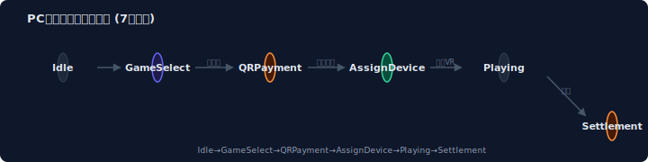
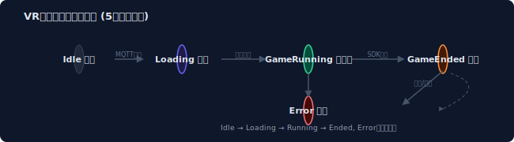
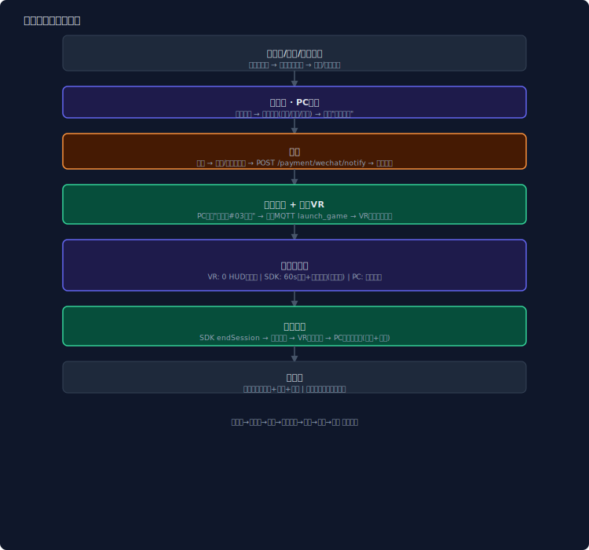
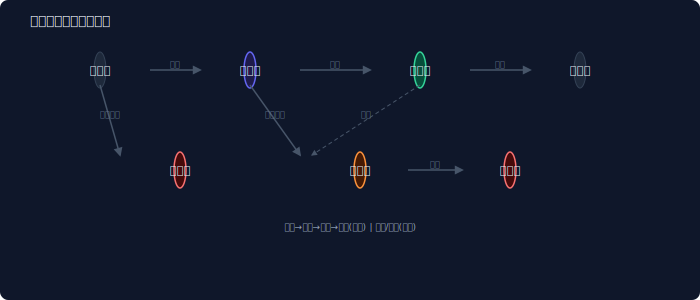
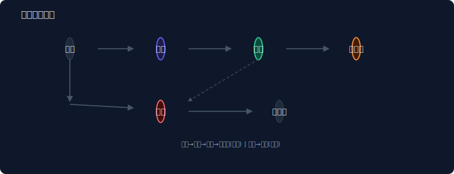
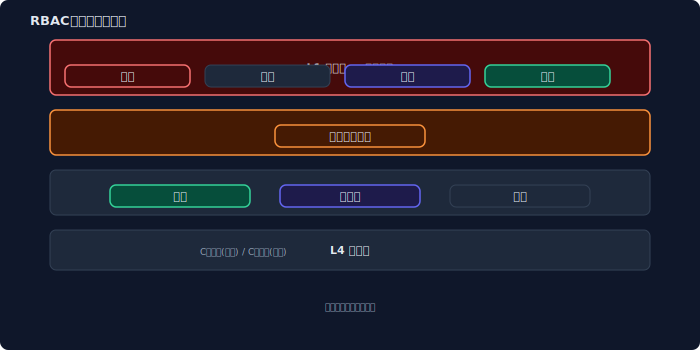
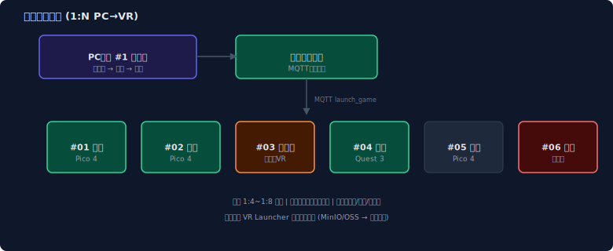

# 头号空间（VR Touhao Kongjian）产品需求文档（PRD）

> **版本**: v1.3 | **日期**: 2026-05-04 | **状态**: ✅ 正式发布  
> **密级**: 内部公开 | **作者**: 产品团队  
> **面向读者**: 技术开发团队、测试团队、运营团队、管理层、游戏CP开发者

---

## 📑 目录

| 章节 | 内容 |
|:----:|------|
| 1 | [产品概述](#1-产品概述) |
| 2 | [商业模式与市场定位](#2-商业模式与市场定位) |
| 3 | [系统整体架构](#3-系统整体架构) |
| 4 | [子系统功能详解](#4-子系统功能详解) |
| 5 | [核心业务流程](#5-核心业务流程) |
| 6 | [数据模型与接口规划](#6-数据模型与接口规划) |
| 7 | [角色权限体系（RBAC）](#7-角色权限体系rbac) |
| 8 | [技术架构方案](#8-技术架构方案) |
| 9 | [竞品分析与差异化](#9-竞品分析与差异化) |
| 10 | [实施路线图与当前进度](#10-实施路线图与当前进度) |
| 11 | [技术开发执行规范](#11-技术开发执行规范) |
| A | [附录](#a-附录) |

---

## 1. 产品概述

### 1.1 产品定义

**头号空间**是一套面向 **VR线下体验店** 的全链路 运营管理系统。系统由 **三大层级 + 六大子系统** 组成：

> 🎯 核心价值：一套代码 + RBAC 权限引擎 = 多角色复用

### 1.2 目标用户画像

| 角色 | 年龄段 | 核心诉求 | 使用频率 | 主要终端 |
|------|--------|---------|:--------:|---------|
| **平台超管/运营/财务** | 28-45岁 | 全局数据 / 内容推广 / 结算对账 | 每日多次 | Web后台(PC) |
| **代理商** | 30-50岁 | 多店业绩 / 分润收益 / 辖区管理 | 每周几次 | Web后台(PC) |
| **店长/收银员/员工** | 18-40岁 | 营收清晰 / 操作便捷 / 高效开单 | 每日高频 | PC收银+Web后台 |
| **C端消费者** | 12-45岁 | 便捷预约 / 沉浸体验 / 会员权益 | 按需使用 | 微信小程序 |

---

## 2. 商业模式与市场定位

### 2.1 核心收入模式

平台收入来源为 **硬件销售佣金 + 游戏豆销售** 两项核心业务：

| 模式 | 说明 | 定价 |
|------|------|:----:|
| **硬件销售** | 设备套餐代理，排除成本后赚取佣金 | ¥15,000-¥50,000/套 |
| **游戏豆销售** | B端运营代币，商家采购供C端消耗 | ¥1/豆 |

---

## 3. 系统整体架构

### 3.1 系统架构图


### 3.2 子系统清单

| # | 子系统 | 形态 | 技术栈 | 页面数 | 完成度 |
|:-:|--------|------|--------|:------:|:------:|
| 1 | **C端微信小程序** | 微信原生/uni-app | Vue3 | ~15页 | 规划中 |
| 2 | **PC收银系统** | Electron桌面应用 | Electron + Vue3 | ~20页 | 规划中 |
| 3 | **PC游戏终端** | Windows全屏kiosk | Electron/WPF | ~8页 | 规划中 |
| 4 | **VR头显终端** | Pico/Quest原生 | Unity XR | ~5页 | ✅ v1.3完成 |
| 5 | **商家管理后台** | Web应用 | Vue3+NaiveUI | ~75页 | ✅ 骨架完成 |
| 6 | **代理商系统** | Web子模块 | 同上(琥珀主题) | ~12页 | ✅ 骨架完成 |
| 7 | **官方总运营后台** | Web应用 | 同上(蓝紫主题) | ~55页 | ✅ 骨架完成 |
| 8 | **游戏SDK** | C++17 / C# | 跨平台native | — | ✅ v1.3完成 |

---

## 4. 子系统功能详解

### 4.1 PC游戏终端

> **形态**: Windows全屏kiosk应用（触摸屏） | **核心职责**: 游戏浏览 + 支付 + 分配设备 + 监控  
> **UI风格**: 深蓝色沉浸式 `#0A1628` + 电光蓝 `#3B82F6`

#### PC终端状态流转



#### PC终端7个核心状态

| # | 状态 | 描述 | UI要素 |
|---|------|------|--------|
| 1 | **Idle 待机** | 默认吸引路人 | Logo + 宣传视频循环 + "点击开始"大按钮 + 设备状态 |
| 2 | **GameSelect 选游戏** | 游戏大厅 | 4列×3行大图标网格 + 分类筛选(刺激/恐怖/休闲…) + 价格/时长/难度 |
| 3 | **GameDetail 游戏详情** | 选中游戏的介绍 | 大图/视频预览 + 名称/价格/星级/时长 + "开始体验"按钮 |
| 4 | **QRPayment 扫码支付** | 支付页面 | 微信/支付宝大二维码 + 金额 + 15分钟倒计时 + 支付状态轮询 |
| 5 | **AssignDevice 分配设备** ⭐v1.3新增 | 支付成功后引导 | 已分配设备编号 + VR位置指引 + "请佩戴 #03 头盔" + 引导动画 |
| 6 | **Playing 游戏监控** ⭐v1.3重构 | VR运行中监控 | VR画面镜像缩略图 + 剩余时间 + 进度条 + [提前结束] + [呼叫店员] |
| 7 | **Settlement 结算** | 游戏结束后 | 消费明细 + 剩余余额/次数 + 五星评分/分享 + 打印小票(可选) |

> 💡 **设计原则**: PC终端负责**所有用户交互**。游戏浏览、详情、支付、结算全在PC触摸屏完成。VR头显仅做纯沉浸体验。

---

### 4.2 VR头显终端（v1.3 纯沉浸式设计）

> **核心设计原则**: VR头显内**不做任何可有可无的UI**。用户戴上头盔的唯一目的就是沉浸式玩游戏。

#### 职责分离

| 职责 | 归属 | 说明 |
|------|:----:|------|
| 游戏选择/浏览/支付 | ❌ → PC终端 | VR内不展示任何游戏库 |
| 倒计时HUD/系统菜单 | ❌ → 不做 | 沉浸感优先，后台计时 |
| 提前结束/暂停 | ❌ → PC终端/摘盔 | 摘下头盔→自动暂停(不计费) |
| 游戏加载动画 | ✅ 极简过渡 | Logo + 环形进度(最多3秒) |
| 结束提示 | ✅ 一行文字 | "体验已结束，请取下头盔"，3秒自动返回 |
| 异常提示 | ✅ 一行文字 | "系统异常，请联系店员"，常驻 |

#### VR终端状态流转



#### VR终端5个状态详解

##### 状态1: Idle 待机

```
用户视野:
┌──────────────────────────────────────────────┐
│                                              │
│              [头号空间 品牌Logo]               │
│               (常亮浮空，30秒淡出)             │
│                                              │
│           (其余区域纯黑，无任何文字)           │
└──────────────────────────────────────────────┘

行为: 等待PC终端分配 → 收到MQTT launch_game指令 → 自动进入Loading
      Logo 30秒后淡出至纯黑(省电模式)
      用户无任何可交互元素, 待机功耗 < 15%
```

##### 状态2: Loading 加载

```
用户视野:
┌──────────────────────────────────────────────┐
│                                              │
│              [头号空间 品牌Logo]               │
│           ◌ ◌ ◌ ◌ ◌ ◌ ◌ ● ◌                 │
│           (环形加载进度，最多显示3秒)          │
└──────────────────────────────────────────────┘

行为: 收到MQTT指令 → 校验签名+时效 → 拉起游戏进程
      游戏进程启动成功 → 自动切换至纯游戏画面
      若3秒后游戏仍未启动 → 进入纯黑(由游戏本身接管)
```

##### 状态3: GameRunning 游戏中（核心状态）

```
用户视野:
┌──────────────────────────────────────────────┐
│                                              │
│              (纯游戏画面)                      │
│      ★ 没有任何叠加UI                         │
│      ★ 没有倒计时、没有进度条                  │
│      ★ 没有HUD、没有系统菜单入口               │
│                                              │
│      SDK在后台默默运行(用户零感知)：             │
│        · 每60秒 heartbeat 上报                │
│        · 时间到 → 自动结束Session              │
│        · 摘盔(P-Sensor) → 暂停(不计费)        │
│        · 游戏崩溃 → 切换到Error状态            │
└──────────────────────────────────────────────┘
```

##### 状态4: GameEnded 结束

```
用户视野:
┌──────────────────────────────────────────────┐
│                                              │
│       体验已结束，请取下头盔                    │
│         (白色文字，居中浮空)                   │
│             3秒后自动返回待机                  │
└──────────────────────────────────────────────┘

行为: 游戏正常结束 / 时间到后自动显示
      仅显示一行文字，不展示消费金额/时长/余额
      3秒后自动返回Idle待机
      用户取下头盔 → PC终端显示完整结算页
```

##### 状态5: Error 异常

```
用户视野:
┌──────────────────────────────────────────────┐
│                                              │
│         ⚠️ 系统异常，请呼叫店员                │
│           (红色文字，居中浮空)                 │
│          常驻直到店员处理/重启                  │
└──────────────────────────────────────────────┘

触发条件: 游戏崩溃 / SDK异常 / 设备过热 / 网络断连>3分钟
```

#### Launcher拉起游戏指令协议

后端 → VR终端的MQTT命令格式：

```json
{
  "command": "launch_game",
  "params": {
    "game_id": "roller-coaster-vr",
    "game_package": "com.thk.rollercoster",
    "launch_type": "unity_scene",
    "arguments": {
      "session_id": "sess_20260504_abc123",
      "api_base_url": "https://api.touhaokongjian.com/v2",
      "store_token": "tk_store_szft_xxxxxx",
      "member_id": "mb_001"
    }
  },
  "expires_at": 1714435200000,
  "signature": "hmac-sha256-..."
}
```

| MQTT命令 | 说明 | 触发方 |
|----------|------|--------|
| `launch_game` | 拉起游戏 | 后端(PC终端支付成功后) |
| `force_stop` | 强制结束 | 后端(PC终端点击"结束") |
| `reboot` | 重启Launcher | 后端(远程维护) |
| `update_config` | 更新配置 | 后端(远程配置) |
| `fetch_logs` | 上传日志 | 后端(远程诊断) |

#### 暂停计费策略

```
摘盔(P-Sensor触发) → Session标记 paused
  ├── 暂停期间 ⏸ 不计费
  ├── 3分钟内重新佩戴 → 自动恢复 → 继续计费
  ├── 3分钟超时未佩戴 → 自动结束Session
  └── 主动点击"结束" → 立即结算

实际付费时长 = actual_duration_sec - pause_duration_sec
```

#### VR终端技术规格

| 项目 | 规格 |
|------|------|
| 渲染层级 | 仅2层: Launcher Canvas(Logo/文字) → 全屏游戏画面 |
| 存储占用 | Launcher应用 < 50MB (不含游戏包体) |
| 启动方式 | 守护进程常驻，游戏进程由Launcher fork/exec |
| 待机功耗 | < 15%，仅维持心跳+MQTT |
| 多平台 | Pico Neo 3(Phase 1) → Quest 3(Phase 2) |

---

### 4.3 游戏SDK（v1.3 完整规格）

> **定位**: 连接VR头显/PC终端与平台后端的**桥梁中间件**  
> **形态**: C++17 原生库(.so/.dll/.dylib) + Unity Package + Unreal Plugin  
> **核心设计原则**: 零侵入 / 高可靠 / 轻量(<50MB)

#### SDK架构


#### 完整API定义

```cpp
namespace thk_sdk {

struct SdkConfig {
    std::string api_base_url;        // API服务器地址
    std::string mqtt_broker_url;     // MQTT Broker
    std::string device_id;           // 设备唯一标识(厂商写入)
    std::string store_token;         // 门店认证令牌
    LogLevel log_level;              // 日志级别
    int heartbeat_interval_sec;      // 心跳间隔(默认60)
    int default_timeout_ms;          // 默认请求超时(10000ms)
    int max_retry_count;             // 最大重试次数(3次)
    bool enable_telemetry;           // 是否开启遥测
};

// === Session管理 ===
SessionHandle createSession(const SessionParams& params);
Result startSession(SessionHandle handle);
Result pauseSession(SessionHandle handle);       // 暂停(不计费)
Result resumeSession(SessionHandle handle);
SessionResult endSession(SessionHandle handle);  // 结算
Result extendSession(SessionHandle handle, int additionalMinutes);  // 续费
Result forceEndSession(SessionHandle handle);    // 强制结束
Result heartbeat(SessionHandle handle, float gameProgress);

// === 计费查询 ===
BalanceInfo queryBalance(const std::string& memberId);
std::vector<PackageInfo> queryPackages(const std::string& memberId);
PreAuthResult preAuthorize(const std::string& memberId, int expectedMinutes);

// === 设备管理 ===
Result registerDevice(const DeviceInfo& di, DeviceRegisterResult* out);
DeviceStatus getDeviceStatus();
void reportDeviceStatus(const DeviceStatus& status);

// === 事件回调 ===
void setEventCallback(EventCallback cb);  // 支付/Session/异常等事件
}
```

#### SDK错误码

| 错误码 | 常量名 | 说明 | 处理建议 |
|:------:|--------|------|---------|
| 0 | SUCCESS | 成功 | - |
| -100 | ERR_NOT_INITIALIZED | SDK未初始化 | 检查initialize() |
| -200 | ERR_NETWORK | 网络连接失败 | 检查网络，队列重试 |
| -300 | ERR_AUTH_FAILED | 门店Token认证失败 | 检查storeToken |
| -400 | ERR_INVALID_SESSION | Session ID不存在 | 检查sessionId |
| -500 | ERR_INSUFFICIENT_BALANCE | 余额不足 | 引导充值 |
| -600 | ERR_DEVICE_OFFLINE | 设备离线 | 等待心跳恢复 |
| -700 | ERR_OTA_IN_PROGRESS | OTA更新中 | 等待完成 |
| **-800** | **ERR_OFFLINE_CONFLICT** | **离线数据冲突** | **以服务端为准，上报审核** |
| **-801** | **ERR_QUEUE_FULL** | **离线队列已满** | **丢弃最早记录** |

#### SDK离线队列冲突解决

```
三大原则:
1️⃣ 先入先出严格重放: 离线期间请求严格按时间戳顺序重放
2️⃣ 幂等覆盖: 服务端以最终状态为准，幂等Key保留72小时
3️⃣ 冲突标记与人工审核: 状态不一致时标记CONFLICT → 运营后台审核

冲突处理流程:
  重放 endSession → 服务端返回 ERR_SESSION_ALREADY_ENDED
  → 获取服务端状态 → 比较本地vs服务端记录
  ├─ 一致(费用差<10%) → 忽略，以服务端为准
  ├─ 不一致(费用差>10%) → 标记CONFLICT，上报AUDIT_LOG
  └─ 本地记录缺失 → 以服务端为准
```

#### SDK版本兼容性

| 变化 | 兼容性 | 对游戏影响 |
|------|--------|-----------|
| MAJOR升级 | API不兼容 | 需重新集成SDK |
| MINOR升级 | 向后兼容 | 无需修改代码 |
| PATCH升级 | 完全透明 | 热替换即可 |

---

## 5. 核心业务流程

### 5.1 用户到店消费全流程



#### 场景一：散客自助体验

```
1. 到店 → 2. PC终端浏览游戏(无需登录)
3. 选游戏 → 点击"开始体验" → 原价
4. 扫码支付(微信/支付宝)
5. 后端回调成功 → 分配空闲VR设备 → "请佩戴 #03 头盔"
6. 佩戴VR → 自动加载游戏 → 纯沉浸游玩
7. 游戏结束 → PC终端结算(消费金额+评分入口)
8. 离店
```

#### 场景二：会员身份消费

```
1. 到店 → 2. PC终端微信扫码/手机号验证
3. 验证身份 → 显示会员信息(余额/等级/折扣)
4. 浏览游戏 → 价格显示会员价(95折)
5. 支付(余额/次数/套票/扫码) → 分配设备
6. 游玩 → 结束 → PC结算(含积分变动)
```

#### 场景三：小程序预约到店

```
1. 在家浏览小程序 → 预约时段(如14:00)
2. 到店 → 前台扫码核销预约码
   ├─ 已预付: 直接分配设备
   └─ 未预付: 引导至PC终端支付
3. 游玩 → 结算
```

### 5.2 订单生命周期



### 5.3 多人Session计费规则

> **决策**: 多人联机时**各付各的**（每人独立Session、独立扣费）

```
多人联机场景: N台VR设备进入同一游戏
  ↓
后端创建 GROUP_SESSION 联机组:
  ├── group_id, game_id
  ├── host_device_id(发起人)
  └── member_devices[参与设备列表]
  ↓
每台VR设备各自独立 GAME_SESSION:
  ├── 各自 session_id, member_id, 计时, 计费
  ├── 各自 heartbeat(进度独立)
  └── 各自 endSession(退出时机独立,互不影响)
```

### 5.4 设备状态机



### 5.5 离线恢复流程

**断网恢复**:
```
断网 → SDK切换离线 → 本地缓存操作到离线队列
  → 3分钟阈值: 本地自动结束Session → 断网显示Error
  → 网络恢复: 按时间戳重放队列
  ├── 无冲突 → 正常完成(用户无感)
  └── 冲突 → 标记CONFLICT → 人工审核
```

**断电恢复**:
```
断电 → 后端90秒标记离线+abnormal_end
  → 重新上电 → Launcher检查unfinished_session → 上报后端
  → 后端按最后心跳时间计算费用
```

---

## 6. 数据模型与接口规划

### 6.1 核心实体关系 (ERD)

**核心实体**：PLATFORM, MERCHANT, STORE, DEVICE, MEMBER, **ORDER**, GAME, AGENT, SETTLEMENT, GAME_SESSION, DEVICE_SHADOW, QUEUE_TICKET, COUPON, PACKAGE, REVIEW

#### ORDER 订单表（完整字段）

| 字段 | 类型 | 必填 | 说明 |
|------|------|:----:|------|
| id | UUID | ✅ | 主键 |
| order_no | VARCHAR(32) | ✅ | 业务订单号 `THK{门店}{8位日期}{6位序列}` |
| store_id | UUID | ✅ | 所属门店 |
| member_id | UUID | | 会员(空=散客) |
| terminal_type | ENUM | ✅ | cashier/pc_terminal/vr_headset/miniapp/manual |
| order_type | ENUM | ✅ | consume/recharge/refund/gift/adjust |
| status | ENUM | ✅ | created/paid/processing/completed/cancelled/refunding/refunded/failed |
| actual_amount | DECIMAL(10,2) | ✅ | 实付金额 |
| **session_id** | VARCHAR(64) | | **关联GAME_SESSION(1:1)** |
| **payment_channel** | ENUM | | **支付渠道: wechat/alipay/balance/cash** |
| **transaction_id** | VARCHAR(128) | | **渠道流水号(对账用)** |
| **refund_status** | ENUM | | **退款状态: none/partial/full** |
| **refund_amount** | DECIMAL(10,2) | | **已退款金额** |
| **platform_commission** | DECIMAL(10,2) | | **平台抽成金额** |
| **agent_commission** | DECIMAL(10,2) | | **代理分润金额** |
| **merchant_net_revenue** | DECIMAL(10,2) | | **商家实收** |
| **commission_status** | ENUM | | **分润状态: pending/settled/paid** |
| created_at | TIMESTAMP | ✅ | 创建时间 |
| paid_at | TIMESTAMP | | 支付时间 |

#### GAME_SESSION 游戏会话表

| 字段 | 类型 | 必填 | 说明 |
|------|------|:----:|------|
| id | VARCHAR(64) | ✅ | 主键 `sess_{日期}_{6位随机}` |
| order_id | UUID | ✅ | 关联ORDER(1:1反向) |
| device_id | VARCHAR(64) | ✅ | VR设备ID |
| game_id | UUID | ✅ | 游戏ID |
| session_type | ENUM | ✅ | single/multi |
| billing_mode | ENUM | ✅ | by_time(按时)/by_count(按次)/package(套票) |
| unit_price | DECIMAL(10,4) | | 单价(元/分钟) |
| actual_duration_sec | INT | | 实际游玩时长(秒) |
| **pause_duration_sec** | INT | | **暂停累计时长(不计费部分)** |
| pre_auth_id | VARCHAR(64) | | 预授权ID |
| status | ENUM | ✅ | pending/running/paused/ended/abnormal/force_ended |
| total_fee | DECIMAL(10,2) | | 最终结算费用 |
| offline_created | BOOLEAN | | 是否离线创建(需审核) |

### 6.2 API接口总览

#### 终端/SDK专用API（15个）

| 方法 | 路径 | 说明 |
|------|------|------|
| POST | `/terminal/auth` | 终端认证(设备证书) |
| GET | `/terminal/games` | 可用游戏列表 |
| POST | `/terminal/session/create` | 创建游戏会话 |
| POST | `/terminal/session/:id/start` | 开始计费 |
| POST | `/terminal/session/:id/pause` | 暂停(不计费) |
| POST | `/terminal/session/:id/resume` | 恢复 |
| POST | `/terminal/session/:id/end` | 结束结算 |
| POST | `/terminal/session/:id/extend` | **续费延长** |
| POST | `/terminal/session/:id/force-stop` | **强制结束** |
| POST | `/terminal/session/:id/heartbeat` | 心跳保活 |
| WS | `/ws/terminal/:deviceId/events` | WebSocket事件推送 |

#### 支付回调API（v1.3新增）

| 方法 | 路径 | 说明 |
|------|------|------|
| POST | **`/payment/wechat/notify`** | **微信支付异步回调** |
| POST | **`/payment/alipay/notify`** | **支付宝异步回调** |
| GET | `/payment/query/:order_id` | 主动查询支付状态 |

**回调处理流程**：
```
支付渠道 → POST /payment/wechat/notify
  → 验签 → 查询ORDER(out_trade_no)
  → 更新支付状态(paid_at, transaction_id)
  → 通知PC终端(WS推送 PAYMENT_CONFIRMED)
  → 返回200(避免重复回调)
```

---

## 7. 角色权限体系（RBAC）

### 7.1 八角色权限层级



### 7.2 数据隔离规则

| 角色 | 可见范围 | 可访问子系统 |
|------|---------|------------|
| 超管/运营 | 全平台 | 总运营后台(Web) |
| 代理商 | WHERE agent_id = current | 代理商后台(Web) |
| 店长 | WHERE store_id = current_store | 商家后台+收银系统 |
| 收银员 | 本人订单+本店会员 | 收银系统(PC) |
| C端会员 | 仅自己数据 | 小程序 |
| C端游客 | 仅公开数据 | 小程序(受限) |

---

## 8. 技术架构方案

### 8.1 门店部署架构



> **架构决策**: 1台PC终端服务N台VR头显(N≥1)，后端统一调度分配  
> **建议比例**: 1:4~1:8（一台PC + 4-8台VR）  
> **游戏分发**: 云存储(MinIO/OSS) → VR Launcher后台静默下载 → OTA增量更新

### 8.2 技术栈总览

| 层级 | 技术选型 | 版本 |
|------|---------|------|
| Web前端(管理后台) | Vue 3 + TypeScript + Vite + NaiveUI | ^3.4 / ^5.4 |
| PC收银/终端 | Electron + Vue3 | 最新LTS |
| C端小程序 | uni-app (Vue3) | — |
| VR头显终端 | Pico SDK / Meta XR SDK + Unity XR Plugin | — |
| 游戏SDK | C++17 (core) + C# (Unity wrapper) | — |
| 后端API | NestJS + Prisma/TypeORM | ^10 |
| 数据库 | PostgreSQL 16+ / Redis 7+ / MongoDB 6+ | — |
| 基础设施 | MinIO/OSS / RabbitMQ / MQTT Broker | — |

---

## 9. 竞品分析与差异化

| 维度 | 幻影星空 | 头号空间 | 优势 |
|------|---------|----------|------|
| 架构 | 双后台割裂 | **统一平台+RBAC+六端联动** | 维护成本降低60% |
| 权限 | 游客模式 | **8角色矩阵+终端权限** | 精细可控 |
| 终端 | 仅PC后台 | **PC收银+PC终端+VR+小程序+SDK** | 全场景覆盖 |
| 代理商 | 不完善 | **完整分润+阶梯+安全+12页后台** | 渠道扩张 |
| 游戏接入 | 封闭生态 | **开放SDK+标准化接入流程** | CP门槛低 |
| VR体验 | 无统一方案 | **纯沉浸式Launcher+SDK** | 体验一致 |

---

## 10. 实施路线图

### 10.1 当前进度快照

| 子系统 | 前端骨架 | 后端API | 规范定义 | 整体进度 |
|--------|:-------:|:-------:|:--------:|:-------:|
| 商家后台(Web) | ✅ 75+页 | ❌ | — | ~30% |
| 代理商(Web) | ✅ 12页 | ❌ | — | ~25% |
| 总运营后台(Web) | ✅ 55+页 | ❌ | — | ~25% |
| C端小程序 | ❌ | ❌ | — | 0% |
| PC收银系统 | ❌ | ❌ | — | 0% |
| PC游戏终端 | ❌ | ❌ | — | 0% |
| **VR头显终端** | ❌ | — | **✅ v1.3** | **~15%** |
| **游戏SDK** | — | ❌ | **✅ v1.3** | **~15%** |

### 10.2 Phase 1 人员配置

| 角色 | 人数 | 范围 |
|------|:----:|------|
| 后端工程师 | 2-3人 | 基础设施+核心API+支付+Session |
| Web前端 | 1-2人 | 三套后台API对接(骨架已有) |
| Electron工程师 | 1-2人 | PC终端+收银系统MVP |
| 小程序开发 | 1人 | 核心5页 |
| Unity工程师 | 1人 | VR Launcher MVP (Pico) |
| C++工程师 | 1-2人 | SDK Core(框架+Session+心跳) |
| QA测试 | 1-2人 | 端到端联调 |
| **合计** | **8-13人** | **8周 Phase 1** |

---

## 11. 附录

### A.1 色彩规范

| 用途 | Web管理后台 | C端小程序 | PC收银 | PC终端/VR | 代理商 |
|------|------------|---------|--------|----------|--------|
| **主色** | `#3B82F6` 电光蓝 | `#6366F1` 靛蓝 | `#3B82F6` | `#0A1628` 深蓝 | `#F59E0B` 琥珀 |
| **背景** | `#F8FAFC` 浅灰 | `#0D0D0D` 黑 | `#FFF` 白 | `#0A1628` 深蓝 | `#FFFBEB` 浅黄 |
| **成功** | `#22C55E` | `#22C55E` | `#22C55E` | `#34D399` | `#22C55E` |
| **错误** | `#EF4444` | `#EF4444` | `#EF4444` | `#F87171` | `#DC2626` |

### A.2 术语表

| 术语 | 定义 |
|------|------|
| **SDK** | 软件开发工具包，连接VR应用与平台的中间件 |
| **Session** | 游戏会话，从开始到结束的一次完整游玩记录 |
| **Device Shadow** | 设备数字孪生，云端的设备实时状态镜像 |
| **Launcher** | VR环境中的极简启动应用(仅Logo+加载+结束) |
| **Heartbeat** | 心跳，定时状态报告(每60秒) |
| **预授权** | 开始前锁定金额，防超支 |
| **离线队列** | 断网时缓存的请求队列，联网后按FIFO重放 |

### A.3 文档版本历史

| 版本 | 日期 | 核心变更 | 规模 |
|------|------|---------|:----:|
| v1.0 | 2026-04-30 | 初版发布(聚焦Web三大后台) | ~450行 |
| v1.1 | 2026-04-30 | 代理商系统完善(12页骨架+阶梯分润+安全机制) | ~540行 |
| v1.2 | 2026-04-30 | C端小程序/PC收银/PC终端/VR/SDK五大子系统完整规格 | ~1100行 |
| v1.3 | **2026-05-04** | **VR终端纯沉浸式重构+SDK全规格+论坛修复10项缺失+开发者就绪度92%** | **~3400行** |

---

> 📧 问题反馈请联系产品团队  
> 📎 配套设计稿: `designs/` 目录下 6张核心设计稿 + 9张竞品参考  
> 📎 配套文档: `docs/运营后台设计方案.md` / `内调沟通总结.md` / `功能差异分析-店铺运营后台.md`  
> 📎 流程图SVG: `docs/images/` 目录下8张SVG图  
> © 2026 头号空间 All Rights Reserved
