# 头号空间（VR Touhao Kongjian）产品设计文档 v2.0

> **版本**: v2.0（完整整合版）  
> **日期**: 2026年5月4日  
> **密级**: 内部公开  
> **文档定位**: 本文件整合了 PRD v1.3、产品设计文档 v1.2、运营后台设计方案、竞品分析和内调沟通总结等全部现有文档，并在每个维度上进行了**大幅度的细节扩充**。新增了完整的数据模型定义、API 接口规范、UI/UX 交互细节、状态机定义、异常处理策略和离线恢复方案。  
> **适用读者**: 产品团队、技术开发团队、测试团队、运营团队、管理层、游戏 CP 开发者

---

## 📑 目录

| 章节 | 标题 | 核心内容 |
|:----:|------|---------|
| 1 | [产品概述与核心价值](#1-产品概述与核心价值) | 产品定义、六端拆解、价值主张、目标用户画像 |
| 2 | [商业模式与盈利体系](#2-商业模式与盈利体系) | 硬件销售佣金、游戏豆销售、分润体系、阶梯策略 |
| 3 | [系统架构总览](#3-系统架构总览) | 四层架构、子系统交互、技术选型全景 |
| 4 | [子系统一：C端微信小程序](#4-子系统一c端微信小程序) | 15页详细规格、UI规范、关键技术点 |
| 5 | [子系统二：PC收银系统](#5-子系统二pc收银系统) | 20页详细规格、4大Tab、交接班、离线能力 |
| 6 | [子系统三：PC游戏终端](#6-子系统三pc游戏终端) | 8个状态/页面、完整流转、Kiosk模式 |
| 7 | [子系统四：VR头显终端](#7-子系统四vr头显终端) | 沉浸优先设计、5状态机、暂停计费策略 |
| 8 | [子系统五：游戏 SDK](#8-子系统五游戏-sdk) | SDK架构、完整API参考、错误码大全 |
| 9 | [子系统六：Web管理后台（三端合一）](#9-子系统六web管理后台三端合一) | 总运营/商家/代理商各模块详解 |
| 10 | [核心业务流程](#10-核心业务流程) | 九阶段用户旅程、订单生命周期、结算分润流程 |
| 11 | [数据模型设计](#11-数据模型设计) | ORDER/GAME_SESSION/DEVICE_SHADOW等核心表完整字段 |
| 12 | [API接口规划](#12-api接口规划) | 全端API总览、响应格式规范 |
| 13 | [角色权限体系（RBAC）](#13-角色权限体系rbac) | 8角色定义、数据隔离、完整权限矩阵 |
| 14 | [UI/UX设计规范](#14-ux设计规范) | 色彩系统、侧边栏、交互标准、响应式适配 |
| 15 | [竞品分析与差异化](#15-竞品分析与差异化) | 100%覆盖竞品功能 + 30项超越功能 |
| 16 | [实施路线图](#16-实施路线图) | 3阶段路线图、当前进度 |
| 17 | [附录](#17-附录) | 术语表、参考资料索引 |

---

## 1. 产品概述与核心价值

### 1.1 产品定义

**头号空间**是一套面向 **VR线下体验店** 的全链路运营管理系统。平台通过 **硬件销售佣金** 和 **游戏豆销售** 盈利，代理商按区域分润。系统由 **六大子系统** 组成，覆盖从用户端到管理端的完整业务闭环。

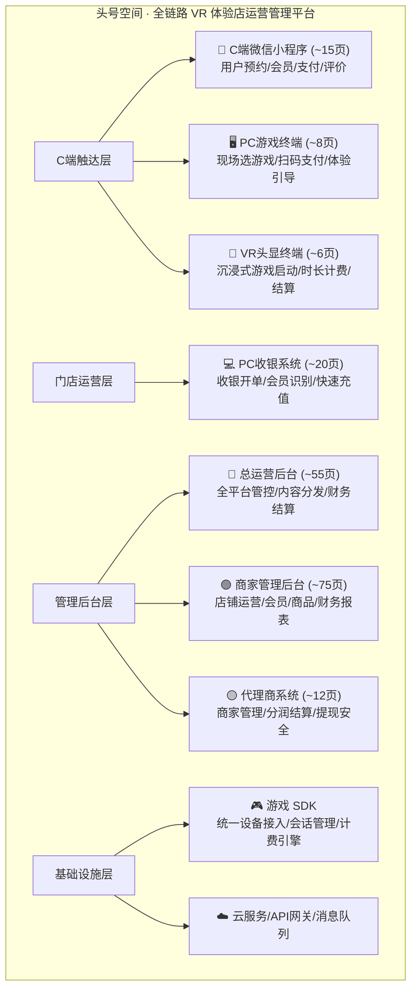

### 1.2 核心价值主张

| 对象 | 核心价值 | 关键指标 |
|------|---------|---------|
| **商家** | 降本增效、数据洞察、营销获客、设备管控、多端协同运营 | 开单效率提升60%、设备利用率提升25% |
| **C端用户** | 便捷体验（微信小程序）、沉浸式消费、会员权益、社交分享 | 预约到店转化率35%+ |
| **代理商** | 区域分润、管理工具、结算透明、阶梯激励 | 分润计算零误差、结算自动化率95%+ |
| **平台** | 全网掌控、内容分发、财务闭环、生态运营 | 硬件市占率30%+、游戏豆复购率90%+ |

### 1.3 目标用户画像

| 角色 | 年龄段 | 核心诉求 | 使用频率 | 主要终端 |
|------|--------|---------|:--------:|---------|
| 平台超管/运营/财务 | 28-45岁 | 全局数据/内容推广/结算对账 | 每日多次 | Web后台(PC) |
| 代理商 | 30-50岁 | 多店业绩、分润收益、辖区管理 | 每周几次 | Web后台(PC) |
| 店长 | 25-40岁 | 营收清晰、操作便捷、营销获客 | 每日高频 | Web后台(PC) |
| 收银员/员工 | 18-28岁 | 开单快、不出错、培训简单 | 每日持续 | PC收银系统 |
| C端消费者 | 12-45岁 | 便捷预约/沉浸体验/会员权益 | 按需使用 | 微信小程序 |
| 游戏CP开发者 | 25-40岁 | SDK易用/文档清晰/数据透明 | 按需使用 | SDK + 开发者后台 |

### 1.4 关键设计原则

1. **统一代码库原则**：商家后台、代理商系统、总运营后台共用一套前端代码库（`admin-dashboard`），通过 **RBAC + 动态菜单 + 三套 Layout** 实现多角色切换，减少50%+的代码维护量。
2. **沉浸优先原则**：VR 头显内不做任何可有可无的 UI——用户戴上头盔的唯一目的就是沉浸式玩游戏，所有交互操作转移到 PC 终端承担。
3. **离线可靠原则**：所有终端层（VR头显/PC终端/PC收银）均支持离线缓存+断网重连+冲突恢复，不因网络问题中断用户体验。
4. **财务闭环原则**：从C端消费→平台抽成→商家结算→代理商分润，全程自动化+可追溯+可审计。

---

## 2. 商业模式与盈利体系

### 2.1 核心业务模式

平台的收入来源为 **硬件销售佣金 + 游戏豆销售** 两项核心业务，代理商的收入为上述两项的**分润抽成**。

```
                      ┌─────────────────────────────────────┐
                      │          头号空间 平台               │
                      │  (硬件代理 + 游戏豆销售)              │
                      └──┬──────────┬──────────────────────┘
                         │          │
              ┌──────────▼──┐  ┌───▼──────────┐
              │  ① 硬件销售  │  │  ② 游戏豆销售  │
              │  (设备套餐)  │  │  (B端代币)     │
              └──────┬──────┘  └──────┬────────┘
                     │                │
              ┌──────▼────────────────▼──────────┐
              │         商家 (VR体验店)            │
              │  · 从平台采购设备套餐(硬件代理)     │
              │  · 从平台批量购买游戏豆(启动游戏用)  │
              │  · 自行定价向C端用户销售游戏项目     │
              └──────┬────────────────▲──────────┘
                     │  C端付款(¥)    │
              ┌──────▼────────────────┘
              │     C端消费者          │
              │  · 在商家处充值/购项目   │
              │  · 玩游戏(消耗商家游戏豆)│
              └────────────────────────┘
```

> **关键区别**: 游戏豆是**B端运营代币**(商户→平台)，不是C端消费代币。C端用户付人民币给商家购买游戏项目，商家后台扣除游戏豆作为运营成本。

### 2.2 收入模式详解

#### 收入一：硬件销售（设备套餐代理）

平台作为VR游戏设备套餐的**代理商/渠道商**，排除设备采购成本后赚取佣金。

| 项目 | 说明 |
|------|------|
| **产品形态** | 整套VR游戏设备套餐（VR头显+PC主机+外设+安装部署） |
| **供货来源** | 上游硬件厂商/Pico/Quest等品牌代理 |
| **平台角色** | 销售渠道 + 售前咨询 + 售后安装 + 软件预装 |
| **平台收入** | **设备售价 - 硬件采购成本 = 平台佣金** |
| **设备定价** | 市场对标定价，含平台佣金（例如¥15,000-¥50,000/套） |
| **下单方式** | 商家在总运营后台的"硬件商城"选购下单 |
| **分账逻辑** | 买家付款 → 扣除硬件成本 → 剩余佣金进入平台收入池 |

#### 收入二：游戏豆（B端运营代币）

游戏豆是商家用来**启动游戏**的运营代币。商家从平台采购游戏豆，C端用户每玩一局游戏，商家消耗一定数量游戏豆。

| 项目 | 说明 |
|------|------|
| **游戏豆定义** | B端运营代币，一个游戏豆 = 商家启动一次游戏的消耗成本 |
| **购买方** | 商家（VR体验店），非C端用户 |
| **使用方** | 商家后台 → 用户每玩一局游戏自动扣除对应数量的游戏豆 |
| **平台定价** | 平台设定游戏豆销售价（例如¥1/豆，） |
| **用途** | 商家用游戏豆启动游戏给C端用户玩 |
| **与C端关系** | C端用户不直接接触游戏豆。C端用户在商家充值¥ → 商家定价一个游戏项目¥XX → 用户付款 → 商家消耗游戏豆 |
| **库存管理** | 商家需预购一定量游戏豆，不足时需补充采购；后台有库存预警 |
| **过期策略** | 游戏豆有效期12个月，过期自动回收(可配置) |

### 2.3 分润体系设计

#### 2.3.1 代理商层级

| 级别 | 保证金 | 管理范围 | 基础分润比例 |
|:----:|:------:|---------|:-----------:|
| 城市代理 | ¥5,000 | 单城市 | 3%-5% |
| 区域代理 | ¥20,000 | 省/跨市 | 5%-8% |
| 省级总代 | ¥50,000 | 整省 | 8%-12% |

#### 2.3.2 阶梯分润策略

分润依据为代理辖区下所有商家的 **游戏豆月采购总额**。按实际采购额所在档位的系数**全额计算**（不是分段累进）。

**以城市代理为例（基础比例 5%）:**

| 月游戏豆采购额范围 | 系数 | 说明 | 示例（全额计算） |
|:-------------------:|:----:|:----:|:--------------:|
| ¥0 - ¥49,999 | ×0.8 | 起步阶段，激励达标 | ¥30,000×5%×0.8=¥1,200 |
| ¥50,000 - ¥99,999 | ×1.0 | 基准水平 | ¥80,000×5%×1.0=¥4,000 |
| ¥100,000 - ¥199,999 | ×1.2 | 成长阶段，加大激励 | ¥120,000×5%×1.2=**¥7,200** |
| ≥ ¥200,000 | ×1.5 | 头部奖励 | ¥250,000×5%×1.5=¥18,750 |

> **关键**：采购额落在哪个档位区间，全额按该档位的系数计算，**不是**前一段一个比例、后一段另一个比例。

#### 2.3.3 结算安全机制

| 项目 | 规则 |
|------|------|
| 结算周期 | T+1 月结（次月15日前打款） |
| 最低提现额 | ¥100（不足累积下月） |
| 安全机制 | 提现账户修改需 **10分钟冷却期 + 短信验证码二次确认** |
| 争议处理 | 代理商可发起申诉→结算单冻结→财务复核→人工调整或放行 |
| 异常处理 | 分账失败自动进入 failed 队列→修复后重试→连续3次失败人工介入 |

---

## 3. 系统架构总览

### 3.1 四层架构

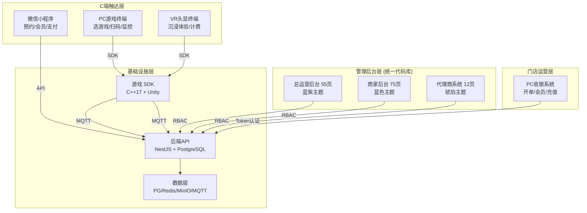

### 3.2 子系统交互拓扑图

```
                              ┌──────────────────────────────────┐
                              │          API 网关 (Kong)          │
                              │  ┌──────┐ ┌──────┐ ┌─────────┐  │
                              │  │ 认证  │ │ 限流  │ │  路由   │  │
                              │  └──────┘ └──────┘ └─────────┘  │
                              └────────────┬─────────────────────┘
                                           │
              ┌─────────────────┬──────────┴──────────┬─────────────────┐
              ▼                 ▼                     ▼                  ▼
     ┌──────────────┐  ┌──────────────┐  ┌──────────────┐  ┌──────────────┐
     │  小程序服务   │  │  收银服务   │  │  终端服务   │  │  管理后台服务  │
     │  (节点/12)    │  │  (节点/4)   │  │  (节点/16)   │  │  (节点/4)     │
     └──────┬───────┘  └──────┬───────┘  └──────┬───────┘  └──────┬───────┘
            │                 │                  │                  │
            └────────┬────────┴─────────┬────────┘                  │
                     │                  │                          │
              ┌──────▼──────┐   ┌───────▼────────┐   ┌────────────▼──────────┐
              │ WebSocket    │   │  MQTT Broker   │   │                     │
              │ (消息推送)   │   │ (设备影子)     │   │  业务数据库(PG)      │
              └─────────────┘   └────────────────┘   │  缓存(Redis)          │
                                                     │  文件存储(MinIO)      │
                                                     └───────────────────────┘
```

### 3.3 技术选型总览

| 层级 | 技术选型 | 版本要求 |
|------|---------|---------|
| **Web前端(管理后台)** | Vue 3 + TypeScript + Vite + NaiveUI + ECharts + Pinia | Vue 3.4+ / Vite 5 |
| **PC收银系统** | Electron 28+ / Tauri 2 + Vue3 + NaiveUI + node-usb(小票) | Electron 28+ |
| **PC游戏终端** | Electron / WPF (Windows kiosk模式) + 自绘深蓝UI | Windows 10+ |
| **C端微信小程序** | uni-app (Vue3) / 微信原生 + wechat-ui | 基础库 3.0+ |
| **VR头显终端** | Pico Neo 3 SDK / Meta Quest SDK + Unity XR Plugin | Unity 2022.3 LTS |
| **游戏SDK** | C++17 (core) + C# (Unity wrapper) + HTTP/MQTT client | C++17 |
| **后端API** | NestJS + Prisma/TypeORM + GraphQL(可选) | Node 18+ |
| **数据库** | PostgreSQL 16+ / Redis 7+ / MongoDB 6+ | PG16 / Redis 7 |
| **基础设施** | MinIO/OSS / RabbitMQ / Socket.io-MQTT / Docker-K8s / Nginx/Kong | Docker |

### 3.4 开发环境快速启动

| 命令 | 用途 |
|------|------|
| `cd admin-dashboard && npm run dev` | 启动管理后台开发服务器（端口9527） |
| `npm run build` | TypeScript检查 + Vite生产构建 |
| `npm run lint` | ESLint代码检查 |

---

## 4. 子系统一：C端微信小程序

### 4.1 小程序页面清单（~15页）

```mermaid
graph TB
    MINI[C端微信小程序 ~15页] --> M1["🏠 首页 Home.vue<br/>Banner/推荐/快捷入口"]
    MINI --> M2["🎮 游戏分类 GameCategory.vue<br/>5大类Tab/瀑布流"]
    MINI --> M3["📄 游戏详情 GameDetail.vue<br/>视频/价格/评价"]
    MINI --> M4["👤 个人中心 Profile.vue<br/>会员/资产/菜单"]
    MINI --> M5["💳 会员/充值 Recharge.vue<br/>充值/记录"]
    MINI --> M6["📱 扫码 ScanCode.vue<br/>扫设备/扫收款码"]
    MINI --> M7["📋 订单记录 Orders.vue<br/>Tab筛选/卡片"]
    MINI --> M8["💬 消息通知 Messages.vue<br/>系统/营销"]
    MINI --> M9["⚙️ 设置 Settings.vue<br/>账号/安全/关于"]
    MINI --> M10["🎫 优惠券 Coupons.vue<br/>可用/已用/已过期"]
    MINI --> M11["🏪 门店列表 StoreList.vue<br/>LBS/地图双视图"]
    MINI --> M12["📊 排队等待 QueueWait.vue<br/>排队/叫号"]
    MINI --> M13["⭐ 评价反馈 Review.vue<br/>评分/文字/图片"]
    MINI --> M14["👥 邀请好友 Invite.vue<br/>海报/奖励"]
    MINI --> M15["🔍 搜索 Search.vue<br/>游戏/门店/历史"]
```

### 4.2 各页面详细规格

| # | 页面 | 核心功能 | UI要素 | 数据来源 | 状态/分页 |
|---|------|---------|--------|----------|-----------|
| 1 | **首页** | Banner轮播(3-5张) + 附近门店推荐(按距离排序) + 热门游戏推荐(6-8款) + 快捷入口网格(扫码/充值/订单/优惠券) | 顶部搜索栏固定/卡片式布局/渐变靛蓝底色 "#6366F1→#8B5CF6" | GET /mini/home | ✅ 已定义 |
| 2 | **游戏分类** | 5大类Tab切换(刺激/恐怖/休闲/亲子/联机) + 游戏瀑布流(按热度排序) + 上拉加载更多 | 分类标签栏(sticky) + 大图卡片(封面/名称/价格/难度星级/时长) + 骨架屏 | GET /games?category=&page=&sort= | ✅ 已定义 |
| 3 | **游戏详情** | 视频/截图轮播(最多6张) + 游戏介绍(支持富文本) + 难度星级/时长/适合年龄 + 关联门店列表 + 用户评价列表(分页) + "到店体验"CTA按钮 + 收藏/分享 | 沉浸式头图/信息卡片堆叠/底部操作栏(sticky) | GET /games/:id | ✅ 已定义 |
| 4 | **个人中心** | 头像/昵称/会员等级 + 会员卡(卡片式展示等级/卡号) + 资产概览(余额/积分/剩余次数) + 功能入口4×N网格(我的订单/优惠券/邀请好友/设置...) | 深色头部背景 "#0D0D0D" + 白色卡片式菜单列表 | GET /members/me | ✅ 已定义 |
| 5 | **会员/充值** | 充值金额选择(固定档: 50/100/200/500 + 自定义输入) + 支付(微信JSAPI) + 充值记录列表 | 金额键盘(大号数字)/支付按钮/安全提示 | POST /recharge + GET /recharge/history | ✅ 已定义 |
| 6 | **扫码** | 扫描设备二维码(跳转到设备关联游戏) / 扫描收款码(快捷支付) | 相机取景框(扫描动画) + 结果跳转/错误提示 | wx.scanCode API | ✅ 已定义 |
| 7-15 | 其余9页 | (详见PRD v1.3第4.1.2节) | | | ✅ |

### 4.3 小程序UI设计规范

| 属性 | 规范值 |
|------|--------|
| **主色调** | 深色背景 `#0D0D0D` / 强调色 `#6366F1`(靛蓝) → `#8B5CF6`(紫色渐变) |
| **文字颜色** | 主文字 `#F8FAFC` / 次要文字 `#94A3B8` / 占位 `#64748B` |
| **圆角** | 卡片 `16rpx` / 按钮 `24rpx`(胶囊) / 图片 `12rpx` |
| **间距** | 页边距 `32rpx` / 卡片间距 `24rpx` / 元素内间距 `16rpx` |
| **字体大小** | 标题 `36rpx`(bold) / 正文 `28rpx` / 辅助 `24rpx` / 角标 `20rpx` |
| **导航栏** | 自定义导航栏(高度含状态栏适配) + 深色半透明背景 |
| **底部TabBar** | 4个tab: 首页/分类/排队/我的 (自定义组件) |
| **安全区域** | iPhone刘海 + 底部Home指示区全面适配 |
| **动效** | 页面切换 `slide-right` / 列表项 `fade-in-up` / 点击 `scale(0.97)` |
| **骨架屏** | 列表页加载时显示占位骨架(灰色渐变脉冲) |

### 4.4 关键技术要点

| 项目 | 方案 | 备注 |
|------|------|------|
| **登录** | 微信一键登录(wx.login) → code换session → 绑定手机(可选) | 无感登录优先 |
| **支付** | 微信支付(JSAPI) → 回调确认 → 更新订单状态 | 15分钟超时取消 |
| **订阅消息** | 用户授权订阅模板消息(排队叫号/订单变更/优惠活动) | 需用户手动同意 |
| **LBS定位** | wx.getLocation → 逆地理编码 → 附近门店排序 | 需用户授权位置 |
| **分享裂变** | 自定义分享卡片(带店铺ID参数) → 邀请奖励机制 | 返积分/优惠券 |
| **性能** | 图片懒加载 + 虚拟长列表(recycle-list) + 分包加载 | 主包<2MB |
| **分包策略** | 主包(首页/个人/扫码) + 游戏包(分类/详情/搜索) + 订单包(订单/充值/优惠券) | 加快首屏加载 |
| **离线体验** | 缓存首页基础数据(30分钟)，网络差时可显示缓存内容 | 非强制离线 |
| **埋点** | 关键事件上报(页面PV/点击/支付/分享)，支持运营分析 | 异步上报，不阻塞 |

---

## 5. 子系统二：PC收银系统

### 5.1 收银系统页面清单（~20页）

| # | 页面 | 组件 | 核心功能 | 交互方式 |
|:-:|------|------|---------|---------|
| 1 | **登录页** | `Login.vue` | 门店选择+账号/验证码+记住状态 | 键盘输入 |
| 2 | **工作台** | `Dashboard.vue` | 今日概览/快捷功能/通知 | 点击跳转 |
| 3 | **收银台(核心)** | `Cashier.vue` | **4大Tab + 顾客身份 + 结算单** | **触摸+快捷键** |
| 4 | **会员查询** | `MemberSearch.vue` | 手机号/姓名模糊搜索 + 扫码查会员 | 输入/扫码 |
| 5 | **商品管理** | `Products.vue` | 商品快速查看(零售价/库存) | 只读查看 |
| 6 | **充值/办卡** | `Recharge.vue` | 固定档充值 + 会员折扣 | 选择+确认 |
| 7 | **套票/套餐** | `Packages.vue` | 次数卡/时长卡/月卡购买 | 选择+支付 |
| 8 | **订单管理** | `Orders.vue` | 今日订单列表 + 状态筛选 | 列表+筛选 |
| 9 | **退款管理** | `Refunds.vue` | 退款审核(按金额分级) + 退款历史 | 审批流 |
| 10 | **交接班** | `ShiftHandover.vue` | 营收汇总+现金盘点+签名确认 | 表单+确认 |
| 11 | **今日报表** | `DailyReport.vue` | 收入汇总/支付分布/时段分析 | 只读查看 |
| 12 | **设备监控** | `DeviceMonitor.vue` | 门店设备运行状态总览 | 状态看板 |
| 13 | **扫码核销** | `ScanVerify.vue` | 扫描核销码/兑换码 | 扫码枪输入 |
| 14 | **优惠券核销** | `CouponVerify.vue` | 手动输入券码核销 | 输入+验证 |
| 15 | **系统设置** | `Settings.vue` | 打印/TCP通信/Token/参数 | 表单配置 |
| 16 | **小票打印(弹窗)** | `Receipt.vue` | 支付成功后打印小票 | 自动触发 |
| 17 | **人脸识别(可选)** | `FaceID.vue` | 摄像头人脸识别关联会员 | 拍照+API |
| 18 | **消息通知** | `Notifications.vue` | 系统告警/订单通知 | 列表+标记已读 |
| 19 | **帮助** | `Help.vue` | 操作指南/快捷键一览/常见问题 | 文档浏览 |
| 20 | **锁屏** | `LockScreen.vue` | 临时离开时锁定屏幕(密码恢复) | 密码解锁 |

### 5.2 核心页面：收银台（Cashier.vue）

收银台是收银系统最核心的页面，分为 **左(顾客身份+商品Tab) 右(结算单)** 双栏布局。

**四大Tab详细说明：**

| Tab | 名称 | 数据来源 | 前置条件 | 结算方式 |
|:---:|------|---------|---------|---------|
| Tab1 | **单次消费** | 后台→商品管理→虚拟商品→按次体验券(已上架) | 无 | 直接支付 |
| Tab2 | **充值活动** | 后台→商品管理→虚拟商品→储值会员卡(启用中) | **必须选会员** | 充值到会员卡 |
| Tab3 | **套票** | 后台→商品管理→虚拟商品→次数套餐/时间卡 | 可选绑定会员 | 支付/扣余额 |
| Tab4 | **实体商品** | 后台→商品管理→实体商品(有库存+上架) | 无 | 支付(自动扣库存) |

**结算流程：**
```
1. 确认金额 → 2. 选择优惠券(如有可用) → 3. 选择支付方式
   ├── 微信支付(主扫/被扫)
   ├── 支付宝(主扫/被扫)
   ├── 现金(手动输入实收金额→找零计算)
   └── 余额(仅限已选会员)
4. 支付完成 → 5. 打印小票(可配置自动/手动) → 6. 扣减库存(实物)/记录消费(虚拟)
```

**快捷键体系：**

| 快捷键 | 功能 | 快捷键 | 功能 |
|--------|------|--------|------|
| F1 | 会员搜索/选择 | F7 | 扫码核销 |
| F2 | 充值活动 | F8 | 打印小票 |
| F3 | 退款管理 | F9-F11 | (保留) |
| F4 | 交接班 | F12 | 锁屏 |
| F5 | 刷新商品列表 | Ctrl+N | 新建订单(清空结算单) |
| F6 | 设备监控 | Ctrl+Shift+L | 登出 |

### 5.3 交接班流程

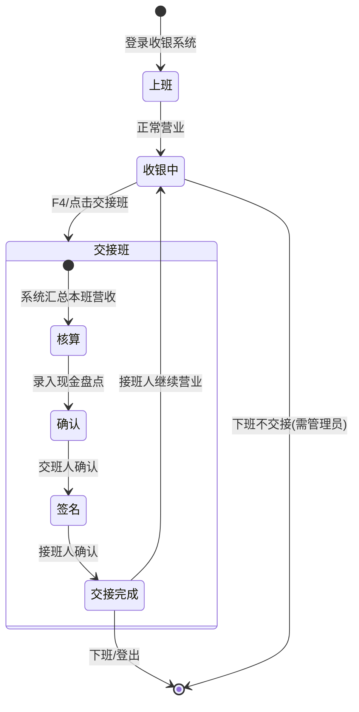

**交接班营收汇总内容：**

| 项目 | 展示方式 | 数据来源 |
|------|---------|---------|
| 现金收入 | 金额(¥) + 本班笔数 | 订单汇总 |
| 微信收入 | 金额(¥) + 笔数 | 支付渠道统计 |
| 支付宝收入 | 金额(¥) + 笔数 | 支付渠道统计 |
| 余额支付 | 金额(¥) + 笔数 | 会员卡支付统计 |
| 退款总额 | 金额(¥) | 本班退款汇总 |
| **实收合计** | **金额(¥) (大号加粗)** | 以上求和 |
| 订单笔数 | 整数 | 订单计数 |
| 客单价 | 金额(¥) (2位小数) | 总营收/总订单数 |
| 现金盘点 | 输入框(手动录入) | 实际清点现金 |

### 5.4 技术规格

| 项目 | 规格 |
|------|------|
| **窗口尺寸** | 最小 `1280×720`，推荐 `1920×1080` 全屏 |
| **响应式** | 支持 `1024×768`(触摸屏收银) 至 `4K` |
| **离线能力** | 断网时商品缓存本地(IndexedDB) → 订单队列 → 联网后批量同步 |
| **离线队列容量** | 最多缓存200笔订单（超过提示"请尽快联网同步"） |
| **硬件集成** | 小票打印机(ESC/POS指令) / 扫码枪(HID) / 钱箱(串口/RJ11) / 客显(串口) |
| **自动更新** | Electron autoUpdater / 后台静默下载 + 重启安装 |
| **数据同步** | 商品/价格每5分钟同步 / 会员信息实时查询 / 订单即时上传 |

---

## 6. 子系统三：PC游戏终端

### 6.1 终端状态机

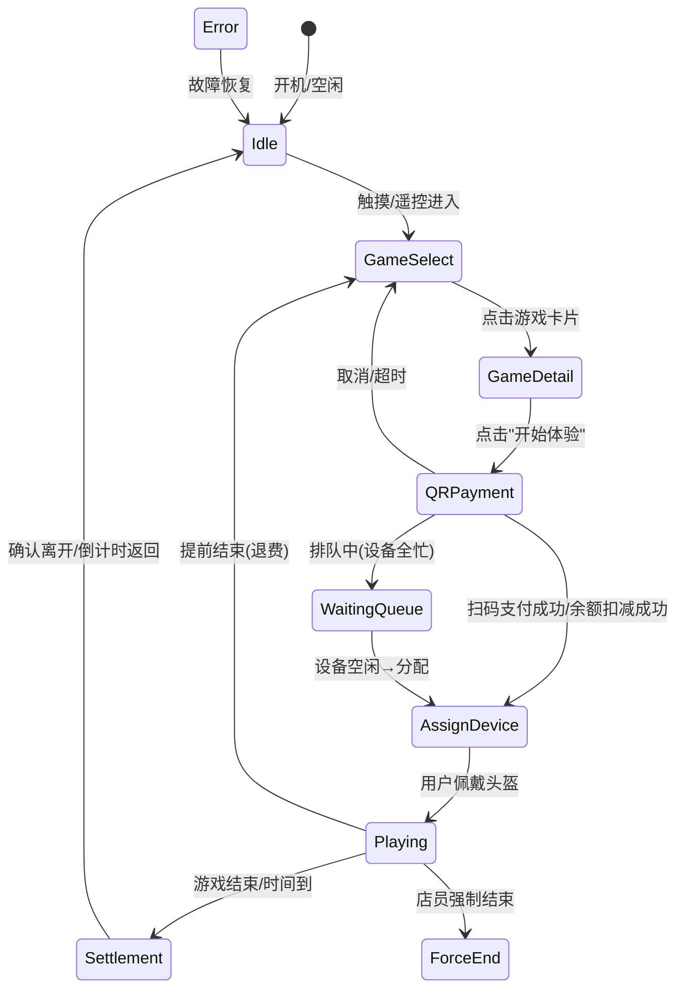

### 6.2 各状态页面规格

| # | 状态/页面 | 描述 | 核心UI元素 | 超时处理 |
|:-:|----------|------|-----------|---------|
| 1 | **待机 Idle** | 默认状态，吸引路人注意 | 店铺Logo + 动态视频/动画循环 + "点击开始"大按钮(80%宽度以上) + 当前设备状态(编号+网络) | 持续待机 |
| 2 | **游戏选择 GameSelect** | 游戏大厅网格 | 4列×N行游戏卡片(封面/名称/价格/时长/难度星级) + 分类筛选栏(5大类) + 分页 + 登录状态栏 | 60秒无操作→返回Idle |
| 3 | **游戏详情 GameDetail** | 选中游戏详情 | 大图/视频预览(全宽) + 游戏名称+介绍+价格+难度+时长+适合年龄 + "开始体验"CTA + 返回按钮 | 120秒无操作→返回GameSelect |
| 4 | **扫码支付 QRPayment** | 手机扫码支付 | 大二维码(≥300×300px) + 金额显示 + 15分钟倒计时 + 支付状态轮询(3秒间隔) + 取消按钮 | 15分钟超时→自动取消 |
| 5 | **分配设备 AssignDevice** | 引导到VR设备 | 大字"请佩戴 #XX 头盔" + 设备位置指引图 + 进度提示(游戏加载中) | 3分钟未佩戴→释放设备 |
| 6 | **游戏中监控 Playing** | VR运行监控面板 | VR画面镜像(缩略图) + 剩余时间(大号) + 进度条 + "提前结束"/"呼叫店员"按钮 | 无(游戏结束自动切) |
| 7 | **结算完成 Settlement** | 消费明细+评价 | 消费金额 + 游玩时长 + 剩余余额/次数 + 五星评分 + 文字评价 + "返回首页" | 30秒无操作→自动返回Idle |
| 8 | **系统设置 Settings** | 设备管理(密码保护) | 设备编号+状态+门店 + 网络测试 + 远程重启 + 日志导出 + 退出Kiosk | 60秒无操作→自动退出 |

### 6.3 PC终端技术规格

| 项目 | 规格 |
|------|------|
| **分辨率** | 主流 `1920×1080`，支持 `1280×800`(小平板) / `3840×2160`(4K大屏) |
| **输入方式** | 触摸屏(主要) / 键鼠(店员模式) |
| **Kiosk模式** | 全屏 + 禁用Win键/Ctrl+Alt+Del + 禁止多任务切换 + 崩溃自动重启 |
| **网络要求** | WiFi/有线双链路 + 断网降级(本地缓存+离线授权验证) |
| **心跳上报** | 每30秒MQTT上报设备状态 |
| **远程管理** | 后台远程重启 / 远程推送游戏更新 / 远程截屏 |
| **日志** | 本地循环日志(7天) + 异常自动上报 |

---

## 7. 子系统四：VR头显终端

### 7.1 核心设计原则

> **沉浸感是第一优先级。** VR头显内不做任何可有可无的UI。所有交互操作、信息展示、管理功能全部由PC终端承担。

**职责分离：**
- **PC终端**（触摸屏）：游戏浏览、详情查看、支付、分配设备、监控、结算、评分 → 完整的交互入口
- **VR终端**（头显内）：纯粹的沉浸式游戏体验 → 极简UI，SDK在后台默默运行

### 7.2 VR终端状态机（v1.3增强版）

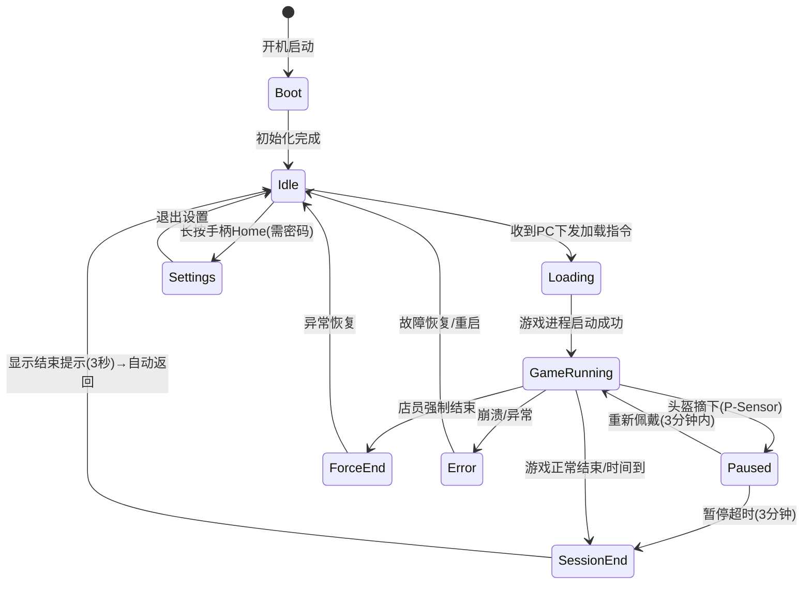

### 7.3 各状态详细规格

#### 状态 1: 待机 Idle

**用户视野：**
```
┌──────────────────────────────────────────────┐
│                                              │
│                                              │
│              [头号空间 品牌Logo]              │
│               (常亮浮空，30秒淡出至纯黑)      │
│                                              │
│           (其余区域纯黑，无任何文字)          │
│                                              │
│  行为:                                       │
│  · 收到PC终端下发指令→进入Loading            │
│  · 30秒无操作→Logo淡出→纯黑(省电模式)        │
│  · 用户无任何可交互元素                      │
│  · 待机功耗 < 30%                            │
└──────────────────────────────────────────────┘
```

#### 状态 2: 加载 Loading

**用户视野：**
```
┌──────────────────────────────────────────────┐
│                                              │
│              [头号空间 品牌Logo]              │
│                                              │
│           ◌ ◌ ◌ ◌ ◌ ◌ ◌ ● ◌                 │
│           (环形加载进度，最多显示3秒)         │
│                                              │
│  行为:                                       │
│  · 收到PC终端发送的游戏包名+参数              │
│  · 拉起游戏进程(Unity Player/system Intent)   │
│  · 游戏启动成功→自动切换至游戏画面           │
│  · 若3秒后仍未启动→进入纯黑(游戏接管)        │
└──────────────────────────────────────────────┘
```

#### 状态 3: 游戏中 GameRunning

**用户视野：** 纯游戏画面 → **没有任何叠加UI、没有倒计时、没有HUD、没有系统菜单入口。**

```
  SDK在后台默默运行（用户完全无感知）：
  · 每60秒 heartbeat 上报
  · 时间到 → 自动结束Session
  · 游戏崩溃 → 切换到Error状态
  
  异常情况：
  · 游戏正常结束 → 切换到GameEnded
  · 头盔摘下(P-Sensor) → SDK标记paused → 3分钟超时自动结束
  · 重新佩戴(3分钟内)→ 自动恢复 → 继续游戏(无中断感)
  · 游戏崩溃 → 进入Error
```

#### 状态 4: 暂停 Paused（头盔摘下时）

| 项目 | 规则 |
|------|------|
| 触发条件 | 头盔P-Sensor检测到摘下 / 系统菜单呼出 |
| 暂停期间 | **不计费**（`pause_duration_sec`从总时长中扣除） |
| 暂停时限 | 3分钟（超时自动结束Session） |
| 重新佩戴 | 3分钟内戴上 → 自动恢复游戏+继续计费 |
| 主动操作 | 可通过手柄选择"结束体验"退出 |

#### 状态 5: 结束 GameEnded

**用户视野：**
```
┌──────────────────────────────────────────────┐
│       体验已结束，请取下头盔                   │
│         (白色文字，居中浮空，3秒自动返回)      │
│                                              │
│  行为:                                       │
│  · 仅显示一行文字，不展示任何金额/时长       │
│  · 3秒后自动返回Idle待机                    │
│  · 完整结算信息在PC终端展示                  │
└──────────────────────────────────────────────┘
```

### 7.4 暂停计费与异常恢复策略

**暂停计费规则：**

```
摘盔(P-Sensor触发) → Session标记 paused
  ├── 暂停期间 ⏸ 不计费
  ├── 3分钟内重新佩戴 → 自动恢复游戏 → 继续计费
  ├── 3分钟超时未佩戴 → 自动结束Session → 按实际游玩时长结算
  └── 主动点击"结束" → 立即结算

实际付费时长 = actual_duration_sec - pause_duration_sec
```

**异常恢复规则（完整）：**

| 异常场景 | Session处理 | 费用处理 | 用户感知 |
|----------|------------|---------|---------|
| **设备断网(<3分钟)** | 继续运行，本地缓存操作日志 | 联网后按实际时长结算 | 无感知(VR继续运行) |
| **设备断网(>3分钟)** | 自动结束Session，按最后心跳时间结算 | 标记`offline_ended`需运营审核 | VR显示Error提示 |
| **设备断电** | Session被动消失，下次心跳恢复时标记`abnormal_end` | 按最后心跳时间计费，差额退还 | 重新上电后显示Error |
| **设备崩溃** | SDK上报异常，后端标记force_ended | 全额退费(用户无过错) | VR显示Error提示 |
| **游戏进程卡死(无心跳>60s)** | 后端主动标记force_stopped | 退费50%(设备问题)或全价(用户操作) | VR显示Error提示 |

---

## 8. 子系统五：游戏 SDK

### 8.1 SDK定位

连接VR头显/PC终端与平台后端的桥梁中间件——**平台的"神经末梢"**。

| 属性 | 值 |
|------|------|
| **形态** | C++17 原生库 (.so/.dll/.dylib) + Unity Package (.unitypackage) |
| **目标开发者** | 游戏内容提供商(CP)、VR设备厂商集成团队 |
| **核心设计原则** | 零侵入(对游戏逻辑无感知) / 高可靠(断网/崩溃保护) / 轻量(<50MB RAM) |

### 8.2 SDK完整架构

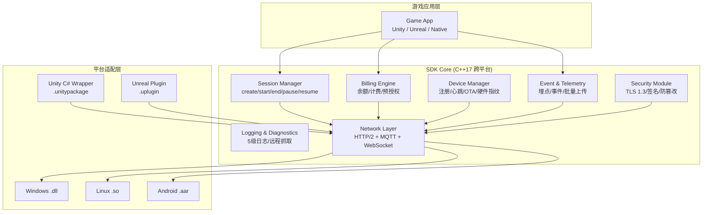

### 8.3 核心模块详解

#### 模块 1: Session Manager（会话管理器）

| API | 参数 | 返回值 | 说明 |
|-----|------|--------|------|
| `createSession` | memberId, gameId, gameVersion, expectedDurationMin | SessionHandle | 创建会话(1:1订单) |
| `startSession` | SessionHandle | Result | 开始计费 |
| `pauseSession` | SessionHandle | Result | 暂停(摘盔) |
| `resumeSession` | SessionHandle | Result | 恢复 |
| `endSession` | SessionHandle | SessionResult | 结束并结算 |
| `forceEndSession` | SessionHandle | Result | 强制结束(异常) |
| `heartbeat` | SessionHandle, gameProgress(0-1) | Result | 60秒心跳 |
| `extendSession` | SessionHandle, additionalMinutes | Result | 续费延长 |

#### 模块 2: Billing Engine（计费引擎）

| API | 参数 | 返回值 | 说明 |
|-----|------|--------|------|
| `queryBalance` | memberId, forceRefresh | BalanceInfo | 余额/游戏豆/积分 |
| `queryPackages` | memberId | PackageInfo[] | 剩余次数/到期时间 |
| `preAuthorize` | memberId, expectedMinutes | PreAuthResult | 预授权锁定金额 |
| `generatePaymentQR` | amount | QRCodeData | VR内支付二维码 |
| `getPaymentStatus` | orderId | PaymentStatus | 轮询支付状态 |

#### 模块 3: Device Manager（设备管理器）

| API | 参数 | 返回值 | 说明 |
|-----|------|--------|------|
| `registerDevice` | DeviceInfo | DeviceRegisterResult | 设备注册(首次) |
| `reportDeviceStatus` | DeviceStatus | Result | 硬件状态上报 |

**硬件指纹采集范围：** CPU型号/GPU型号/总内存/总存储/MAC地址/蓝牙MAC/序列号

#### 模块 4: 安全模块（v1.3新增）

| 安全措施 | 说明 |
|----------|------|
| TLS 1.3 加密通信 | 双向证书校验 |
| 设备身份认证 | 硬件绑定(SNR + TPM) + 一次性注册码 |
| API调用签名 | HMAC-SHA256(request body + timestamp) |
| 防篡改 | SDK二进制完整性校验(启动时SHA256自检) |
| 防重放 | 每个请求携带X-Timestamp+X-Signature |

### 8.4 SDK 错误码大全

| 错误码 | 常量名 | HTTP | 说明 | 处理方案 |
|:------:|--------|:----:|------|---------|
| 0 | SUCCESS | 200 | 成功 | - |
| -100 | ERR_NOT_INITIALIZED | - | SDK未初始化 | 检查initialize()调用 |
| -200 | ERR_NETWORK | 502 | 网络连接失败 | 指数退避重试队列 |
| -300 | ERR_AUTH_FAILED | 401 | Token认证失败 | 检查storeToken |
| -400 | ERR_INVALID_SESSION | 404 | Session ID不存在 | 检查参数 |
| -500 | ERR_INSUFFICIENT_BALANCE | 402 | 余额不足 | 引导用户充值 |
| -502 | ERR_SESSION_EXPIRED | 400 | Session超期>12h | 创建新Session |
| -600 | ERR_DEVICE_OFFLINE | 503 | 设备已离线 | 等待心跳恢复 |
| -700 | ERR_OTA_IN_PROGRESS | 409 | OTA更新中 | 等待完成 |
| -800 | ERR_OFFLINE_CONFLICT | 409 | 离线数据冲突 | 以服务端为准 |
| -999 | ERR_UNKNOWN | 500 | 未知错误 | 收集日志上报 |

### 8.5 离线队列策略

```
离线队列架构：
SDK内部维护FIFO队列(disk-backed SQLite，容量上限1000条)
正常模式: 请求 → HTTP发送 → 成功(移除) / 失败(指数退避重试)
断网模式: 请求 → 写入本地队列(带X-Request-ID幂等key)
联网恢复: 按时间戳顺序逐一重放 → 成功后移除 → 冲突标记

三大原则：
1. 先入先出：离线期间的请求严格按时间戳顺序重放
2. 幂等覆盖：服务端以最终状态为准(幂等key保留72小时)
3. 冲突标记：状态不一致时标记CONFLICT → 运营后台人工审核
```

### 8.6 Unity C# Wrapper 快速集成

```csharp
public class THKSdkManager : MonoBehaviour
{
    void Awake()
    {
        var config = new SdkConfig
        {
            apiBaseUrl = "https://api.touhaokongjian.com/v2",
            mqttBrokerUrl = "mqtts://mqtt.touhaokongjian.com:8883",
            deviceId = GetDeviceId(),
            storeToken = "tk_store_xxxx",
            logLevel = LogLevel.Info
        };
        THKSdk.Instance.Initialize(config);
        THKSdk.Instance.OnEvent += OnSdkEvent;
    }

    // 创建游戏会话示例
    public void StartGame(string memberId, string gameId)
    {
        var param = new SessionParams
        {
            memberId = memberId,
            gameId = gameId,
            expectedDurationMin = 10
        };
        var handle = THKSdk.Instance.CreateSession(param);
        THKSdk.Instance.StartSession(handle);
    }
}
```

---

## 9. 子系统六：Web管理后台（三端合一）

### 9.1 统一代码库架构

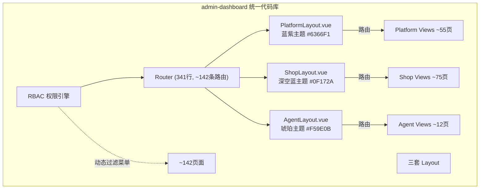

### 9.2 总运营后台详细模块（55页）

| 模块 | 页面数 | 核心功能 | 路由前缀 |
|:----:|:------:|---------|----------|
| 📊 数据中心 | 4 | 全局数据大屏/多维报表/内容消费大盘/设备总览 | `/platform/dashboard` |
| 🏪 门店体系 | 6 | 门店列表/审核/详情/商家管理/代理商管理/等级套餐 | `/platform/stores` |
| 🎮 内容中心 | 4 | 游戏库CRUD/审核/内容分发推送/版本更新 | `/platform/games` |
| 👥 会员中心(全网) | 9 | 跨店检索/会员增长/储值审计/游戏币查询/预存次数审计 | `/platform/members` |
| 📋 订单流水 | 6 | 6种订单类型: 收银/VOD/手工/余额/游戏币/促销 | `/platform/orders` |
| 💰 **平台财务(★核心)** | **8** | **营收总览/游戏豆销售/商家结算/代理商结算/阶梯策略/分账管理/对账/财务报表** | `/platform/finance` |
| 👤 平台账号 | 2 | 员工账号管理/RBAC权限矩阵 | `/platform/users` |
| ❓ 帮助通知 | 5 | 文档/FAQ/公告/推送/收件箱 | `/platform/help` |
| ⚙️ 系统运维 | 7 | 版本发布/告警中心/操作日志/工单系统/帮助中心 | `/platform/system` |
| 👤 个人中心 | 2 | 个人信息/安全设置 | `/platform/account` |

#### 9.2.1 平台财务模块详解（★v1.3核心新增）

| # | 页面 | 路由 | 核心功能 | 权限 |
|:-:|------|------|---------|:----:|
| 1 | **营收总览** | `/platform/finance/overview` | 全平台GMV/平台净收入/各线收入占比/月同比趋势/TOP10排行 | 超管·运营·财务 |
| 2 | **游戏豆销售** | `/platform/finance/game-bean` | 采购明细/商家排名/价差分析/库存预警 | 超管·运营·财务 |
| 3 | **商家结算** | `/platform/finance/merchant-settle` | 月度流水/抽成计算/待结算/已打款/异常标记 | 超管·财务 |
| 4 | **代理商结算(★)** | `/platform/finance/agent-settle` | 全代理分润概览/按级别筛选/阶梯系数应用/本月应发总额 | 超管·财务 |
| 5 | **阶梯策略配置** | `/platform/finance/tier-config` | 各级基础比例/区间系数矩阵(可视化拖拽)/版本管理/模拟计算器 | **仅超管** |
| 6 | **分账管理(★)** | `/platform/finance/payouts` | 异常处理/状态监控/人工放行/失败重试/拉卡拉同步 | 超管·财务 |
| 7 | **对账中心** | `/platform/finance/reconciliation` | 四方(平台/支付/商家/代理)自动比对/差异高亮/人工调账 | 超管·财务 |
| 8 | **财务报表** | `/platform/finance/reports` | 利润损益表/现金流量表/应收账款账龄/ARPU趋势 | 超管·运营·财务 |

### 9.3 商家管理后台详细模块（75页）

| 模块 | 页面数 | 核心功能 | 路由前缀 |
|:----:|:------:|---------|----------|
| 📈 工作台 | 1 | KPI卡片/设备12宫格监控/营收趋势图/待办 | `/shop/workbench` |
| 📦 商品管理 | 3 | 实体商品CRUD+库存/虚拟商品(次卡/时长卡/储值)/单次消费项目 | `/shop/products` |
| 🎟️ 运营管理 | 10 | 充值套餐/套票/优惠券/促销/赠送/短信/导购/会员运营 | `/shop/recharge` |
| 👥 会员管理 | 11 | 会员CRUD/等级5级/排行/储值变更/游戏币次数/调整日志 | `/shop/members` |
| 📊 数据报表 | 22 | 日报/历史/渠道/售品/账户/交接班/员工点播/点播数据6页/订单查询7类 | `/shop/reports` |
| 💰 财务管理 | 7 | 结算/对账/账户总览4页/游戏豆充值 | `/shop/finance` |
| ⚙️ 系统设置 | 14 | 店铺/点播/设备(含远程)/收银3项/参数/RBAC | `/shop/settings` |
| 👤 个人中心 | 4 | 商家信息/个人/安全/消息 | `/shop/account` |

### 9.4 代理商系统详细模块（12页）

| # | 路由 | 页面 | 核心功能 |
|:-:|------|------|---------|
| 1 | `/agent/dashboard` | 首页概览 | KPI + 充值趋势 + TOP10商家排行 + 最近分润 |
| 2 | `/agent/merchants` | 商家管理 | 搜索/筛选 + 详情弹窗 |
| 3 | `/agent/stores` | 店铺概览 | 店铺列表 + 状态筛选 |
| 4 | `/agent/stores/devices` | 设备统计 | 汇总卡 + 明细表 + 饼图 |
| 5 | `/agent/commission` | 分润明细 | 阶梯策略面板 + 明细表 |
| 6 | `/agent/settlement` | 结算记录 | 月度结算 + Excel导出 |
| 7 | `/agent/bank-account` | 提现账户 | 冷却期+短信验证+操作日志 |
| 8 | `/agent/reports/revenue` | 营收统计 | 折线图 + 环形图 |
| 9 | `/agent/reports/members` | 会员统计 | 增长曲线 + 分布对比 |
| 10 | `/agent/account` | 账户信息 | 公司资料编辑 |
| 11 | `/agent/account/security` | 安全设置 | 密码/手机/设备管理 |
| 12 | `/agent/account/message` | 消息中心 | 系统+公告 + 已读标记 |

---

## 10. 核心业务流程

### 10.1 C端用户到店消费完整闭环（九阶段）

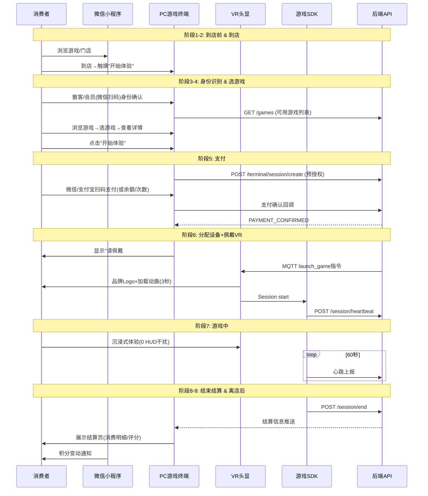

### 10.2 三个核心场景

#### 场景一：散客自助体验（最简路径）

```
1. 到店 → 2. PC终端浏览游戏(无需登录)
3. 选游戏 → 点击"开始体验" → 显示原价
4. 扫码支付(微信/支付宝) → 5. 分配空闲VR设备
6. 佩戴VR头盔 → 自动加载游戏
7. 纯沉浸玩游戏(0 UI干扰)
8. 游戏结束 → PC终端结算页(消费金额+评分)
9. 离店
```

#### 场景二：会员身份消费

```
1. 到店 → 2. PC终端微信扫码登录/输入手机号
3. 验证身份 → 显示会员价(95折)
4. 选游戏 → 选择支付方式:
   ├─ 余额支付: 直接扣款
   ├─ 次数套票: 扣减剩余次数
   └─ 扫码支付: 显示二维码
5. 分配设备 → 佩戴 → 游戏 → 结算(含积分变动)
```

#### 场景三：小程序预约到店

```
1. 在家浏览小程序 → 查看门店/游戏/价格
2. 预约时段(如14:00)
3. 到店→前台扫码核销预约码
4. 已预付→直接分配设备 / 未预付→引导支付
5. 游戏→结算
```

### 10.3 订单生命周期

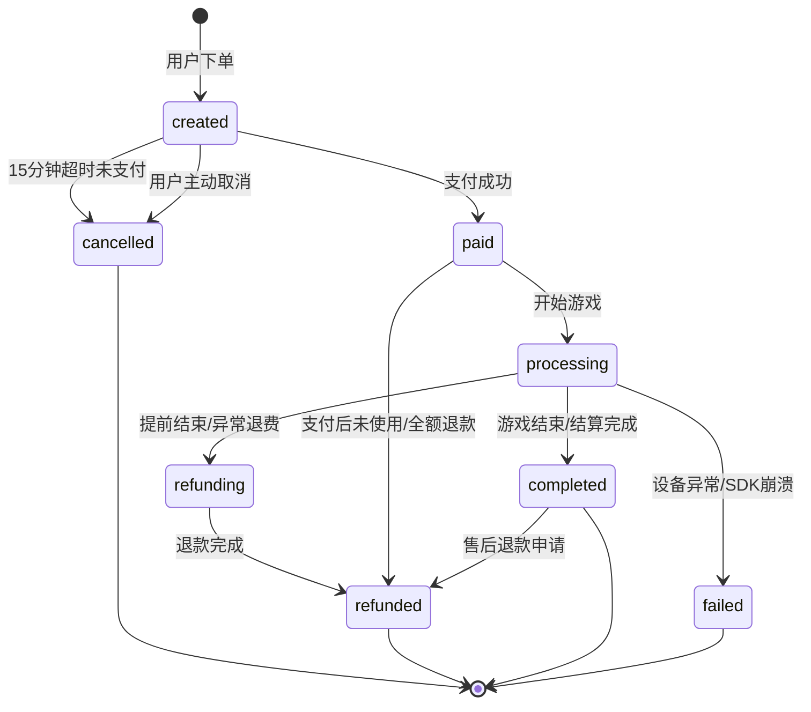

### 10.4 结算分润流程

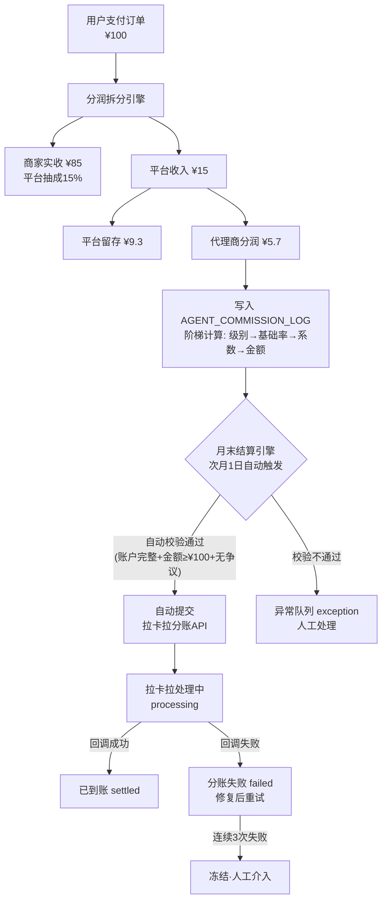

---

## 11. 数据模型设计

### 11.1 核心表总览

| 表名 | 说明 | 核心关联 |
|------|------|---------|
| `ORDER` | 订单表(支付对账基石) | 1:1 GAME_SESSION, N:1 MEMBER, N:1 STORE |
| `GAME_SESSION` | 游戏会话表 | 1:1 ORDER, N:1 DEVICE |
| `DEVICE_SHADOW` | 设备影子表 | 1:1 DEVICE |
| `QUEUE_TICKET` | 排队票据表 | N:1 STORE |
| `MEMBER` | 会员表 | 1:N ORDER |
| `STORE` | 门店表 | 1:N DEVICE |
| `AGENT` | 代理商表 | 1:N STORE |
| `SETTLEMENT` | 结算记录表 | N:1 AGENT/STORE |

### 11.2 ORDER 订单表（完整字段）

| 字段 | 类型 | 必填 | 说明 |
|------|------|:----:|------|
| `id` | UUID | ✅ | 主键 |
| `order_no` | VARCHAR(32) | ✅ | 业务订单号(唯一)，格式: `THK{门店编号}{8位日期}{6位序列}` |
| `store_id` | UUID | ✅ | 所属门店 |
| `member_id` | UUID | | 会员ID(空=散客) |
| `staff_id` | UUID | | 操作店员ID(收银开单时) |
| `terminal_type` | ENUM | ✅ | 终端来源: `cashier`(收银)/`pc_terminal`(PC终端)/`vr_headset`(VR)/`miniapp`(小程序)/`manual`(手动) |
| `order_type` | ENUM | ✅ | 订单类型: `consume`(消费)/`recharge`(充值)/`refund`(退款)/`gift`(赠送)/`adjust`(调整) |
| `status` | ENUM | ✅ | 状态流: `created`→`paid`→`processing`→`completed`/`cancelled`/`refunded`/`failed` |
| `items` | JSONB | ✅ | 订单明细 `[{product_id, name, qty, unit_price, subtotal, type}]` |
| `original_amount` | DECIMAL(10,2) | ✅ | 原始金额(未优惠) |
| `discount_amount` | DECIMAL(10,2) | | 优惠减免总额 |
| `coupon_id` | UUID | | 使用的优惠券ID |
| `actual_amount` | DECIMAL(10,2) | ✅ | **实付金额**(用户实际支付) |
| `session_id` | VARCHAR(64) | | 关联的GAME_SESSION ID（1:1关系） |
| `payment_channel` | ENUM | | 支付渠道: `wechat`/`alipay`/`balance`(余额)/`cash`(现金)/`mixed`(混合) |
| `transaction_id` | VARCHAR(128) | | 支付渠道流水号(用于对账) |
| `callback_raw_data` | TEXT | | 支付回调原始报文(审计用) |
| `refund_status` | ENUM | | 退款状态: `none`/`partial`/`full` |
| `refund_amount` | DECIMAL(10,2) | | 已退款总额 |
| `platform_commission` | DECIMAL(10,2) | | 平台抽成金额 |
| `agent_commission` | DECIMAL(10,2) | | 代理商分润金额 |
| `merchant_net_revenue` | DECIMAL(10,2) | | 商家实收净额 |
| `commission_status` | ENUM | | 分润状态: `pending`/`settled`/`paid` |
| `created_at` | TIMESTAMP | ✅ | 创建时间 |
| `paid_at` | TIMESTAMP | | 支付时间 |
| `expired_at` | TIMESTAMP | | 支付超时时间(默认15分钟) |
| `updated_at` | TIMESTAMP | ✅ | 更新时间 |

### 11.3 GAME_SESSION 游戏会话表

| 字段 | 类型 | 说明 |
|------|------|------|
| `id` | VARCHAR(64) | 主键，格式: `sess_{日期}_{6位随机}` |
| `order_id` | UUID | 关联ORDER表（1:1） |
| `device_id` | VARCHAR(64) | VR设备ID |
| `game_id` | UUID | 游戏ID |
| `member_id` | UUID | 会员ID(空=散客) |
| `session_type` | ENUM | `single`(单人)/`multi`(多人联机) |
| `billing_mode` | ENUM | `by_time`(按时)/`by_count`(按次)/`package`(套票) |
| `unit_price` | DECIMAL(10,4) | 单价(元/分钟) |
| `expected_duration_sec` | INT | 预期时长(秒) |
| `actual_duration_sec` | INT | 实际游玩时长(秒) |
| `pause_duration_sec` | INT | 暂停累计时长(摘盔不计费部分) |
| `pre_auth_id` | VARCHAR(64) | 预授权ID |
| `pre_auth_amount` | DECIMAL(10,2) | 预授权锁定金额 |
| `status` | ENUM | `pending`/`running`/`paused`/`ended`/`abnormal`/`force_ended` |
| `total_fee` | DECIMAL(10,2) | 最终结算费用 |
| `refund_amount` | DECIMAL(10,2) | 退款金额 |
| `balance_after` | DECIMAL(10,2) | 结算后余额 |
| `heartbeat_count` | INT | 心跳总次数 |
| `last_heartbeat_at` | TIMESTAMP | 最后心跳时间 |
| `started_at` | TIMESTAMP | 开始时间 |
| `ended_at` | TIMESTAMP | 结束时间 |
| `offline_created` | BOOLEAN | 是否离线状态下创建 |

### 11.4 DEVICE_SHADOW 设备影子表

**关键指标字段：**

| 字段 | 类型 | 说明 | 重要程度 |
|------|------|------|:--------:|
| `cpu_temperature` | DECIMAL(5,1) | CPU温度(°C) | ⭐ 过热预警 |
| `gpu_temperature` | DECIMAL(5,1) | GPU温度(°C) | ⭐ |
| `battery_level` | INT | **电量百分比 0-100** | ⭐⭐ VR头显关键指标 |
| `is_charging` | BOOLEAN | **是否在充电中** | ⭐⭐ |
| `fps` | DECIMAL(5,1) | **当前帧率** | ⭐⭐ 体验质量 |
| `thermal_level` | INT | **热力等级 0-5** | ⭐⭐ |
| `signal_strength` | INT | **信号强度 0-100** | ⭐⭐ |
| `headset_worn` | BOOLEAN | **P-Sensor是否检测到佩戴** | ⭐⭐ |
| `current_session_id` | VARCHAR(64) | 当前Session ID | ⭐ |
| `uptime_ms` | BIGINT | 设备总运行时长 | ⭐ 运维 |

### 11.5 AGENT 代理商扩展字段

| 字段 | 类型 | 说明 |
|------|------|------|
| `level` | ENUM | `city`/`region`/`province` |
| `deposit` | DECIMAL(10,2) | 保证金 |
| `base_commission_rate` | DECIMAL(5,4) | 基础分润比例 |
| `tier_strategy` | JSONB | 阶梯分润配置 `[{"min":0,"max":50000,"factor":0.8},...]` |
| `bank_account_no` | VARCHAR(64) | 银行账号(加密存储) |
| `bank_account_cooling_until` | TIMESTAMP | 修改冷却期截止时间 |
| `bank_account_history` | JSONB | 变更审计日志 |
| `managed_area` | JSONB | 管理区域 `[{"province":"广东","cities":["深圳","广州"]}]` |
| `total_earned` | DECIMAL(12,2) | 历史总收益 |

---

## 12. API接口规划

### 12.1 API响应格式标准

```json
// 成功响应
{
  "code": 0,
  "message": "success",
  "data": { ... },
  "timestamp": 1714435200000
}

// 错误响应
{
  "code": 40001,
  "message": "余额不足",
  "data": null,
  "timestamp": 1714435200000
}

// 分页响应
{
  "code": 0,
  "data": {
    "list": [ ... ],
    "pagination": {
      "page": 1,
      "size": 20,
      "total": 156
    }
  },
  "timestamp": 1714435200000
}
```

### 12.2 通用接口

| 方法 | 路径 | 说明 |
|:----:|------|------|
| POST | `/auth/login` | 账号密码登录 |
| POST | `/auth/wechat-login` | 微信小程序登录 |
| POST | `/auth/token/refresh` | 刷新JWT |
| GET | `/common/stores/nearby` | LBS附近门店 |
| GET | `/common/games` | 游戏列表(公开) |
| GET | `/common/games/:id` | 游戏详情 |
| POST | `/search` | 全文搜索 |

### 12.3 C端小程序专用

| 方法 | 路径 | 说明 |
|:----:|------|------|
| GET | `/mini/home` | 首页数据(Banner/推荐/热门) |
| GET | `/mini/games?category=&page=` | 游戏分类列表(分页) |
| GET | `/mini/games/:id/detail` | 游戏详情(含评价) |
| GET | `/mini/member/profile` | 我的个人信息 |
| POST | `/mini/recharge` | 充值(微信支付) |
| GET | `/mini/orders` | 订单列表 |
| GET | `/mini/reviews` | 获取评价列表 |
| POST | `/mini/reviews` | 提交评价 |
| GET | `/mini/coupons/my` | 我的优惠券 |
| POST | `/mini/queue/join` | 加入排队 |
| POST | `/mini/queue/leave` | 离开排队 |
| GET | `/mini/messages` | 消息列表 |
| POST | `/mini/invite/generate` | 生成邀请海报 |

### 12.4 PC终端/游戏SDK专用

| 方法 | 路径 | 说明 |
|:----:|------|------|
| POST | `/terminal/auth` | 终端认证(设备证书) |
| GET | `/terminal/games` | 可用游戏列表 |
| POST | `/terminal/session/create` | 创建会话(预授权) |
| POST | `/terminal/session/:id/start` | 开始计费 |
| POST | `/terminal/session/:id/pause` | 暂停(摘盔) |
| POST | `/terminal/session/:id/resume` | 恢复 |
| POST | `/terminal/session/:id/end` | 结束会话(结算) |
| POST | `/terminal/session/:id/extend` | 续费延长 |
| POST | `/terminal/session/:id/force-stop` | 强制结束 |
| POST | `/terminal/session/:id/heartbeat` | 心跳保活 |
| GET | `/terminal/queue/current` | 当前排队情况 |
| WS | `/ws/terminal/:deviceId/events` | WebSocket事件推送 |

### 12.5 平台财务专用接口（★v1.3新增）

| # | 方法 | 路径 | 说明 | 权限 |
|:-:|:----:|------|------|:----:|
| 1 | GET | `/platform/finance/overview` | 全平台GMV/净收入/趋势 | 超管·运营·财务 |
| 2 | GET | `/platform/finance/agent-settle/list` | 代理商分润列表(筛选) | 超管·财务 |
| 3 | GET | `/platform/finance/agent-settle/:id/detail` | 代理商分润详情(阶梯计算) | 超管·财务 |
| 4 | POST | `/platform/finance/agent-settle/generate-batch` | 批量生成本月结算单 | **仅超管** |
| 5 | GET | `/platform/finance/tier-strategy/current` | 当前生效阶梯策略 | **仅超管** |
| 6 | PUT | `/platform/finance/tier-strategy/update` | 更新阶梯规则(版本化) | **仅超管** |
| 7 | POST | `/platform/finance/tier-strategy/simulate` | 模拟计算器 | **仅超管** |
| 8 | GET | `/platform/finance/payouts?status=` | 打款队列(按状态筛选) | 超管·财务 |
| 9 | PUT | `/platform/finance/payouts/:id/resolve` | 异常放行 | 超管·财务 |
| 10 | POST | `/platform/finance/payouts/batch-resolve` | 批量放行 | 超管·财务 |
| 11 | GET | `/platform/finance/reconciliation/summary` | 四方对账概览 | 超管·财务 |
| 12 | POST | `/platform/finance/reconciliation/manual-adjust` | 人工调账(双因子审批) | 超管·财务 |

---

## 13. 角色权限体系（RBAC）

### 13.1 八角色层级

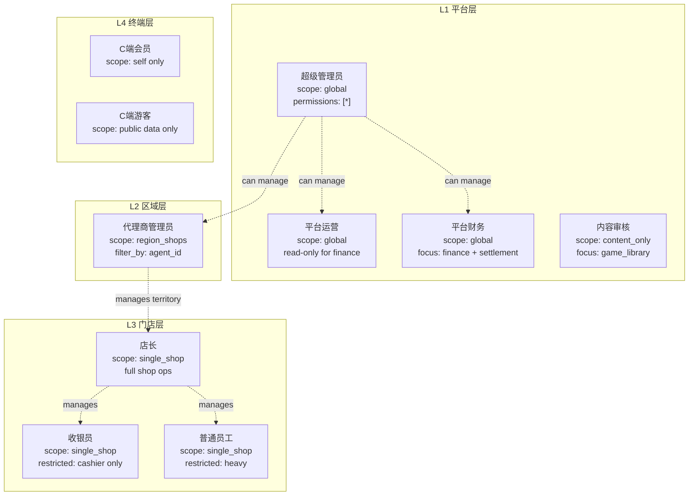

### 13.2 数据隔离规则

| 角色 | 可见范围 | 可访问子系统 |
|------|---------|------------|
| 超管/运营/财务/内容 | 全平台 | 总运营后台(Web) |
| 代理商 | `WHERE agent_id = current` | 代理商后台(Web) |
| 店长 | `WHERE store_id = current_store` | 商家后台(Web) + 收银系统(查看) |
| 收银员 | `WHERE staff_id = current AND store_id = current_store` | 收银系统(PC) |
| 员工 | `WHERE store_id = current_store AND limited_by_role` | 商家后台(受限) |
| C端会员 | 仅自己的数据 | C端小程序 |
| C端游客 | 仅公开数据(游戏列表/门店信息) | C端小程序(受限) |

### 13.3 权限矩阵（完整版）

| 功能域 | 超管 | 运营 | 财务 | 内容 | 代理商 | 店长 | 收银员 | C端 | 游客 |
|:-------|:----:|:----:|:----:|:----:|:------:|:----:|:------:|:---:|:----:|
| **全局数据大屏** | ✅ | ✅ | ✅ | - | - | - | - | - | - |
| **门店工作台** | ✅ | ✅ | ✅ | - | ✅ | ✅ | ✅ | - | - |
| **门店管理(全部)** | ✅ | ✅ | - | - | ✅* | - | - | - | - |
| **门店管理(本店)** | ✅ | ✅ | ✅ | - | ✅ | ✅(本店) | 👁 | - | - |
| **游戏库CRUD** | ✅ | ✅ | - | ✅ | - | - | - | - | - |
| **游戏体验(终端)** | - | - | - | - | - | - | - | ✅ | ✅ |
| **内容分发** | ✅ | ✅ | - | - | - | - | - | - | - |
| **会员管理(全部)** | ✅ | ✅* | ✅* | - | ✅ | - | - | - | - |
| **会员管理(本店)** | ✅ | ✅* | ✅* | - | ✅ | ✅ | ✅ | ✅(自己) | - |
| **会员等级规则** | ✅ | ✅ | - | - | - | ✅ | - | - | - |
| **收银开单** | - | - | - | - | - | - | ✅ | - | - |
| **订单管理(全部)** | ✅ | ✅* | ✅* | - | ✅* | - | - | ✅(自己) | - |
| **退款审批** | ✅ | ✅ | ✅ | - | - | ✅ | - | - | - |
| **交接班** | - | - | - | - | - | ✅ | ✅ | - | - |
| **设备监控(全局)** | ✅ | ✅ | - | - | ✅ | - | - | - | - |
| **设备监控(本店)** | ✅ | ✅ | ✅ | - | ✅ | ✅ | 👁 | - | - |
| **设备远程控制** | ✅ | ✅ | - | - | - | ✅ | - | - | - |
| **平台财务总览** | ✅ | - | ✅ | - | - | - | - | - | - |
| **代理商结算(平台)** | ✅ | ✅* | ✅* | - | - | - | - | - | - |
| **阶梯策略编辑** | ✅ | - | - | - | - | - | - | - | - |
| **分账管理** | ✅ | - | ✅ | - | - | - | - | - | - |
| **对账调账** | ✅ | - | ✅ | - | - | - | - | - | - |
| **优惠券(全局)** | ✅ | ✅ | - | - | - | - | - | - | - |
| **优惠券(本店)** | ✅ | ✅ | ✅ | - | ✅ | ✅ | - | - | - |
| **营销活动** | ✅ | ✅ | ✅ | - | ✅ | ✅ | - | - | - |
| **平台公告推送** | ✅ | ✅ | - | - | - | - | - | - | - |
| **员工管理(本店)** | - | - | - | - | - | ✅ | - | - | - |
| **角色权限配置** | ✅ | - | - | - | - | - | - | - | - |
| **系统参数配置** | ✅ | - | - | - | - | - | - | - | - |
| **版本发布管理** | ✅ | - | - | - | - | - | - | - | - |
| **操作日志审计** | ✅ | - | - | - | - | ✅(本店) | - | - | - |
| **工单系统** | ✅ | ✅ | - | - | ✅ | ✅ | ✅ | ✅ | - |
| **帮助文档** | ✅ | ✅ | ✅ | - | ✅ | ✅ | ✅ | ✅ | ✅ |

`✅` 完全访问 &nbsp; `✅*` 只读 &nbsp; `👁` 仅查看状态 &nbsp; `-` 无权 &nbsp; `✅(本店)` 仅本店范围

---

## 14. UI/UX设计规范

### 14.1 色彩系统

```css
:root {
  /* ===== 品牌色 ===== */
  --color-primary: #3B82F6;        /* 电光蓝 - 主色调 */
  --color-primary-dark: #2563EB;   /* 深蓝 */
  --color-primary-light: #93C5FD;  /* 浅蓝 */
  
  /* ===== 中性色 ===== */
  --color-bg-base: #F8FAFC;       /* 页面背景 */
  --color-bg-white: #FFFFFF;      /* 卡片背景 */
  --color-bg-sidebar: #0F172A;    /* 侧边栏背景 - 深空蓝 */
  --color-border: #E2E8F0;        /* 边框 */
  --color-text-primary: #1E293B;  /* 主文字 */
  --color-text-secondary: #64748B;/* 次要文字 */
  
  /* ===== 语义色 ===== */
  --color-success: #22C55E;       /* 成功绿 */
  --color-warning: #F59E0B;       /* 警告黄 */
  --color-danger: #EF4444;        /* 错误红 */
  --color-info: #3B82F6;          /* 信息蓝 */

  /* ===== 三套Layout主题色 ===== */
  /* 总运营后台: 蓝紫 */
  --platform-primary: #6366F1;
  /* 商家后台: 深空蓝 */
  --shop-primary: #0F172A;
  /* 代理商系统: 琥珀 */
  --agent-primary: #F59E0B;
}
```

### 14.2 三套侧边栏导航

**总运营后台侧边栏：**

| 一级菜单 | 二级菜单 |
|---------|---------|
| 📊 数据中心 | 大屏看板 / 数据报表 |
| 🏪 门店管理 | 门店列表 / 门店审核 / 代理商 |
| 🎮 内容中心 | 游戏库 / 内容分发 / 审核管理 |
| 👥 用户体系 | 平台账号 / 角色权限 |
| 🎟️ 营销工具 | 优惠券 / 活动配置 |
| 💰 平台财务 | 营收总览 / 结算管理 / 对账中心 / 阶梯策略 / 分账管理 |
| ⚙️ 系统运维 | 版本发布 / 告警中心 / 操作日志 |
| 🛠️ 运维支持 | 工单系统 / 帮助中心 |

**商家后台侧边栏：**

| 一级菜单 | 二级菜单 |
|---------|---------|
| 📈 工作台 | 今日概况 / 设备监控 / 营收概览 |
| 👥 会员管理 | 会员列表 / 充值记录 / 标签画像 / 等级配置 |
| 📦 商品管理 | 实体商品 / 虚拟商品 / 库存管理 |
| 🎮 设备管理 | 设备列表 / 远程控制 |
| 💵 营业报表 | 收入分析 / 订单明细 / 交接班 / 员工点播 |
| 🎟️ 营销工具 | 优惠券 / 活动配置 / 短信营销 |
| 👨‍💼 员工管理 | 员工列表 / 权限分配 |
| ⚙️ 店铺设置 | 基本信息 / 收银设置 / Token配置 / 系统参数 |

**代理商侧边栏：**

| 一级菜单 |
|---------|
| 📊 首页概览 |
| 🏪 商家管理 |
| 🏬 店铺概览 |
| 📊 设备统计 |
| 💰 分润明细 |
| 📋 结算记录 |
| 💳 提现账户 |
| 📈 营收统计 |
| 👥 会员统计 |
| 👤 账户信息 |

### 14.3 交互设计标准

| 元素 | 交互行为 | 反馈 |
|------|---------|------|
| **按钮** | hover: 背景色加深10% / active: scale(0.97) / disabled: 灰色+禁止点击 | 视觉+可选触觉 |
| **表格行** | hover: 背景色变浅(HSLA) / click: 选中高亮(蓝色) | 视觉反馈 |
| **搜索输入框** | 300ms防抖自动搜索 / 空状态: "无搜索结果" / 加载: 骨架屏 | 视觉 |
| **表单提交** | 按钮loading状态(disabled+旋转图标) / 成功提示(绿色Toast 3s) / 失败提示(红底白字) | 视觉 |
| **长列表** | 虚拟滚动(仅渲染可视区域) + 上拉加载更多 | 性能优化 |
| **弹窗/Modal** | 居中显示 + 遮罩(点击外部关闭) / ESC关闭 / 入场动画(fade-in scale 0.9→1) | 视觉+动画 |
| **Toast通知** | 右上角弹出 / 3秒自动消失 / 手动关闭 / 最多叠3条 | 视觉 |
| **确认对话框** | 居中 + "确定"/"取消" / 破坏性操作用红色按钮 + 二次确认弹窗 | 视觉+确认 |
| **空状态** | 插图(200×200) + 主文案 + 副文案 + 操作按钮 | 引导 |
| **加载状态** | 首屏: 骨架屏 / 局部: spinner(24px) / 页面切换: 顶部进度条 | 视觉 |

---

## 15. 竞品分析与差异化

### 15.1 竞品总览

| 项目 | 我们 | 幻影星空（竞品） | 头号空间优势 |
|:-----|:----:|:----------------:|:-----------:|
| **架构** | 统一平台+RBAC(一套代码多角色) | 独立双后台(维护成本高) | ✅ 代码维护减少50%+ |
| **权限** | 8角色层级化权限矩阵 | 游客模式(体验割裂) | ✅ 精细化管控 |
| **Token** | 可视化配置+审计日志+轮换机制 | 机制存在但流程不清晰 | ✅ 安全合规 |
| **设备监控** | 实时画面预览+远程控制(重启/结束/喊话) | 仅基础状态显示 | ✅ 远程运维能力 |
| **数据分析** | 8种报表+自定义组合+同行对比 | 基础固定报表 | ✅ 数据驱动决策 |
| **营销工具** | 5种券型+CRM会员体系+自动化营销 | 仅优惠券发放 | ✅ 完整的营销闭环 |
| **视觉** | 深空蓝+电光蓝+VR元素(现代科技风) | 传统后台风格 | ✅ 品牌辨识度 |
| **多终端** | PC收银/小程序/PC终端三端协同 | PC为主 | ✅ 场景全覆盖 |

### 15.2 功能覆盖度（100% + 30项超越）

| 模块 | 竞品功能数 | 已覆盖 | 覆盖率 | 超越项 |
|:-----|:--------:|:----:|:-----:|:-----:|
| 1. 工作台/首页 | 4 | 4 | **100%** | +2 |
| 2. 数据报表 | 4 | 4 | **100%** | +6 |
| 3. 会员管理 | 5 | 5 | **100%** | +4 |
| 4. 游戏内容 | 4 | 4 | **100%** | +3 |
| 5. 设备管理 | 3 | 3 | **100%** | +5 |
| 6. 订单/收银 | 5 | 5 | **100%** | +3 |
| 7. 商品管理 | ~4 | ~4 | **100%** | +4 |
| 8. 系统设置 | 3 | 3 | **100%** | +3 |
| **合计** | **~32** | **~32** | **100%** | **+30** 🏆 |

### 15.3 10项核心差异化竞争力

| # | 功能 | 价值 |
|:-:|------|------|
| 1 | **统一平台RBAC架构** | 一套代码服务三种角色，维护成本降低50%+ |
| 2 | **设备远程控制** | 远程重启/结束游戏/语音喊话，降低人工干预成本 |
| 3 | **实时画面预览** | VR第一视角画面可选监控，满足监管和安防需求 |
| 4 | **自定义报表** | 用户自选字段组合分析，替代固定报表 |
| 5 | **内容分发推送** | 按地区/等级/指定门店分发游戏更新 |
| 6 | **会员标签画像CRM** | 价格敏感/周末常客等标签体系，支撑精准营销 |
| 7 | **自动化营销** | 生日自动发券/流失召回/消费后跟进 |
| 8 | **Token轮换+审计日志** | 企业级安全合规(谁在何时复制了Token) |
| 9 | **转化漏斗+同行对比** | 进店→注册→首购→复购全链路分析与同城对标 |
| 10 | **暂停计费+断网恢复** | VR摘盔不计费/断网自动缓存/联网后无缝恢复 |

---

## 16. 实施路线图

### 16.1 三阶段路线图

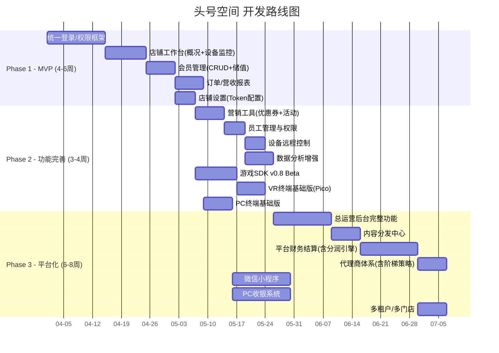

### 16.2 当前进度（截至2026年5月4日）

| 子系统 | 完成度 | 说明 |
|--------|:-----:|------|
| Web管理后台(三端) | ✅ **骨架完成** | 142页面路由+Mock数据已实现 |
| VR头显终端 | ✅ **规范完成** | v1.3发布，沉浸优先设计 |
| 游戏SDK | ✅ **规范完成** | v1.3发布，完整API+安全模块+离线队列 |
| PC收银系统 | 📋 规划中 | 设计方案已完成，待开发 |
| PC游戏终端 | 📋 规划中 | 设计方案已完成，待开发 |
| C端小程序 | 📋 规划中 | 设计方案已完成，待开发 |

---

## 17. 附录

### A. 术语表

| 术语 | 英文 | 说明 |
|------|------|------|
| Session | 游戏会话 | 一次VR游戏体验的完整生命周期，包含开始→暂停→结束+结算 |
| 游戏豆 | Game Bean | 平台发行的虚拟货币，商家采购后可按一定比例兑换成消费额度 |
| 预授权 | Pre-authorization | 游戏开始前锁定一定金额，防止超支，结束后按实际消费释放 |
| 心跳 | Heartbeat | 设备/SDK定期向服务器发送的空包，证明设备在线+运行正常 |
| 设备影子 | Device Shadow | 服务器端保存的设备最新状态缓存，每次心跳更新 |
| 阶梯分润 | Tier Commission | 按业绩区间分段计算代理商分润的激励策略 |
| Kiosk模式 | Kiosk Mode | Windows全屏锁定模式，禁用系统按键/任务切换/任务管理器 |
| RBAC | Role-Based Access Control | 基于角色的访问控制，通过角色权限矩阵控制资源访问 |
| 冷却期 | Cooling Period | 提现账户修改后10分钟内不可提现，防篡改安全机制 |

### B. 参考资料索引

| 文件名 | 说明 | 位置 |
|--------|------|------|
| PRD v1.3 | 产品需求文档(完整版) | `docs/头号空间-产品需求文档-PRD-v1.3.md` |
| 运营后台设计方案 v1.0 | 运营后台架构+UI设计 | `docs/运营后台设计方案.md` |
| 内调沟通总结 | 竞品分析+核心决策 | `docs/内调沟通总结.md` |
| 功能差异分析 | 竞品对比矩阵 | `docs/功能差异分析-店铺运营后台.md` |
| 设计稿(PNG) | 各端设计稿截图(18张) | `designs/` |
| 竞品截图 | 幻影星空参考(9张) | `docs/references/huanying_xingkong/` |
| VR终端UI预览 | VR头显界面HTML预览 | `docs/VR终端UI设计预览.html` |

---

> **文档版本**: v2.0（完整整合版）  
> **构建日期**: 2026年5月4日  
> **基于以下源文档**:  
> - 头号空间-产品需求文档-PRD-v1.3.md  
> - 头号空间-产品设计文档-v1.2.md  
> - 运营后台设计方案.md  
> - 内调沟通总结.md  
> - 功能差异分析-店铺运营后台.md  
> 
> **说明**: 本文档为上述所有源文档的整合与增强版本，在保持原有内容完整性的基础上，对每个维度进行了细节扩充、表格规范化、状态机补充和异常场景覆盖。
