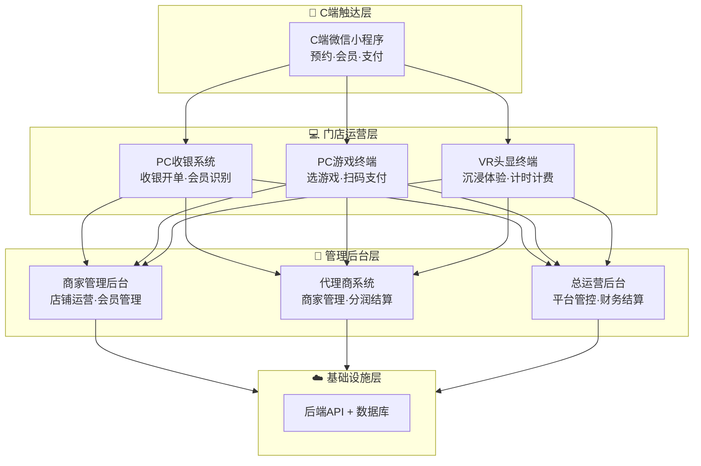
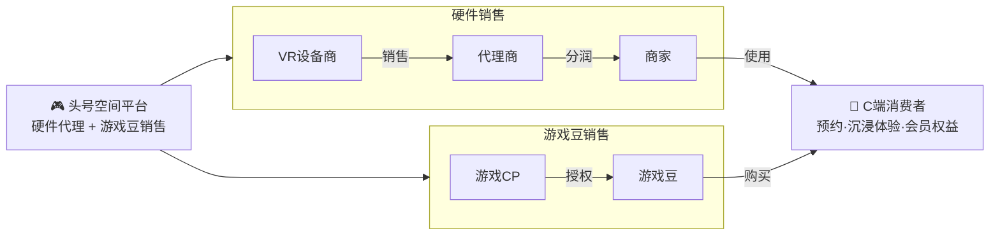
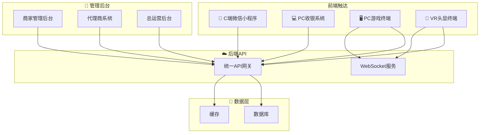
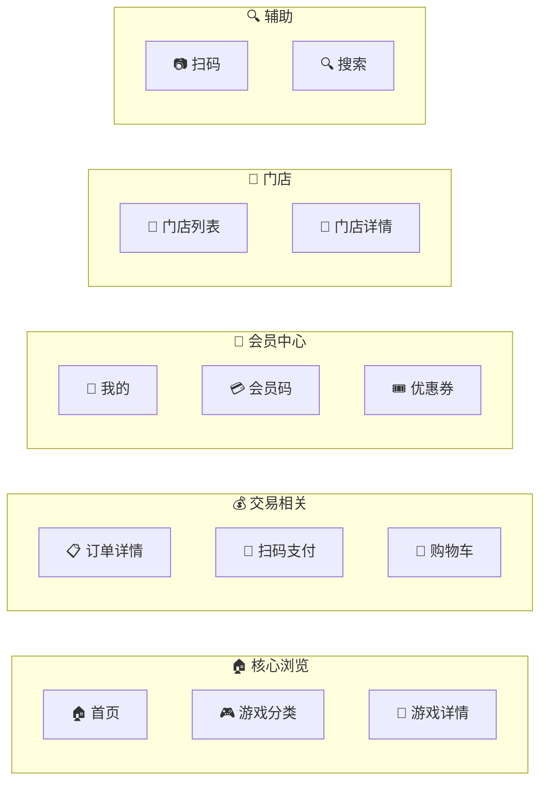
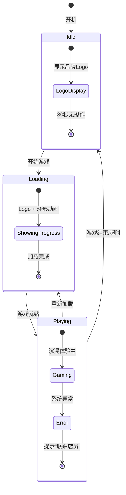
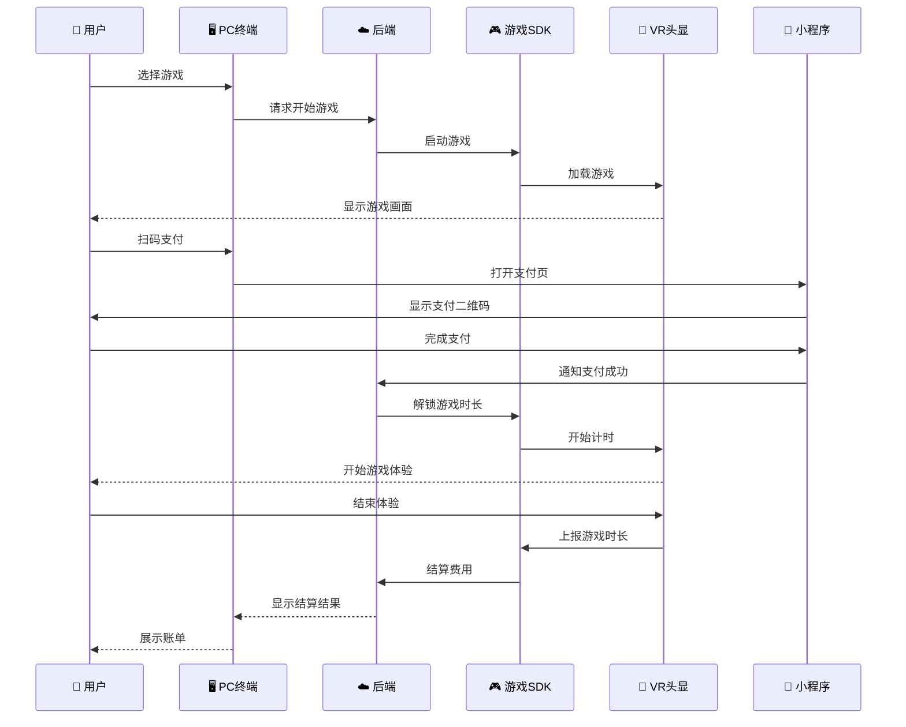

# 头号空间 - 产品需求文档（PRD）

> **版本**: v1.5  
> **日期**: 2026年5月21日  
> **状态**: 正式发布（生日会主题资源新增）  
> **密级**: 内部公开  
> **作者**: 产品团队  
> **面向读者**: 技术开发团队、测试团队、运营团队、管理层、游戏CP开发者

---

## 📑 文档目录

| 章节 | 标题 |
|:----:|------|
| 1 | [产品概述](#1-产品概述) |
| 2 | [商业模式与市场定位](#2-商业模式与市场定位) |
| 3 | [系统整体架构](#3-系统整体架构) |
| 4 | [子系统功能详解](#4-子系统功能详解) |
| 5 | [核心业务流程](#5-核心业务流程) |
| 6 | [关键数据概要](#6-关键数据概要) |
| 7 | [角色权限体系（RBAC）](#7-角色权限体系rbac) |
| 8 | [技术方案概要](#8-技术方案概要) |
| 9 | [开发规划里程碑](#9-开发规划里程碑) |
| A | [附录](#a-附录) |

---

## 1. 产品概述

### 1.1 产品定义

**头号空间**是一套面向 **VR线下体验店** 的全链路运营管理系统。平台通过 **硬件销售佣金**和**游戏豆销售**盈利，代理商按区域分润。系统由 **四层架构** 组成：



### 1.2 核心价值主张

| 对象 | 核心价值 |
|------|---------|
| **商家** | 降本增效、数据洞察、营销获客、设备管控、多端协同运营 |
| **C端用户** | 便捷体验（微信小程序）、沉浸式消费、会员权益、社交分享 |
| **代理商** | 区域分润、管理工具、结算透明、阶梯激励 |
| **平台** | 全网掌控、内容分发、财务闭环、生态运营 |

### 1.3 目标用户画像

| 角色 | 年龄段 | 核心诉求 | 使用频率 | 主要终端 |
|------|--------|---------|:--------:|---------|
| 平台超管/运营/财务 | 全局数据/内容推广/结算对账 | 每日多次 | Web后台(PC) |
| 代理商 | 多店业绩、分润收益、辖区管理 | 每周几次 | Web后台(PC) |
| 店长/收银员/员工 | 营收清晰、操作便捷、高效开单 | 每日高频 | PC收银+Web后台 |
| C端消费者 | 捷预约/沉浸体验/会员权益 | 按需使用 | 微信小程序 |

---

## 2. 商业模式与市场定位

### 2.1 核心业务模式

平台的收入来源为 **硬件销售佣金 + 游戏豆销售** 两项核心业务，代理商的收入为上述两项的**分润抽成**。



> **关键区别**: 游戏豆是**B端运营代币**(商户→平台)，不是C端消费代币。C端用户付人民币给商家购买游戏项目，商家后台扣除游戏豆作为运营成本。

### 2.2 游戏豆收入详解

> 硬件销售详情见线下合同，平台系统不处理硬件交易的在线流程。

#### 游戏豆（B端运营代币）

游戏豆是商家用来**启动游戏**的运营代币。商家从平台采购游戏豆，C端用户每玩一局游戏，商家消耗一定数量游戏豆。

| 项目 | 说明 |
|------|------|
| **游戏豆定义** | B端运营代币，启动游戏所需游戏豆 = 商家启动一次游戏的消耗成本 |
| **购买方** | 商家（VR体验店），非C端用户 |
| **使用方** | 商家后台 → 用户每玩一局游戏自动扣除对应数量的游戏豆 |
| **平台定价** | ¥1/豆，平台统一定价 |
| **用途** | 商家用游戏豆启动游戏给C端用户玩 |
| **与C端关系** | C端用户不直接接触游戏豆。C端用户在商家充值¥ → 商家定价一个游戏项目¥XX → 用户付款 → 商家消耗游戏豆 |
| **库存管理** | 商家需预购一定量游戏豆，不足时需补充采购；后台有库存预警 |

> **举例**: 商家采购1,000游戏豆(¥1/豆 = ¥1,000)。平台配置每次过山车VR消耗20豆(=¥20成本)，C端用户花¥39玩一次。每次游玩消耗的游戏豆数量由平台在后台统一配置。

### 2.3 分润体系设计

> 代理商的分润以 **游戏豆采购分润** 为核心（硬件销售分润详见线下合同，不走平台系统）。

#### 代理商层级

| 级别 | 保证金 | 管理范围 | 游戏豆采购分润(基础) |
|------|:------:|---------|:------------------:|
| 城市代理 | ¥5,000 | 单城市 | 辖区采购额的 **3%-5%** |
| 区域代理 | ¥20,000 | 省/跨市 | 辖区采购额的 **5%-8%** |
| 省级总代 | ¥50,000 | 整省 | 辖区采购额的 **8%-12%** |

#### 游戏豆采购阶梯分润策略

**计算规则**：按实际采购额所在档位的系数**全额计算**，不是分段累进。

**以城市代理为例（基础比例 5%）**:

| 月辖区游戏豆采购额范围 | 阶梯系数 | 实际分润比例 | 示例（全额计算） |
|:---------------------:|:--------:|:-----------:|:--------------:|
| ¥0 - 49,999 | ×0.8 起步期 | 4.0% | ¥30,000×5%×0.8=¥1,200 |
| ¥50,000 - 99,999 | ×1.0 基准 | 5.0% | ¥80,000×5%×1.0=¥4,000 |
| ¥100,000 - 199,999 | ×1.2 成长期 | 6.0% | ¥120,000×5%×1.2=**¥7,200** |
| ≥ ¥200,000 | ×1.5 奖励期 | 7.5% | ¥250,000×5%×1.5=¥18,750 |

> **关键**：采购额落在哪个档位区间，全额按该档位的系数计算，**不是**前5万一个比例、后5万另一个比例。

#### 代理商月度总分润

```
代理商月总分润 = 游戏豆采购分润（硬件分润按线下合同执行，不走平台系统）
  └── 游戏豆分润: ∑(辖区商家月游戏豆采购额 × 阶梯分润比例)
```

#### 结算安全机制

| 项目 | 规则 |
|------|------|
| 结算周期 | T+1 月结（次月15日前打款） |
| 安全机制 | 提现账户修改需 **10分钟冷却期 + 短信验证码二次确认** |

---

## 3. 系统整体架构

### 3.1 各子系统总览

| # | 子系统 | 形态描述 |
|:-:|--------|---------|
| 1 | **C端微信小程序** | 微信小程序（用户端） |
| 2 | **PC收银系统** | 桌面应用（前台收银） |
| 3 | **PC游戏终端** | Windows触摸屏（现场选游戏） |
| 4 | **VR头显终端** | VR原生应用（沉浸体验） |
| 5 | **🏪商家管理后台** | Web后台（商家运营） |
| 6 | **🤝代理商系统** | Web后台（代理商管理） |
| 7 | **🔴官方总运营后台** | Web后台（平台管控） |
| 8 | **🎮游戏SDK** | 跨平台中间件（CP集成） |

> **关键技术决策**：商家后台、代理商系统、总运营后台 **共用一套前端代码库** (`admin-dashboard`)，通过 **RBAC + 动态菜单 + 三套Layout** 实现多角色切换。

### 3.2 子系统间交互关系



---

## 4. 子系统功能详解

> **产品功能全景图**: 详见 [4. 子系统功能详解](#4-子系统功能详解) 章节

---

### 4.1 C端微信小程序

> **定位**: C端用户触达的唯一入口，面向消费者提供游戏浏览、到店预约、会员二维码、消费记录等功能  
> **形态**: 微信小程序（建议 uni-app Vue3），深色沉浸式主题  
> **核心设计**: 主包(首页/个人/扫码) + 游戏包(分类/详情/搜索) + 订单包(订单/会员码/优惠券) 分包策略

#### 4.1.1 页面结构



#### 4.1.2 各页面功能速览

| # | 页面 | 功能要点 | 关键交互 |
|---|------|---------|---------|
| 1 | **首页** | Banner轮播 + 附近门店推荐 + 热门游戏推荐 + 快捷入口 | 搜索、扫码 |
| 2 | **游戏分类** | 5大类Tab(刺激/恐怖/休闲/亲子/联机) + 瀑布流卡片 | 分类切换、排序筛选 |
| 3 | **游戏详情** | 视频/截图轮播 + 介绍 + 价格 + 时长 + "到店体验" | 收藏、分享、预约 |
| 4 | **个人中心** | 头像/昵称/等级 + 会员卡 + 资产概览(余额/积分/次数) | 功能入口网格 |
| 5 | **会员码** | 展示动态会员二维码，到店由店员扫码充值/核销。展示会员资产(余额/积分/次数) | 扫码即时到账 |
| 6 | **扫码** | 扫描设备二维码 / 收款码 | wx.scanCode调用 |
| 7 | **订单记录** | 全部/待支付/已完成/已退款 Tab | 继续支付、取消订单 |
| 8 | **消息通知** | 系统通知(充值成功/订单变更) + 营销消息 | 已读/未读标记 |
| 9 | **设置** | 账号安全/隐私/关于/清除缓存/退出 | 分组菜单列表 |
| 10 | **优惠券** | 可用/已用/已过期 Tab | 卡片样式(面额/有效期) |
| 11 | **门店列表** | LBS附近门店 + 列表/地图双视图 | 距离/评分/营业状态/收藏 |
| 12 | **搜索** | 搜索游戏/门店 + 搜索历史 + 热门推荐 | 联想搜索 |
| 13 | **邀请好友** | 邀请海报 + 邀请记录 + 奖励规则 | 分享裂变 |
| 15 | **消息通知** | 系统通知(充值成功/订单变更) + 营销消息 | 已读/未读标记 |

#### 4.1.3 功能说明

| 功能模块 | 功能说明 |
|---------|---------|
| **首页** | 展示Banner轮播（店铺活动/新品推荐）、附近门店推荐（LBS定位）、热门游戏推荐、快捷操作入口（扫码/会员码/订单）。未登录时展示引导登录提示 |
| **游戏分类与详情** | 按5大类聚合展示门店所有VR游戏项目。游戏详情页展示视频/截图、介绍文案、价格、难度/时长、适龄提示。底部"到店体验"按钮跳转到门店选择页 |
| **会员码** | 展示动态会员二维码，到店出示给店员，由店员通过PC收银系统扫码完成充值/开卡。展示充值记录。充值后余额用于到店消费 |
| **扫码** | 支持扫描门店二维码、设备二维码、收款码，自动跳转对应页面 |
| **订单记录** | 按全部/待支付/已完成/已退款分类展示，待支付订单可继续支付或取消 |
| **门店列表与搜索** | 基于LBS展示附近门店（列表/地图双视图）。支持搜索游戏名称和门店名称 |
| **邀请与裂变** | 生成邀请海报分享微信好友，好友注册后双方获得奖励 |

#### 4.1.4 规则说明

| 规则类型 | 规则内容 |
|---------|---------|
| **登录** | 游客可浏览首页、游戏分类、游戏详情和门店列表。充值、下单、邀请等功能需微信一键登录。登录后7天内免登录 |
| **支付** | 仅支持微信支付（JSAPI）。C端用户在小程序不可直接充值，须到店出示会员码，由PC收银系统扫码完成充值。成功后发送订阅消息通知 |
| **搜索** | 支持搜索游戏名称和门店名称。展示搜索历史标签和热门推荐 |
| **优惠券** | 由商家在后台创建分发，一次性使用不可叠加，过期自动失效 |

#### 4.1.5 交互说明

| 交互场景 | 交互流程 |
|---------|---------|
| **游客浏览** | 进入小程序 → 首页推荐 → 游戏分类浏览 → 详情查看 → 引导登录/到店 |
| **出示会员码充值** | 个人中心 → 会员码 → 出示给店员 → 店员扫码 → 选择充值金额 → 支付 → 到账确认 |
| **到店消费完整流程** | 浏览游戏 → 选择门店（预约或不预约）→ 到店告知店员 → PC终端自助选游戏/扫码支付 → 佩戴VR → 玩游戏 → 结算 → 小程序同步消费记录 |
| **搜索** | 顶部搜索框 → 输入关键字 → 联想搜索 → 显示游戏/门店混合结果 |

---

### 4.2 PC收银系统

> **定位**: 门店收银员/店长的日常操作终端，负责开单收银、会员管理、商品管理、交接班等门店运营核心业务  
> **形态**: 桌面应用（Electron/Tauri），Windows全屏模式  
> **部署位置**: VR体验店前台收银台，由收银员日常操作

#### 4.2.1 页面结构

| 功能模块 | 说明 |
|---------|------|
| 🔐 **登录/锁屏** | 收银员账号密码登录，暂离一键锁屏 |
| 🏠 **工作台** | 营业概览KPI、设备状态、快捷操作入口 |
| 🛒 **收银台（核心）** | 4Tab销售：单次消费/充值/套票/商品，右侧结算单 |
| 👥 **会员管理** | 查询/新增/识别会员（手机号搜索+扫码） |
| 💰 **充值/办卡** | 选择金额或套餐，微信/支付宝/现金/余额支付 |
| 🎫 **套票/套餐** | 次数套餐/时间卡，可绑定会员或生成兑换码 |
| 📋 **订单管理** | 查订单、退款（30天内原路或现金） |
| 🔄 **交接班** | 当班营收统计 + 现金盘点，交接确认 |
| 🖥️ **设备监控** | 实时查看VR设备状态，远程重启 |
| 📊 **今日报表** | 门店当日销售数据汇总 |

#### 4.2.2 收银台核心（4Tab 结构）

收银台是PC收银系统的核心页面，采用 **左-中-右** 三段式布局：

- **左侧（顾客身份区）**：搜索/扫码识别会员，选中后显示会员信息（余额/积分/等级/折扣）
- **中间（4Tab销售区）**：

| Tab | 名称 | 说明 | 操作规则 |
|:---:|------|------|---------|
| 1 | **单次消费** | 按次体验券，点击游戏卡片加入结算单 | 无需选择会员，按原价结算 |
| 2 | **充值活动** | 储值会员卡选面额支付 | **必须先选择会员** |
| 3 | **套票** | 次数套餐/时间卡 | 选套餐 → 绑定会员或生成兑换码 |
| 4 | **实体商品** | 饮料/零食等 | 选商品 → 加购物车 → 自动扣库存 |

- **右侧（结算单区）**：实时显示待结商品列表、合计金额、优惠、实付，点击"去结算"完成收银

**支付方式**: 微信扫码 / 支付宝扫码 / 现金 / 余额支付

#### 4.2.3 功能说明

| 功能模块 | 功能说明 |
|---------|---------|
| **登录/锁屏** | 收银员账号密码登录，选择门店。暂离一键锁屏，防止他人误操作 |
| **工作台** | 登录后默认页，展示今日营业数据概览（营收/订单数/客单价/退款笔数）、设备状态、快捷入口 |
| **收银台** | 4Tab商品销售区，右侧结算单实时汇总。支持会员识别后享受折扣价 |
| **会员管理** | 查询/新增会员，支持手机号搜索和扫码识别。会员信息含等级/余额/积分/次数 |
| **订单管理** | 查询门店所有订单，支持退款操作（原路退回或现金退款）。30天后不可退款 |
| **交接班** | 自动统计当班营收数据（各支付方式收入/订单笔数/退款额），现金需手动盘点核对 |
| **设备监控** | 实时查看门店VR设备状态，支持远程重启 |

#### 4.2.4 规则说明

| 规则类型 | 规则内容 |
|---------|---------|
| **销售** | 单次消费无需选会员按原价结算。充值活动和套票必须先选会员。实体商品自动扣库存 |
| **支付** | 支持微信/支付宝/现金/余额四种方式。微信/支付宝使用服务商模式 |
| **退款** | 仅支持已完成支付的订单退款，30天后不可退款。可原路退回或现金退款 |
| **交接班** | 当班数据锁定不可修改，仅店长和收银员可操作。需填写实际现金盘点金额 |
| **离线** | 断网时商品缓存本地，订单入本地队列，联网后批量同步 |

#### 4.2.5 交互说明

| 交互场景 | 交互流程 |
|---------|---------|
| **到店消费（收银开单）** | 顾客到前台 → 收银员选"单次消费"Tab → 可选会员识别 → 点击游戏加入结算单 → 确认金额 → 选支付方式 → 顾客付款 → 打印小票 → 分配VR设备 |
| **会员充值** | 搜索/识别会员 → 切换到"充值活动"Tab → 选金额或套餐 → 生成付款 → 支付 → 到账确认 → 打印小票 |
| **退款** | 订单管理 → 搜索订单 → 确认 → 选退款方式 → 填原因 → 确认退款 → 打印退款小票 |
| **交接班** | 点击交接班 → 显示营收汇总 → 输入现金盘点额 → 系统自动计算差异 → 接班人确认 → 完成 |

---

### 4.3 PC游戏终端

> **定位**: VR体验店现场的自助交互终端（右脚点播系统），顾客到店自行浏览游戏、选游戏、扫码支付、获取设备引导、查看结算  
> **形态**: Windows全屏kiosk应用（触摸屏），深蓝色沉浸式主题，放置在每台VR设备旁  
> **核心原则**: PC终端承担所有交互，VR头显内不做任何UI

> **💡 补充说明 — 点播系统业务逻辑**
> - **PC 游戏终端 = 右脚点播系统**：每台 PC 终端即一个"点播系统"，顾客通过该终端选择并启动游戏。
> - **每台主机设备绑定一个点播系统**：主机（PC 终端设备）与点播系统一一绑定，不可多台主机共用同一系统。
> - **系统归属门店账号下**：点播系统隶属于具体门店，门店管理员可管理本店下的所有点播系统。
> - **游戏豆门店共享**：同一门店下的所有点播系统共享该门店的游戏豆余额，任意终端消耗游戏豆均从门店总账户扣除。

#### 4.3.1 状态流转

| 状态 | 用户操作 | 系统处理 |
|:----:|---------|---------|
| ① 待机 | 触摸/点击"开始体验" | 展示品牌Logo + 宣传视频 |
| ② 选游戏 | 浏览卡片 → 点击感兴趣的游戏 | 按分类筛选，展示价格/时长 |
| ③ 看详情 | 查看游戏介绍 → 点击"开始体验" | 展示视频/价格 |
| ④ 支付 | 扫码付款（或会员余额抵扣） | 生成二维码，15分钟倒计时 |
| ⑤ 设备忙 | 显示"当前设备全满"提示 | 无系统排队，店员线下引导 |
| ⑥ 佩戴 | 按指引找到VR设备并佩戴 | 显示"请佩戴 #03 头盔" |
| ⑦ 体验中 | 沉浸式玩游戏，0 UI干扰 | 后台计时，PC端显示监控面板 |
| ⑧ 结算 | 查看消费明细 → 评分 → 离开 | 展示金额/时长，五星评分入口 |

#### 4.3.2 各状态说明

| # | 状态 | 用户看到的画面 | 说明 |
|:--:|------|-------------|------|
| 1 | **待机/Idle** | 店铺Logo + 宣传视频循环 + "点击开始"按钮 + 设备状态 | 默认状态，吸引路人 |
| 2 | **游戏选择** | 游戏卡片网格(4列×3行) + 分类筛选栏 + 价格/时长/难度 | 触摸选游戏 |
| 3 | **游戏详情** | 大图/视频预览 + 名称/介绍 + 价格 + 难度/时长 + "开始体验"按钮 | 确认后进入支付 |
| 4 | **扫码支付** | 大二维码(微信/支付宝) + 金额 + 15分钟倒计时 + 状态轮询 | 会员可用余额抵扣 |
| 5 | **设备繁忙** | 提示"当前设备忙，请稍后" | 设备全满时触发 |
| 6 | **分配设备** | "请佩戴 #03 头盔" + VR设备位置指引 | 引导顾客就座 |
| 7 | **游戏中监控** | VR画面缩略图 + 剩余时间 + 进度条 + "提前结束/呼叫店员" | 监控面板 |
| 8 | **结算完成** | 消费明细 + 剩余余额/次数 + 评分入口 + "返回首页" | 可打印小票 |
| 9 | **设置** | 设备编号/状态 + 网络测试 + 远程重启 + 日志导出 | 店员密码模式 |
| 10 | **头显管理** | 设备列表 + 参数设置(瞳距/刷新率等) + 游戏安装 + 绑定/解绑 | 店员密码模式（从设置Tab进入） |

#### 4.3.3 功能说明

| 功能状态 | 功能说明 |
|---------|---------|
| **待机/吸引** | 默认空闲状态，展示品牌Logo和宣传视频，显示大号"点击开始"按钮和当前设备编号/状态 |
| **游戏浏览选择** | 游戏大厅按分类筛选（全部/刺激/恐怖/休闲/亲子/联机），卡片网格展示封面图/名称/价格/时长/难度星级 |
| **会员登录** | 支持微信扫码登录和输入手机号验证。登录后享受会员价、查看余额/次数。不登录以散客身份按原价体验 |
| **扫码支付** | 选择游戏后生成支付二维码（微信+支付宝），显示金额和15分钟倒计时。会员可用余额或次数直接扣除 |
| **设备分配与引导** | 支付成功后自动分配空闲VR设备，屏幕显示"请佩戴 #03 头盔"和位置指引 |
| **游戏中监控** | 游戏进行期间切换监控面板，显示VR画面缩略图、剩余时间、进度条，提供"提前结束"和"呼叫店员"按钮 |
| **结算评价** | 游戏结束后展示消费明细（游戏名称/时长/金额）、剩余余额/次数，提供五星评分入口 |

#### 4.3.4 规则说明

| 规则类型 | 规则内容 |
|---------|---------|
| **身份** | 散客无需登录按原价支付。会员登录后显示会员价，可用余额或次数消费。同一终端一次接待一位顾客 |
| **支付** | 支持微信/支付宝扫码、会员余额/次数扣除。扫码支付15分钟超时自动取消。支付成功即时分配VR设备 |
| **设备分配** | 自动分配空闲设备，优先最近一台。全满时提示设备繁忙 |
| **设备忙** | 设备全满时提示"当前设备繁忙"，由店员引导分流/等候 |
| **时长** | 按设定时长计费，提前结束按实际时长结算退费。超时自动结束Session |
| **与VR关系** | PC终端不直连VR头显。PC选游戏+支付 → 后端指令 → 下发加载给VR设备（通过游戏SDK间接通信） |
| **超时** | 支付二维码15分钟超时。待机30秒无人操作进省电模式 |

#### 4.3.5 交互说明

| 交互场景 | 交互流程 |
|---------|---------|
| **散客自助体验** | 到店→触摸"开始体验"→ 浏览游戏→ 看详情→ 点击"开始体验"→ 确认原价→ 手机扫码支付→ 分配设备→ "请佩戴#03头盔"→ 佩戴VR→ 玩游戏→ 结束→ 结算页→ 评分→ 返回待机 |
| **会员自助体验** | 到店→登录(微信扫码/手机验证)→ 显示会员信息→ 浏览游戏(会员价)→ 选游戏→ 余额扣款或扫码→ 分配设备→ 佩戴VR→ 玩游戏→ 结算(含积分变动) |
| **提前结束** | 游戏进行中→ 走出VR区→ 在PC终端点击"提前结束"→ 确认→ 按实际时长结算退费→ 显示消费明细 |
| **呼叫店员** | 游戏进行中有问题→ 走出VR区→ 在PC终端点击"呼叫店员"→ 前台收银系统收到提醒→ 店员到场处理 |

#### 4.3.6 头显管理（v2.1新增）

> **定位**: PC终端的Settings页面中新增「头显管理」Tab，提供对连接的头显设备（Pico等无线VR头显）的统一管理能力。
> **入口**: Settings页面 → 新增「头显管理」Tab
> **适用角色**: 店员/店长（需密码进入Settings页面）

##### 页面布局

采用「左侧设备列表 + 右侧Tab内容区」左右分栏布局：
- **左侧**: 已绑定的头显设备列表（显示设备名称/在线状态），点击切换当前管理目标
- **右侧**: 根据左侧选中的设备，展示3个Tab内容

##### Tab 1: 设备信息（只读）

| 信息项 | 说明 |
|--------|------|
| 瞳距(IPD) | 当前设备瞳距值，如64.5mm |
| 刷新率 | 当前设备刷新率，如90Hz |
| 渲染分辨率 | 自动/高品质2688×2688/高性能1920×1920 |
| 存储 | 总容量/已用/可用 + 容量进度条 |
| 已安装游戏 | 显示该设备上已安装的游戏列表及版本号 |

##### Tab 2: 参数设置

| 参数 | 交互方式 | 说明 |
|------|---------|------|
| 瞳距微调(IPD) | 滑块（58-72mm，带刻度标尺） | 设置后实时同步到头显 |
| 刷新率 | 三选一按钮 | 72Hz(省电) / 90Hz(推荐) / 120Hz(高性能) |
| 渲染分辨率 | 三选一按钮 | 自动 / 高品质2688×2688 / 高性能1920×1920 |
| 屏幕亮度 | 滑块（范围0-100%） | 实时同步 |
| 音量限制（保护听力） | 开关 | 开启后限制最大音量 |
| 自动待机（无人佩戴） | 开关 | 开启后摘盔超时自动待机 |
| 仅闲时后台更新 | 开关 | 开启后仅在设备空闲时下载更新 |
| 预设方案 | 卡片点击切换 | 成人模式(65mm·90Hz) / 儿童模式(58mm·72Hz) / 高性能(65mm·120Hz) |

- 参数修改后点击「保存并同步」→ 参数实时下发到头显
- 支持「应用到所有设备」按钮

##### Tab 3: 安装游戏

| 功能 | 说明 |
|------|------|
| 游戏库 | 展示全量可安装游戏，支持按名称搜索和分类筛选（全部/动作/冒险/射击/音乐/模拟/竞速） |
| 游戏状态标识 | ✓ 已安装（灰显不可选）/ 可选 / 🔄 可更新 |
| 多选推送 | 勾选多个游戏 → 点击「推送到目标头显」 |
| 推送进度监控 | 实时显示进度条 + 传输速度 + 预计剩余时间 |
| 推送队列 | 支持多个推送任务排队（进行中 / 已完成 / 排队中） |
| 断点续传 | 网络中断后自动续传 |

##### 设备绑定/解绑

| 操作 | 流程 |
|------|------|
| **绑定** | 点击左侧「+ 绑定」→ 弹出扫码窗口 → 头显端进入「设置→设备连接→扫码配对」→ 扫描二维码 → WiFi Direct配对成功 → 设备出现在列表 |
| **绑定备选** | 输入配对码（如 `8X2P-9KL4`）代替扫码 |
| **解绑** | 离线设备列表中出现✕按钮 → 点击弹出确认框 → 确认后解除绑定关系（已安装游戏保留在设备上） |

##### 规则说明

| 规则类型 | 规则内容 |
|---------|---------|
| **权限** | 头显管理功能仅在Settings页面中可用，Settings需密码进入（店员密码模式） |
| **60秒超时** | Settings页面60秒无操作自动退出至PC终端主界面 |
| **连接方式** | 通过WiFi Direct建立PC与头显的直接连接，无需局域网环境 |
| **二维码有效期** | 绑定二维码5分钟过期，过期后自动刷新 |
| **参数同步** | 参数变更后点击「保存」触发立即同步，同步失败显示错误提示 |
| **安装方式** | 游戏包体通过WiFi Direct从PC终端直接传输到头显 |

---

#### 4.3.7 游戏运营设置兼容（v1.5 新增）

> PC 终端需兼容总运营后台在游戏库中配置的各项运营参数，包括运行平台、游戏豆消耗、玩法模式、付费模式、时长限制。

##### 运行平台兼容（v1.5 新增）

| 运行平台 | 说明 |
|:-------:|------|
| **主机游戏**（`host`） | 游戏在 PC 主机上运行，画面串流到头显设备，适合高性能需求的游戏 |
| **VR 头显一体机**（`allInOne`） | 游戏直接在 VR 头显上独立运行，无需 PC 主机支撑 |

##### 单人付费 / 多人付费兼容

| 付费模式 | 交互流程 |
|:--------:|---------|
| **单人付费**（`single`） | 选游戏 → 显示单人价格 → 支付 → 分配 1 台设备 → 开始游戏 |
| **多人付费**（`multi`） | 选游戏 → 选择参与人数(2-4人) → 显示总价+人均 → 支付 → 分配 N 台设备 → 全部就绪后开始游戏 |

**多人付费交互细节**：
- **选择人数**：PC 终端提供人数选择界面（2/3/4人），显示游戏支持的最大人数
- **价格分摊**：总游戏豆消耗 = 单个游戏豆消耗 × 参与人数；人均价格 = 总消耗 ÷ 人数
- **设备分配**：系统自动分配 N 台空闲 VR 设备，显示设备编号和位置指引
- **就绪等待**：所有参与者佩戴就绪后统一进入游戏；超时未就绪的设备可跳过
- **退出规则**：各参与者独立 Session，一人退出不影响其他人继续游戏

##### 游戏详情页 · 游戏豆消耗展示

PC 终端游戏详情页需展示该游戏的游戏豆消耗信息：

| 场景 | 展示内容 |
|------|---------|
| 单人付费 · 有消耗 | 显示「🫘 X个/次」+ 付费模式标签 |
| 多人付费 · 有消耗 | 显示「🫘 X个/次/人」+ 人数选择器 + 总价计算 |
| 游戏豆消耗为 0 | 显示「🆓 免费体验」 |

##### 游戏豆余额不足提示

PC 终端在以下时机检测并提示余额不足：

| 检测时机 | 处理方式 |
|---------|---------|
| 点击「开始游戏」时 | 弹窗：「商家游戏豆余额不足，无法运行此游戏」 |
| 多人模式选人数后 | 弹窗：「余额不足，建议减少人数」 |
| 扫码支付前 | 提示：「商家游戏豆不足，请联系工作人员充值」 |
| 游戏进行中 | VR 终端显示「即将结束」倒计时，时间到自动结束 |

**错误码**：`-500` 游戏豆余额不足 · `-501` 多人模式部分参与者余额不足

##### 时长限制与自动结束

对于开启时长限制的游戏：
- PC 终端监控界面（Playing）大字体显示剩余时间 + 进度条
- 倒计时 1 分钟时发出视觉提醒，10 秒时数字倒数
- 倒计时归零 → 后端自动终止 Session → VR 退出 → PC 跳转结算
- 提供「提前结束」按钮，按实际游玩时长结算

**游戏详情接口返回的运营字段**：
```json
{
  "runPlatform": "host",         // host | allInOne
  "gameBeanCost": 20,            // 游戏豆消耗（个/次/人）
  "payMode": "single",           // single | multi
  "gameType": "standalone",      // standalone | online
  "timeLimitEnabled": true,      // 时长限制开关
  "timeLimitMinutes": 10         // 限制时长（分钟）
}
```

---

### 4.4 VR头显终端

> **核心设计原则**: VR 头显内 **不做任何可有可无的 UI**。用户戴上头盔的唯一目的就是沉浸式玩游戏，所有交互操作、信息展示、管理功能全部由 PC 终端承担。
>
> **职责分离**：
> - **PC终端（触摸屏）**：游戏浏览、详情查看、支付、分配设备、监控、结算、评分 → **完整的交互入口**
> - **VR终端（头显内）**：纯粹的沉浸式游戏体验 → **什么 UI 都不应该有**
>
> **理由**：
> 1. 沉浸感是第一优先级——倒计时 HUD 会让用户焦虑，打破沉浸
> 2. 计时/扣费是后台系统职责，用户不该在 VR 里看到
> 3. 用户走出 VR 区即可通过 PC 终端操作一切（呼叫店员、查看时间、提前结束）
> 4. 竞品（幻影星空）同样不在 VR 头显内显示任何通用 UI
>
> **目标设备**: Pico Neo 3 / Pico 4 / Meta Quest 3 / Quest Pro  
> **形态**: 极简 Launcher 应用（仅负责拉起/关闭游戏进程）  
> **核心职责**: 游戏进程管理 + 设备心跳上报

#### 4.4.1 VR终端功能范围

| 功能 | VR终端处理 | 说明 |
|------|-----------|------|
| 游戏选择/浏览/支付 | ❌ → 由PC终端完成 | VR内不展示任何游戏库或支付 |
| 游戏中 HUD（倒计时/进度条） | **❌ → 不做** | 沉浸感优先，不显示任何叠加 UI |
| 暂停/系统菜单 | **❌ → 不做** | 摘下头盔 → Session 自动结束（由 SDK 处理）；呼叫店员→走出 VR 区 |
| 提前结束游戏 | **❌ → 不做** | 通过 PC 终端操作，或摘下头盔等待超时 |
| 结算/评分 | **❌ → 不做** | 详情去 PC 终端查看评价 |
| 游戏加载 | **✅ 极简过渡** | 加载时显示品牌 Logo + 环形进度（最多3秒，否则进黑屏保护） |
| 游戏结束提示 | **✅ 一行文字** | "体验已结束，请取下头盔"，3秒自动返回待机 |
| 异常提示 | **✅ 一行文字** | "系统异常，请联系店员"，常驻直到重启 |
| 设备心跳上报 | **✅ 后台执行** | 每60秒通过SDK上报，用户无感知 |
| OTA升级 | **✅ 静默执行** | 待机时后台下载安装，重启生效 |

#### 4.4.2 VR终端状态清单（仅3个核心状态）



#### 4.4.3 各状态详细规格

##### 状态1: 待机 Idle
```
用户视野:
┌──────────────────────────────────────────────┐
│                                              │
│                                              │
│                                              │
│              [头号空间 品牌Logo]              │
│               (常亮浮空，30秒淡出)             │
│                                              │
│                                              │
│           (其余区域纯黑，无任何文字)           │
│                                              │
└──────────────────────────────────────────────┘

行为:
  · 等待→收到PC终端下发指令→进入Loading
  · Logo长亮30秒→淡出→纯黑（省电模式）
  · 用户无任何可交互元素
  · 待机功耗 < 30%
```

##### 状态2: 加载 Loading
```
用户视野:
┌──────────────────────────────────────────────┐
│                                              │
│                                              │
│              [头号空间 品牌Logo]              │
│                                              │
│           ◌ ◌ ◌ ◌ ◌ ◌ ◌ ● ◌                 │
│           (环形加载进度，最多显示3秒)          │
│                                              │
│                                              │
└──────────────────────────────────────────────┘

行为:
  · 收到PC终端发送的游戏包名+参数
  · 拉起游戏进程(通过Unity Player/system Intent)
  · 游戏进程启动成功后→自动切换至游戏画面
  · 若3秒后游戏仍未启动→进入纯黑（由游戏本身接管逻辑）
```

##### 状态3: 游戏中 GameRunning
```
用户视野:
┌──────────────────────────────────────────────┐
│                                              │
│              (纯游戏画面)                      │
│                                              │
│      ★ 没有任何叠加UI                         │
│      ★ 没有倒计时、没有进度条                  │
│      ★ 没有HUD、没有系统菜单入口               │
│      ★ 没有"按B键呼叫店员"                    │
│                                              │
│      SDK在后台默默运行（用户无感知）：           │
│        · 每60秒 heartbeat 上报                │
│        · 时间到 → 自动结束Session              │
│        · 游戏崩溃 → 切换到Error状态             │
│                                              │
└──────────────────────────────────────────────┘

异常情况:
  · 游戏正常结束 → 切换到GameEnded状态
  · 头盔摘下(P-Sensor触发) → SDK标记paused → 3分钟超时自动结束Session
  · 用户摘下头盔后再次戴上 → 若Session未超时 → 继续游戏（无中断感）
  · 游戏崩溃 → 进入Error状态
```

##### 状态4: 结束 GameEnded
```
用户视野:
┌──────────────────────────────────────────────┐
│                                              │
│                                              │
│                                              │
│       体验已结束，请取下头盔                    │
│         (白色文字，居中浮空)                   │
│                                              │
│                                              │
│             3秒后自动返回待机                  │
│                                              │
└──────────────────────────────────────────────┘

行为:
  · 游戏正常结束（或时间到）后自动显示
  · 仅显示一行文字，不展示任何消费金额/时长/余额
  · 3秒后自动返回Idle待机
  · 用户取下头盔→PC终端显示完整结算页
```

##### 状态5: 异常 Error
```
用户视野:
┌──────────────────────────────────────────────┐
│                                              │
│                                              │
│                                              │
│         ⚠️ 系统异常，请呼叫店员                │
│           (红色文字，居中浮空)                 │
│                                              │
│                                              │
│          常驻直到店员处理/重启                  │
│                                              │
└──────────────────────────────────────────────┘

行为:
  · 游戏崩溃/SDK异常/设备过热时触发
  · 文字常驻不消失（用户需要走出VR区找店员）
  · 店员在PC终端可查看错误日志 → 重启设备恢复
```

#### 4.4.4 VR终端 ↔ PC终端 / SDK 协作矩阵

```
┌───── 事件 ─────┬────── 谁处理 ──────┬──── 用户感知 ────┐
│                │ PC终端 | VR | SDK  │                    │
├────────────────┼──────┼────┼───────┼────────────────────┤
│ 选游戏         │  ✅  │ ❌  │  ❌   │ PC触屏操作          │
│ 支付           │  ✅  │ ❌  │  ❌   │ PC扫码/余额         │
│ 分配设备       │  ✅  │ ❌  │  ❌   │ 显示"请佩戴#03"     │
│ 加载游戏       │  ❌  │ ✅  │  ✅   │ Logo+加载环(3秒)   │
│ 计时扣费       │  ❌  │ ❌  │  ✅   │ 完全无感知(后台)    │
│ 时间到自动结束  │  ✅  │ ❌  │  ✅   │ VR内→结束提示      │
│ 提前结束       │  ✅  │ ❌  │  ✅   │ PC点击"结束"→通知   │
│ 头盔摘下       │  ❌  │ ❌  │  ✅   │ 无感知(后台标记)    │
│ 游戏崩溃       │  ❌  │ ✅  │  ✅   │ 显示"异常提示"      │
│ 呼叫店员       │  ✅  │ ❌  │  ❌   │ 走出VR区找店员      │
│ 结算评价       │  ✅  │ ❌  │  ❌   │ PC终端完整结算页    │
│ 系统设置       │  ✅  │ ❌  │  ❌   │ 店员PC后台操作      │
│ 设备心跳       │  ❌  │ ❌  │  ✅   │ 完全无感知          │
└────────────────┴──────┴────┴───────┴────────────────────┘
```

#### 4.4.5 VR终端技术规格

| 项目 | 规格 |
|------|------|
| **UI复杂度** | **极低** — 仅5个状态中的3个有简单文字/Logo，无按钮、无菜单、无列表 |
| **渲染层级** | 2层: Launcher Canvas(文字/Logo) → 游戏全屏画面 |
| **存储占用** | Launcher应用 < 50MB (仅Logo图片+文字显示) |
| **交互方式** | **零交互** — 用户不需要在VR内做任何操作（所有操作在PC终端） |
| **启动方式** | 守护进程模式，常驻运行，游戏进程由Launcher fork/exec |
| **待机功耗** | 极低模式 (< 15% 功耗)，仅维持心跳+网络连接 |
| **OTA升级** | 待机时后台静默下载安装，下次重启生效 |
| **与PC终端通信** | 通过后端(HTTP+MQTT)间接通信，非直连 |

#### 4.4.6 多平台适配策略

| 目标平台 | SDK版本 | 特殊适配 | 工作量 |
|----------|--------|---------|:------:|
| **Pico Neo 3** | Pico SDK 3.x | 基线 | 基线 |
| **Pico 4** | Pico SDK 3.x | 无（UI极简无需特殊适配） | +5% |
| **Meta Quest 3** | Meta XR SDK v62 | 需适配Passthrough初始背景 | +10% |
| **Meta Quest Pro** | Meta XR SDK v62 | 同上 | +10% |

> **建议**: 本终端 UI 极简，各平台差异极小。Phase 1 即可同时支持 Pico + Quest。
#### 4.4.7 Launcher 拉起游戏指令协议（v1.3 新增）

后端→VR终端的MQTT命令topic：`/device/{deviceId}/command`

**指令格式**：
```json
{
  "command": "launch_game",
  "params": {
    "game_id": "roller-coaster-vr",
    "game_package": "com.thk.rollercoster",
    "launch_type": "unity_scene",
    "arguments": {
      "session_id": "sess_20260504_abc123",
      "api_base_url": "https://api.touhaokongjian.com/v2",
      "store_token": "tk_store_szft_xxxxxx",
      "member_id": "mb_001",
      "game_params": "{\"difficulty\":\"normal\",\"language\":\"zh-CN\"}"
    }
  },
  "expires_at": 1714435200000,
  "signature": "hmac-sha256-..."
}
```

**Launcher处理流程**：
```
收到 launch_game 指令
  → 校验 signature(防篡改)
  → 校验 expires_at(过期丢弃)
  → 切换至 Loading 状态(显示Logo+环形动画)
  → 拉起游戏进程:
     ├─ Unity: SceneManager.LoadScene(gameName, args)
     ├─ 原生:  Process.Start(intent/gameExe, arguments)
     └─ 错误:  切换至 Error 状态
  → 游戏进程启动成功后 → Launcher 进入后台监听模式
  → 游戏进程退出时 → 收到退出信号 → 切换至 GameEnded
```

**其他MQTT命令**：

| 命令 | 说明 | 触发方 |
|------|------|--------|
| `launch_game` | 拉起游戏 | 后端(PC终端支付成功后) |
| `force_stop` | 强制结束当前游戏 | 后端(PC终端点击"结束") |
| `reboot` | 重启Launcher | 后端(远程维护) |
| `update_config` | 更新配置参数 | 后端(远程配置) |
| `fetch_logs` | 上传日志文件 | 后端(远程诊断) |

#### 4.4.8 暂停计费与异常恢复策略（v1.3 新增）

**暂停计费规则**：

```
摘盔(P-Sensor触发) → Session标记 paused
  ├── 暂停期间 ⏸ 不计费
  ├── 3分钟内重新佩戴 → 自动恢复 → 继续计费
  ├── 3分钟超时未佩戴 → 自动结束Session → 按实际游玩时长结算
  └── 主动点击"结束" → 立即结算

实际付费时长 = actual_duration_sec - pause_duration_sec
```

**异常恢复规则**：

| 异常场景 | Session处理 | 费用处理 | 用户感知 |
|----------|------------|---------|---------|
| **设备断网(<3分钟)** | 继续运行，本地缓存操作日志 | 联网后按实际时长结算 | 无感知(VR继续运行) |
| **设备断网(>3分钟)** | 自动结束，按最后心跳时间结算 | 标记`offline_ended`需审核 | VR显示Error提示 |
| **设备断电** | 被动消失，下次心跳恢复时标记`abnormal_end` | 按最后心跳时间计费 | 重新上电后显示Error |
| **设备崩溃** | SDK上报异常，后端标记force_ended | 全额退费(用户无过错) | VR显示Error提示 |
| **游戏进程卡死(无心跳>60s)** | 后端主动标记force_stopped | 退费50%(设备问题)或全价(用户游戏内操作) | VR显示Error提示 |

#### 4.4.9 多平台适配策略

| 目标平台 | SDK版本 | 特殊适配 | 开发工作量 |
|----------|--------|---------|:---------:|
| **Pico Neo 3** | Pico SDK 3.x | 基础版本(Phase 1) | 基线 |
| **Pico 4** | Pico SDK 3.x | Pancake镜头校准+彩色Passthrough | +15% |
| **Meta Quest 3** | Meta XR SDK v62 | 手柄Touch Plus/手势追踪/空间锚点 | +30% |
| **Meta Quest Pro** | Meta XR SDK v62 | 全彩透视/眼动追踪/面部追踪 | +40% |

> **建议**: Phase 1 仅做 Pico Neo 3，Phase 2 扩展至 Quest 3。UI极简(仅Logo+文字)所以各平台差异极小。

---


### 4.5 游戏SDK

> **定位**: 连接VR头显/PC终端与平台后端的桥梁中间件，由游戏内容提供商（CP）集成到VR游戏中  
> **形态**: C++ Core + Unity C# Wrapper，跨平台（Windows/Android）  
> **核心职责**: Session管理 / 计费与心跳 / 设备注册 / 离线队列

| 能力 | 说明 |
|------|------|
| **Session管理** | 游戏会话全生命周期（创建→开始→心跳→暂停→结束），CP只需调用少量API |
| **计费引擎** | 按分钟计费，支持预授权、余额冻结、提前结束退费 |
| **设备心跳** | 每60秒上报设备状态（在线/使用中/离线/故障），支持摘盔暂停（3分钟超时） |
| **离线保护** | 断网时本地缓存操作记录，联网后自动批量补传，冲突自动解决 |
| **安全通信** | TLS 1.3 + HMAC-SHA256签名，设备注册绑定硬件SNR |
| **集成方式** | Unity Package (.unitypackage) 导入即用，无需修改游戏逻辑 |

#### 4.5.1 集成流程

CP 集成 SDK 的工作量极小，核心只需关注两个时刻：

| 时机 | CP需要做的 | SDK自动完成的 |
|:----:|-----------|--------------|
| **游戏启动时** | 调用初始化API，传入平台下发的设备Token | 设备注册、MQTT连接、心跳启动 |
| **用户开始玩时** | 调用开始会话API | 计时计费、状态上报 |
| **用户结束玩时** | 调用结束会话API | 触发后端结算、显示消费结果 |
| **摘盔/重戴** | 无需任何操作 | SDK通过P-Sensor自动暂停/恢复计时 |

> 对CP来说，SDK集成就像"插一个插件"——游戏逻辑不需要改造，只需要在游戏开始和结束的节点各加一行代码。

#### 4.5.2 集成交付物

| 交付物 | 格式 | 说明 |
|--------|:----:|------|
| **SDK Unity包** | `.unitypackage` | 导入 Unity 项目即用，含预制件和脚本 |
| **开发文档** | 在线文档 | API说明、接入步骤、调试指南、常见问题 |
| **示例项目** | Unity项目 | 完整集成的VR示例场景，可直接运行 |
| **技术支持** | 微信群/工单 | 集成过程中的问题响应 |

#### 4.5.3 跨平台支持

| 平台 | SDK版本 | Phase 1 | Phase 2 |
|------|---------|:-------:|:-------:|
| **Pico Neo 3 / Pico 4** | Pico SDK 3.x | ✅ | ✅ |
| **Meta Quest 3 / Quest Pro** | Meta XR SDK v62 | ❌ | ✅ |
| **Windows（PC调试）** | 模拟运行模式 | ✅ | ✅ |

> **建议**：SDK本身跨平台兼容，UI极简（仅Logo+文字提示），各平台适配差异极小。Phase 1 可先对齐 Pico 平台，Phase 2 扩展至 Meta 生态。

#### 4.5.4 关键设计决策

| 决策 | 选择 | 理由 |
|------|------|------|
| **UI方案** | VR内零UI，仅Logo+文字提示 | 沉浸感优先，计费/时间等由PC终端展示 |
| **通信协议** | MQTT（设备指令）+ HTTP（业务数据） | MQTT低延迟推送实时指令，HTTP承载业务API |
| **离线策略** | 本地缓存 + 联网自动补传 | 断网不中断用户体验，恢复后自动对账 |
| **计费方式** | 按秒计时，后端统一结算 | CP无需关心计费逻辑，SDK自动上报时长 |
| **摘盔处理** | P-Sensor自动检测 + 3分钟超时 | 用户无感知，不需要额外交互 |
| **集成门槛** | 零侵入设计，无需修改游戏循环 | CP最快10分钟完成集成 |

### 4.6 商家管理后台

> **定位**: 商家（VR体验店）日常运营管理的Web后台，店长/员工使用  
> **核心功能**: 店铺运营、会员管理、商品定价、订单处理、财务管理、设备管控

| 功能模块 | 说明 |
|---------|------|
| 📊 **工作台** | 今日营收KPI、设备状态监控、热门游戏排行、快捷操作入口 |
| 📦 **商品管理** | 游戏项目定价（按次/按时长/套餐）、游戏豆消耗配置、库存上下架、批量调价 |
| 👥 **会员管理** | 会员CRUD、等级配置（普通→黑金5级）、储值/积分/次数管理、消费排行 |
| 📋 **订单管理** | 6种订单类型查询、退款处理（原路/现金）、订单导出 |
| 💰 **充值套餐** | 充值活动配置（送余额/积分/次数）、套餐上下架 |
| 🎮 **游戏豆采购** | 从平台采购游戏豆（¥1/豆）、库存预警、消耗明细查询 |
| 🖥️ **设备管理** | VR设备状态监控、远程开机/关机/重启、固件升级 |
| 📈 **数据报表** | 日报/历史营收/渠道收入/商品销售排行 |
| ⚙️ **系统设置** | 门店信息、收银外设配置、员工权限、系统参数 |
| 🎂 **内容管理** | 生日会主题资源管理（小寿星专属音频资源CRUD、按本商家店铺筛选） |

### 4.7 代理商系统

> **定位**: 各级代理商（城市/区域/省级）管理辖区商家、查看分润和结算的Web后台  
> **核心功能**: 商家管理、分润明细、结算确认、提现管理

| 功能模块 | 说明 |
|:----:|------|
| 📊 **工作台** | KPI概览、充值趋势、TOP10商家排行、近6个月分润趋势 |
| 🏪 **商家管理** | 辖区商家搜索/筛选/审核、经营数据查看 |
| 🏬 **店铺概览** | 旗下店铺列表、状态筛选 |
| 💰 **分润明细** | 按月度查看阶梯分润计算过程、明细表格（逐商家采购额×比例×系数）、Excel导出 |
| 📋 **结算记录** | 月度结算单列表、确认结算/发起申诉、查看打款凭证 |
| 💳 **提现账户** | 银行账户管理（10分钟冷却期+短信验证码二次确认）、修改记录日志 |
| 📈 **营收统计** | 营收折线图+环形图+同比分析 |
| 📢 **消息中心** | 系统通知+平台公告+已读标记 |### 4.8 官方总运营后台

> **定位**: 平台超管/运营/财务使用的全局管控后台，负责全平台数据监控、内容分发、财务结算

#### 4.8.1 模块总览

| 模块 | 核心功能 |
|------|---------|
| 📊 **数据中心** | 全局大屏驾驶舱、多维报表、设备总览 |
| 🏪 **门店体系** | 全平台门店CRUD、商家入驻审核、代理商管理 |
| 🎮 **内容中心** | 游戏库管理（上架/下架/版本/运营配置）、小程序 Banner 管理、生日会主题资源管理、内容分发推送 |
| 👤 **会员中心** | 跨店会员检索、增长分析、储值审计 |
| 📋 **订单流水** | 6种订单类型独立视图 |
| 💰 **平台财务** | 营收总览、游戏豆销售、商家结算、代理商结算、阶梯策略配置、打款管理、对账中心 |

#### 4.8.2 内容中心-游戏库

> 总运营后台维护全平台游戏库，游戏排序直接影响 PC 终端和小程序端的游戏展示顺序；推荐游戏在两端均显示角标。

| 功能 | 说明 | 影响范围 |
|:----:|------|:--------:|
| **游戏列表** | 全平台游戏 CRUD（上架/下架/版本管理），列表支持按排序号、上架时间、热度、名称排序 | PC 终端 · 小程序 |
| **推荐游戏** | 标记游戏为「推荐」，在 PC 终端和小程序列表前端展示，带推荐角标 | PC 终端 · 小程序 |
| **推荐排序** | 多款推荐游戏之间仍按排序号排列，推荐游戏始终排在非推荐游戏之前 | PC 终端 · 小程序 |
| **游戏豆消耗**（v1.4） | 为每个游戏配置单次消耗的游戏豆数量（0表示免费），PC 终端详情页展示该消耗值；多人付费模式下总消耗 = 单个消耗 × 参与人数 | PC 终端 |
| **运行平台**（v1.5） | 配置游戏为「主机游戏」（游戏在 PC 主机上运行，画面串流到头显）或「VR 头显一体机游戏」（游戏直接在头显上运行），PC 终端根据平台类型展示对应的游戏说明和运行方式 | PC 终端 |
| **玩法模式**（v1.5） | 配置游戏为「单机游戏」（单人独立体验）或「联机游戏」（支持多台 VR 设备联网共同游戏），PC 终端根据类型展示对应的游戏说明和交互方式 | PC 终端 |
| **时长限制**（v1.4） | 开关 + 限制时长（分钟），开启后游戏时间到自动结束；PC 终端监控面板显示倒计时，关闭则不限制时长 | PC 终端 · VR 终端 |
| **付费模式**（v1.4） | 单人付费（一人花钱运行游戏）/ 多人付费（多人共同花钱运行游戏），PC 终端根据模式切换交互流程 | PC 终端 |

#### 4.8.2 内容中心-生日会主题资源（v1.5 新增）

> 平台运营人员统一配置门店生日会的通用主题设置，并为各商家门店的寿星客户上传专属生日祝福音频资源。商家后台只可管理自有门店的专属资源，无法访问通用配置。

**功能 Tab 结构**：

| Tab | 访问角色 | 说明 |
|:---:|---------|------|
| 🎂 **通用配置管控** | 仅平台运营 | 配置全局生日会通用参数（背景音乐、灯光效果、主题模板等） |
| 🌟 **小寿星专属资源** | 平台运营 + 商家 | 为各门店的寿星客户管理专属音频资源CRUD |

**小寿星专属资源管理**：

| 功能 | 说明 |
|:----:|------|
| **列表展示** | 按商家 → 店铺 → 寿星姓名展示，支持分页、搜索 |
| **级联筛选** | 商家下拉 → 店铺下拉联动筛选；选择商家后店铺选项自动过滤为该商家旗下门店 |
| **新增/编辑** | 弹窗表单：选择所属商家 → 级联选择所属店铺 → 输入寿星姓名 → 上传专属生日音频文件；地区字段根据所选店铺自动推导 |
| **删除** | 支持删除专属资源记录，二次确认 |
| **数据互通** | 平台运营在总后台录入的专属资源，商家在商家后台可实时查看和管理（限本商家数据） |
| **商家隔离** | 商家后台仅展示本商家旗下店铺资源，不可跨商家查看；平台后台可查看全部商家数据 |

**核心交互**：
- 筛选栏：商家下拉选中后，店铺下拉选项联动更新；清空商家则显示全部店铺
- 表单级联：新建/编辑弹窗中，切换商家自动清空已选店铺，确保数据一致性
- 地区自动推导：根据选定店铺自动填充地区信息，减少手动输入
- 平台端 & 商家端共享同一数据源，增删改实时双向同步

#### 4.8.2 平台财务模块

| 模块 | 说明 | 使用角色 |
|:----:|------|:--------:|
| 📊 **营收总览** | 全平台营收仪表盘（游戏豆销售/各线收入占比/月同比/Top排行） | 超管/运营/财务 |
| 🎮 **游戏豆销售** | 采购明细/商家排行/采购趋势/库存预警 | 超管/运营/财务 |
| 🏪 **商家结算** | 月度流水汇总/平台收入计算/待结算列表 | 超管/财务 |
| 🤝 **代理商结算** | 全平台代理商分润概览、按级别筛选、阶梯系数应用结果 | 超管/财务 |
| 📋 **阶梯策略配置** | 三级代理阶梯系数CRUD、版本管理、回滚、影响评估、模拟计算器 | 超管 |
| 💰 **打款管理** | 4状态管理（待打款/打款中/已打款/失败）、异常处理（重试/线下/凭证上传） | 财务 |
| 🔍 **对账中心** | 平台×渠道×商家×代理四方比对、差异高亮、人工调账、报告导出 | 财务 |

#### 4.8.3 代理商结算页

> 平台方查看和管理所有代理商分润数据的主页面。

- **分润概览表**: 按代理级别筛选（城市/区域/省级），展示每个代理商的阶梯系数应用结果和应发总额
- **生成结算单**: 系统自动计算，生成待确认结算单
- **批量操作**: 批量勾选代理商→生成结算单→推送打款队列
- **异常标记**: 流水为0灰显、争议标橙色、不满¥100提示累积

#### 4.8.4 阶梯策略配置页

> 超管配置全平台分润阶梯策略。

- **三级配置**: 城市/区域/省级各有独立的基础比例和区间系数
- **计算方式**: 全额按档位（非分段累进），落在哪个区间就全员按该系数
- **版本管理**: 历史版本保留，支持一键回滚
- **影响评估**: 发布前自动显示受影响的代理商数量和分润金额变化
- **模拟计算器**: 输入假设采购额，实时预览各级别分润结果

#### 4.8.5 打款管理

> 结算单生成后的监控与异常处置。正常单自动处理，仅异常单需人工介入。

- **自动打款条件**: 金额≥¥100、账户完整、无申诉、合约有效
- **状态流转**: 待打款→打款中→已打款→完成，及异常拦截
- **自动校验**: 4项规则全部满足才自动提交，任一不通过→人工处理
- **异常场景**: 账户名不符/未开户/金额不足/申诉冻结等，支持重试或转为线下打款并上传凭证------|:-----:|---------|
| 数据中心 | 4 | 全局大屏/多维报表/内容消费大盘/设备总览 |
| 门店体系 | 3 | 全平台门店CRUD/商家管理/代理商管理 |
| 内容中心 | 6 | 游戏库CRUD/审核/Banner 管理/生日会主题资源/分发推送 |
| 会员中心(全网) | 9 | 跨店检索/增长分析/储值审计/游戏币/预存次数 |
| 订单流水 | 6 | 6种订单类型独立视图(cashier/vod/manual/balance/gamebean/promo) |
| **平台财务（★v1.3展开）** | **8** | **营收总览/游戏豆销售/商家结算/代理商结算/阶梯策略/打款管理/对账中心/财务报表** |
| 平台账号 | 2 | 员工账号/RBAC权限矩阵 |
| 帮助通知 | 5 | 文档/FAQ/公告/推送/inbox |
| 系统运维+支持 | 7 | 版本发布/告警/日志/工单/帮助 |
| 个人中心 | 2 | 个人信息/安全设置 |

#### 4.8.2 平台财务模块详细页面清单（8页）

> 本模块是**平台侧财务闭环的核心**，对应代理商系统的「分润明细→结算记录→提现账户」三大页面，但视角为**平台管理者视角**——负责审核、打款、调整、异常处理。

| 模块 | 说明 | 主要用户 |
|:----:|------|:--------:|
| 📊 **营收总览** | 全平台营收仪表盘：游戏豆销售/各线收入占比/月同比/Top排行 | 超管/运营/财务 |
| 🎮 **游戏豆销售** | 采购明细/商家排行/采购趋势/库存预警/定价配置 | 超管/运营/财务 |
| 🏪 **商家结算** | 月度流水汇总/平台收入计算/待结算列表/已打款记录 | 超管/财务 |
| 🤝 **代理商结算** | 全平台代理商分润概览/按级别筛选/阶梯系数应用结果/应发总额 | 超管/财务 |
| 📋 **阶梯策略配置** | 城市/区域/省级三级阶梯系数的CRUD+版本管理+影响评估+模拟计算器 | 超管 |
| 💰 **打款管理** | 待打款/打款中/已打款/失败4状态管理+异常处理(重试/线下/凭证上传) | 财务 |
| 🔍 **对账中心** | 平台×渠道×商家×代理四方比对+差异高亮+人工调账+报告导出(Excel/PDF) | 财务 |
| 📈 **财务报表** | 各类统计报表 | 超管/财务 |

#### 4.8.3 代理商结算页

> 这是**平台方查看和管理所有代理商分润数据的主页面**，是 v1.3 新增的核心页面。

**页面布局（ASCII 线框图）**：

```
┌──────────────────────────────────────────────────────────────────────┐
│ 📊 代理商结算管理                                    [导出Excel] [刷新] │
├──────────────────────────────────────────────────────────────────────┤
│                                                                      │
│ ┌─ 筛选栏 ───────────────────────────────────────────────────────┐   │
│ │ 级别: [全部▼] [城市代理] [区域代理] [省级总代]                    │   │
│ │ 月份: [2026-04 ▼]  地区: [全部▼]  状态: [全部▼]                 │   │
│ │ 关键词: [搜索代理商名称/编号...                    ] [搜索]      │   │
│ └─────────────────────────────────────────────────────────────────┘   │
│                                                                      │
│ ┌─ 汇总卡片区 ──────────────────────────────────────────────────┐    │
│ │ ┌──────────┐ ┌──────────┐ ┌──────────┐ ┌──────────┐          │    │
│ │ │代理商总数│ │本月应发总额│ │已确认打款│ │待审核    │          │    │
│ │ │   128    │ │ ¥892,450 │ │ ¥756,300 │ │ ¥136,150 │          │    │
│ │ └──────────┘ └──────────┘ └──────────┘ └──────────┘          │    │
│ └─────────────────────────────────────────────────────────────────┘    │
│                                                                      │
│ ┌─ 代理商分润明细表 ──────────────────────────────────────────────┐   │
│ │ ☑ │ 代理商        │ 级别  │ 月**豆采购额**     │ 基础率 │ 阶梯系数 │ 应发分润  │ │
│ ├───┼───────────────┼──────┼───────────┼───────┼─────────┼─────────┤   │
│ │ ☑ │ 广东省级总代-A │ 省级 │ ¥1,850,000│ 10%   │ ×1.5    │¥277,500  │   │
│ │ ☑ │ 华东区域代理-B │ 区域 │ ¥ 680,000 │ 7%    │ ×1.2    │ ¥57,120  │   │
│ │ ☑ │ 深圳城市代理-C │ 城市 │ ¥ 120,000 │ 5%    │ ×1.2    │ ¥7,200   │   │
│ │ ☑ │ 广州城市代理-D │ 城市 │ ¥ 45,000  │ 5%    │ ×0.8    │ ¥1,800   │   │
│ │ ☑ │ 成都城市代理-E │ 城市 │ ¥ 0       │ 5%    │ -       │ ¥0       │   │
│ ├───┴───────────────┴──────┴───────────┴───────┴─────────┴─────────┤   │
│ │ 显示 1-20 / 共 128 条              [< 1 2 ... 7 >]              │   │
│ └─────────────────────────────────────────────────────────────────┘   │
│                                                                      │
│ 点击行 → 弹出详情面板:                                                 │
│ ┌─ 分润详情弹窗 ────────────────────────────────────────────────┐     │
│ │ 代理商: 深圳城市代理-C  级别: 城市代理  合同号: AG-SZ-2024001  │     │
│ │                                                                │     │
│ │ 阶梯分润计算过程:                                                │     │
│ │ ┌──────────────┬──────────┬──────┬────────┬─────────┐         │     │
│ │ │ **采购额区间**      │ 区间金额  │基础率│ 阶梯系数│ 区间分润 │         │     │
│ │ ├──────────────┼──────────┼──────┼────────┼─────────┤         │     │
│ │ │ ¥120,000     │ ¥120,000 │ 5%   │ ×1.2   │ ¥7,200   │         │     │
│ │ │ 落在×1.2档  │ 全额计算 │      │ 全额   │          │         │     │
│ │ ├──────────────┼──────────┼──────┼────────┼─────────┤         │     │
│ │ │ **合计**      │**¥120,000│ 5%   │ ×1.2   │**¥7,200**│         │     │
│ │ └──────────────┴──────────┴──────┴────────┴─────────┘         │     │
│ │ ※ 全额按档位计算：¥120,000×5%×1.2=¥7,200，非分段累进              │     │
│ │ 辖区商家贡献TOP5:                                               │     │
│ │  #1 福田旗舰店  ¥52,000   #2 南山店  ¥38,000  ...             │     │
│ │                                                                │     │
│ │ 历史分润趋势(近6月): [折线图]                                   │     │
│ │                                                                │     │
│ │                        [查看结算单] [特殊调整] [关闭]           │     │
│ └────────────────────────────────────────────────────────────────┘     │
└──────────────────────────────────────────────────────────────────────┘
```

**核心交互逻辑**：
- 表格默认按**应发分润降序**排列，一眼看出哪些代理商贡献最大
- 点击**阶梯系数**列可弹出该代理商的完整分段计算（如上图的详情弹窗）
- 支持**批量操作**：勾选多个代理商 → 批量生成结算单 → 推送到打款队列
- **异常标红**：流水为0的代理商灰显；分润金额<¥100的提示"累积下月"；有争议/申诉的显示橙色警示

#### 4.8.4 阶梯策略配置页

> **仅超管可访问**——这是控制全平台分润规则的"上帝视角"配置页。

**功能模块**：

| # | 功能 | 说明 |
|---|------|------|
| 1 | **级别基础比例编辑** | 三级代理商的基础分润百分比独立设置（城市3-5%、区域5-8%、省级8-12%） |
| 2 | **阶梯区间矩阵** | 可视化表格/拖拽条，配置每个级别的**游戏豆采购额**区间→系数映射（当前为4档：×0.8起步 / ×1.0基准 / ×1.2成长 / ×1.5奖励） |
| 3 | **模拟计算器** | 输入任意**游戏豆采购额** → 实时预览各级别的分润结果（辅助决策调参） |
| 4 | **变更版本管理** | 每次修改自动存为新版本；支持回滚到历史版本；变更需填写原因并记录操作人 |
| 5 | **生效时间控制** | 支持"立即生效"或"指定月份生效"（如11月调整，12月1日起用新规则） |
| 6 | **影响评估报告** | 修改参数后，系统自动对比新旧规则对所有在网代理商的分润影响（谁涨了/谁降了/总支出变化） |

**配置界面概念图**：

```
┌─────────────────────────────────────────────────────────────┐
│ ⚙️ 阶梯分润策略配置                              v2.1 (生效中) │
├─────────────────────────────────────────────────────────────┤
│                                                             │
│ ┌─ 城市代理 (基础比例: 5%) ─────────────────────────────┐    │
│ │ **豆采购额**范围(¥)     系数   拖拽调整                       │    │
│ │ [    0 - 50,000 ]  ×0.8  |===-------|                │    │
│ │ [50,001 - 100,000]  ×1.0  |=======----|               │    │
│ │ [100,001 - 200,000] ×1.2  |=========--|               │    │
│ │ [     200,001+    ]  ×1.5  |============|              │    │
│ └───────────────────────────────────────────────────────┘    │
│                                                             │
│ （区域代理 / 省级总代 同样结构，各自独立的区间和系数）         │
│                                                             │
│ ┌─ 模拟计算器 ─────────────────────────────────────────┐     │
│ │ 输入**月游戏豆采购额**: [_________]  →  预览各级别分润:            │     │
│ │   城市代理: ¥___  |  区域代理: ¥___  |  省级: ¥___    │     │
│ └───────────────────────────────────────────────────────┘     │
│                                                             │
│ ┌─ 变更历史 ────────────────────────────────────────────┐    │
│ │ v2.1 当前生效  操作:张超管  原因:Q2激励政策  2026-03-01│    │
│ │ v2.0 已归档    操作:李运营  原因:年初常规调整 2026-01-01│    │
│ │ v1.0 初始版    操作:王超管  原因:系统上线 2025-06-01  │    │
│ │                            [查看详情] [回滚至此版本]   │    │
│ └───────────────────────────────────────────────────────┘    │
│                                                             │
│              [保存草稿]  [预览影响]  [确认发布]               │
└─────────────────────────────────────────────────────────────┘
```

#### 4.8.5 打款管理

> 结算单生成后的**监控与异常处置层**——正常单自动提交拉卡拉分账，无需人工干预；仅异常单需人工处理。

**核心原则：全自动 + 仅拦异常**

```
结算引擎生成结算单
    │
    ├── 自动校验（账户完整? 金额&ge;&yen;100? 无申诉冻结?）
    │       │
    │       ├── 全部通过 ──▶ 自动提交拉卡拉分账 API
    │       │                   │
    │       │              拉卡拉受理(processing)
    │       │                   │
    │       │              回调成功 → 已到账(settled)
    │       │              回调失败 → 分账失败(failed) → 修复后重试
    │       │
    │       └── 任一不通过 ──▶ 异常拦截(exception) → 人工处理放行
    │
    └── 代理商申诉 → 冻结已提交的单 → 进入 exception 队列
```

**状态定义**：

| 状态 | 英文 | 说明 | 是否需要人工 |
|------|------|------|:-----------:|
| 已自动提交 | `auto_submitted` | 正常单，系统已自动提交拉卡拉开票+分账 | 否 |
| 拉卡拉分账中 | `processing` | 拉卡拉已受理，等待打款结果回调 | 否（可手动查） |
| 已到账 | `settled` | 拉卡拉开票成功，款项已到代理商账户 | 否 |
| 分账失败 | `failed` | 拉卡拉返回错误（账户名不符/未开户等），需修复后重试 | **是** |
| 异常待处理 | `exception` | 不满足自动条件，被系统拦截 | **是** |

**自动校验规则（全部满足才自动提交）**：

1. 收款银行账户**已完整绑定**（bankName + cardNo 均非空）
2. 应发分润金额 **&ge; &yen;100**（低于此门槛不生成分账请求）
3. 该代理商**无活跃申诉** / **未被冻结**
4. 合约状态为**有效**（非终止/暂停）

**页面功能区**：

| 功能 | 说明 |
|------|------|
| **统计概览** | 本月自动分润笔数/金额 · 分账中 · 已到账 · 异常待处理(红色高亮) |
| **自动化规则提示条** | 展示自动校验规则，让管理员清楚知道哪些单子会自动走掉 |
| **分账队列** | 按 Tab 筛选(全部/已自动提交/分账中/已到账/分账失败/⚠异常待处) |
| **异常标记** | exception/failed 行左侧红/黄边标识 + 状态列旁显示警告图标 |
| **单笔详情** | 结算单号/代理商/采购额/阶梯分段明细/应发分润/手续费/拉卡拉流水号/收款账户/分账日志时间线 |
| **异常处理** | 单个"处理后放行"按钮 + 批量"放行"选框 → 确认后立即重新提交拉卡拉 |
| **失败重试** | failed 状态的记录可点"修复后重试"（修复账户等问题后） |
| **同步状态** | "同步拉卡拉状态"按钮主动查询 processing 记录的最新结果 |

**Mock 数据场景覆盖**：

| 场景 | 状态 | 说明 |
|------|------|------|
| 正常大代理 | `auto_submitted` | 账户完整、金额达标、无申诉 → 自动提交拉卡拉 LK202604280930001 |
| 正常中代理 | `processing` | 已提交拉卡拉，等回调中 |
| 上月已完成 | `settled` | 完整链路走完，已到账 |
| 账户未绑定 | `exception` | 新代理还没绑银行卡 → 拦截 |
| 0元采购 | `exception` | 本月没生意 → 低于门槛，累积下月 |
| 账户名不符 | `failed` | 拉卡拉返回 BANK_NAME_MISMATCH → 需联系代理修正后重试 |
| 代理申诉中 | `exception` | 代理对分润有异议发起申诉 → 暂冻结 |

---

## 5. 核心业务流程

### 5.1 用户到店消费完整闭环（六端联动时序图）



#### 5.1.1 场景一：散客自助体验（最简路径）

```
1. 到店 → 2. 在PC终端浏览游戏(无需登录)
3. 选择游戏 → 点击"开始体验" → 显示原价
4. 扫码支付(微信/支付宝)
5. 后端支付回调 → 分配空闲VR设备 → PC终端显示"请佩戴 #03 头盔"
6. 用户佩戴VR头盔 → 自动加载游戏
7. 玩游戏(纯沉浸,0 UI干扰)
8. 游戏结束 → 回到PC终端 → 结算页(消费金额+评分入口)
9. 离店
```

#### 5.1.2 场景二：会员身份消费

```
1. 到店 → 2. 在PC终端点击"微信扫码登录" 或 输入手机号验证
3. 验证身份 → 后端返回会员信息(余额¥256/金卡/95折)
4. 浏览游戏 → 价格显示会员价(打95折)
5. 点击"开始体验" → 选择支付方式:
   ├─ 余额支付: 直接扣款 → 进入分配设备
   ├─ 次数/套票: 扣减剩余次数 → 进入分配设备
   └─ 扫码支付: 显示二维码 → 手机扫码 → 进入分配设备
6. 后端分配空闲VR设备 → 显示"请佩戴 #03 头盔"
7. 玩游戏 → 结束 → PC终端结算(含会员积分变动)
```

#### 5.1.3 场景三：小程序预约到店

```
1. 在家浏览小程序 → 查看门店/游戏/价格 → 预约时段(如14:00)
2. 到店 → 前台扫码核销(预约码) → 无需排队优先安排设备
   ├─ 已预付: 直接分配设备
   └─ 未预付: 引导至PC终端支付
3. 玩游戏 → 结束 → 结算
```

### 5.2 订单生命周期

`Created → Paid → Processing → Completed` (正常)
支持分支：
- `Cancelled` (超时15分钟未支付自动取消 / 用户主动取消)
- `Refunded` (全额退款)
- `PartialRefund` (中途退出按比例退费)

### 5.3 结算分润流程（v1.3 完整版）

#### 5.3.1 分润计算

> 硬件销售分润按线下合同执行，不走平台系统。平台系统仅处理**游戏豆采购分润**。

```
商家月内多次采购游戏豆，月末统一汇总
    │
    ▼
┌─────────────────────────────────────────────────────────┐
│  游戏豆分润引擎                                          │
│                                                         │
│  商家A 本月游戏豆采购总额: ¥120,000                        │
│  城市代理-C 的分润计算:                                    │
│  ├─ 查代理商级别→城市代理→基础比例5%                      │
│  ├─ 累计月采购额¥120,000→匹配阶梯区间→得系数×1.2          │
│  ├─ 落在¥100,000~199,999档(系数1.2) → 全额按该档计算       │
│  └─ 分润 = ¥120,000 × 5% × 1.2 = ¥7,200                 │
│                                                         │
│  阶梯计算核心逻辑（全额按档位，非分段累进）:                 │
│  查代理商ID → 取级别 → 取基础比例                          │
│  → 累计当月商家游戏豆采购额 → 匹配阶梯区间 → 得系数         │
│  → base_rate × tier_factor × 总采购额                     │
└─────────────────────────────────────────────────────────┘
    │
    ▼
写入: GAME_BEAN_ORDER + AGENT_COMMISSION_LOG
```

#### 5.3.2 月末结算周期（T+1）

| 时间节点 | 操作 | 执行者 | 系统 |
|---------|------|--------|------|
| **游戏豆: 月末23:59** | 冻结当月数据，锁定各代理商辖区**游戏豆采购总额** | 定时任务(Cron) | 后端 |
| **次月1-3日** | 自动汇总各代理商的**游戏豆阶梯分润**，生成当月`SETTLEMENT`结算单草稿 | 结算引擎 | 后端 |
| **次月1-3日（生成后即时）** | 结算单自动校验 → 符合条件则**自动提交拉卡拉开票+分账接口**；不满足条件则进入异常队列等待人工处理 | 系统(自动) | 分账引擎 |
| **次月4-7日** | 公示期（代理商可在自己的后台看到待发金额，有异议可发起申诉） | — | 双端可见 |
| **持续** | 拉卡拉异步回调更新状态：成功→已到账 / 失败→failed队列 | 系统(自动) | 拉卡拉Webhook |
| **随时** | 财务处置异常(exception/failed)、手动同步、批量放行 | 财务人员 | 分账管理 |

#### 5.3.3 特殊场景处理

| 场景 | 处理规则 |
|------|---------|
| **硬件退货/退款** | 硬件退货按线下合同处理，不走平台系统 |
| **代理商月游戏豆分润 < 最低提现额(¥100)** | 不生成结算单，累积到下月合并 |
| **代理商中途升级级别** | 按升级前后两段分别用不同基础比例计算 |
| **代理商账户修改中(冷却期)** | 正常生成分润，但结算单进入exception队列，等新账户生效后自动放行 |
| **争议/申诉** | 代理商发起申诉后对应结算单自动冻结为exception，财务复核后手动调整或放行 |
| **代理商合约终止** | 立即触发最终结算，清零所有未结游戏豆分润款项 |
| **拉卡拉分账失败** | 结算单变为failed状态，修复后可重试；连续3次失败则冻结需人工介入 |

#### 5.3.4 两系统协作关系图

| 步骤 | 操作 | 时间节点 | 执行方 |
|:----:|------|:--------:|:------:|
| ① | 商家采购游戏豆 → 系统记录采购额 | 随时 | 商家 |
| ② | 阶梯分润计算（全量按档位，非分段累进） | 月末结算 | 系统自动 |
| ③ | 生成月度结算单初稿 | 次月1-3日 | 结算引擎 |
| ④ | 代理商确认：无异议→确认 / 有异议→申诉 | 次月4-7日 | 代理商 |
| ⑤ | 平台财务审核：正常→放行 / 申诉→复核 | 随时 | 财务人员 |
| ⑥ | 打款（自动拉卡拉分账 / 异常走线下） | 次月15日前 | 系统+财务 |
| ⑦ | 结算完成 | 到账后 | — |

### 5.4 会员生命周期

注册 → 普通 → (首次充值)激活 → 银/金/钻/黑金五级升降 → (12月不活跃)降级 → 注销/黑名单

### 5.5 设备状态机

`Offline → Online → Idle → InUse` 
支持分支：`Error → Maintenance`、`ForceStop`、`Paused`(头盔摘下)

### 5.6 多人Session计费规则（v1.3 新增）

> **决策**: 多人联机时 **各付各的**（每人独立Session、独立扣费）。

**规则**：
```
多人联机场景: 2台(或N台)VR设备进入同一游戏
  ↓
后端创建一个"联机组"对象(GROUP_SESSION):
  ├── group_id: 唯一联机组ID
  ├── game_id: 联机游戏ID
  ├── host_device_id: 主设备ID(发起人)
  ├── member_devices: [device_id...] (参与设备列表)
  └── created_at
  ↓
每台VR设备各自独立创建 GAME_SESSION:
  ├── 各自 session_id, member_id
  ├── 各自计时/计费(时间独立,费用独立)
  ├── 各自 heartbeat(进度独立)
  └── 各自 endSession(退出时机独立)
  ↓
例外: 如果一人先退出,其他人不受影响,各自继续
```

**为何不选"主付模式"**：
- VR体验店用户多数是陌生人/小团体(A和B各自付自己的)
- 主付模式需要退款分摊逻辑，复杂度高
- 各付各的与现有的 1Order:1Session 架构一致

### 5.7 VR终端离线/异常恢复流程（v1.3 新增）

**断网恢复时序**：
```
网络断连(0s)
  ├── SDK检测到网络不可用 → 切换至离线模式
  ├── 本地继续游戏 ↓
  ├── 本地缓存所有操作(createSession/start/heartbeat)到离线队列
  ├── 达到3分钟阈值
  │   ├── 本地自动结束Session(duration = 本地计时)
  │   └── VR显示Error提示"系统异常"
  └── 等待网络恢复
      ↓
网络恢复(任意时刻)
  ├── SDK检测到网络可用 → 停止离线模式
  ├── 按时间戳顺序重发放离线队列:
  │   └── createSession → startSession → [heartbeat...] → endSession
  ├── 无冲突 → 正常完成(用户无感)
  ├── 有冲突 → 标记CONFLICT → 写入AUDIT_LOG → 人工审核
  └── 清理离线队列
```

**断电恢复时序**：
```
VR终端断电(游戏进行中)
  ├── 立即断连,心跳消失
  ├── 后端在90秒后(3次心跳超时)标记设备离线
  ├── 同时标记当前Session为 abnormal_end
  ↓
VR终端重新上电
  ├── Launcher启动 → 检查上次Session状态
  ├── 发现 unfinished_session → 上报后端
  ├── 后端查询设备离线时长 + 最后心跳时间
  ├── 按最后心跳时间计算费用
  └── Session标记为 settled_abnormal → 写入运营日志
```

---

## 6. 关键数据概要

> 本章仅供产品理解核心数据关系，详细字段定义和API规范由技术团队在设计文档中定义。

| 数据实体 | 核心概念 | 关联系统 |
|---------|---------|---------|
| **订单 Order** | 用户消费记录，含商品/金额/支付方式/状态 | 收银系统/POS |
| **游戏会话 Session** | 用户从开始游戏到结束的完整记录，含时长/费用 | 游戏SDK/PC终端 |
| **设备影子 DeviceShadow** | VR设备的实时状态快照，含在线/使用/心跳时间 | 所有终端 |
| **游戏豆订单** | 商家从平台的游戏豆采购记录 | 商家后台 |
| **代理商结算单** | 每月代理商的阶梯分润结算记录 | 代理商系统/运营后台 |
| *（无系统级排队功能，由店员线下引导）* | — | — |

## 7. RBAC 角色权限体系

### 7.1 八角色层级

- **L1平台层**：超管 🔴 / 运营 🔵 / 财务 🟣 / 内容 🟢
- **L2区域层**：代理商 🟡
- **L3门店层**：店长 🟢 / 收银员 🔵 / 员工 ⚪
- **L4终端层**：C端游客(匿名) / C端会员(注册)

### 7.2 数据隔离规则

| 角色 | 可见范围 | 可访问子系统 |
|------|---------|------------|
| 超管/运营 | 全平台 | 总运营后台(Web) |
| 代理商 | WHERE agent_id = current | 代理商后台(Web) |
| 店长 | WHERE store_id = current_store | 商家后台(Web) + 收银系统查看 |
| 收银员 | WHERE staff_id = current AND store_id = current_store | 收银系统(PC) |
| C端会员 | 仅自己的数据 | C端小程序 |
| C端游客 | 仅公开数据 | C端小程序(受限) |

### 7.3 子系统权限矩阵（v1.2 完整版）

| 功能域 | 超管 | 运营 | 财务 | 内容 | 代理商 | 店长 | 收银员 | C端会员 | 游客 |
|:-------|:----:|:----:|:----:|:----:|:------:|:----:|:------:|:------:|:----:|
| **Web总运营后台** | ✅ | ✅ | ✅ | ✅ | ❌ | ❌ | ❌ | ❌ | ❌ |
| **Web代理商后台** | ✅ | ✅ | ❌ | ❌ | ✅ | ❌ | ❌ | ❌ | ❌ |
| **Web商家后台** | ✅ | ✅* | ✅* | ❌ | ✅* | ✅ | 👁 | ❌ | ❌ |
| **PC收银系统** | - | - | - | - | - | ✅ | ✅ | ❌ | ❌ |
| **PC游戏终端** | - | - | - | - | - | ✅(设置) | 👁 | ✅(使用) | ✅(使用) |
| **VR头显终端** | - | - | - | - | - | - | - | ✅(使用) | ✅(使用) |
| **C端小程序** | - | - | - | - | - | - | - | ✅ | ✅(受限) |
| **全局数据大屏** | ✅ | ✅ | ✅ | - | - | - | - | - | - |
| **门店工作台** | ✅ | ✅ | ✅ | - | ✅ | ✅ | ✅ | - | - |
| **游戏库管理(CRUD)** | ✅ | ✅ | - | ✅ | - | - | - | - | - |
| **游戏体验(终端)** | - | - | - | - | - | - | - | ✅ | ✅ |
| **收银开单** | - | - | - | - | - | - | ✅ | - | - |
| **退款审批** | ✅ | ✅ | ✅ | - | - | ✅ | - | - | - |
| **交接班** | - | - | - | - | - | - | ✅ | - | - |
| **会员管理** | ✅ | ✅* | ✅* | - | ✅ | ✅ | ✅ | ✅(自己) | - |
| **充值/消费记录** | ✅ | ✅* | ✅* | - | ✅ | ✅ | ✅ | ✅(自己) | - |
| **设备远程控制** | ✅ | ✅ | - | - | - | ✅ | - | - | - |
| **代理商分润查看(平台侧)** | ✅ | ✅* | ✅* | - | - | - | - | - | - |
| **阶梯策略编辑** | ✅ | - | - | - | - | - | - | - | - |
| **结算审核打款** | ✅ | - | ✅ | - | - | - | - | - | - |
| **对账调账** | ✅ | - | ✅ | - | - | - | - | - | - |
| **结算打款** | - | - | ✅ | - | - | - | - | - | - |

`✅`完全访问 `✅*`只读 `👁`仅查看 `✅(自己)`仅自身数据 `-`无权

---

## 8. 技术方案概要（产品视角）

> 详细技术方案由技术团队另行出具，此处仅列关键决策点供产品理解。

| 系统 | 技术选型 | 关键考虑 |
|------|---------|---------|
| **管理后台Web** | Vue 3 + TypeScript + NaiveUI | 三套角色共享代码库（RBAC+动态菜单） |
| **PC收银系统** | Electron / Tauri 桌面应用 | 硬件集成（小票/扫码枪/钱箱），支持离线模式 |
| **PC游戏终端** | Windows kiosk 触摸屏应用 | 全屏防退出，支付后自动分配VR设备 |
| **C端微信小程序** | uni-app (Vue3) / 微信原生 | 分包加载，微信登录+微信支付 |
| **VR头显** | Pico SDK / Meta XR SDK + Unity | 零UI沉浸设计，仅Logo+文字提示 |
| **游戏SDK** | C++17 Core + Unity C# Wrapper | Session/计费/心跳/离线队列，CP集成无侵入 |
| **后端API** | RESTful API + WebSocket + MQTT | 所有终端共享，RBAC权限控制 |

**部署关系**: PC终端不直连VR头显。PC终端选择游戏+支付 → 后端 → 下发加载指令给VR设备（通过游戏SDK间接通信）。

## 9. 开发规划里程碑

> **设计原则变更**：原里程碑按"后台→终端→商业→渠道"的技术分层划分。本次重构以**业务流程闭环**为核心——每个里程碑都是一个可独立验收的业务切片，优先跑通"上架→收银→游玩→分润"主线流程，再补充渠道和运营能力。

### 9.1 里程碑总览

| 里程碑 | 名称 | 核心交付 | 前置依赖 | 建议工期 |
|:------:|------|---------|:--------:|:--------:|
| **M1** | **门店核心链路** | PC收银 + PC终端 + VR终端 + 游戏SDK + 商家后台（完整） + 运营后台 | 无 | 6-7周 |
| **M2** | **商业闭环** | 代理商系统 + 平台财务（分润/结算/对账/打款） | M1（依赖商品订单数据） | 3-4周 |
| **M3** | **C端触达** | 微信小程序（预约/到店核销/支付） | M1（依赖门店+游戏数据） | 4-5周 |
| **M4** | **运营增效** | 数据分析 + 内容分发 + 设备管控 + 系统运维 | M1/M2 | 3-4周 |

### 9.2 各里程碑详解

#### M1：门店核心链路（6-7周）

> 目标：**一店可独立运营，用户到店可完成"选商品→支付→游玩→结束"完整闭环**。
>
> 这是项目第一优先级，全部开发资源集中于此。在此之前，任何代理商、小程序、数据分析功能均不启动。

**商家后台（Web）**
- 商家可上架/下架游戏、设置售价
- 商家可查看和管理会员信息、操作储值充值和积分调整
- 商家可查看订单列表和详情、处理退款
- 商家可绑定/解绑门店的VR设备、查看设备在线状态

**PC收银系统（门店收银台）**
- 收银员可通过收银台为顾客选购商品、结算并完成支付（支持推荐/精品/会员/全部分类快速切换）
- 收银员可通过手机号或扫码识别会员、支持储值扣费和积分累计
- 收银员可进行交接班和日结操作
- 支持小票打印和扫码枪硬件

**PC游戏终端（门店自助机）**
- 用户在终端上浏览游戏、选择游戏后扫码支付
- 支付完成后自动分配VR设备并下发启动指令
- 游玩结束后显示结算信息

**VR头显终端**
- VR设备收到指令后自动拉起游戏
- 游玩过程中自动上报计费数据
- 摘盔自动暂停，超时自动结束并结算

**游戏SDK（供VR游戏CP集成）**
- 提供标准化接入能力，VR游戏接入后可实现：设备注册、心跳保活、Session管理、计费上报
- 支持断网续传，断网时本地缓存游戏记录，恢复网络后自动同步

**总运营后台（Web）**
- 运营人员可审核商家入驻/冻结/解冻
- 运营人员可上架游戏应用、管理版本
- 运营人员可查看所有门店的设备列表和状态

**里程碑验收标准**：
1. 商家可上架游戏、管理会员
2. 收银员可用PC收银系统完成"选购→支付"
3. 用户在PC终端选游戏、扫码支付后，VR设备自动拉起游戏
4. 游戏结束后正常计费并返回结算页
5. 运营后台可审核商家、管理游戏库

#### M2：商业闭环（3-4周）

> 目标：**代理商有分润、有结算、有钱提；平台有对账、有打款管控**。
>
> 新角色"代理商"在此阶段加入系统。

**后端API**
| 模块 | 交付内容 |
|------|---------|
| 代理认证 | 代理商角色 + JWT/RBAC |
| 分润服务 | 阶梯分润策略CRUD、分润计算、版本管理 |
| 结算服务 | 结算单批量生成、异常处理、版本比对 |
| 打款服务 | 自动分账/失败重试/线下打款记录 |

**代理商后台**
- 工作台：KPI概览、分润趋势、TOP商家排行
- 商家管理：辖区商家列表、经营数据查看
- 分润明细：按月查看阶梯分润计算过程（采购额×比例×系数）、Excel导出
- 结算记录：月度结算单列表、确认/申诉、打款凭证查看
- 提现管理：银行账户管理（10分钟冷却期+短信验证）、修改记录日志

**平台财务（总运营后台补充）**
- 阶梯分润策略配置（三级代理 × 四档区间 + 模拟计算器）
- 代理商结算管理（批量生成结算单/异常处理/历史版本比对）
- 打款管理（自动拉卡拉分账/失败重试/线下打款录入）
- 对账中心（平台vs支付渠道四方比对）

**里程碑验收标准**：
1. 代理商登录后可查看辖区商家营收和分润明细
2. 平台可配置阶梯分润策略、批量生成结算单
3. 代理商可发起提现（含安全机制）
4. 对账中心可完成四方对账

#### M3：C端触达（4-5周）

> 目标：**C端用户可通过小程序预约到店、扫码支付、查看游玩记录**。
>
> M3 与 M2 可并行开发。

**C端微信小程序**
- 核心页（~5页 MVP）：首页/游戏分类/游戏详情/个人中心/订单记录
- 扩展页（~10页）：扫码/优惠券/邀请/消息/搜索
- 微信登录 + 微信支付
- 预约到店 → 到店核销

**总运营后台补充**
- 小程序 Banner 管理（轮播图新增/编辑/排序/上下架，支持跳转到游戏详情页或自定义链接）
- 优惠券管理（创建/分发/核销统计）

**里程碑验收标准**：
1. C端用户可在小程序浏览游戏、预约到店
2. 到店后可通过扫码拉起收银台或直接支付
3. 用户可查看历史订单和游玩记录

#### M4：运营增效（3-4周）

> 目标：**平台运营人员拥有一套完整的业务管理工具，支持精细化运营**。

**总运营后台补齐**
- 数据报表：营收趋势/门店排行/游戏排行/会员增长
- 内容分发中心：游戏/活动定向分发到指定门店
- 设备远程管控：远程开机/关机/重启/OTA固件升级
- 消息推送：公告/系统通知/活动推送到各终端
- 系统运维：操作日志/参数配置/帮助中心

**里程碑验收标准**：
1. 运营人员可查看完整数据报表（日/周/月）
2. 可远程管控门店设备（状态查看/指令下发）
3. 可定向分发游戏内容到指定门店


---

## A. 附录

### A.1 术语表

| 术语 | 定义 |
|------|------|
| **SDK** | Software Development Kit，软件开发工具包，此处指连接VR应用与平台的中间件 |
| **Session** | 游戏会话，从用户开始体验到结束的一次完整游玩记录 |
| **Device Shadow** | 设备数字孪体，云端维护的设备实时状态镜像 |
| **Kiosk** | 信息亭/公共查询机模式，指全屏锁定防止误操作的终端运行模式 |
| **Launcher** | 启动器，VR环境中的应用选择大厅 |
| **Heartbeat** | 心跳，定时发送的状态报告信号(用于保活和状态同步) |
| **阶梯分润** | 根据业绩区间采用不同分润比例的策略 |
| **冷却期** | 安全操作前的等待时间窗口（如提现账户修改需10分钟） |
| **RBAC** | Role-Based Access Control，基于角色的访问控制 |
| **游戏豆** | B端运营代币，商家从平台购买，用于启动游戏给C端用户体验 |
| **OTA** | Over-The-Air，空中下载(远程固件/软件更新) |

---

> **文档结束**  
> 📧 问题反馈请联系产品团队  
> 📎 配套文档: `docs/运营后台设计方案.md`(123KB详设) / `内调沟通总结.md`(竞品分析) / `功能差异分析-店铺运营后台.md`(逐项对比)  
> 📎 v1.3 新增: VR头显终端&游戏SDK全规格设计（详见 4.4 / 4.5 节）  
> 📎 v1.4 新增: 游戏运营设置（游戏豆消耗、时长限制、付费模式）  
> 📎 v1.5 新增: 生日会主题资源管理（通用配置 + 小寿星专属资源，平台端 & 商家端数据互通）  
> © 2026 头号空间 All Rights Reserved
