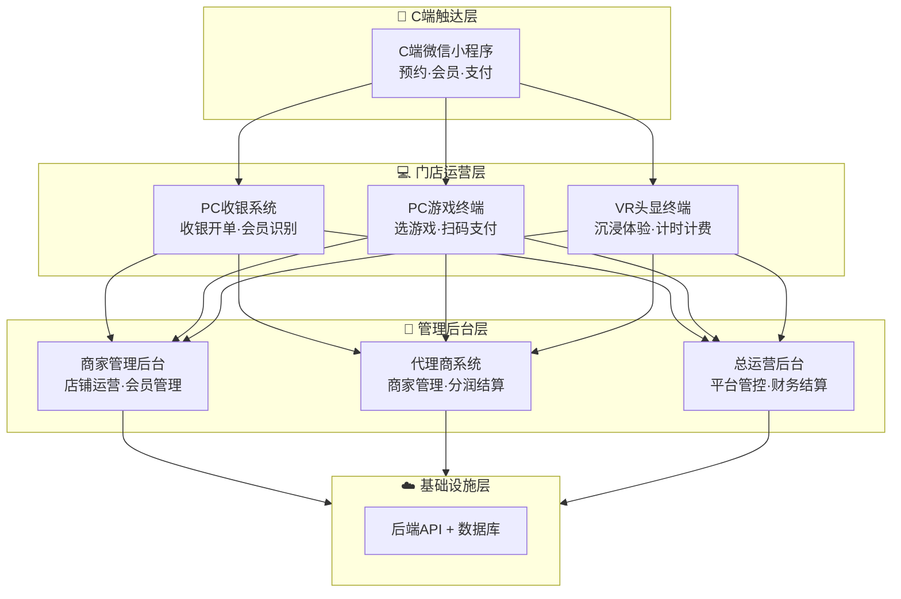
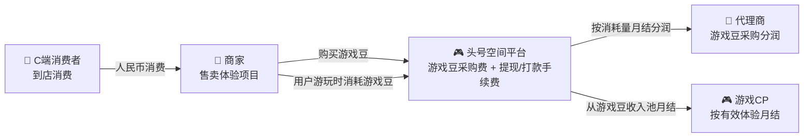
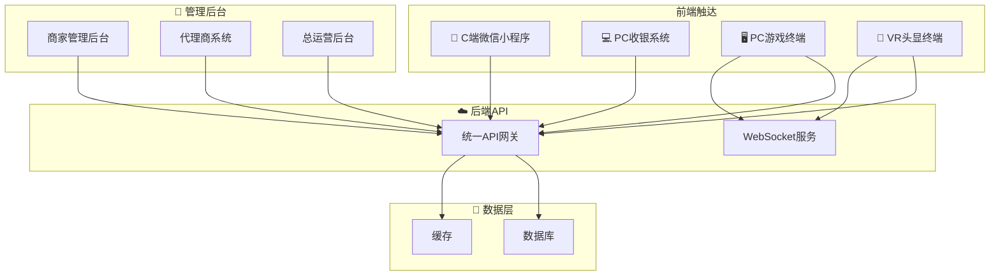
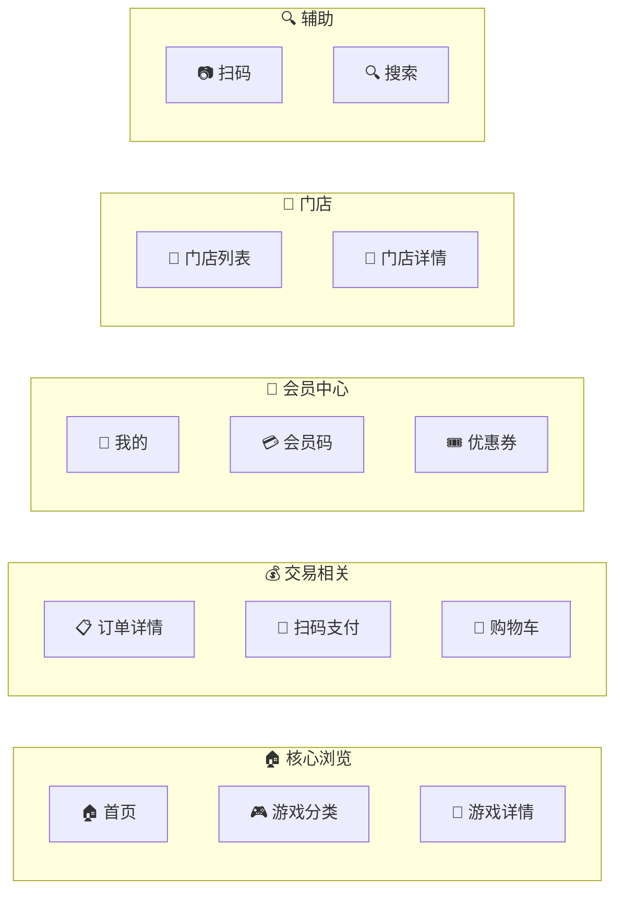
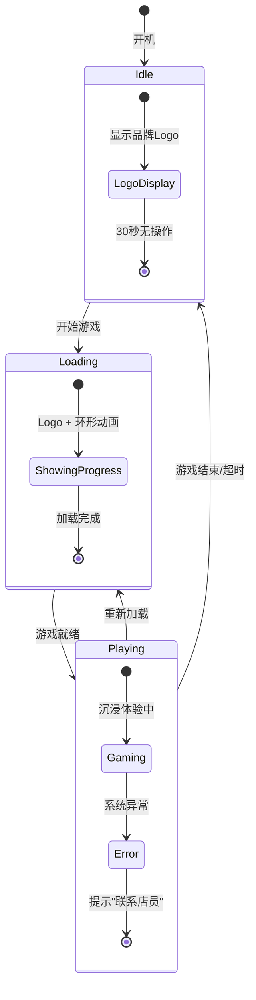
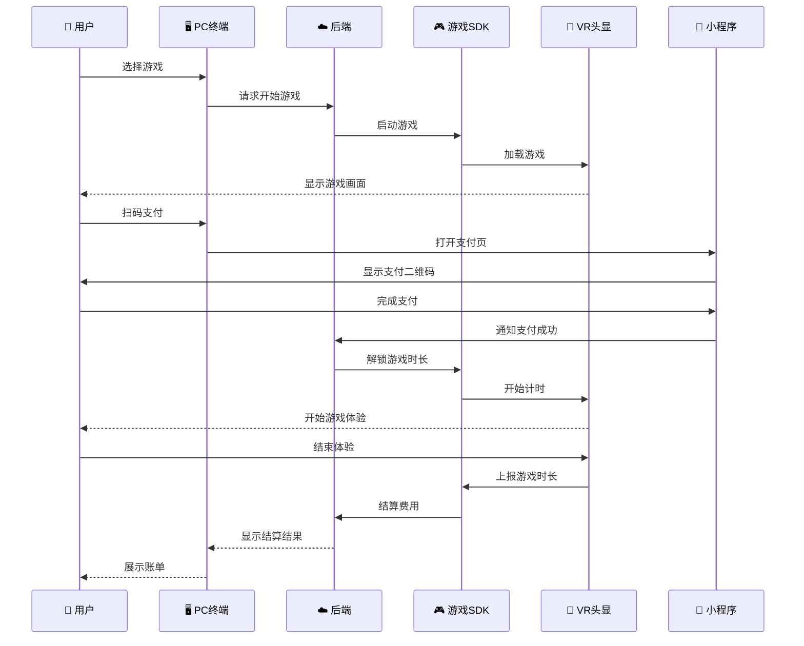
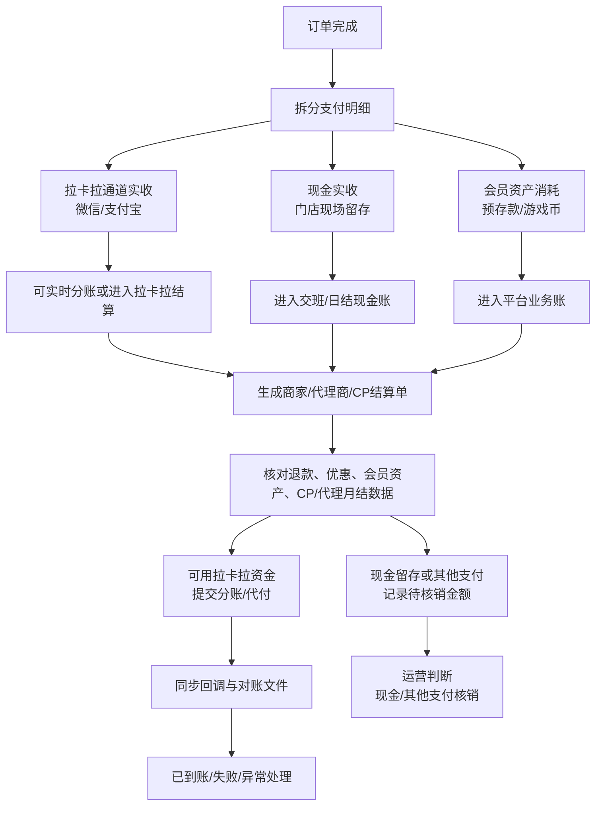

# 头号空间 - 产品需求文档（PRD）

> **文档状态**：本文是头号空间唯一产品需求文档。支付、对账、分账、结算、退款、游戏豆/游戏币/预存款账务规则均以内文第 10 章为准；旧的专题文档仅作为归档材料，不再作为开发依据。

> **版本**: v2.7
> **日期**: 2026年6月25日
> **状态**: 消息类型统一收敛 — `review`纳入一级分类，新增`MESSAGE_TAG_MAP`统一映射表，各终端`Message.vue`统一调用工具函数消除硬编码
> **密级**: 内部公开
> **作者**: 产品团队
> **面向读者**: 技术开发团队、测试团队、运营团队、管理层、游戏CP开发者

---

## 📑 文档目录

| 章节 | 标题 |
|:----:|------|
| 1 | [产品概述](#1-产品概述) |
| 2 | [商业模式与市场定位](#2-商业模式与市场定位) |
| 3 | [系统整体架构](#3-系统整体架构) |
| 4 | [子系统功能详解](#4-子系统功能详解) |
| 5 | [核心业务流程](#5-核心业务流程) |
| 6 | [关键数据概要](#6-关键数据概要) |
| 7 | [角色权限体系（RBAC）](#7-角色权限体系rbac) |
| 8 | [技术方案概要](#8-技术方案概要) |
| 9 | [开发规划里程碑](#9-开发规划里程碑) |
| A | [附录](#a-附录) |

---

## 1. 产品概述

### 1.1 产品定义

**头号空间**是一套面向 **VR线下体验店** 的全链路运营管理系统。平台系统内第一版收费项为 **商家游戏豆采购费** 和 **提现/打款手续费**，代理商按辖区商家游戏豆消耗量分润；硬件销售如另有商务安排，按线下合同处理，不纳入本系统结算。系统由 **四层架构** 组成：



### 1.2 核心价值主张

| 对象 | 核心价值 |
|------|---------|
| **商家** | 降本增效、数据洞察、营销获客、设备管控、多端协同运营 |
| **C端用户** | 便捷体验（微信小程序）、沉浸式消费、会员权益、社交分享 |
| **代理商** | 区域分润、管理工具、结算透明、按游戏豆消耗量分润 |
| **游戏CP** | 自助提交游戏、按次结算收益、数据透明、提现便捷 |
| **平台** | 全网掌控、内容分发、财务闭环、生态运营 |

### 1.3 目标用户画像

| 角色 | 核心诉求 | 使用频率 | 主要终端 |
|------|---------|:--------:|---------|
| 平台超管/运营/财务 | 全局数据/内容推广/结算对账 | 每日多次 | Web后台(PC) |
| 代理商 | 多店业绩、分润收益、辖区管理 | 每周几次 | Web后台(PC) |
| **游戏CP（新增）** | 提交游戏/查看数据/收益提现 | 每日/每周 | Web后台(PC) |
| 店长/收银员/员工 | 营收清晰、操作便捷、高效开单 | 每日高频 | PC收银+Web后台 |
| C端消费者 | 预约/沉浸体验/会员权益 | 按需使用 | 微信小程序 |

---

## 2. 商业模式与市场定位

### 2.1 核心业务模式

平台系统内第一版收入来源为 **商家游戏豆采购费 + 提现/打款手续费**。代理商第一版收入只来自辖区商家游戏豆消耗分润，不按硬件销售、商家交易流水或 C端消费订单分润。



> **关键区别**: 游戏豆是**B端运营代币**(商户→平台)，不是C端消费代币。C端用户付人民币给商家购买游戏项目，商家后台扣除游戏豆作为运营成本。

### 2.2 游戏豆收入详解

> 硬件销售详情见线下合同，平台系统不处理硬件交易的在线流程。

#### 游戏豆（B端运营代币）

游戏豆是商家用来**启动游戏**的运营代币。商家从平台采购游戏豆，C端用户每玩一局游戏，商家消耗一定数量游戏豆。

| 项目 | 说明 |
|------|------|
| **游戏豆定义** | B端运营代币，启动游戏所需游戏豆 = 商家启动一次游戏的消耗成本 |
| **购买方** | 商家（VR体验店），非C端用户 |
| **使用方** | 商家后台 → 用户每玩一局游戏自动扣除对应数量的游戏豆 |
| **平台定价** | ¥1/豆，平台统一定价 |
| **用途** | 商家用游戏豆启动游戏给C端用户玩 |
| **与C端关系** | C端用户不直接接触游戏豆。C端用户在商家充值¥ → 商家定价一个游戏项目¥XX → 用户付款 → 商家消耗游戏豆 |
| **库存管理** | 商家需预购一定量游戏豆，不足时需补充采购；后台有库存预警 |

> **举例**: 商家采购1,000游戏豆(¥1/豆 = ¥1,000)。平台配置每次过山车VR消耗20豆(=¥20成本)，C端用户花¥39玩一次。每次游玩消耗的游戏豆数量由平台在后台统一配置。

#### 游戏豆与CP结算模型（v1.6新增）

> **商业模式**：平台不从玩家消费订单分成。CP 的收益来自商家购买/消耗游戏豆形成的 B 端收入池，第一版按各游戏体验次数 × 单次成本价（CP 自定）月结。平台收费项为商家购买游戏豆的费用，以及提现/打款手续费。

```
商家购买游戏豆（¥1/豆）──▶ 用户游玩扣豆 ──▶ 形成B端收入池 ──▶ CP按次月结（单次成本×次数）
                                                                    │
                                                             提现/打款时扣手续费
```

| 项目 | 说明 |
|------|------|
| **游戏豆售价** | ¥1/豆，商家从平台采购 |
| **CP单次成本** | CP 自行设定单次启动结算价（如 ¥2.00/次） |
| **平台毛利** | 游戏豆采购收入 − CP结算 − 代理商分润等成本 |
| **提现手续费** | 提现/打款时按结算配置收取或代扣 |
| **CP实际到账** | = 体验次数 × 单次成本 − 提现手续费（如 CP 承担） |

### 2.3 分润体系设计

> 代理商的分润以 **游戏豆采购分润** 为核心（硬件销售分润详见线下合同，不走平台系统）。

#### 代理商层级

| 级别 | 保证金 | 管理范围 | 游戏豆采购分润比例 |
|------|:------:|---------|:------------------:|
| 城市代理 | ¥5,000 | 单城市 | 辖区消耗量的 **3%-5%** |
| 区域代理 | ¥20,000 | 省/跨市 | 辖区消耗量的 **5%-8%** |
| 省级总代 | ¥50,000 | 整省 | 辖区消耗量的 **8%-12%** |

#### 游戏豆采购分润规则

> **v2.4 变更**：代理商分润公式对齐拉卡拉业务分析口径，改为基于**平台利润基数**（实际消耗减去退还）计算。本地商家游戏豆均由平台统一定价 ¥1/豆采购，因此"游戏豆消耗"可等价于"回款基准收入"。

**核心公式**（v2.4）：

```
平台利润基数 = 辖区商家月累计游戏豆消耗量 − 辖区商家月累计游戏豆退还量
代理商分润 = 平台利润基数 × 分润比例
```

> **说明**：代理商分润来自游戏豆消耗账单，不改变订单级结算状态。以商家实际消耗的游戏豆（用户游玩时扣减）减去退还的游戏豆（退款/无效体验退还）作为分润基数，能更准确反映辖区的实际运营贡献。就平台而言不存在其他分成来源，其他分成不在本平台范围内。

**计算示例（以城市代理 5% 比例为例）**：

| 月累计消耗游戏豆 | 月累计退还游戏豆 | 平台利润基数 | 分润比例 | 应发分润 |
|:----------------:|:----------------:|:------------:|:--------:|:--------:|
| 120,000 豆（¥120,000） | 6,000 豆（¥6,000） | 114,000 豆（¥114,000） | 5% | ¥5,700 |
| 250,000 豆（¥250,000） | 15,000 豆（¥15,000） | 235,000 豆（¥235,000） | 5% | ¥11,750 |

> ⚠️ **变更说明（v2.2/v2.4）**：阶梯分润策略（×0.8起步/×1.0基准/×1.2成长/×1.5奖励档位）**暂时隐藏，暂不启用**，阶梯系数统一视为 ×1.0。v2.4 公式从「（采购额 − 供应商成本）× 分润比例」改为「（消耗 − 退还）× 分润比例」，不再涉及供应商成本扣除。

#### 代理商月度总分润

```
平台系统内代理商月总分润 = 游戏豆消耗分润（硬件分润如有，按线下合同执行，不走平台系统）
  └── 游戏豆分润: ∑[(辖区商家月累计游戏豆消耗 − 月累计游戏豆退还) × 分润比例]
```

#### 结算安全机制

| 项目 | 规则 |
|------|------|
| 结算周期 | T+1 月结（次月15日前打款） |
| 安全机制 | 提现账户修改需 **10分钟冷却期 + 短信验证码二次确认** |

### 2.4 支付资产与拉卡拉分账总口径（v1.7新增）

> 详细规则统一见本文第 10 章。本节为 PRD 总体口径摘要，所有终端与后台原型必须遵守。

#### 2.4.1 支付资产分层

| 名称 | 定义 | 是否进入拉卡拉实时分账 | 说明 |
|------|------|:----------------------:|------|
| 微信/支付宝 | 通过拉卡拉或支付通道完成的真实支付资金 | 是 | 可实时分账或进入拉卡拉结算 |
| 现金 | 门店现场收取的真实资金 | 否 | 不经过拉卡拉，进入现金账和周期结算 |
| 预存款 | 会员账户人民币余额 | 否 | 充值资金进入拉卡拉总账或现金账，按运营规则结算给商家；消费时释放会员负债 |
| 游戏币 | 会员账户消费资产，和预存款 1:1 抵扣 | 否 | 系统自动抵扣，不作为手动支付按钮 |
| 游戏豆 | 商家/平台侧 B 端运营资源 | 否 | 用于启动游戏和 CP 成本，不是 C 端支付方式 |
| 优惠券/活动优惠 | 商家自行创建的减免权益（满减券/折扣券/新人券），其中新人券在新会员注册时自动发放 | 否 | 先优惠，再计算会员资产和外部支付；第一版无平台券 |

#### 2.4.2 会员资产自动抵扣

默认消耗顺序：

```
商家优惠券/活动优惠 → 预存款 → 游戏币 → 外部支付补差
```

业务规则：

- 商户可自定义预存款与游戏币的消耗优先级，但不能突破商品支付范围限制。
- 游戏币不允许收银员或用户主动选择，系统按商品规则和商户优先级自动决策是否消耗。
- 游戏币目前来源为充值赠送、活动赠送、后台发放，不设置售卖型来源。
- 充值储值只能使用现金、微信、支付宝等外部支付，不允许使用预存款、游戏币或积分充值。
- `仅游戏币` 商品不允许外部支付补差，游戏币不足时禁止购买或兑换。

#### 2.4.3 拉卡拉分账边界

拉卡拉处理的是微信、支付宝等进入支付通道的真实资金。现金、预存款、游戏币、优惠券不属于当前拉卡拉交易中的实时可分账资金。

会员充值是独立资金链路：微信/支付宝充值金额进入拉卡拉总账，再按运营配置的规则分给商家（例如次月 1 日打款至商家银行卡）。

分账默认策略：

| 场景 | 分账方式 |
|------|----------|
| 微信/支付宝直付订单 | 可实时拉卡拉分账 |
| 现金订单 | 周期结算，不做实时拉卡拉分账 |
| 包含预存款/游戏币的订单 | 平台业务账归集后周期结算 |
| 代理商分润 | 周期结算，通过拉卡拉分账/代付 |
| CP收益 | 周期结算，通过拉卡拉分账/代付 |

现金处理口径：

```
现金由商家现场留存
  ↓
进入交班/日结现金账
  ↓
进入商家现金对账和结算校验
  ↓
不形成 C端平台服务费；仅当运营改用现金/其他方式完成平台收费项时记录待核销金额
```

---

## 3. 系统整体架构

### 3.1 各子系统总览

| # | 子系统 | 形态描述 |
|:-:|--------|---------|
| 1 | **C端微信小程序** | 微信小程序（用户端） |
| 2 | **PC收银系统** | 桌面应用（前台收银） |
| 3 | **PC游戏终端** | Windows触摸屏（现场选游戏） |
| 4 | **VR头显终端** | VR原生应用（沉浸体验） |
| 5 | **🏪商家管理后台** | Web后台（商家运营） |
| 6 | **🤝代理商系统** | Web后台（代理商管理） |
| 7 | **🔴官方总运营后台** | Web后台（平台管控） |
| 8 | **🎮游戏SDK** | 跨平台中间件（CP集成） |

> **关键技术决策**：商家后台、代理商系统、总运营后台 **共用一套前端代码库** (`admin-dashboard`)，通过 **RBAC + 动态菜单 + 三套Layout** 实现多角色切换。

### 3.2 子系统间交互关系



---

## 4. 子系统功能详解

> **产品功能全景图**: 详见 [4. 子系统功能详解](#4-子系统功能详解) 章节

---

### 4.1 C端微信小程序

> **定位**: C端用户触达的唯一入口，面向消费者提供游戏浏览、到店预约、会员二维码、消费记录等功能  
> **形态**: 微信小程序（建议 uni-app Vue3），深色沉浸式主题  
> **核心设计**: 主包(首页/个人/扫码) + 游戏包(分类/详情/搜索) + 订单包(订单/会员码/优惠券) 分包策略

#### 4.1.1 页面结构



#### 4.1.2 各页面功能速览

| # | 页面 | 功能要点 | 关键交互 |
|---|------|---------|---------|
| 1 | **首页** | Banner轮播 + 附近门店推荐 + 热门游戏推荐 + 快捷入口 | 搜索、扫码 |
| 2 | **游戏分类** | 5大类Tab(刺激/恐怖/休闲/亲子/联机) + 瀑布流卡片 | 分类切换、排序筛选 |
| 3 | **游戏详情** | 视频/截图轮播 + 介绍 + 价格 + 时长 + "到店体验" | 收藏、分享、预约 |
| 4 | **个人中心** | 头像/昵称/等级 + 会员卡 + 资产概览(余额/积分/次数) | 功能入口网格 |
| 5 | **会员码** | 展示动态会员二维码，到店由店员扫码充值/核销。展示会员资产(余额/积分/次数) | 扫码即时到账 |
| 6 | **扫码** | 扫描设备二维码 / 收款码 | wx.scanCode调用 |
| 7 | **订单记录** | 全部/待支付/已完成/已退款 Tab | 继续支付、取消订单 |
| 8 | **消息通知** | 系统通知(充值成功/订单变更) + 营销消息 | 已读/未读标记 |
| 9 | **设置** | 账号安全/隐私/关于/清除缓存/退出 | 分组菜单列表 |
| 10 | **优惠券** | 可用/已用/已过期 Tab | 卡片样式(面额/有效期) |
| 11 | **门店列表** | LBS附近门店 + 列表/地图双视图 | 距离/评分/营业状态/收藏 |
| 12 | **搜索** | 搜索游戏/门店 + 搜索历史 + 热门推荐 | 联想搜索 |
| 13 | **邀请好友** | 邀请海报 + 邀请记录 + 奖励规则 | 分享裂变 |
| 15 | **消息通知** | 系统通知(充值成功/订单变更) + 营销消息 | 已读/未读标记 |

#### 4.1.3 功能说明

| 功能模块 | 功能说明 |
|---------|---------|
| **首页** | 展示Banner轮播（店铺活动/新品推荐）、附近门店推荐（LBS定位）、热门游戏推荐、快捷操作入口（扫码/会员码/订单）。未登录时展示引导登录提示 |
| **游戏分类与详情** | 按5大类聚合展示门店所有VR游戏项目。游戏详情页展示视频/截图、介绍文案、价格、难度/时长、适龄提示。底部"到店体验"按钮跳转到门店选择页 |
| **会员码** | 展示动态会员二维码，到店出示给店员，由店员通过PC收银系统扫码完成充值/开卡。展示充值记录。充值后余额用于到店消费 |
| **扫码** | 支持扫描门店二维码、设备二维码、收款码，自动跳转对应页面 |
| **订单记录** | 按全部/待支付/已完成/已退款分类展示，待支付订单可继续支付或取消 |
| **门店列表与搜索** | 基于LBS展示附近门店（列表/地图双视图）。支持搜索游戏名称和门店名称 |
| **邀请与裂变** | 生成邀请海报分享微信好友，好友注册后双方获得奖励 |

#### 4.1.4 规则说明

| 规则类型 | 规则内容 |
|---------|---------|
| **登录** | 游客可浏览首页、游戏分类、游戏详情和门店列表。充值、下单、邀请等功能需微信一键登录。登录后7天内免登录 |
| **支付** | 仅支持微信支付（JSAPI）。C端用户在小程序不可直接充值，须到店出示会员码，由PC收银系统扫码完成充值。成功后发送订阅消息通知 |
| **搜索** | 支持搜索游戏名称和门店名称。展示搜索历史标签和热门推荐 |
| **优惠券** | 商家在后台创建三种类型：满减券、折扣券、新人券。新人券在新会员注册时自动发放，无需手动操作。一次性使用不可叠加，过期自动失效 |

#### 4.1.5 交互说明

| 交互场景 | 交互流程 |
|---------|---------|
| **游客浏览** | 进入小程序 → 首页推荐 → 游戏分类浏览 → 详情查看 → 引导登录/到店 |
| **出示会员码充值** | 个人中心 → 会员码 → 出示给店员 → 店员扫码 → 选择充值金额 → 支付 → 到账确认 |
| **到店消费完整流程** | 浏览游戏 → 选择门店（预约或不预约）→ 到店告知店员 → PC终端自助选游戏/扫码支付 → 佩戴VR → 玩游戏 → 结算 → 小程序同步消费记录 |
| **搜索** | 顶部搜索框 → 输入关键字 → 联想搜索 → 显示游戏/门店混合结果 |

#### 4.1.6 小程序付款结算流程（v1.8 新增）

> 用户扫描设备二维码后进入付款结算页面，系统按固定优先级自动抵扣会员资产，不足部分通过微信支付补差。  
> 核心原则：**支付前必须可预览、可确认、可追溯。**

##### 页面状态流转

```
加载中(loading) → 付款结算(confirm) → 支付中(processing) → 支付成功(success)
                                                       ↘ 支付失败(failed)
```

| 状态 | 说明 |
|------|------|
| `loading` | 扫码后加载订单信息、查询会员数据 |
| `confirm` | 展示订单内容 + 会员资产 + 支付明细，用户确认后发起支付 |
| `processing` | 提交支付请求，展示处理中动画，禁止退出 |
| `success` | 支付成功，展示支付方式、订单详情，指引用户前往设备体验 |
| `failed` | 支付失败，展示失败原因和重试/返回入口 |

##### 抵扣链（核心计费规则）

系统按固定优先级自动计算每笔支付的资产消耗，顺序不可调整：

```
优惠券(减面值) → 会员折扣 → 预存款 → 游戏币 → 微信支付(补差)
```

| 步骤 | 名称 | 计算公式 |
|------|------|----------|
| ① | 原价 | `originalPrice = unitPrice` |
| ② | 优惠券后 | `amountAfterCoupon = max(0, originalPrice - couponDiscountAmount)` |
| ③ | 会员折扣后应付 | `priceAfterDiscount = amountAfterCoupon × (member.discount / 10)` |
| ④ | 预存款抵扣 | `prepaidDeduction = min(member.balance, priceAfterDiscount)` |
| ⑤ | 预存款抵扣后剩余 | `afterPrepaid = priceAfterDiscount - prepaidDeduction` |
| ⑥ | 游戏币抵扣量 | `coinDeduction = min(member.coins, ceil(afterPrepaid))` |
| ⑦ | 游戏币抵扣金额 | `coinValue = coinDeduction`（汇率 1:1） |
| ⑧ | 微信应付/缺口 | `remainingPay = afterPrepaid - coinValue` |

**关键规则**：
- **汇率**：游戏币与人民币为 1:1
- **游戏币粒度**：不足 1 元时按 1 币扣除（向上取整）
- **不为负**：每一步结果均 `max(0, ...)` 确保不出现负值
- **缺口判定**：`shortage = remainingPay`，当 `shortage > 0` 时判定为预存款+游戏币不足

##### 付款结算页（confirm 状态）

| 模块 | 内容 |
|------|------|
| 导航栏 | 返回按钮 + "付款结算"标题 |
| 会员卡片 | 姓名、等级、折扣、预存款、游戏币、套票、预存次数 |
| 订单内容 | 游戏名称、时长、标签、原价 |
| 支付明细 | 完整抵扣链展示（原价 → 优惠券 → 折扣 → 抵扣 → 应付） |
| 底部按钮 | 确认并支付 / 微信补差 |

**不足提醒**（`shortage > 0` 时）：
- 会员卡片变色（变深紫色）
- 显示黄色警告条："预存款+游戏币不足，需微信补差"
- 支付明细末尾"应付"变红
- 底部按钮变红，文案变为"微信补差 ¥xx.xx"

**按钮文案规则**：

| 条件 | 按钮文案 |
|------|----------|
| `shortage > 0` | 微信补差 ¥xx.xx |
| `shortage == 0` | 确认并支付 ¥xx.xx |
| 处理中 | loading 动画 + "处理中..." |

##### 支付成功页（success 状态）

**支付方式标签**（根据实际支付构成动态显示）：
- 有预存款抵扣 → `预存款 ¥xx.xx`（紫色标签）
- 有游戏币抵扣 → `xx 游戏币`（橙色标签）
- 有微信支付 → `微信支付 ¥xx.xx`（绿色标签）

| 字段 | 内容 |
|------|------|
| 游戏 | 游戏名称 |
| 时长 | xx分钟 |
| 订单号 | VR202606070001 格式 |
| 设备提示 | "xx号设备 已准备就绪，请前往开始体验" |

##### 支付失败页（failed 状态）

| 场景 | 展示标题 | 说明 | 触发条件 |
|------|----------|------|----------|
| 订单已失效 | 订单已失效 | 订单超时或已被使用 | 后端返回 `order_status = expired/cancelled`，如订单超过有效期、已被他人支付、设备端取消订单 |
| 支付超时 | 支付超时 | 支付处理超时 | 点击确认支付后，微信支付 API 在 30~60 秒内无响应，前端请求超时或后端回调超时 |
| 余额不足 | 余额不足 | 微信支付余额不足 | 微信支付 JSAPI 返回失败，用户微信零钱/银行卡余额不足以覆盖 `remainingPay` |

> **注意**：`failTitle` 由调用方（父组件 / 后端 API 返回）通过 prop 传入，MiniPayFlow 组件不自行判断失败类型。

**失败处理指引**：返回设备端重新展示付款码 → 确认网络正常后再次发起支付 → 如已扣款，稍后在订单中心查看结果

##### 场景示例（8 种覆盖主流组合）

> 以下示例原价 38 元，基础会员折扣 9 折

| # | 场景 | 优惠券 | 折扣 | 预存款 | 游戏币 | 折后应付 | 预存款抵扣 | 游戏币抵扣 | 微信应付 |
|---|------|--------|------|--------|--------|----------|------------|------------|----------|
| 1 | 纯预存款全覆盖 | 0 | 9 | 100 | 0 | 34.20 | 34.20 | 0 | 0 |
| 2 | 纯游戏币全覆盖 | 0 | 9 | 0 | 50 | 34.20 | 0 | 35 | 0 |
| 3 | 预存款+游戏币全覆盖 | 0 | 9 | 20 | 30 | 34.20 | 20 | 15 | 0 |
| 4 | 预存款不足→补差 | 0 | 9 | 10 | 0 | 34.20 | 10 | 0 | 24.20 |
| 5 | 游戏币不足→补差 | 0 | 9 | 0 | 20 | 34.20 | 0 | 20 | 14.20 |
| 6 | 预存款+币均不足→补差 | 0 | 9 | 10 | 10 | 34.20 | 10 | 10 | 14.20 |
| 7 | 优惠券+折扣+全额覆盖 | 5 | 8.5 | 100 | 30 | 28.05 | 28.05 | 0 | 0 |
| 8 | 优惠券+折扣+不足→补差 | 5 | 8.5 | 10 | 0 | 28.05 | 10 | 0 | 18.05 |

**示例计算演示（场景 6）**：

```
原价：                  ¥38.00
优惠券：                   0
会员折扣(9折)：          -¥3.80
折后应付：               ¥34.20
─────────────────────────────
预存款抵扣：             -¥10.00  （余额 ¥10，全扣）
游戏币抵扣：            -10 币    （剩余 ¥24.20 → 25 币需要，余额 10 币）
─────────────────────────────
微信应付：               ¥14.20   ← 不足，需补差
```

##### Demo 项目

小程序支付流程 Demo 位于 `miniapp-payment/` 目录：

| 文件 | 说明 |
|------|------|
| `MiniPayFlow.vue` | 支付流程核心组件，实现 5 种状态和抵扣计算 |
| `DemoPreview.vue` | 演示控制面板，支持 8 种场景切换 + 手机框/全屏预览 |

启动方式：
```bash
cd miniapp-payment && npx vite --port 9528
```

---

### 4.2 PC收银系统

> **定位**: 门店收银员/店长的日常操作终端，负责开单收银、会员管理、商品管理、交接班等门店运营核心业务  
> **形态**: 桌面应用（Electron/Tauri），Windows全屏模式  
> **部署位置**: VR体验店前台收银台，由收银员日常操作

#### 4.2.1 页面结构

| 功能模块 | 说明 |
|---------|------|
| 🔐 **登录/锁屏** | 收银员账号密码登录，暂离一键锁屏 |
| 🏠 **工作台** | 营业概览KPI、设备状态、快捷操作入口 |
| 🛒 **收银台（核心）** | 4Tab销售：单次消费/充值/套票/商品，右侧结算单 |
| 👥 **会员管理** | 查询/新增/识别会员（手机号搜索+扫码） |
| 💰 **充值/办卡** | 选择金额或套餐，仅支持微信/支付宝/现金等外部支付 |
| 🎫 **套票/套餐** | 次数套餐/时间卡，可绑定会员或生成兑换码 |
| 📋 **订单管理** | 查订单、退款（30天内原路或现金） |
| 🔄 **交接班** | 当班营收统计 + 现金盘点，交接确认 |
| 🖥️ **设备监控** | 实时查看VR设备状态，远程重启 |
| 📊 **今日报表** | 门店当日销售数据汇总 |

#### 4.2.2 收银台核心（4Tab 结构）

收银台是PC收银系统的核心页面，采用 **左-中-右** 三段式布局：

- **左侧（顾客身份区）**：搜索/扫码识别会员，选中后显示会员信息（预存款/游戏币/积分/等级/折扣）
- **中间（4Tab销售区）**：

| Tab | 名称 | 说明 | 操作规则 |
|:---:|------|------|---------|
| 1 | **单次消费** | 按次体验券，点击游戏卡片加入结算单 | 无需选择会员，按原价结算 |
| 2 | **充值活动** | 储值会员卡选面额支付 | **必须先选择会员** |
| 3 | **套票** | 次数套餐/时间卡 | 选套餐 → 绑定会员或生成兑换码 |
| 4 | **实体商品** | 饮料/零食等 | 选商品 → 加购物车 → 自动扣库存 |

- **右侧（结算单区）**：实时显示待结商品列表、合计金额、优惠、实付，点击"去结算"完成收银

**支付方式**: 微信扫码 / 支付宝扫码 / 现金 / 会员资产自动抵扣（预存款/游戏币）

> **v1.9 更新**：微信/支付宝支付增加扫码枪流程——收银员选择微信或支付宝后，系统弹出扫码弹窗，使用扫码枪扫描玩家付款码，经格式校验 + 后端验证后完成支付。扫码枪故障时支持手动输入付款码付款。现金和会员资产抵扣无需扫码。

#### 4.2.2.1 会员资产自动抵扣规则（销售页）

为避免收银员在"切换会员 / 调整购物车 / 试算优惠"过程中发生误扣款，**选择会员仅代表识别会员身份，不代表立即扣预存款或游戏币**。会员资产实际扣减发生在收银员点击结算区主按钮并确认支付成功之后。

| 场景 | 规则 |
|------|------|
| **会员识别** | 选择会员后，页面立即展示会员等级、预存款、游戏币、可用优惠和会员价，但**不自动扣款** |
| **可用会员资产范围** | 单次消费 / 套票 / 实体商品默认支持预存款和游戏币自动抵扣；充值活动**不支持**会员资产支付 |
| **游戏币决策** | 游戏币不作为手动支付按钮出现，由系统根据商品支付范围和商户优先级自动计算是否消耗 |
| **默认优先级** | 默认按`优惠券/活动优惠 → 预存款 → 游戏币 → 外部支付补差`计算，商户可自定义预存款和游戏币优先级 |
| **订单拆分** | 充值单与消费单必须分开结算，不允许同一订单同时包含"充值"与"消费扣款" |
| **扣款时点** | 收银员确认结算后，系统创建订单、扣减预存款/游戏币、写入会员资产流水 |
| **价格计算顺序** | 商品原价 → 会员价/折扣 → 优惠券/活动优惠 → 会员资产自动抵扣 → 外部支付补差 |
| **默认支付推荐** | 当会员资产足够时，结算区默认推荐`确认扣款`；仍保留切换为微信/支付宝/现金的入口 |

#### 4.2.2.2 会员资产不足处理规则

| 场景 | 页面表现 | 处理规则 |
|------|---------|---------|
| **会员资产足够** | 结算区显示`将扣预存款 ¥X + 游戏币 Y`，主按钮文案为`确认扣款` | 点击后进入二次确认，确认成功即完成扣款 |
| **会员资产不足但允许补差** | 结算区显示`仍需支付 ¥XX.XX`，展示微信/支付宝/现金入口 | 会员资产先按规则扣减，剩余金额走外部支付 |
| **仅游戏币商品且游戏币不足** | 显示`游戏币不足`，主按钮禁用 | 不允许外部补差，不允许用预存款替代 |
| **充值场景** | 不展示会员资产抵扣 | 充值只能用微信/支付宝/现金 |
| **商品不支持会员资产** | 提示`当前商品不支持会员资产支付` | 仅展示外部支付方式 |

#### 4.2.2.3 销售页结算交互调整

| 触发条件 | 主按钮文案 | 次要操作 |
|---------|-----------|---------|
| 未选会员 | `去结算 ¥XX.XX` | 微信 / 支付宝 / 现金 |
| 已选会员且会员资产足够 | `确认扣款` | 改其他方式支付 |
| 已选会员且需补差（微信/支付宝） | `扫码支付（微信）¥XX.XX` / `扫码支付（支付宝）¥XX.XX` | 点击后弹出扫码弹窗 |
| 已选会员且需补差（现金） | `确认并支付 ¥XX.XX` | 直接确认 |
| 仅游戏币商品且游戏币不足 | `游戏币不足`（禁用） | 引导活动赠送或后台处理 |
| 充值Tab | `立即充值 ¥XX.XX` | 不展示会员资产抵扣 |

> **推荐实现**: 销售页保留"结算确认"这一步。会员资产抵扣区只展示系统计算结果，不把游戏币做成可手动选择的支付按钮。

#### 4.2.2.4 销售成功结果展示规范

支付成功后的结果弹窗应采用**小票式结构**，用于让收银员与顾客快速复核本单信息。

| 展示区域 | 规则 |
|---------|------|
| **逐项明细** | 每个商品一行，左侧显示商品名，次行显示`数量 × 单价`，右侧显示该行小计 |
| **汇总信息** | 底部按顺序显示`商品合计`、`优惠券`（如有）、`优惠合计`（如有）、`预存款抵扣`、`游戏币抵扣`、`外部支付补差`、`实付总计` |
| **会员资产变化** | 展示预存款和游戏币的扣减前后值，例如`预存款 ¥300 → ¥240`、`游戏币 2704 → 2684` |
| **标题** | 普通支付显示`支付成功`；会员资产全额抵扣显示`扣款成功`；混合支付显示`支付成功` |
| **一致性要求** | 单项消费与多项消费均使用同一结果结构，不因订单项数不同切换成完全不同样式 |

> **说明**: 成功结果页必须能回溯顾客是否使用了优惠券、扣了多少预存款、扣了多少游戏币、外部补差多少，不能只展示商品明细而缺少结算结果。

#### 4.2.3 功能说明

| 功能模块 | 功能说明 |
|---------|---------|
| **登录/锁屏** | 收银员账号密码登录，选择门店。暂离一键锁屏，防止他人误操作 |
| **工作台** | 登录后默认页，展示今日营业数据概览（营收/订单数/客单价/退款笔数）、设备状态、快捷入口 |
| **收银台** | 4Tab商品销售区，右侧结算单实时汇总。支持会员识别后享受折扣价和会员资产自动抵扣 |
| **会员管理** | 查询/新增会员，支持手机号搜索和扫码识别。会员信息含等级/预存款/游戏币/积分/次数 |
| **订单管理** | 查询门店所有订单，支持退款操作（原路退回或现金退款）。30天后不可退款 |
| **交接班** | 自动统计当班营收数据（各支付方式收入/订单笔数/退款额），现金需手动盘点核对 |
| **设备监控** | 实时查看门店VR设备状态，支持远程重启 |

#### 4.2.4 规则说明

| 规则类型 | 规则内容 |
|---------|---------|
| **销售** | 单次消费无需选会员按原价结算。识别会员后可享会员价、优惠券和会员资产自动抵扣能力，但**不会因为选中会员而自动扣资产**。充值活动和套票必须先选会员。实体商品自动扣库存 |
| **支付** | 支持微信/支付宝/现金/会员资产自动抵扣。微信/支付宝使用服务商模式，需通过扫码枪扫描玩家付款码并完成后端验证；现金和会员资产直接确认。预存款和游戏币仅在点击结算确认后发生扣减 |
| **退款** | 仅支持已完成支付的订单退款，30天后不可退款。可原路退回或现金退款 |
| **交接班** | 当班数据锁定不可修改，仅店长和收银员可操作。需填写实际现金盘点金额 |
| **离线** | 断网时商品缓存本地，订单入本地队列，联网后批量同步 |
| **会员资产不足** | 若会员资产不足且商品允许补差，则提示差额并允许微信/支付宝/现金补差；若商品为`仅游戏币`，游戏币不足时禁止结算 |

#### 4.2.5 交互说明

| 交互场景 | 交互流程 |
|---------|---------|
| **到店消费（收银开单）** | 顾客到前台 → 收银员选"单次消费"Tab → 可选会员识别 → 点击游戏加入结算单 → 系统试算会员价/优惠/预存款/游戏币/补差金额 → 收银员选择支付方式确认 → **微信/支付宝需扫码枪扫玩家付款码验证** → 现金/会员资产直接确认 → 支付成功 → 打印小票 → 分配VR设备 |
| **会员充值** | 搜索/识别会员 → 切换到"充值活动"Tab → 选金额或套餐 → 生成付款 → 支付 → 到账确认 → 打印小票 |
| **退款** | 订单管理 → 搜索订单 → 确认 → 选退款方式 → 填原因 → 确认退款 → 打印退款小票 |
| **交接班** | 点击交接班 → 显示营收汇总 → 输入现金盘点额 → 系统自动计算差异 → 接班人确认 → 完成 |

#### 4.2.6 会员扣费页补充规则

会员扣费页（菜单：`会员扣费`）与销售页在会员资产能力上遵循同一原则，但页面定位为"会员账户资产扣减"。

| 场景 | 规则 |
|------|------|
| **扣费前校验** | 根据商品支付范围自动计算预存款、游戏币和补差金额 |
| **游戏币规则** | 游戏币不作为手动按钮，由系统自动决策；`仅游戏币`商品游戏币不足时禁止扣费 |
| **资产不足提示** | 页面显示`仍需支付 ¥XX.XX`或`游戏币不足`，按商品规则决定是否允许补差 |
| **充值引导** | 预存款不足且商品不允许游戏币或补差时，可提供`去充值`入口，跳转到销售页充值Tab，并保留当前会员上下文 |
| **优惠参与** | 会员扣费页若使用优惠券，实扣金额按`商品合计 - 优惠合计`计算 |
| **扣费成功结果** | 成功弹窗采用与销售页一致的小票式结构，展示`商品合计`、`优惠券`（如有）、`优惠合计`、`预存款抵扣`、`游戏币抵扣`、`外部补差`、`会员资产变化` |

#### 4.2.7 现有收银原型调整清单（v1.7新增）

结合当前收银系统原型，需做以下调整：

| 页面/组件 | 需要调整的内容 |
|----------|----------------|
| 销售页右侧结算栏 | 从"余额是否足够"升级为"会员资产抵扣预览"，展示优惠、预存款、游戏币、仍需支付 |
| 支付弹窗 | 支付方式按钮只展示微信/支付宝/现金等外部支付；会员资产抵扣放在金额明细区，游戏币不做手动按钮 |
| 会员扣费页 | 由"仅余额扣费"升级为"预存款/游戏币自动扣费"，并支持按商品规则判断是否允许补差 |
| 成功弹窗/小票 | 增加预存款和游戏币的扣减前后值；混合支付需拆分展示每一类支付 |
| 订单详情 | 支付内容字段需拆成`优惠明细`、`预存款抵扣`、`游戏币抵扣`、`外部支付补差`、`退款/冲正记录` |
| 交接班/日结 | 保留现金盘点，同时新增会员资产消耗统计；现金不进入拉卡拉实时分账 |
| 商品配置原型 | 增加商品支付范围：`仅外部支付`、`可预存款`、`可游戏币`、`仅游戏币`、`可混合支付` |

#### 4.2.8 登录与锁屏功能说明

> 收银系统是门店日常运营的核心终端，涉及资金交易和会员隐私数据，需要严格的登录认证与暂离保护机制。

**登录流程**

| 步骤 | 说明 |
|:----:|------|
| 1. 启动应用 | 收银系统启动后展示登录页，输入员工账号密码 |
| 2. 选择门店 | 员工可能归属多个门店（如连锁店），登录时需选择当前操作门店 |
| 3. 角色校验 | 系统根据账号角色（店长/收银员）加载对应的功能权限菜单 |
| 4. 进入工作台 | 登录成功后默认展示当日营业概览（营收/订单数/设备状态） |

**锁屏功能**

| 维度 | 说明 |
|------|------|
| **触发方式** | 收银员暂离时点击「锁屏」按钮（通常位于顶部栏或快捷菜单），一键锁定当前界面 |
| **锁屏效果** | 屏幕显示锁定遮罩，隐藏所有业务数据和敏感信息，仅展示锁屏界面（含解锁输入框） |
| **解锁方式** | 输入当前登录员工的密码（或设置独立锁屏PIN码），验证通过后恢复锁屏前的操作界面 |
| **自动锁屏** | 支持配置空闲超时自动锁屏（如5分钟无操作自动锁定），可在系统参数中调整超时时长 |
| **安全策略** | 连续输错密码 N 次后临时锁定账号（如5次错误锁定30分钟），需店长账号解锁 |
| **交接班联动** | 锁屏不影响后台计时和交接班数据统计；交接班操作前必须先解锁 |
| **权限控制** | 锁屏期间禁止任何业务操作（收银/退款/会员查询等），防止他人误操作或恶意操作 |

**锁屏与交接班的关系**

```
收银员A上班 → 登录系统 → 正常操作
                         ├── 暂离 → 一键锁屏 → 回来解锁 → 继续操作
                         └── 下班 → 先解锁（如已锁屏）→ 交接班 → 收银员B登录
```

**技术实现要点**

| 要点 | 说明 |
|------|------|
| 会话保持 | 锁屏不解锁登录态，后端Session持续有效 |
| 本地状态 | 锁屏前界面状态（如未提交的结算单、选中的会员）需保留 |
| 全局快捷键 | 支持配置锁屏快捷键（如 Ctrl+L），方便收银员快速锁屏 |
| 日志记录 | 每次锁屏/解锁操作记录到操作日志，含时间戳和操作员工号 |

---

### 4.3 PC游戏终端

> **定位**: VR体验店现场的自助交互终端（右脚点播系统），顾客到店自行浏览游戏、选游戏、扫码支付、获取设备引导、查看结算  
> **形态**: Windows全屏kiosk应用（触摸屏），深蓝色沉浸式主题，放置在每台VR设备旁  
> **核心原则**: PC终端承担所有交互，VR头显内不做任何UI

> **💡 补充说明 — 点播系统业务逻辑**
> - **PC 游戏终端 = 右脚点播系统**：每台 PC 终端即一个"点播系统"，顾客通过该终端选择并启动游戏。
> - **每台主机设备绑定一个点播系统**：主机（PC 终端设备）与点播系统一一绑定，不可多台主机共用同一系统。
> - **系统归属门店账号下**：点播系统隶属于具体门店，门店管理员可管理本店下的所有点播系统。
> - **游戏豆门店共享**：同一门店下的所有点播系统共享该门店的游戏豆余额，任意终端消耗游戏豆均从门店总账户扣除。

#### 4.3.1 状态流转

| 状态 | 用户操作 | 系统处理 |
|:----:|---------|---------|
| ① 待机 | 触摸/点击"开始体验" | 展示品牌Logo + 宣传视频 |
| ② 选游戏 | 浏览卡片 → 点击感兴趣的游戏 | 按分类筛选，展示价格/时长 |
| ③ 看详情 | 查看游戏介绍 → 点击"开始体验" | 展示视频/价格 |
| ④ 支付 | 扫码付款（或会员资产自动抵扣） | 生成二维码，15分钟倒计时 |
| ⑤ 设备忙 | 显示"当前设备全满"提示 | 无系统排队，店员线下引导 |
| ⑥ 佩戴 | 按指引找到VR设备并佩戴 | 显示"请佩戴 #03 头盔" |
| ⑦ 体验中 | 沉浸式玩游戏，0 UI干扰 | 后台计时，PC端显示监控面板 |
| ⑧ 结算 | 查看消费明细 → 评分 → 离开 | 展示金额/时长，五星评分入口 |

#### 4.3.2 各状态说明

| # | 状态 | 用户看到的画面 | 说明 |
|:--:|------|-------------|------|
| 1 | **待机/Idle** | 店铺Logo + 宣传视频循环 + "点击开始"按钮 + 设备状态 | 默认状态，吸引路人 |
| 2 | **游戏选择** | 游戏卡片网格(4列×3行) + 分类筛选栏 + 价格/时长/难度 | 触摸选游戏 |
| 3 | **游戏详情** | 大图/视频预览 + 名称/介绍 + 价格 + 难度/时长 + "开始体验"按钮 | 确认后进入支付 |
| 4 | **扫码支付** | 大二维码(微信/支付宝) + 金额 + 15分钟倒计时 + 状态轮询 | 会员可按规则使用预存款/游戏币抵扣 |
| 5 | **设备繁忙** | 提示"当前设备忙，请稍后" | 设备全满时触发 |
| 6 | **分配设备** | "请佩戴 #03 头盔" + VR设备位置指引 | 引导顾客就座 |
| 7 | **游戏中监控** | VR画面缩略图 + 剩余时间 + 进度条 + "提前结束/呼叫店员" | 监控面板 |
| 8 | **结算完成** | 消费明细 + 剩余预存款/游戏币 + 评分入口 + "返回首页" | 可打印小票 |
| 9 | **设置** | 设备编号/状态 + 网络测试 + 远程重启 + 日志导出 | 店员密码模式 |
| 10 | **头显管理** | 设备列表 + 参数设置(瞳距/刷新率等) + 游戏安装 + 绑定/解绑 | 店员密码模式（从设置Tab进入） |

#### 4.3.3 功能说明

| 功能状态 | 功能说明 |
|---------|---------|
| **待机/吸引** | 默认空闲状态，展示品牌Logo和宣传视频，显示大号"点击开始"按钮和当前设备编号/状态 |
| **游戏浏览选择** | 游戏大厅按分类筛选（全部/刺激/恐怖/休闲/亲子/联机），卡片网格展示封面图/名称/价格/时长/难度星级 |
| **会员登录** | 支持微信扫码登录和输入手机号验证。登录后享受会员价、查看预存款/游戏币。不登录以散客身份按原价体验 |
| **扫码支付** | 选择游戏后生成支付二维码（微信+支付宝），显示金额和15分钟倒计时。会员可按规则使用预存款/游戏币，资产不足时外部支付补差 |
| **设备分配与引导** | 支付成功后自动分配空闲VR设备，屏幕显示"请佩戴 #03 头盔"和位置指引 |
| **游戏中监控** | 游戏进行期间切换监控面板，显示VR画面缩略图、剩余时间、进度条，提供"提前结束"和"呼叫店员"按钮 |
| **结算评价** | 游戏结束后展示消费明细（游戏名称/时长/金额）、剩余预存款/游戏币，提供五星评分入口 |

#### 4.3.4 规则说明

| 规则类型 | 规则内容 |
|---------|---------|
| **身份** | 散客无需登录按原价支付。会员登录后显示会员价，可用预存款/游戏币消费。同一终端一次接待一位顾客 |
| **支付** | 支持微信/支付宝扫码、会员资产自动抵扣。扫码支付15分钟超时自动取消。支付成功即时分配VR设备 |
| **设备分配** | 自动分配空闲设备，优先最近一台。全满时提示设备繁忙 |
| **设备忙** | 设备全满时提示"当前设备繁忙"，由店员引导分流/等候 |
| **时长** | 按设定时长计费，提前结束按实际时长结算退费。超时自动结束Session |
| **续费** | 游戏进行中支持续费追加时长（从当前进度继续，不从头开始）。续费时长 = 原购买时长，续费后总时长翻倍。是否允许续费由平台/CP在游戏配置中控制 |
| **与VR关系** | PC终端不直连VR头显。PC选游戏+支付 → 后端指令 → 下发加载给VR设备（通过游戏SDK间接通信） |
| **超时** | 支付二维码15分钟超时。待机30秒无人操作进省电模式 |

#### 4.3.5 交互说明

| 交互场景 | 交互流程 |
|---------|---------|
| **散客自助体验** | 到店→触摸"开始体验"→ 浏览游戏→ 看详情→ 点击"开始体验"→ 确认原价→ 手机扫码支付→ 分配设备→ "请佩戴#03头盔"→ 佩戴VR→ 玩游戏→ 结束→ 结算页→ 评分→ 返回待机 |
| **会员自助体验** | 到店→登录(微信扫码/手机验证)→ 显示会员信息→ 浏览游戏(会员价)→ 选游戏→ 系统展示预存款/游戏币/补差明细 → 用户确认支付 → 分配设备 → 佩戴VR → 玩游戏 → 结算(含资产变动) |
| **提前结束** | 游戏进行中→ 走出VR区→ 在PC终端点击"提前结束"→ 确认→ 按实际时长结算退费→ 显示消费明细 |
| **呼叫店员** | 游戏进行中有问题→ 走出VR区→ 在PC终端点击"呼叫店员"→ 前台收银系统收到提醒→ 店员到场处理 |

#### 4.3.6 头显管理（v2.1新增）

> **定位**: PC终端的Settings页面中新增「头显管理」Tab，提供对连接的头显设备（Pico等无线VR头显）的统一管理能力。
> **入口**: Settings页面 → 新增「头显管理」Tab
> **适用角色**: 店员/店长（需密码进入Settings页面）

##### 页面布局

采用「左侧设备列表 + 右侧Tab内容区」左右分栏布局：
- **左侧**: 已绑定的头显设备列表（显示设备名称/在线状态），点击切换当前管理目标
- **右侧**: 根据左侧选中的设备，展示3个Tab内容

##### Tab 1: 设备信息（只读）

| 信息项 | 说明 |
|--------|------|
| 瞳距(IPD) | 当前设备瞳距值，如64.5mm |
| 刷新率 | 当前设备刷新率，如90Hz |
| 渲染分辨率 | 自动/高品质2688×2688/高性能1920×1920 |
| 存储 | 总容量/已用/可用 + 容量进度条 |
| 已安装游戏 | 显示该设备上已安装的游戏列表及版本号 |

##### Tab 2: 参数设置

| 参数 | 交互方式 | 说明 |
|------|---------|------|
| 瞳距微调(IPD) | 滑块（58-72mm，带刻度标尺） | 设置后实时同步到头显 |
| 刷新率 | 三选一按钮 | 72Hz(省电) / 90Hz(推荐) / 120Hz(高性能) |
| 渲染分辨率 | 三选一按钮 | 自动 / 高品质2688×2688 / 高性能1920×1920 |
| 屏幕亮度 | 滑块（范围0-100%） | 实时同步 |
| 音量限制（保护听力） | 开关 | 开启后限制最大音量 |
| 自动待机（无人佩戴） | 开关 | 开启后摘盔超时自动待机 |
| 仅闲时后台更新 | 开关 | 开启后仅在设备空闲时下载更新 |
| 预设方案 | 卡片点击切换 | 成人模式(65mm·90Hz) / 儿童模式(58mm·72Hz) / 高性能(65mm·120Hz) |

- 参数修改后点击「保存并同步」→ 参数实时下发到头显
- 支持「应用到所有设备」按钮

##### Tab 3: 安装游戏

| 功能 | 说明 |
|------|------|
| 游戏库 | 展示全量可安装游戏，支持按名称搜索和分类筛选（全部/动作/冒险/射击/音乐/模拟/竞速） |
| 游戏状态标识 | ✓ 已安装（灰显不可选）/ 可选 / 🔄 可更新 |
| 多选推送 | 勾选多个游戏 → 点击「推送到目标头显」 |
| 推送进度监控 | 实时显示进度条 + 传输速度 + 预计剩余时间 |
| 推送队列 | 支持多个推送任务排队（进行中 / 已完成 / 排队中） |
| 断点续传 | 网络中断后自动续传 |

##### 设备绑定/解绑

| 操作 | 流程 |
|------|------|
| **绑定** | 点击左侧「+ 绑定」→ 弹出扫码窗口 → 头显端进入「设置→设备连接→扫码配对」→ 扫描二维码 → WiFi Direct配对成功 → 设备出现在列表 |
| **绑定备选** | 输入配对码（如 `8X2P-9KL4`）代替扫码 |
| **解绑** | 离线设备列表中出现✕按钮 → 点击弹出确认框 → 确认后解除绑定关系（已安装游戏保留在设备上） |

##### 规则说明

| 规则类型 | 规则内容 |
|---------|---------|
| **权限** | 头显管理功能仅在Settings页面中可用，Settings需密码进入（店员密码模式） |
| **60秒超时** | Settings页面60秒无操作自动退出至PC终端主界面 |
| **连接方式** | 通过WiFi Direct建立PC与头显的直接连接，无需局域网环境 |
| **二维码有效期** | 绑定二维码5分钟过期，过期后自动刷新 |
| **参数同步** | 参数变更后点击「保存」触发立即同步，同步失败显示错误提示 |
| **安装方式** | 游戏包体通过WiFi Direct从PC终端直接传输到头显 |

---

#### 4.3.7 游戏运营设置兼容（v1.5 新增）

> PC 终端需兼容总运营后台在游戏库中配置的各项运营参数，包括运行平台、游戏豆消耗、玩法模式、付费模式、时长限制。

##### 运行平台兼容（v1.5 新增）

| 运行平台 | 说明 |
|:-------:|------|
| **主机游戏**（`host`） | 游戏在 PC 主机上运行，画面串流到头显设备，适合高性能需求的游戏 |
| **VR 头显一体机**（`allInOne`） | 游戏直接在 VR 头显上独立运行，无需 PC 主机支撑 |

##### 单人付费 / 多人付费兼容

| 付费模式 | 交互流程 |
|:--------:|---------|
| **单人付费**（`single`） | 选游戏 → 显示单人价格 → 支付 → 分配 1 台设备 → 开始游戏 |
| **多人付费**（`multi`） | 选游戏 → 选择参与人数(2-4人) → 显示总价+人均 → 支付 → 分配 N 台设备 → 全部就绪后开始游戏 |

**多人付费交互细节**：
- **选择人数**：PC 终端提供人数选择界面（2/3/4人），显示游戏支持的最大人数
- **价格分摊**：总游戏豆消耗 = 单个游戏豆消耗 × 参与人数；人均价格 = 总消耗 ÷ 人数
- **设备分配**：系统自动分配 N 台空闲 VR 设备，显示设备编号和位置指引
- **就绪等待**：所有参与者佩戴就绪后统一进入游戏；超时未就绪的设备可跳过
- **退出规则**：各参与者独立 Session，一人退出不影响其他人继续游戏

##### 游戏详情页 · 游戏豆消耗展示

PC 终端游戏详情页需展示该游戏的游戏豆消耗信息：

| 场景 | 展示内容 |
|------|---------|
| 单人付费 · 有消耗 | 显示「🫘 X个/次」+ 付费模式标签 |
| 多人付费 · 有消耗 | 显示「🫘 X个/次/人」+ 人数选择器 + 总价计算 |
| 游戏豆消耗为 0 | 显示「🆓 免费体验」 |

##### 游戏豆余额不足提示

PC 终端在以下时机检测并提示商家游戏豆余额不足：

| 检测时机 | 处理方式 |
|---------|---------|
| 点击「开始游戏」时 | 弹窗：「商家游戏豆余额不足，无法运行此游戏」 |
| 多人模式选人数后 | 弹窗：「商家游戏豆余额不足，建议减少人数」 |
| 扫码支付前 | 提示：「商家游戏豆不足，请联系工作人员充值」 |
| 游戏进行中 | VR 终端显示「即将结束」倒计时，时间到自动结束 |

**错误码**：`-500` 游戏豆余额不足 · `-501` 多人模式部分参与者余额不足

##### 时长限制与自动结束

对于开启时长限制的游戏：
- PC 终端监控界面（Playing）大字体显示剩余时间 + 进度条
- 倒计时 1 分钟时发出视觉提醒，10 秒时数字倒数
- 倒计时归零 → 后端自动终止 Session → VR 退出 → PC 跳转结算
- 提供「提前结束」按钮，按实际游玩时长结算

**游戏详情接口返回的运营字段**：
```json
{
  "runPlatform": "host",         // host | allInOne
  "gameBeanCost": 20,            // 游戏豆消耗（个/次/人）
  "payMode": "single",           // single | multi
  "gameType": "standalone",      // standalone | online
  "timeLimitEnabled": true,      // 时长限制开关
  "timeLimitMinutes": 10         // 限制时长（分钟）
}
```

---

### 4.4 VR头显终端

> **核心设计原则**: VR 头显内 **不做任何可有可无的 UI**。用户戴上头盔的唯一目的就是沉浸式玩游戏，所有交互操作、信息展示、管理功能全部由 PC 终端承担。
>
> **职责分离**：
> - **PC终端（触摸屏）**：游戏浏览、详情查看、支付、分配设备、监控、结算、评分 → **完整的交互入口**
> - **VR终端（头显内）**：纯粹的沉浸式游戏体验 → **什么 UI 都不应该有**
>
> **理由**：
> 1. 沉浸感是第一优先级——倒计时 HUD 会让用户焦虑，打破沉浸
> 2. 计时/扣费是后台系统职责，用户不该在 VR 里看到
> 3. 用户走出 VR 区即可通过 PC 终端操作一切（呼叫店员、查看时间、提前结束）
> 4. 竞品（幻影星空）同样不在 VR 头显内显示任何通用 UI
>
> **目标设备**: Pico Neo 3 / Pico 4 / Meta Quest 3 / Quest Pro  
> **形态**: 极简 Launcher 应用（仅负责拉起/关闭游戏进程）  
> **核心职责**: 游戏进程管理 + 设备心跳上报

#### 4.4.1 VR终端功能范围

| 功能 | VR终端处理 | 说明 |
|------|-----------|------|
| 游戏选择/浏览/支付 | ❌ → 由PC终端完成 | VR内不展示任何游戏库或支付 |
| 游戏中 HUD（倒计时/进度条） | **❌ → 不做** | 沉浸感优先，不显示任何叠加 UI |
| 暂停/系统菜单 | **❌ → 不做** | 摘下头盔 → Session 自动结束（由 SDK 处理）；呼叫店员→走出 VR 区 |
| 提前结束游戏 | **❌ → 不做** | 通过 PC 终端操作，或摘下头盔等待超时 |
| 结算/评分 | **❌ → 不做** | 详情去 PC 终端查看评价 |
| 游戏加载 | **✅ 极简过渡** | 加载时显示品牌 Logo + 环形进度（最多3秒，否则进黑屏保护） |
| 游戏结束提示 | **✅ 一行文字** | "体验已结束，请取下头盔"，3秒自动返回待机 |
| 异常提示 | **✅ 一行文字** | "系统异常，请联系店员"，常驻直到重启 |
| 设备心跳上报 | **✅ 后台执行** | 每60秒通过SDK上报，用户无感知 |
| OTA升级 | **✅ 静默执行** | 待机时后台下载安装，重启生效 |

#### 4.4.2 VR终端状态清单（仅3个核心状态）



#### 4.4.3 各状态详细规格

##### 状态1: 待机 Idle
```
用户视野:
┌──────────────────────────────────────────────┐
│                                              │
│                                              │
│                                              │
│              [头号空间 品牌Logo]              │
│               (常亮浮空，30秒淡出)             │
│                                              │
│                                              │
│           (其余区域纯黑，无任何文字)           │
│                                              │
└──────────────────────────────────────────────┘

行为:
  · 等待→收到PC终端下发指令→进入Loading
  · Logo长亮30秒→淡出→纯黑（省电模式）
  · 用户无任何可交互元素
  · 待机功耗 < 30%
```

##### 状态2: 加载 Loading
```
用户视野:
┌──────────────────────────────────────────────┐
│                                              │
│                                              │
│              [头号空间 品牌Logo]              │
│                                              │
│           ◌ ◌ ◌ ◌ ◌ ◌ ◌ ● ◌                 │
│           (环形加载进度，最多显示3秒)          │
│                                              │
│                                              │
└──────────────────────────────────────────────┘

行为:
  · 收到PC终端发送的游戏包名+参数
  · 拉起游戏进程(通过Unity Player/system Intent)
  · 游戏进程启动成功后→自动切换至游戏画面
  · 若3秒后游戏仍未启动→进入纯黑（由游戏本身接管逻辑）
```

##### 状态3: 游戏中 GameRunning
```
用户视野:
┌──────────────────────────────────────────────┐
│                                              │
│              (纯游戏画面)                      │
│                                              │
│      ★ 没有任何叠加UI                         │
│      ★ 没有倒计时、没有进度条                  │
│      ★ 没有HUD、没有系统菜单入口               │
│      ★ 没有"按B键呼叫店员"                    │
│                                              │
│      SDK在后台默默运行（用户无感知）：           │
│        · 每60秒 heartbeat 上报                │
│        · 时间到 → 自动结束Session              │
│        · 游戏崩溃 → 切换到Error状态             │
│                                              │
└──────────────────────────────────────────────┘

异常情况:
  · 游戏正常结束 → 切换到GameEnded状态
  · 头盔摘下(P-Sensor触发) → SDK标记paused → 3分钟超时自动结束Session
  · 用户摘下头盔后再次戴上 → 若Session未超时 → 继续游戏（无中断感）
  · 游戏崩溃 → 进入Error状态
```

##### 状态4: 结束 GameEnded
```
用户视野:
┌──────────────────────────────────────────────┐
│                                              │
│                                              │
│                                              │
│       体验已结束，请取下头盔                    │
│         (白色文字，居中浮空)                   │
│                                              │
│                                              │
│             3秒后自动返回待机                  │
│                                              │
└──────────────────────────────────────────────┘

行为:
  · 游戏正常结束（或时间到）后自动显示
  · 仅显示一行文字，不展示任何消费金额/时长/余额
  · 3秒后自动返回Idle待机
  · 用户取下头盔→PC终端显示完整结算页
```

##### 状态5: 异常 Error
```
用户视野:
┌──────────────────────────────────────────────┐
│                                              │
│                                              │
│                                              │
│         ⚠️ 系统异常，请呼叫店员                │
│           (红色文字，居中浮空)                 │
│                                              │
│                                              │
│          常驻直到店员处理/重启                  │
│                                              │
└──────────────────────────────────────────────┘

行为:
  · 游戏崩溃/SDK异常/设备过热时触发
  · 文字常驻不消失（用户需要走出VR区找店员）
  · 店员在PC终端可查看错误日志 → 重启设备恢复
```

#### 4.4.4 VR终端 ↔ PC终端 / SDK 协作矩阵

```
┌───── 事件 ─────┬────── 谁处理 ──────┬──── 用户感知 ────┐
│                │ PC终端 | VR | SDK  │                    │
├────────────────┼──────┼────┼───────┼────────────────────┤
│ 选游戏         │  ✅  │ ❌  │  ❌   │ PC触屏操作          │
│ 支付           │  ✅  │ ❌  │  ❌   │ PC扫码/余额         │
│ 分配设备       │  ✅  │ ❌  │  ❌   │ 显示"请佩戴#03"     │
│ 加载游戏       │  ❌  │ ✅  │  ✅   │ Logo+加载环(3秒)   │
│ 计时扣费       │  ❌  │ ❌  │  ✅   │ 完全无感知(后台)    │
│ 时间到自动结束  │  ✅  │ ❌  │  ✅   │ VR内→结束提示      │
│ 提前结束       │  ✅  │ ❌  │  ✅   │ PC点击"结束"→通知   │
│ 头盔摘下       │  ❌  │ ❌  │  ✅   │ 无感知(后台标记)    │
│ 游戏崩溃       │  ❌  │ ✅  │  ✅   │ 显示"异常提示"      │
│ 呼叫店员       │  ✅  │ ❌  │  ❌   │ 走出VR区找店员      │
│ 结算评价       │  ✅  │ ❌  │  ❌   │ PC终端完整结算页    │
│ 系统设置       │  ✅  │ ❌  │  ❌   │ 店员PC后台操作      │
│ 设备心跳       │  ❌  │ ❌  │  ✅   │ 完全无感知          │
└────────────────┴──────┴────┴───────┴────────────────────┘
```

#### 4.4.5 VR终端技术规格

| 项目 | 规格 |
|------|------|
| **UI复杂度** | **极低** — 仅5个状态中的3个有简单文字/Logo，无按钮、无菜单、无列表 |
| **渲染层级** | 2层: Launcher Canvas(文字/Logo) → 游戏全屏画面 |
| **存储占用** | Launcher应用 < 50MB (仅Logo图片+文字显示) |
| **交互方式** | **零交互** — 用户不需要在VR内做任何操作（所有操作在PC终端） |
| **启动方式** | 守护进程模式，常驻运行，游戏进程由Launcher fork/exec |
| **待机功耗** | 极低模式 (< 15% 功耗)，仅维持心跳+网络连接 |
| **OTA升级** | 待机时后台静默下载安装，下次重启生效 |
| **与PC终端通信** | 通过后端(HTTP+MQTT)间接通信，非直连 |

#### 4.4.6 多平台适配策略

| 目标平台 | SDK版本 | 特殊适配 | 工作量 |
|----------|--------|---------|:------:|
| **Pico Neo 3** | Pico SDK 3.x | 基线 | 基线 |
| **Pico 4** | Pico SDK 3.x | 无（UI极简无需特殊适配） | +5% |
| **Meta Quest 3** | Meta XR SDK v62 | 需适配Passthrough初始背景 | +10% |
| **Meta Quest Pro** | Meta XR SDK v62 | 同上 | +10% |

> **建议**: 本终端 UI 极简，各平台差异极小。Phase 1 即可同时支持 Pico + Quest。

#### 4.4.7 Launcher 拉起游戏指令协议（v1.3 新增）

后端→VR终端的MQTT命令topic：`/device/{deviceId}/command`

**指令格式**：
```json
{
  "command": "launch_game",
  "params": {
    "game_id": "roller-coaster-vr",
    "game_package": "com.thk.rollercoster",
    "launch_type": "unity_scene",
    "arguments": {
      "session_id": "sess_20260504_abc123",
      "api_base_url": "https://api.touhaokongjian.com/v2",
      "store_token": "tk_store_szft_xxxxxx",
      "member_id": "mb_001",
      "game_params": "{\"difficulty\":\"normal\",\"language\":\"zh-CN\"}"
    }
  },
  "expires_at": 1714435200000,
  "signature": "hmac-sha256-..."
}
```

**Launcher处理流程**：
```
收到 launch_game 指令
  → 校验 signature(防篡改)
  → 校验 expires_at(过期丢弃)
  → 切换至 Loading 状态(显示Logo+环形动画)
  → 拉起游戏进程:
     ├─ Unity: SceneManager.LoadScene(gameName, args)
     ├─ 原生:  Process.Start(intent/gameExe, arguments)
     └─ 错误:  切换至 Error 状态
  → 游戏进程启动成功后 → Launcher 进入后台监听模式
  → 游戏进程退出时 → 收到退出信号 → 切换至 GameEnded
```

**其他MQTT命令**：

| 命令 | 说明 | 触发方 |
|------|------|--------|
| `launch_game` | 拉起游戏 | 后端(PC终端支付成功后) |
| `force_stop` | 强制结束当前游戏 | 后端(PC终端点击"结束") |
| `reboot` | 重启Launcher | 后端(远程维护) |
| `update_config` | 更新配置参数 | 后端(远程配置) |
| `fetch_logs` | 上传日志文件 | 后端(远程诊断) |

#### 4.4.8 暂停计费与异常恢复策略（v1.3 新增）

**暂停计费规则**：

```
摘盔(P-Sensor触发) → Session标记 paused
  ├── 暂停期间 ⏸ 不计费
  ├── 3分钟内重新佩戴 → 自动恢复 → 继续计费
  ├── 3分钟超时未佩戴 → 自动结束Session → 按实际游玩时长结算
  └── 主动点击"结束" → 立即结算

实际付费时长 = actual_duration_sec - pause_duration_sec
```

**异常恢复规则**：

| 异常场景 | Session处理 | 费用处理 | 用户感知 |
|----------|------------|---------|---------|
| **设备断网(<3分钟)** | 继续运行，本地缓存操作日志 | 联网后按实际时长结算 | 无感知(VR继续运行) |
| **设备断网(>3分钟)** | 自动结束，按最后心跳时间结算 | 标记`offline_ended`需审核 | VR显示Error提示 |
| **设备断电** | 被动消失，下次心跳恢复时标记`abnormal_end` | 按最后心跳时间计费 | 重新上电后显示Error |
| **设备崩溃** | SDK上报异常，后端标记force_ended | 全额退费(用户无过错) | VR显示Error提示 |
| **游戏进程卡死(无心跳>60s)** | 后端主动标记force_stopped | 退费50%(设备问题)或全价(用户游戏内操作) | VR显示Error提示 |

#### 4.4.9 平台适配补充说明

| 目标平台 | SDK版本 | 特殊适配 | 开发工作量 |
|----------|--------|---------|:---------:|
| **Pico Neo 3** | Pico SDK 3.x | 基础版本(Phase 1) | 基线 |
| **Pico 4** | Pico SDK 3.x | Pancake镜头校准+彩色Passthrough | +15% |
| **Meta Quest 3** | Meta XR SDK v62 | 手柄Touch Plus/手势追踪/空间锚点 | +30% |
| **Meta Quest Pro** | Meta XR SDK v62 | 全彩透视/眼动追踪/面部追踪 | +40% |

> **建议**: Phase 1 仅做 Pico Neo 3，Phase 2 扩展至 Quest 3。UI极简(仅Logo+文字)所以各平台差异极小。

---


### 4.5 游戏SDK

> **定位**: 连接VR头显/PC终端与平台后端的桥梁中间件，由游戏内容提供商（CP）集成到VR游戏中  
> **形态**: C++ Core + Unity C# Wrapper，跨平台（Windows/Android）  
> **核心职责**: Session管理 / 计费与心跳 / 设备注册 / 离线队列

| 能力 | 说明 |
|------|------|
| **Session管理** | 游戏会话全生命周期（创建→开始→心跳→暂停→结束），CP只需调用少量API |
| **计费引擎** | 按分钟计费，支持预授权、余额冻结、提前结束退费 |
| **设备心跳** | 每60秒上报设备状态（在线/使用中/离线/故障），支持摘盔暂停（3分钟超时） |
| **离线保护** | 断网时本地缓存操作记录，联网后自动批量补传，冲突自动解决 |
| **安全通信** | TLS 1.3 + HMAC-SHA256签名，设备注册绑定硬件SNR |
| **集成方式** | Unity Package (.unitypackage) 导入即用，无需修改游戏逻辑 |

#### 4.5.1 集成流程

CP 集成 SDK 的工作量极小，核心只需关注两个时刻：

| 时机 | CP需要做的 | SDK自动完成的 |
|:----:|-----------|--------------|
| **游戏启动时** | 调用初始化API，传入平台下发的设备Token | 设备注册、MQTT连接、心跳启动 |
| **用户开始玩时** | 调用开始会话API | 计时计费、状态上报 |
| **用户结束玩时** | 调用结束会话API | 触发后端结算、显示消费结果 |
| **摘盔/重戴** | 无需任何操作 | SDK通过P-Sensor自动暂停/恢复计时 |

> 对CP来说，SDK集成就像"插一个插件"——游戏逻辑不需要改造，只需要在游戏开始和结束的节点各加一行代码。

#### 4.5.2 集成交付物

| 交付物 | 格式 | 说明 |
|--------|:----:|------|
| **SDK Unity包** | `.unitypackage` | 导入 Unity 项目即用，含预制件和脚本 |
| **开发文档** | 在线文档 | API说明、接入步骤、调试指南、常见问题 |
| **示例项目** | Unity项目 | 完整集成的VR示例场景，可直接运行 |
| **技术支持** | 微信群/工单 | 集成过程中的问题响应 |

#### 4.5.3 跨平台支持

| 平台 | SDK版本 | Phase 1 | Phase 2 |
|------|---------|:-------:|:-------:|
| **Pico Neo 3 / Pico 4** | Pico SDK 3.x | ✅ | ✅ |
| **Meta Quest 3 / Quest Pro** | Meta XR SDK v62 | ❌ | ✅ |
| **Windows（PC调试）** | 模拟运行模式 | ✅ | ✅ |

> **建议**：SDK本身跨平台兼容，UI极简（仅Logo+文字提示），各平台适配差异极小。Phase 1 可先对齐 Pico 平台，Phase 2 扩展至 Meta 生态。

#### 4.5.4 关键设计决策

| 决策 | 选择 | 理由 |
|------|------|------|
| **UI方案** | VR内零UI，仅Logo+文字提示 | 沉浸感优先，计费/时间等由PC终端展示 |
| **通信协议** | MQTT（设备指令）+ HTTP（业务数据） | MQTT低延迟推送实时指令，HTTP承载业务API |
| **离线策略** | 本地缓存 + 联网自动补传 | 断网不中断用户体验，恢复后自动对账 |
| **计费方式** | 按秒计时，后端统一结算 | CP无需关心计费逻辑，SDK自动上报时长 |
| **摘盔处理** | P-Sensor自动检测 + 3分钟超时 | 用户无感知，不需要额外交互 |
| **集成门槛** | 零侵入设计，无需修改游戏循环 | CP最快10分钟完成集成 |

### 4.6 商家管理后台

> **定位**: 商家（VR体验店）日常运营管理的Web后台，店长/员工使用  
> **核心功能**: 店铺运营、会员管理、商品定价、订单处理、财务管理、设备管控

| 功能模块 | 说明 |
|---------|------|
| 📊 **工作台** | 今日营收KPI、设备状态监控、热门游戏排行、快捷操作入口 |
| 📦 **商品管理** | 游戏项目定价（按次/按时长/套餐）、游戏豆消耗配置、库存上下架、批量调价 |
| 👥 **会员管理** | 会员CRUD、等级配置（普通→黑金5级）、储值/积分/次数管理、消费排行 |
| 📋 **订单管理** | 6种订单类型查询、退款处理（原路/现金）、订单导出 |
| 💰 **充值套餐** | 充值活动配置（送余额/积分/次数）、套餐上下架 |
| 🎮 **游戏豆采购** | 从平台采购游戏豆（¥1/豆）、库存预警、消耗明细查询 |
| 🖥️ **设备管理** | VR设备状态监控、远程开机/关机/重启、固件升级 |
| 📈 **数据报表** | 日报/历史营收/渠道收入/商品销售排行 |
| ⚙️ **系统设置** | 门店信息、收银外设配置、员工权限、系统参数 |
| 🎂 **内容管理** | 生日会主题资源管理（小寿星专属音频资源CRUD、按本商家店铺筛选） |
| 🎟️ **优惠券管理** | 优惠券模板CRUD（满减券/折扣券/新人券）、手动发券、优惠券核销统计 |

##### 会员活跃度状态定义

> 会员活跃度用于衡量会员近期消费频率，影响会员列表筛选和营销策略触达。

| 状态 | 条件 | 活跃度区间 | 说明 |
|:----:|------|:--------:|------|
| 🟢 **活跃会员** | 30 天内有消费记录 | 70-100 | 店铺核心客群，适合推送高价值活动 |
| 🟡 **沉睡会员** | 30-60 天无消费记录 | 40-70 | 有流失风险，建议发放优惠券挽留 |
| 🔴 **流失会员** | 超过 60 天无消费记录 | 0-40 | 已流失，可推送大力度优惠尝试召回 |
| ⚫ **未激活** | 注册后从未消费 | 0 | 注册后未体验，可通过新人券引导首次消费 |

> **活跃度数值** = 基于最近消费天数的反向映射值（距上次消费越近活跃度越高）。在会员消费排行页面以进度条形式展示，在优惠券筛选发放中作为筛选条件使用。

#### 4.6.1 优惠券管理（v2.1 新增）

> 商家可创建三种类型优惠券模板，支持手动发券和新人自动发券两种发放方式。

**优惠券类型**：

| 类型 | 说明 | 发放方式 | 使用规则 |
|:----:|------|:--------:|---------|
| **满减券** | 满 X 元减 Y 元 | 手动发放 | 单笔消费达门槛后抵扣，不可叠加 |
| **折扣券** | 消费打 X 折 | 手动发放 | 单笔消费直接打折，不可叠加 |
| **新人券** | 新人专享满减券 | **自动发放** | 新会员注册时自动发放，每位新会员仅领取一次；门槛显示「新人专享」 |

**新人券自动发放机制**：

```
店主创建「新人券」并启用 → 新会员注册 → 系统自动发放此券
                                                ↓
                              暂停/删除新人券 → 新注册会员不再获得此券（已发券不受影响）
```

| 规则项 | 说明 |
|--------|------|
| **触发时机** | 会员首次注册完成时 |
| **发放范围** | 每个启用新人券的店铺，新注册会员各领一张 |
| **暂停处理** | 暂停新人券后，新注册不再发放；已发放的券仍有效 |
| **总量控制** | 新人券不设总量上限（店主可随时暂停以控制成本） |
| **与其他券关系** | 新人券与满减券/折扣券互斥，单笔消费仅可使用一张券 |

#### 4.6.2 活动赠送规则（v2.1 更新）

> 商家可在后台配置活动赠送规则，当会员满足指定条件时自动赠送游戏币。

**触发条件**（v2.1 已移除「生日」触发条件）：

| 触发条件 | 说明 | 示例 |
|---------|------|------|
| **单笔消费满额** | 单次消费金额达门槛 | 消费满 100 元赠送 100 游戏币 |
| **充值金额** | 单次充值金额达门槛 | 充值满 500 元赠送 500 游戏币 |

> ⚠️ 注意：v2.1 已移除「生日」作为活动赠送触发条件。生日相关功能仅保留在 **§4.8.3 生日会主题资源管理**（VR体验场景的音频/灯光/主题模板等沉浸式资源配置），不作为自动发券/赠送游戏币的触发条件。店铺如需为生日会员提供优惠，可手动发放满减券/折扣券。

### 4.7 代理商系统

> **定位**: 各级代理商（城市/区域/省级）管理辖区商家、查看分润和结算的Web后台  
> **核心功能**: 商家管理、分润明细、结算确认、提现管理

| 功能模块 | 说明 |
|:----:|------|
| 📊 **工作台** | KPI概览、充值趋势、TOP10商家排行、近6个月分润趋势 |
| 🏪 **商家管理** | 辖区商家搜索/筛选/审核、经营数据查看 |
| 🏬 **店铺概览** | 旗下店铺列表、状态筛选 |
| 💰 **分润明细** | 按月度查看分润计算过程（消耗 − 退还 = 平台利润基数 × 分润比例）、明细表格、Excel导出 |
| 📋 **结算记录** | 月度结算单列表、确认结算/发起申诉、查看打款凭证 |
| 💳 **提现账户** | 银行账户管理（10分钟冷却期+短信验证码二次确认）、修改记录日志 |
| 📈 **营收统计** | 营收折线图+环形图+同比分析 |
| 📢 **消息中心** | 系统通知+平台公告+已读标记 |

### 4.8 官方总运营后台

> **定位**: 平台超管/运营/财务使用的全局管控后台，负责全平台数据监控、内容分发、财务结算

#### 4.8.1 模块总览

| 模块 | 核心功能 |
|------|---------|
| 📊 **数据中心** | 全局大屏驾驶舱、多维报表、设备总览 |
| 🏪 **门店体系** | 全平台门店CRUD、商家入驻审核、代理商管理 |
| 🎮 **内容中心** | 游戏库管理（上架/下架/版本/运营配置）、小程序 Banner 管理、生日会主题资源管理、内容分发推送 |
| 👤 **会员中心** | 跨店会员检索、增长分析、储值审计 |
| 📋 **订单流水** | 6种订单类型独立视图 |
| 📝 **反馈管理** | 全平台用户反馈汇总，查看用户在小程序提交的反馈内容及提交时间 |
| 💰 **平台财务** | 营收总览、游戏豆销售、商家结算、代理商结算、阶梯策略配置、打款管理、对账中心 |

#### 4.8.2 内容中心-游戏库

> 总运营后台维护全平台游戏库，游戏排序直接影响 PC 终端和小程序端的游戏展示顺序；推荐游戏在两端均显示角标。

| 功能 | 说明 | 影响范围 |
|:----:|------|:--------:|
| **游戏列表** | 全平台游戏 CRUD（上架/下架/版本管理），列表支持按排序号、上架时间、热度、名称排序 | PC 终端 · 小程序 |
| **推荐游戏** | 标记游戏为「推荐」，在 PC 终端和小程序列表前端展示，带推荐角标 | PC 终端 · 小程序 |
| **推荐排序** | 多款推荐游戏之间仍按排序号排列，推荐游戏始终排在非推荐游戏之前 | PC 终端 · 小程序 |
| **游戏豆消耗**（v1.4） | 为每个游戏配置单次消耗的游戏豆数量（0表示免费），PC 终端详情页展示该消耗值；多人付费模式下总消耗 = 单个消耗 × 参与人数 | PC 终端 |
| **运行平台**（v1.5） | 配置游戏为「主机游戏」（游戏在 PC 主机上运行，画面串流到头显）或「VR 头显一体机游戏」（游戏直接在头显上运行），PC 终端根据平台类型展示对应的游戏说明和运行方式 | PC 终端 |
| **玩法模式**（v1.5） | 配置游戏为「单机游戏」（单人独立体验）或「联机游戏」（支持多台 VR 设备联网共同游戏），PC 终端根据类型展示对应的游戏说明和交互方式 | PC 终端 |
| **时长限制**（v1.4） | 开关 + 限制时长（分钟），开启后游戏时间到自动结束；PC 终端监控面板显示倒计时，关闭则不限制时长 | PC 终端 · VR 终端 |
| **付费模式**（v1.4） | 单人付费（一人花钱运行游戏）/ 多人付费（多人共同花钱运行游戏），PC 终端根据模式切换交互流程 | PC 终端 |

#### 4.8.3 内容中心-生日会主题资源（v1.5 新增）

> 平台运营人员统一配置门店生日会的通用主题设置，并为各商家门店的寿星客户上传专属生日祝福音频资源。商家后台只可管理自有门店的专属资源，无法访问通用配置。

**功能 Tab 结构**：

| Tab | 访问角色 | 说明 |
|:---:|---------|------|
| 🎂 **通用配置管控** | 仅平台运营 | 配置全局生日会通用参数（背景音乐、灯光效果、主题模板等） |
| 🌟 **小寿星专属资源** | 平台运营 + 商家 | 为各门店的寿星客户管理专属音频资源CRUD |

**小寿星专属资源管理**：

| 功能 | 说明 |
|:----:|------|
| **列表展示** | 按商家 → 店铺 → 寿星姓名展示，支持分页、搜索 |
| **级联筛选** | 商家下拉 → 店铺下拉联动筛选；选择商家后店铺选项自动过滤为该商家旗下门店 |
| **新增/编辑** | 弹窗表单：选择所属商家 → 级联选择所属店铺 → 输入寿星姓名 → 上传专属生日音频文件；地区字段根据所选店铺自动推导 |
| **删除** | 支持删除专属资源记录，二次确认 |
| **数据互通** | 平台运营在总后台录入的专属资源，商家在商家后台可实时查看和管理（限本商家数据） |
| **商家隔离** | 商家后台仅展示本商家旗下店铺资源，不可跨商家查看；平台后台可查看全部商家数据 |

**核心交互**：
- 筛选栏：商家下拉选中后，店铺下拉选项联动更新；清空商家则显示全部店铺
- 表单级联：新建/编辑弹窗中，切换商家自动清空已选店铺，确保数据一致性
- 地区自动推导：根据选定店铺自动填充地区信息，减少手动输入
- 平台端 & 商家端共享同一数据源，增删改实时双向同步

#### 4.8.4 平台财务模块

| 模块 | 说明 | 使用角色 |
|:----:|------|:--------:|
| 📊 **营收总览** | 全平台营收仪表盘（游戏豆销售/各线收入占比/月同比/Top排行） | 超管/运营/财务 |
| 🎮 **游戏豆销售** | 采购明细/商家排行/采购趋势/库存预警 | 超管/运营/财务 |
| 🏪 **商家结算** | 商家应结金额、充值待结、现金留存、拉卡拉分账状态、待核销金额 | 超管/财务 |
| 🤝 **代理商结算** | 全平台代理商分润概览、按级别筛选、（消耗 − 退还）× 分润比例计算、拉卡拉打款状态 | 超管/财务 |
| 🎮 **CP结算** | 有效体验次数、单次成本价、退款冲减、拉卡拉打款状态 | 超管/财务 |
| 📋 **阶梯策略配置** | ~~三级代理阶梯系数CRUD、版本管理~~ **（v2.2 暂隐藏，暂不启用）** | 超管 |
| 💰 **打款管理** | 5状态管理（待打款/打款中/已打款/失败/已关闭）、失败提示、API同步、其他支付记录 | 财务 |
| 🔍 **对账中心** | 平台×拉卡拉×商家×代理商×CP 五方比对、差异高亮、人工调账、报告导出 | 财务 |

#### 4.8.4.1 拉卡拉分账管理要求（v1.7新增）

平台财务模块需要支持三类结算对象：

| 结算对象 | 结算来源 | 默认结算方式 |
|----------|----------|--------------|
| 商家 | 外部支付实收、充值待结、现金实收、预存款消费确认、游戏币消费确认、退款冲正 | 微信/支付宝进入拉卡拉资金账；充值款按运营规则打款至商家银行卡；现金和会员资产进入业务账 |
| 代理商 | 第一版按（辖区商家游戏豆消耗 − 游戏豆退还）× 分润比例计算 | 周期结算，通过拉卡拉分账+账管家提现 |
| CP | 第一版按有效体验次数 × 单次成本价计算 | 周期结算，通过拉卡拉分账+账管家提现 |

现金订单处理：

- 现金不进入拉卡拉实时分账。
- 现金由商家现场留存，必须进入交班/日结现金账。
- 第一版不从 C 端消费收取平台服务费，现金消费订单不生成平台抽成。
- 仅当运营决定改用现金或其他方式完成平台收费项（如游戏豆采购、提现/打款手续费）时，系统记录待核销金额、操作人、原因和凭证。

对账中心必须拆分展示：

```
拉卡拉通道实收
现金实收
预存款消耗
游戏币消耗
优惠减免
退款冲正
商家应结
代理商应发
CP应发
待核销金额
```

#### 4.8.5 平台财务模块详细页面清单（9页）

> 本模块是**平台侧财务闭环的核心**，对应代理商系统的「分润明细→结算记录→提现账户」三大页面，但视角为**平台管理者视角**——负责审核、打款、调整、异常处理。

| 模块 | 说明 | 主要用户 |
|:----:|------|:--------:|
| 📊 **营收总览** | 全平台营收仪表盘：游戏豆销售/各线收入占比/月同比/Top排行 | 超管/运营/财务 |
| 🎮 **游戏豆销售** | 采购明细/商家排行/采购趋势/库存预警/定价配置 | 超管/运营/财务 |
| 🏪 **商家结算** | 商家应结金额、充值待结、现金留存、拉卡拉分账状态、待核销金额 | 超管/财务 |
| 🤝 **代理商结算** | 全平台代理商分润概览、（消耗 − 退还）× 分润比例计算、拉卡拉打款状态 | 超管/财务 |
| 🎮 **CP结算** | 有效体验次数、单次成本价、退款冲减、拉卡拉打款状态 | 超管/财务 |
| 📋 **阶梯策略配置** | ~~城市/区域/省级三级阶梯系数的CRUD~~ **（v2.2 暂隐藏，暂不启用）** | 超管 |
| 💰 **打款管理** | 待打款/打款中/已打款/失败/已关闭 5状态管理+API同步+失败提示+其他支付记录 | 财务 |
| 🔍 **对账中心** | 平台×拉卡拉×商家×代理商×CP 五方比对+差异高亮+人工调账+报告导出(Excel/PDF) | 财务 |
| 📈 **财务报表** | 各类统计报表 | 超管/财务 |

#### 4.8.6 代理商结算页

> 这是**平台方查看和管理所有代理商分润数据的主页面**，是 v1.3 新增的核心页面。v2.4 更新公式为「（累计消耗 − 累计退还）× 分润比例」，对齐拉卡拉业务分析口径。

**页面布局（ASCII 线框图）**：

```
┌──────────────────────────────────────────────────────────────────────┐
│ 📊 代理商结算管理                                    [导出Excel] [刷新] │
├──────────────────────────────────────────────────────────────────────┤
│                                                                      │
│ ┌─ 筛选栏 ───────────────────────────────────────────────────────┐   │
│ │ 级别: [全部▼] [城市代理] [区域代理] [省级总代]                    │   │
│ │ 月份: [2026-04 ▼]  地区: [全部▼]  状态: [全部▼]                 │   │
│ │ 关键词: [搜索代理商名称/编号...                    ] [搜索]      │   │
│ └─────────────────────────────────────────────────────────────────┘   │
│                                                                      │
│ ┌─ 汇总卡片区 ──────────────────────────────────────────────────┐    │
│ │ ┌──────────┐ ┌──────────┐ ┌──────────┐ ┌──────────┐          │    │
│ │ │代理商总数│ │本月应发总额│ │已打款    │ │待打款    │          │    │
│ │ │   128    │ │ ¥49,068  │ │ ¥41,580  │ │ ¥7,488   │          │    │
│ │ └──────────┘ └──────────┘ └──────────┘ └──────────┘          │    │
│ └─────────────────────────────────────────────────────────────────┘    │
│                                                                      │
│ ┌─ 代理商分润明细表 ──────────────────────────────────────────────┐   │
│ │ ☑ │ 代理商        │ 级别  │月消耗豆 │月退还豆│利润基数 │比例│应发分润  │
│ ├───┼───────────────┼──────┼────────┼───────┼────────┼────┼─────────┤
│ │ ☑ │ 广东省级总代-A │ 省级 │185,000 │ 9,250 │175,750 │10% │¥17,575  │
│ │ ☑ │ 华东区域代理-B │ 区域 │ 68,000 │ 3,400 │ 64,600 │ 7% │¥4,522   │
│ │ ☑ │ 深圳城市代理-C │ 城市 │ 12,000 │   600 │ 11,400 │ 5% │¥570     │
│ │ ☑ │ 广州城市代理-D │ 城市 │  4,500 │   200 │  4,300 │ 5% │¥215     │
│ │ ☑ │ 成都城市代理-E │ 城市 │      0 │     0 │      0 │ 5% │¥0       │
│ ├───┴───────────────┴──────┴────────┴───────┴────────┴────┴─────────┤
│ │ 显示 1-20 / 共 128 条              [< 1 2 ... 7 >]              │   │
│ └─────────────────────────────────────────────────────────────────┘   │
│                                                                      │
│ 点击行 → 弹出详情面板:                                                 │
│ ┌─ 分润详情弹窗 ────────────────────────────────────────────────┐     │
│ │ 代理商: 深圳城市代理-C  级别: 城市代理  合同号: AG-SZ-2024001  │     │
│ │                                                                │     │
│ │ 平台利润基数计算:                                                │     │
│ │ ┌────────────────┬──────────┬──────────────────┐              │     │
│ │ │ 项目            │ 豆数/金额 │ 说明              │              │     │
│ │ ├────────────────┼──────────┼──────────────────┤              │     │
│ │ │ 月累计消耗游戏豆 │ 12,000 豆│ ¥12,000          │              │     │
│ │ │ 减:累计退还游戏豆│   600 豆│ ¥600             │              │     │
│ │ │ = 平台利润基数  │ 11,400 豆│ ¥11,400          │              │     │
│ │ │ × 分润比例(5%)  │          │                  │              │     │
│ │ │ = 应发分润      │   **¥570**│                 │              │     │
│ │ └────────────────┴──────────┴──────────────────┘              │     │
│ │ ※ 公式：(消耗 − 退还) × 分润比例 = 应发分润                    │     │
│ │ 辖区商家贡献TOP5:                                               │     │
│ │  #1 福田旗舰店  消耗 5,200豆   #2 南山店  消耗 3,800豆  ...   │     │
│ │                                                                │     │
│ │ 历史分润趋势(近6月): [折线图]                                   │     │
│ │                                                                │     │
│ │                        [查看结算单] [特殊调整] [关闭]           │     │
│ └────────────────────────────────────────────────────────────────┘     │
└──────────────────────────────────────────────────────────────────────┘
```

**核心交互逻辑**：
- 表格默认按**应发分润降序**排列，一眼看出哪些代理商贡献最大
- 点击行可弹出该代理商的平台利润基数计算明细（如上图的详情弹窗）
- 支持**批量操作**：勾选多个代理商 → 批量生成结算单 → 推送到打款队列
- **异常标红**：流水为0的代理商灰显；分润金额<¥100的提示"累积下月"；有争议/申诉的显示橙色警示

#### 4.8.7 阶梯策略配置页

> ⚠️ **v2.2/v2.4 变更**：阶梯分润策略（×0.8起步/×1.0基准/×1.2成长/×1.5奖励档位）**暂时隐藏，暂不启用**。该页面路由已注释，菜单项已隐藏。当前分润统一按「（消耗 − 退还）× 分润比例」计算，阶梯系数视为 ×1.0。

> ~~仅超管可访问~~——这是控制全平台分润规则的配置页。

**功能模块**：

| # | 功能 | 说明 |
|---|------|------|
| 1 | **级别基础比例编辑** | 三级代理商的基础分润百分比独立设置（城市3-5%、区域5-8%、省级8-12%） |
| 2 | **阶梯区间矩阵** | 可视化表格/拖拽条，配置每个级别的**游戏豆消耗量**区间→系数映射（当前为4档：×0.8起步 / ×1.0基准 / ×1.2成长 / ×1.5奖励） |
| 3 | **模拟计算器** | 输入任意**游戏豆消耗量** → 实时预览各级别的分润结果（辅助决策调参） |
| 4 | **变更版本管理** | 每次修改自动存为新版本；支持回滚到历史版本；变更需填写原因并记录操作人 |
| 5 | **生效时间控制** | 支持"立即生效"或"指定月份生效"（如11月调整，12月1日起用新规则） |
| 6 | **影响评估报告** | 修改参数后，系统自动对比新旧规则对所有在网代理商的分润影响（谁涨了/谁降了/总支出变化） |

**配置界面概念图**：

```
┌─────────────────────────────────────────────────────────────┐
│ ⚙️ 阶梯分润策略配置                              v2.1 (生效中) │
├─────────────────────────────────────────────────────────────┤
│                                                             │
│ ┌─ 城市代理 (基础比例: 5%) ─────────────────────────────┐    │
│ │ **豆消耗量**范围(¥)     系数   拖拽调整                       │    │
│ │ [    0 - 50,000 ]  ×0.8  |===-------|                │    │
│ │ [50,001 - 100,000]  ×1.0  |=======----|               │    │
│ │ [100,001 - 200,000] ×1.2  |=========--|               │    │
│ │ [     200,001+    ]  ×1.5  |============|              │    │
│ └───────────────────────────────────────────────────────┘    │
│                                                             │
│ （区域代理 / 省级总代 同样结构，各自独立的区间和系数）         │
│                                                             │
│ ┌─ 模拟计算器 ─────────────────────────────────────────┐     │
│ │ 输入**月游戏豆消耗量**: [_________]  →  预览各级别分润:            │     │
│ │   城市代理: ¥___  |  区域代理: ¥___  |  省级: ¥___    │     │
│ └───────────────────────────────────────────────────────┘     │
│                                                             │
│ ┌─ 变更历史 ────────────────────────────────────────────┐    │
│ │ v2.1 当前生效  操作:张超管  原因:Q2激励政策  2026-03-01│    │
│ │ v2.0 已归档    操作:李运营  原因:年初常规调整 2026-01-01│    │
│ │ v1.0 初始版    操作:王超管  原因:系统上线 2025-06-01  │    │
│ │                            [查看详情] [回滚至此版本]   │    │
│ └───────────────────────────────────────────────────────┘    │
│                                                             │
│              [保存草稿]  [预览影响]  [确认发布]               │
└─────────────────────────────────────────────────────────────┘
```

#### 4.8.8 打款管理

> 结算单生成后的**监控与异常处置层**——正常单自动提交拉卡拉分账；异常单提示错误并保留状态，由运营判断重试或改用现金/其他形式支付。

**核心原则：API优先 + 失败明确提示**

```
结算引擎生成结算单 (pending)
    │
    ├── 自动校验（账户完整? 金额≥最低结算金额? 无申诉冻结?）
    │       │
    │       ├── 全部通过 ──▶ 自动发起拉卡拉打款 (processing)
    │       │                   │
    │       │              a. 平台余额分账给接收方
    │       │              b. 分账成功后，账管家提现到银行账户
    │       │                   │
    │       │              回调成功 → 已打款 (settled)
    │       │              回调失败 → 打款失败 (failed) → 展示错误信息，运营判断重试或改用其他支付
    │       │
    │       └── 任一不通过 ──▶ 保持 pending → 展示阻断原因，运营处理后再提交
    │
    └── 申诉/争议 → 暂缓打款（保持 pending）→ 复核后继续或关闭
```

**状态定义（统一 5 态枚举，对齐拉卡拉打款生命周期）**：

> **v2.4 变更**：结算单状态由原先 9 态简化为 5 态，对齐拉卡拉实际打款生命周期。审核、异常拦截、调整中等中间流程转为**结算单内部流转**或**操作日志**记录，不再作为结算单主状态。状态码定义文件：`admin-dashboard/src/constants/settlementStatus.ts`。

| 状态 | 英文码 | 说明 | 前端标签（平台端）| 前端标签（商家/CP/代理端）| 是否需要人工 |
|------|--------|------|:---:|:---:|:-----------:|
| 待打款 | `pending` | 结算单已生成，待发起拉卡拉打款 | 待打款 | 待结算 | 否（自动校验通过后自动提交） |
| 打款中 | `processing` | 已发起拉卡拉打款（余额分账→账管家提现），等待回调结果 | 打款中 | 处理中 | 否（可手动查） |
| 已打款 | `settled` | 拉卡拉回调成功，款项已到达收款方银行账户 | 已打款 | 已到账 | 否 |
| 打款失败 | `failed` | 拉卡拉返回错误或回调超时，展示错误信息等待运营处置 | 失败 | 失败 | **是** |
| 已关闭 | `closed` | 结算单关闭（作废/合并/低于门槛累积下月等） | 已关闭 | 已关闭 | 否 |

**状态流转主链路**：

```
pending → processing → settled (正常完成)
              ↘ failed → [重试/改用其他支付] → processing 或 closed
任意态 → closed (作废/合并/低于门槛)
```

> **说明**：原 9 态中的"审核中"、"异常拦截"、"调整中"等中间环节转为结算单的**内部流转状态**或**操作日志记录**，不在页面的主状态 Tag 中展示。运营人员通过「结算处理台」统一管理待打款/打款中/打款失败/已打款四类结算单。

**自动校验规则（全部满足才自动提交打款）**：

1. 收款银行账户**已完整绑定**（bankName + cardNo 均非空）
2. 应发金额 **&ge; 最低结算金额**（可配置，默认 ¥100，低于此门槛不生成打款请求，累积下月）
3. 该收款方**无活跃申诉** / **未被冻结**
4. 合约状态为**有效**（非终止/暂停）

**结算打款流程**（对齐拉卡拉分账+账管家提现链路）：

```
1. 运营或定时任务生成结算单 → 状态: pending（待打款）
2. 发起打款（自动或人工） → 状态: processing（打款中）
   2a. 平台余额分账给商家/代理商/CP 接收方
   2b. 分账成功后，通过账管家提现到接收方银行账户
3. 提现成功回调 → 状态: settled（已打款）
4. 调用失败或回调失败 → 状态: failed（打款失败），需后台重试或人工处理
```

**页面功能区**：

| 功能 | 说明 |
|------|------|
| **统计概览** | 本月待打款笔数/金额 · 打款中 · 已打款 · 打款失败(红色高亮) |
| **结算队列** | 按 Tab 筛选(全部/待打款/打款中/已打款/打款失败) |
| **失败标记** | failed 行左侧红色边标识 + 状态列旁显示警告图标 |
| **单笔详情** | 结算单号/收款方/结算金额/手续费/拉卡拉流水号/收款账户/操作日志时间线 |
| **失败处理** | failed 状态支持重新同步、重试提交；如运营判断改用现金/其他形式支付，记录操作人、原因和凭证 |
| **同步状态** | "同步拉卡拉状态"按钮主动查询 processing 记录的最新结果 |
| **关闭操作** | 运营可将无法处理的结算单关闭（作废/合并），需填写原因 |

**Mock 数据场景覆盖（5 态枚举）**：

| 场景 | 状态 | 说明 |
|------|------|------|
| 正常待打款 | `pending` | 结算单已生成，待发起打款 |
| 打款处理中 | `processing` | 已提交拉卡拉分账+提现，等回调中 |
| 上月已完成 | `settled` | 完整链路走完，已到账 |
| 金额不足 | `pending` → `closed` | 本月应发金额 < 最低结算金额门槛，累积下月（关闭本单） |
| 账户名不符 | `failed` | 拉卡拉返回 BANK_NAME_MISMATCH → 需联系收款方修正后重试 |
| 作废关闭 | `closed` | 结算单被作废/合并 |

#### 4.8.9 平台营收总览页 UI 规范（v1.7 补充）

> 对应原型：`admin-dashboard/src/views/platform/FinanceOverview.vue`

**页面结构**（四区块 + 趋势图）：

| 区块 | 标题 | 内容 |
|------|------|------|
| 一 | 平台营收 | 收入漏斗：游戏豆销售 − CP结算成本 − 代理商分润 = 平台毛利 + 月度趋势折线图 |
| 二 | 商家结算 | 待结算总额指标卡 + 近期商家结算流水表（含**提现手续费**列） |
| 三 | 代理商分润 | 已打款/活跃代理商/**本月提现手续费**指标卡 + TOP 排行表 |
| 四 | **CP 供应商结算（新增）** | 待结算/已到账/**本月提现手续费**/异常失败 指标卡 + CP 结算流水表 |

**CP 供应商结算流水表字段定义**：

| 字段 | Key | 宽度 | 说明 |
|------|-----|:----:|------|
| 结算单号 | settlementNo | 140px | CP 前缀编号，如 CP2026042001 |
| CP 供应商 | cpName | — | CP 公司名称 |
| 有效体验 | validPlayCount | 80px | 当月有效体验次数，格式 `N 次` |
| 应结金额 | cpSettleAmount | 110px | = 有效体验 × 单次成本价 |
| 退款冲减 | refundAdjustment | 90px | 退款冲减金额，无则显示 `-` |
| 实发金额 | actualPayout | 110px | = 应结金额 − 退款冲减 |
| **提现手续费** | payoutFee | 95px | 支付渠道扣取的手续费，统一命名"提现手续费" |
| **拉卡拉流水** | lakalaSplitNo | 150px | 已到账记录显示流水号（等宽字体），未完成显示 `-` |
| 状态 | status | 75px | Tag 展示：settled=绿 / pending=黄 / adjusting=红 |

> **注意**：拉卡拉流水号仅 `settled` 状态的记录有值；`pending` / `adjusting` 状态因尚未提交或正在处理，暂无流水号。

#### 4.8.10 商家结算详情 - 资金构成展示规范（v1.7 补充）

> 对应原型：`admin-dashboard/src/views/shop/Settlement.vue` 详情弹窗

商家结算详情弹窗需展示完整的**资金构成**（依据本文第 10 章的字段口径），UI 结构如下：

```
┌─ 基本信息 ─────────────────────────────┐
│ 结算单号 | 商家 | 结算周期              │
│ 拉卡拉商户号 | 状态(Tag) | 拉卡拉分账流水号 │
└────────────────────────────────────────┘
┌─ 资金构成（按第10章字段口径）─────────┐
│ 订单总额                              │ ¥XXX,XXX
│ ─── 支付来源 ──────────────────────    │
│   拉卡拉通道实收                       +¥XX,XXX （绿色）
│   现金实收                             +¥XX,XXX （灰色）
│   预存款消耗                           +¥XX,XXX （灰色）
│   游戏币消耗                           +¥XX,XXX （灰色）
│ ─── 扣减项 ──────────────────────      │
│   商家承担优惠                         −¥X,XXX  （红色）
│   平台服务费（第一版为0，仅预留）       −¥0      （红色）
│   退款冲正                             −¥X,XXX  (红色)
│ ─────────────────────────────────────  │
│ 商家应结金额                          ¥XXX,XXX （蓝色加粗）
│ 待核销金额（其他支付核销）            ¥X,XXX   （橙色，仅在 >0 时展示）
└────────────────────────────────────────┘
```

**资金构成字段映射（第10章 → 前端展示）**：

| §5.3 字段名 | 前端 Key | 归类 | 颜色 |
|------------|---------|:----:|------|
| orderAmount | orderAmount | 订单总额 | 默认（加粗） |
| lakalaPaidAmount | lakalaPaidAmount | 支付来源 | 绿色（正向） |
| cashPaidAmount | cashPaidAmount | 支付来源 | 灰色（中性） |
| prepaidConsumed | prepaidConsumed | 支付来源 | 灰色（中性） |
| gameCoinConsumed | gameCoinConsumed | 支付来源 | 灰色（中性） |
| merchantDiscountAmount | merchantDiscountAmount | 扣减项 | 红色（负向） |
| platformFeeAmount | platformFeeAmount | 预留扣减项，第一版固定为 0 | 红色（负向） |
| refundAmount | refundAmount | 扣减项 | 红色（负向） |
| merchantSettleAmount | merchantSettleAmount | 结果 | 蓝色（结果值） |
| platformReceivableAmount | platformReceivableAmount | 待核销金额 | 橙色（条件展示） |
| lakalaSplitNo | lakalaSplitNo | 流水号 | 等宽字体 monospace |
| lakalaMerchantNo | lakalaMerchantNo | 商户号 | — |

---

#### 4.8.11 平台消息管理系统（v2.5 新增）

> **定位**：平台运营人员统一管理公告发布、消息推送和消息查阅的三模块体系。覆盖消息生产端（公告管理 + 消息推送）和消息消费端（消息中心收件箱）。
>
> **设计原则**：消息推送仅支持**手动推送**，不在系统内配置自动触发规则；消息模板功能已移除，运营人员直接填写推送内容。

##### 消息分类体系

系统采用两级分类体系，定义文件：`admin-dashboard/src/constants/noticeTypes.ts`。

**一级分类（消息中心分类）**— 贯穿公告管理、消息推送和消息中心三个模块，共 5 类：

| 分类值 | 显示名称 | 标识色 | 说明 |
|:------:|---------|:------:|------|
| `review` | 审核通知 | 🟡 橙色 | CP游戏审核结果通知（通过/不通过/下线） |
| `financial` | 财务核算 | 🟢 绿色 | 结算单生成、打款到账、对账提醒等财务类消息 |
| `order` | 订单监控 | 🔵 蓝色 | 大额订单、异常订单、退款通知等订单类消息 |
| `security` | 安全风控 | 🔴 红色 | 异常登录、密码修改、权限变更等安全类消息 |
| `announcement` | 系统公告 | 🟡 黄色 | 平台公告、维护通知、版本更新等公告类消息 |

**各端特有子类型（`MESSAGE_SUB_TYPES`）**— 补充终端独有消息，不进入公告管理/消息推送发送端：

| 子类型值 | 显示名称 | 标识色 | 归属终端 |
|:--------:|---------|:------:|:---|
| `review` | 审核通知 | 🟡 橙色 | CP端（与一级分类共用同一 value） |
| `commission` | 分润提醒 | 🟢 绿色 | 代理商端 |
| `activity` | 活动通知 | 🟡 橙色 | 店铺端 |

**统一标签映射表（`MESSAGE_TAG_MAP`）**— `type → { label, tagType }` 的一站式映射，7 项全覆盖：

| 映射 key | label | tagType |
|:---------|-------|:-------:|
| `review` | 审核通知 | `warning` |
| `commission` | 分润提醒 | `success` |
| `activity` | 活动通知 | `warning` |
| `financial` | 财务核算 | `success` |
| `order` | 订单监控 | `info` |
| `security` | 安全风控 | `error` |
| `announcement` | 系统公告 | `warning` |

**统一工具函数**（各终端 `Message.vue` 统一调用）：

| 函数 | 用途 |
|------|------|
| `categoryLabel(v)` | 一级分类 value → 中文显示名 |
| `categoryTagType(v)` | 一级分类 value → NTag 颜色类型 |
| `subTypeLabel(v)` | 公告子类型 value → 中文显示名 |
| `subTypeTagType(v)` | 公告子类型 value → NTag 颜色类型 |
| `msgTagLabel(v)` | 任意消息 type → 中文显示名（查 `MESSAGE_TAG_MAP`） |
| `msgTagType(v)` | 任意消息 type → NTag 颜色类型（查 `MESSAGE_TAG_MAP`） |

> **设计原则**：所有消息类型定义收敛在 `noticeTypes.ts` 单一数据源。CP端/代理商端/店铺端的 `Message.vue` 组件统一 `import { msgTagType, msgTagLabel } from '@/constants/noticeTypes'`，消除各处硬编码的 v-if/else-if 映射链。

**二级分类（公告子类型）**— 仅用于 `category='announcement'` 的公告管理：

| 子类型值 | 显示名称 | 标识色 | 说明 |
|:--------:|---------|:------:|------|
| `normal` | 普通公告 | 默认灰色 | 一般性平台通知、活动公告 |
| `urgent` | 紧急通知 | 🔴 红色 | 需要立即关注的紧急事项 |
| `maintain` | 维护公告 | 🟡 黄色 | 系统维护、升级、停机公告 |

##### 模块一：公告管理 (`NoticeAnnouncement.vue`)

> 对应路由：`/platform/notice-announcement`

公告管理用于平台运营人员发布面向全平台的系统公告（`category='announcement'`），不涉及财务、订单、安全等分类。

**功能清单**：

| 功能 | 说明 |
|:----:|------|
| 公告列表 | 展示已发布的公告，支持按子类型（普通/紧急/维护）和状态（已发布/草稿）筛选 |
| 新建公告 | 选择子类型 → 填写标题/正文 → 选择目标范围 → 发布或保存草稿 |
| 编辑公告 | 草稿可编辑后发布；已发布公告不可直接修改，需撤销后重新发布 |
| 删除公告 | 支持删除草稿和已发布公告，二次确认 |
| 发布/撤销 | 草稿可发布；已发布公告可撤销（变为草稿状态） |

**公告发布范围**：
- 公告默认面向全平台（所有商家、代理商、CP），无需选择具体目标对象
- 发布后自动推送至各角色终端的消息中心

##### 模块二：消息推送 (`NoticePush.vue`)

> 对应路由：`/platform/notice-push`
>
> ⚠️ **v2.5 变更**：移除「自动通知」Tab 和「消息模板」功能，仅保留手动推送模式。

消息推送用于平台运营人员向指定目标群体手动发送消息。支持四个一级分类，可指定推送渠道和目标对象。

**功能清单**：

| 功能 | 说明 |
|:----:|------|
| 推送列表 | 展示所有手动推送记录，支持按分类、渠道、状态筛选和关键词搜索 |
| 新建推送 | 选渠道（站内消息/短信）→ 选分类 → 选目标 → 填标题/正文 → 立即发送或定时发送 |
| 推送详情 | 查看推送消息的完整内容、推送渠道、目标对象、发送时间和状态 |
| 删除推送 | 支持删除推送记录，二次确认 |

**推送渠道**：

| 渠道 | 说明 |
|:----:|------|
| 站内消息 | 推送至目标角色的消息中心收件箱 |
| 短信 | 发送短信至目标用户手机号（依赖短信通道集成） |

**推送目标类型**：

| 目标类型 | 说明 |
|:--------:|------|
| 全部 | 面向全平台所有角色用户 |
| 按角色 | 按用户角色筛选（商家管理员、商家员工、代理商管理员、平台运营） |
| 自定义 | 精确选择目标商家/代理商/店铺/个人 |

**定时发送**：
- 支持指定发送时间，到时间自动发送
- 未到发送时间的消息标记为「待发送」状态

##### 模块三：消息中心 (`SystemNoticeInbox.vue`)

> 对应路由：`/platform/system-notice-inbox`

消息中心是消息的**消费端**，汇聚所有模块产生的消息（公告管理发布的公告 + 消息推送发送的消息），供各角色用户查阅。

**功能清单**：

| 功能 | 说明 |
|:----:|------|
| 消息列表 | 按时间倒序展示所有收到的消息，支持按分类筛选 |
| 已读/未读 | 支持标记已读/未读状态切换，未读消息高亮显示 |
| 消息详情 | 点击查看消息完整内容，自动标记为已读 |
| 删除消息 | 支持删除单条消息 |

**消息来源标识**：
- `announcement`：来自公告管理模块的公告
- `push`：来自消息推送模块的手动推送
- 消息详情中展示来源模块和发送时间

##### 三模块数据流关系

```
┌─────────────────┐     ┌─────────────────┐
│   公告管理模块    │     │   消息推送模块    │
│ (Announcement)  │     │  (NoticePush)   │
│                 │     │                 │
│ category=       │     │ 手动推送 ────────┤
│   announcement  │     │ 4分类 + 渠道     │
│ subType=        │     │ + 目标 + 定时    │
│   normal/urgent/│     └────────┬────────┘
│   maintain      │              │
└────────┬────────┘              │
         │                       │
         ▼                       ▼
┌─────────────────────────────────────┐
│          消息中心收件箱              │
│      (SystemNoticeInbox)           │
│                                     │
│  汇聚全平台消息，按分类筛选查阅       │
│  type = financial/order/            │
│         security/announcement       │
└─────────────────────────────────────┘

公告管理 + 消息推送 = 消息生产端
消息中心 = 消息消费端（收件箱）
```

##### 各分类在各模块的覆盖

| 一级分类 | 公告管理 | 消息推送 | 消息中心 |
|:---|:---:|:---:|:---:|
| `review` 审核通知 | ❌ | ❌ | ✅（CP端接收） |
| `financial` 财务核算 | ❌ | ✅ | ✅ |
| `order` 订单监控 | ❌ | ✅ | ✅ |
| `security` 安全风控 | ❌ | ✅ | ✅ |
| `announcement` 系统公告 | ✅ (带子类型) | ✅ | ✅ |

> **说明**：公告管理仅处理 `category='announcement'` 的消息（细分靠 `subType`）；消息推送覆盖 `financial`/`order`/`security`/`announcement` 四个分类；消息中心接收全部五个一级分类。`review`（审核通知）由平台审核流程自动产生，仅推送至 CP端消息中心。

##### 各端消息中心分类对照

所有消息接收端均使用统一的 `msgTagType()`/`msgTagLabel()` 工具函数查 `MESSAGE_TAG_MAP` 获取标签颜色和显示名，不再硬编码映射。各端覆盖如下：

| 端 | 消息页面 | 覆盖分类 | 筛选Tab |
|:---|:---|:---|:---|
| **平台端** | `SystemNoticeInbox.vue` | `financial`/`order`/`security`/`announcement` | 全部/未读/财务核算/订单监控/安全风控/系统公告 |
| **CP端** | `cp/Message.vue` | `review`/`financial`/`announcement` | 全部/未读/审核通知/结算通知/系统公告 |
| **代理商端** | `agent/Message.vue` | `financial`/`security`/`announcement`/`commission` | 全部/未读/结算通知/安全告警/系统公告/分润提醒 |
| **店铺端** | `shop/account/Message.vue` | `order`/`security`/`announcement`/`activity` | 全部/未读/订单通知/安全通知/系统公告/活动通知 |

> **统一原则**：4 个 `Message.vue` 均 `import { msgTagType, msgTagLabel } from '@/constants/noticeTypes'`，模板中使用 `<n-tag :type="msgTagType(msg.type)">{{ msgTagLabel(msg.type) }}</n-tag>` 一行替代原来的 v-if/else-if 硬编码链。

---

### 4.9 CP供应商终端（v1.6 新增）

> **定位**: 游戏内容提供商（CP）自助管理游戏的Web后台。CP可提交游戏、查看数据和收益、申请提现  
> **形态**: Web后台，路由前缀 `/cp`，独立布局CPLayout  
> **核心价值**: 去中心化内容供给、数据透明化、按次结算闭环、CP自主定价

#### 4.9.1 路由总览

```
/cp 路由树
├── /cp/dashboard                   数据概览
├── /cp/analytics/consumption       点播消费记录
├── /cp/analytics/game-summary      点播游戏汇总
├── /cp/games                       我的游戏（列表）
├── /cp/games/add                   上传新游戏
├── /cp/games/:id                   游戏详情/编辑
├── /cp/games/:id/data              单游戏数据详情
├── /cp/finance                     收益总览
├── /cp/finance/detail              收益明细
├── /cp/finance/withdraw            提现管理
├── /cp/account/info                CP资料（公司信息、结算账户）
├── /cp/account/security            安全设置
├── /cp/account/message             消息通知
```

#### 4.9.2 数据中心

> CP端仅展示游戏级别的数据，不暴露店铺和设备信息。

**数据概览 `/cp/dashboard`**

| 模块 | 说明 |
|------|------|
| 核心指标卡片 | 累计游戏数、已上线数、审核中数、本月新增体验次数、本月收益 |
| 体验趋势图 | 近30天所有游戏的日体验次数折线图（可切换日/周/月） |
| 游戏排行榜 | TOP 10 游戏按体验次数/收益排名 |
| 收益趋势图 | 近6个月收益柱状图（含环比增长率） |
| 审核状态提醒 | 待审核/审核不通过的游戏列表，快捷入口跳转到编辑页 |
| 平台公告 | 拉取平台通知中的公告内容 |

**点播消费记录 `/cp/analytics/consumption`**

| 筛选条件 | 游戏名称（下拉搜索）+ 日期范围 |
|---------|------|
| 表格列 | 游戏名称、消费人数、消费次数、游戏豆消耗、CP收益 |
| 数据来源 | 该CP旗下所有游戏在全平台的消费汇总 |

**点播游戏汇总 `/cp/analytics/game-summary`**

| 筛选条件 | 日期范围 |
|---------|------|
| 表格列 | 游戏名称、消费次数、消费人数、游戏豆消耗、CP收益、消费占比 |
| 汇总行 | 底部展示所有游戏的合计数据 |

#### 4.9.3 我的游戏 `/cp/games`

**游戏列表**

| 功能 | 说明 |
|------|------|
| 状态筛选 | 全部/已上线/审核中/审核不通过/草稿/已下架 |
| 搜索 | 按游戏名称搜索 |
| 排序 | 按更新时间/体验次数/收益 |
| 游戏卡片 | 封面图 + 名称 + 状态标签 + 体验次数 + 更新时间 |

**状态流转**

```
草稿 ──提交审核──▶ 审核中 ──通过──▶ 已上线 ──CP下架──▶ 已下架
  ▲                  │ 不通过              │ 平台下架
  └──修改重提────────┘                    ▼
                                     已下架（平台）
```

**各状态操作权限**

| 状态 | 可用操作 |
|------|---------|
| 草稿 | 编辑、提交审核、删除 |
| 审核中 | 查看、撤回 |
| 审核不通过 | 查看原因、编辑、重新提交 |
| 已上线 | 查看数据 |
| 已下架 | 查看、重新提交 |

**上传新游戏 `/cp/games/add`**

> CP 端与平台端共用同一表单模板（`GameEdit.vue` / `GameDetail.vue`），通过权限控制差异字段的可见性和可编辑性。CP 端新增「保存草稿」和「提交审核」双操作，平台端为直接「保存」。

**字段差异总览**

| 字段 | 平台端 | CP端 |
|------|--------|------|
| 游戏名称/版本号/大小/时长 | ✅ 可编辑 | ✅ 可编辑 |
| 游戏题材 | ✅ 可编辑（多选） | ✅ 从平台已有题材中选择（单选） |
| 标签 | ✅ 自由标签+预设 | ✅ 从预设标签选取 |
| 评分/排序号/推荐标记 | ✅ | ❌ 隐藏 |
| 上线状态 | ✅ online/offline/draft | ❌ 隐藏（提交后由审核状态替代） |
| 游戏描述/支持特性/运行平台/玩法模式/付费模式/时长限制/允许续费 | ✅ | ✅ |
| 游戏豆消耗 | ✅ 可编辑 | ⚠️ 只读（由平台审核定价） |
| 宣传视频/封面图/展位图/资源包 | ✅ | ✅ |
| 归属供应商 | ✅ 可选择 | ❌ 自动归属当前CP |
| 界面语言/语音语言/空间需求/支持设备 | ✅ | ❌ 隐藏 |
| 发布时间 | ✅ | ❌ 隐藏 |
| **建议单次成本** | — | 🆕 CP可填写期望单次结算价格（供平台参考） |
| **预设销售金额** | — | 🆕 **必填**，CP填写建议零售价，平台审核确认后作为默认售价 |
| **开发者备注** | — | 🆕 给审核人员的说明 |

**完整表单字段规范**

*1) 媒体资源（左侧栏）*

| 字段 | 类型 | 要求 | 说明 |
|------|------|------|------|
| 宣传视频 (`videoUrl`) | 文件上传 | ≤500MB，video/* | 可选，上传后显示文件名和封面预览 |
| 游戏封面 (`coverUrl`) | 图片上传 | 300×400，PNG/JPG，≤5MB | 必填，列表卡片使用。**全端封面统一以 3:4 竖屏比例展示**（收银台 72×96px / 游戏库 3:4 aspect-ratio / 内容分发 36×48px） |
| 展位图 (`bannerList`) | 多图片上传 | 1600×900，PNG/JPG，≤5MB | 支持多张，详情页轮播使用 |

*2) 基本信息*

| 字段 | 类型 | 必填 | 校验规则 | 说明 |
|------|------|:----:|---------|------|
| 游戏名称 (`name`) | 文本输入 | 是 | 1-50字符 | — |
| 归属供应商 (`cpName`) | 下拉选择 | 否 | — | 仅平台端可见 |
| 游戏题材 (`category`/`categories`) | 下拉选择 | 是 | CP端单选，平台端多选 | 题材列表由平台维护 |
| 当前版本 (`version`) | 文本输入 | 是 | 如 v1.0.0 | — |
| 游戏大小 (`size`) | 文本输入 | 否 | 如 256M / 2G | — |
| 游戏时长 (`duration`) | 数字输入 | 否 | 1-180分钟 | — |
| 标签 (`tags`) | 动态标签 | 否 | CP端从预设选取 | 平台端支持自由输入+预设 |

*3) 游戏简介*

| 字段 | 类型 | 说明 |
|------|------|------|
| 游戏简介 (`description`) | 多行文本（5行） | 用于列表和详情页展示 |
| 游戏介绍长图 (`longImageUrl`) | 图片上传 | ≤10MB，用于详情页纵向长图展示 |

*4) 支持特性（全部布尔值）*

`supportShooting`（支持射击）、`supportWalking`（支持行走）、`supportSeated`（支持坐姿）、`multiPlayer`（多人模式）、`hasVoiceChat`（语音聊天）、`hasLeaderboard`（排行榜）

*5) 运行架构与资源规格*

**运行架构** (`runtimeArchitecture`) — 六选一，决定需要上传哪些资源构件：

| 架构值 | 名称 | 必传资源 |
|--------|------|----------|
| `pcvr` | PCVR 主机运行 | `pc_client` |
| `headset_native` | 头显本地运行 | `headset_client` |
| `headset_with_pc_service` | 头显 + PC 服务终端 | `headset_client` + `pc_service` |
| `multiplayer_server` | 多终端联机/主控 | `headset_client` + `server_room` |
| `webxr` | WebXR/浏览器游戏 | `web_bundle` |
| `media_experience` | VR 影视/体验内容 | `media_content` |

**资源构件** (`resourceComponents`) — 10种可选，根据运行架构联动展示：

| 角色 | 名称 | 文件类型 | 大小限制 | 必传条件 |
|------|------|----------|----------|----------|
| `headset_client` | 头显客户端 | .apk | ≤2GB | headset_native / headset_with_pc_service / multiplayer_server |
| `headset_data` | 头显数据包 | .obb/.zip/.rar/.7z | ≤5GB | 可选 |
| `pc_client` | PC 游戏客户端 | .exe/.zip/.rar/.7z | ≤10GB | pcvr |
| `pc_service` | PC 服务终端 | .exe/.zip/.rar/.7z | ≤5GB | headset_with_pc_service |
| `server_room` | 房间/主控服务 | .exe/.zip/.rar/.7z | ≤5GB | multiplayer_server |
| `stream_client` | 串流客户端 | .apk/.exe/.zip/.rar/.7z | ≤2GB | 可选 |
| `web_bundle` | WebXR 离线包 | .zip/.rar/.7z | ≤2GB | webxr |
| `media_content` | 媒体内容包 | .mp4/.mov/.zip/.rar/.7z | ≤10GB | media_experience |
| `dependency` | 运行依赖/驱动 | .exe/.msi/.zip/.rar/.7z | ≤2GB | 可选 |
| `patch` | 补丁/差分包 | .patch/.zip/.rar/.7z | ≤2GB | 可选 |

**技术规格**（根据运行架构条件显示）：

| 字段 | 说明 | 显示条件 |
|------|------|----------|
| `installTarget` | 安装目标：windows_pc / android_headset / web | 始终显示 |
| `packageIdentifier` | 包名/应用标识 | 始终显示 |
| `entryPoint` | 启动入口（exe路径或Activity名） | 始终显示 |
| `launchArgs` | 启动参数 | 始终显示 |
| `servicePort` | PC 服务端口号 | needsPcService 为 true |
| `startupOrder` | 启动顺序（先启动服务端还是客户端） | needsPcService 为 true |
| `networkMode` | 网络模式：offline / lan / internet / lan_with_auth | needsNetworkConfig 为 true |
| `portList` | 需要开放的端口列表 | needsNetworkConfig 为 true |
| `webEntryUrl` | WebXR 入口 URL | runtimeArchitecture = webxr |
| `browserRequirement` | 浏览器要求 | runtimeArchitecture = webxr |
| `technicalNote` | 安装与验收说明 | 始终显示（可选） |

*6) 运营配置*

| 字段 | 类型 | 平台端 | CP端 | 说明 |
|------|------|:------:|:----:|------|
| 游戏豆消耗 (`gameBeanCost`) | 数字 | 可编辑 | 只读 | 0-99999，个/次 |
| 玩法模式 (`gameMode`/`gameType`) | 单选 | standalone / online | standalone / online | 单机/联机 |
| 时长限制开关 (`timeLimitEnabled`) | 开关 | ✅ | ✅ | — |
| 时长限制分钟数 (`timeLimitMinutes`) | 滑块 | ✅ | ✅ | 1-180分钟，含预设快捷值 |
| 付费模式 (`payMode`) | 单选 | multi / single | multi / single | 多人付费/单人付费 |

*7) 仅平台端字段*

| 字段 | 类型 | 说明 |
|------|------|------|
| 发布时间 (`publishTime`) | 日期时间 | — |
| 评分 (`rating`) | 星级评分 | 0-5星，支持半星 |
| 上线状态 (`status`) | 三选一 | online / offline / draft |
| 排序号 (`sortOrder`) | 数字 | 1-999 |
| 推荐标记 (`recommended`) | 复选框 | — |
| 界面语言 (`uiLanguage`) | 多选 | zh-CN / en-US / both / multi |
| 语音语言 (`voiceLanguage`) | 多选 | 同 uiLanguage 选项 |
| 空间需求 (`spaceRequired`) | 文本 | 如 "2m × 2m" |
| 支持设备 (`supportDevices`) | 多选 | 21种VR设备型号 |

*8) CP端特有字段*

| 字段 | 类型 | 说明 |
|------|------|------|
| 建议单次成本 | 数字（元/次） | CP 填写的期望结算单价，供平台审核时参考 |
| 预设销售金额 (`presetPrice`) | 数字（元/次） | **必填**，CP填写的建议零售价（min=0.01），平台审核确认后作为默认售价。商家可在后台覆盖定价 |
| 开发者备注 | 多行文本 | 给审核人员的补充说明 |

**提交流程**

| 操作 | 按钮 | 校验规则 | 后续状态 |
|------|------|---------|----------|
| 保存草稿 | 「保存草稿」 | 仅校验游戏名称非空 | 草稿（可继续编辑） |
| 提交审核 | 「提交审核」 | 校验名称+题材+版本号+预设销售金额+必填资源构件已上传 | 审核中（不可编辑，可撤回） |
| 平台保存 | 「保存」 | 校验必填资源已上传 | 直接生效（online/offline/draft） |

**审核与更新流程**

```
CP 新建游戏 ──保存草稿──▶ 草稿 ──提交审核──▶ 审核中 ──平台通过──▶ 已上线
                         ▲                      │ 平台不通过
                         └──修改重提──────────────┘

CP 已上线游戏 ──更新版本(?mode=update)──▶ 提交更新审核 ──平台通过──▶ 已上线（版本更新）
                                            │ 平台不通过
                                            └──▶ CP 需修改后重新提交更新
```

#### 4.9.3.1 游戏审核 `/platform/games/review`

> **定位**：平台运营人员审核 CP 供应商提交的新游戏和游戏更新版本的核心操作页面。审核结果直接影响游戏能否上架供商家分发和消费者体验。

**页面入口**

路径：`/platform/games/review`（平台端 → 内容管理 → 游戏审核）

**页面结构**

*1) 顶部统计卡片*

| 统计项 | 说明 | 标识色 |
|--------|------|:------:|
| 待审核 | 当前待处理的审核申请总数 | 🟡 黄色 |
| 本月通过 | 本月已审核通过的游戏数 | 🟢 绿色 |
| 本月拒绝 | 本月已审核不通过的游戏数 | 🔴 红色 |

*2) 待审核 Tab*

表格列：

| 列名 | 说明 |
|------|------|
| 游戏名称 | CP 提交的游戏名称 |
| 供应商 | 归属 CP 供应商名称 |
| 版本 | 提交审核的游戏版本号 |
| 题材 | 游戏所属分类 |
| 类型 | 新游审核（蓝色标签）/ 更新审核（黄色标签） |
| 大小 | 游戏资源包大小 |
| 提交时间 | CP 提交审核的时间 |
| 操作 | 「审核」按钮，点击打开审核弹窗 |

*3) 已审核 Tab*

表格列：

| 列名 | 说明 |
|------|------|
| 游戏名称 | — |
| 供应商 | — |
| 版本 | — |
| 审核结果 | 通过（绿色）/ 不通过（红色） |
| 游戏豆定价 | 平台运营在审核时设定的游戏豆消耗（个/次） |
| 分成成本 | 给 CP 的单次成本价（元/次） |
| 审核人 | 执行审核操作的后台运营人员 |
| 审核时间 | 审核完成的时间 |
| 审核意见 | 审核通过时的备注或拒绝时填写的驳回原因 |

支持按审核结果筛选：全部 / 已通过 / 未通过

**审核弹窗**

弹窗宽度 980px，结构化展示提交内容的完整信息，分为四个区域：

*区域一：基础信息*

使用 `n-descriptions` 表格展示：

| 字段 | 说明 |
|------|------|
| 游戏名称 | CP 填写的名称 |
| 版本号 | 提交审核的版本 |
| 供应商 | 归属 CP |
| 题材 | 游戏分类 |
| 游戏大小 | 资源包大小 |
| 预计时长 | CP 预估的单次游玩时长 |
| 运行平台 | 选择的运行架构（pcvr / headset_native 等） |
| 玩法模式 | 单机 / 联机 |
| 提交时间 | CP 提交审核的时刻 |
| 体验人数 | 建议同时体验人数 |
| 游戏描述 | CP 填写的游戏简介 |
| 开发者备注 | CP 给审核人员的补充说明 |

*区域二：运行与资源规格*

| 内容 | 说明 |
|------|------|
| 架构摘要 | 展示选中的运行架构名称、描述和标签 |
| 技术规格网格 | 安装目标、包名、启动入口、启动参数、PC服务端口（如有）、启动顺序（如有）、网络模式（如有）、开放端口（如有）、WebXR入口（如有）、浏览器要求（如有） |
| 安装与验收说明 | CP 填写的技术备注 |

*区域三：资源与素材下载*

| 内容 | 说明 |
|------|------|
| 游戏资源构件列表 | 每个构件一行，显示：构件名称、必传/可选标签、描述、文件名和大小、「下载」按钮 |
| 运营素材下载 | 游戏封面图（下载）、宣传视频（下载+预览）、展位图列表（逐个下载） |

运营人员通过下载资源包进行本地测试验收。

*区域四：审核配置*

| 表单字段 | 类型 | 必填 | 校验规则 | 说明 |
|----------|------|:----:|---------|------|
| 游戏豆定价 (`gameBeanCost`) | 数字输入 | 是 | min=1，个/次 | 平台运营设定消费者每次游玩的游戏豆消耗 |
| 单次成本 (`costPerPlay`) | 数字输入 | 是 | min=0，step=0.01，元/次 | 给 CP 的单次结算成本价 |
| 价格摘要 | 只读 | — | 自动计算 | 预览展示：平台毛利 = 游戏豆售价 - CP成本 |
| 审核意见 (`comment`) | 多行文本 | 拒绝时必填 | — | 审核通过时的备注（可选），或拒绝时的驳回原因（必填） |

**审核动作**

| 动作 | 按钮 | 前置校验 | 执行结果 |
|------|------|---------|----------|
| 审核通过 | 「通过」 | gameBeanCost > 0 且 costPerPlay >= 0 | 游戏从待审核列表移除 → 加入已审核列表（result: passed）→ 游戏状态变更为「已上线」→ 提示成功 |
| 审核不通过 | 「不通过」 | comment 非空（必须填写驳回原因） | 游戏从待审核列表移除 → 加入已审核列表（result: rejected, gameBeanCost=0, costPerPlay=0）→ 游戏状态变更为「审核不通过」→ CP 收到通知后可修改重新提交 |
| 取消 | 「取消」 | — | 关闭弹窗，不做任何变更 |

**审核类型标签**

| 类型值 | 标签文字 | 标签颜色 | 说明 |
|:------:|---------|:------:|------|
| `new` | 新游审核 | 🔵 蓝色 | CP 首次提交该游戏 |
| `update` | 更新审核 | 🟡 黄色 | CP 对已上线游戏的版本更新审核 |

**审核通知联动**

| 审核结果 | CP端收到的通知 |
|---------|---------------|
| 审核通过 | 「你的游戏《XXX》已通过审核，版本 vX.X.X 已上架，游戏豆定价：X 个/次」 |
| 审核不通过 | 「你的游戏《XXX》审核不通过，原因：XXXX，请修改后重新提交」 |

**完整审核流程**

```
CP 提交游戏（新游/更新）
        │
        ▼
   待审核列表 (pending)
        │
  平台运营点击「审核」
        │
        ▼
   审核弹窗
   ├── 查看基础信息
   ├── 查看运行架构和资源规格
   ├── 下载资源构件进行本地测试
   └── 填写审核配置
        │
        ├── [通过] ──▶ 设游戏豆定价 + CP成本 → 游戏上架 → 通知CP
        │
        └── [不通过] ──▶ 填驳回原因 → 游戏退回 → 通知CP
                              │
                              ▼
                        CP 查看原因 → 修改 → 重新提交
```

---

#### 4.9.4 收益管理 `/cp/finance`

> CP收益来自商家购买/消耗游戏豆形成的 B 端收入池，不从玩家消费订单分成。第一版 CP收益 = 游戏体验次数 × 单次成本价（CP自定），按月结算；提现/打款时按结算配置扣取手续费。

**收益总览 `/cp/finance`**

| 模块 | 说明 |
|------|------|
| 账户余额卡片 | 可提现余额、累计收益、本月收益、上月收益 |
| 收益趋势图 | 近12个月收益变化 |
| 各游戏收益占比 | 饼图展示每个游戏贡献的收益比例 |
| 快速操作 | 申请提现按钮 → 跳转提现管理 |

**收益明细 `/cp/finance/detail`**

| 字段 | 说明 |
|------|------|
| 时间 | 结算周期（按月） |
| 游戏名称 | |
| 体验次数 | 该游戏当月总体验次数 |
| 单次成本 | CP设定的单次结算单价 |
| 结算金额 | = 体验次数 × 单次成本 |
| 提现手续费 | 提现/打款时扣取的手续费（承担方由平台结算配置决定） |
| 到账金额 | = 结算金额 − 提现手续费（如CP承担） |
| 结算状态 | 待结算/已结算/已提现 |

**提现管理 `/cp/finance/withdraw`**

| 功能 | 说明 |
|------|------|
| 提现申请 | 输入金额（不超过可提现余额）、选择收款账户 |
| 提现记录 | 申请时间、金额、收款账户、状态（审核中/已打款/已拒绝） |

#### 4.9.5 消息通知 `/cp/account/message`

| 通知类型 | 触发场景 |
|---------|---------|
| 审核结果 | 游戏审核通过/不通过（含原因） |
| 游戏下线通知 | 平台运营主动下架游戏 |
| 结算通知 | 月度结算完成，收益已到账 |
| 提现通知 | 提现申请审核结果 |
| 平台公告 | 平台发布的公告/政策更新 |
| 系统通知 | 账号安全、合同到期提醒等 |

#### 4.9.6 CP资料 `/cp/account/info`

| 信息分组 | 字段 |
|---------|------|
| 公司信息 | 公司名称、联系人、联系电话、联系邮箱、公司地址 |
| 结算账户 | 账户类型（对公/对私）、开户行、开户名、账号、支付宝账号 |
| 合同管理 | 当前合作协议查看/下载（平台上传）、签约状态 |

#### 4.9.7 平台端配合改动

| 平台端页面 | 改动内容 |
|-----------|---------|
| 游戏库 `GameLibrary` | 新增「供应商」筛选列、显示CP来源 |
| 游戏详情 `GameDetail` | 新增审核操作区（通过/不通过+原因）、查看CP信息、查看建议成本价 |
| 内容分发 `ContentDistribute` | 分发时可看到CP来源信息 |
| **🆕 CP管理页** | CP列表、审核入驻、合同管理、结算配置 |

#### 4.9.8 数据流

```
CP提交游戏 ──▶ 平台审核 ──▶ 游戏库 ──▶ 内容分发 ──▶ 商家店铺
                                        │
                                        ▼
                            消费者体验（收银端/点播系统）
                                        │
                                        ▼
                            体验次数上报 ──▶ CP数据看板
                            结算金额计算 ──▶ 结算系统 ──▶ CP收益到账
                            （次数×单次成本）         （提现扣支付渠道手续费）
```

#### 4.9.9 非功能需求

| 维度 | 要求 |
|------|------|
| 资源包存储 | 支持断点续传、上传进度显示、最大2GB |
| 审核流程 | 支持审核意见（文字+截图标注）、修改后重新提交 |
| 数据刷新 | 数据看板支持手动刷新，T+1数据为准 |
| 权限控制 | CP只能看到自己提交的游戏和数据，无法跨CP查看 |
| 移动端适配 | 数据看板核心指标适配移动端H5查看 |

---

## 5. 核心业务流程

### 5.1 用户到店消费完整闭环（六端联动时序图）



#### 5.1.1 场景一：散客自助体验（最简路径）

```
1. 到店 → 2. 在PC终端浏览游戏(无需登录)
3. 选择游戏 → 点击"开始体验" → 显示原价
4. 扫码支付(微信/支付宝)
5. 后端支付回调 → 分配空闲VR设备 → PC终端显示"请佩戴 #03 头盔"
6. 用户佩戴VR头盔 → 自动加载游戏
7. 玩游戏(纯沉浸,0 UI干扰)
8. 游戏结束 → 回到PC终端 → 结算页(消费金额+评分入口)
9. 离店
```

#### 5.1.2 场景二：会员身份消费

```
1. 到店 → 2. 在PC终端点击"微信扫码登录" 或 输入手机号验证
3. 验证身份 → 后端返回会员信息(预存款¥256/游戏币120/金卡/95折)
4. 浏览游戏 → 价格显示会员价(打95折)
5. 点击"开始体验" → 系统试算支付明细:
   ├─ 会员资产足够: 展示预存款/游戏币扣减明细 → 用户确认 → 进入分配设备
   ├─ 会员资产不足且允许补差: 展示资产抵扣 + 微信/支付宝补差 → 支付完成 → 进入分配设备
   └─ 散客或不使用会员资产: 显示二维码 → 手机扫码 → 进入分配设备
6. 后端分配空闲VR设备 → 显示"请佩戴 #03 头盔"
7. 玩游戏 → 结束 → PC终端结算(含会员积分变动)
```

#### 5.1.3 场景三：小程序预约到店

```
1. 在家浏览小程序 → 查看门店/游戏/价格 → 预约时段(如14:00)
2. 到店 → 前台扫码核销(预约码) → 无需排队优先安排设备
   ├─ 已预付: 直接分配设备
   └─ 未预付: 引导至PC终端支付
3. 玩游戏 → 结束 → 结算
```

### 5.2 订单生命周期

`Created → Paid → Processing → Completed` (正常)
支持分支：
- `Cancelled` (超时15分钟未支付自动取消 / 用户主动取消)
- `Refunded` (全额退款)
- `PartialRefund` (中途退出按比例退费)

### 5.3 结算分润流程（v2.4 更新版）

#### 5.3.1 分润计算

> 硬件销售分润按线下合同执行，不走平台系统。平台系统仅处理**游戏豆消耗分润**。

```
商家向平台采购游戏豆（¥1/豆）→ 用户游玩时商家消耗游戏豆 → 月末统一汇总
    │
    ▼
┌─────────────────────────────────────────────────────────┐
│  游戏豆分润引擎（v2.4：(消耗 − 退还) × 分润比例）          │
│                                                         │
│  辖区商家A 本月游戏豆消耗账单:                              │
│  城市代理-C 的分润计算:                                    │
│  ├─ 查代理商级别→城市代理→分润比例5%                      │
│  ├─ 月累计消耗游戏豆: 12,000 豆                           │
│  ├─ 月累计退还游戏豆: 600 豆                              │
│  ├─ 平台利润基数 = 12,000 − 600 = 11,400 豆               │
│  └─ 分润 = 11,400 × 5% × ¥1/豆 = ¥570                  │
│                                                         │
│  分润计算核心逻辑:                                        │
│  查代理商ID → 取级别 → 取分润比例                         │
│  → 累计辖区当月商家游戏豆消耗 → 扣除当月退还               │
│  → (消耗 − 退还) × 分润比例                               │
│                                                         │
│  ⚠️ 阶梯系数（×0.8/×1.0/×1.2/×1.5）暂时隐藏，暂不启用    │
└─────────────────────────────────────────────────────────┘
    │
    ▼
写入: GAME_BEAN_CONSUMPTION + AGENT_COMMISSION_LOG
```

#### 5.3.2 月末结算周期（T+1）

| 时间节点 | 操作 | 执行者 | 系统 |
|---------|------|--------|------|
| **游戏豆: 月末23:59** | 冻结当月数据，锁定各代理商辖区**游戏豆消耗量**和**退还量** | 定时任务(Cron) | 后端 |
| **次月1-3日** | 自动汇总各代理商的**（消耗 − 退还）× 分润比例**，生成当月结算单(pending) | 结算引擎 | 后端 |
| **次月1-3日（生成后即时）** | 结算单自动校验 → 符合条件则**自动发起拉卡拉打款**（分账+提现）；不满足条件则保持 pending 并展示原因 | 系统(自动) | 分账引擎 |
| **次月4-7日** | 公示期（代理商可在自己的后台看到待发金额，有异议可发起申诉） | — | 双端可见 |
| **持续** | 拉卡拉异步回调更新状态：成功→已打款 / 失败→failed | 系统(自动) | 拉卡拉Webhook |
| **随时** | 财务处置失败单(failed)、手动同步、重新提交或关闭 | 财务人员 | 结算处理台 |

#### 5.3.3 特殊场景处理

| 场景 | 处理规则 |
|------|---------|
| **硬件退货/退款** | 硬件退货按线下合同处理，不走平台系统 |
| **代理商月分润 < 最低结算金额(默认¥100)** | 不生成打款请求，结算单关闭(closes)，累积到下月合并 |
| **代理商中途升级级别** | 按升级前后两段分别用不同分润比例计算 |
| **代理商账户修改中(冷却期)** | 正常计算分润，但结算单保持 pending，等新账户生效后重新校验提交 |
| **争议/申诉** | 代理商发起申诉后对应结算单暂缓打款（保持 pending），财务复核后调整或重新提交 |
| **代理商合约终止** | 立即触发最终结算，清零所有未结游戏豆分润款项 |
| **拉卡拉打款失败** | 结算单变为 failed 状态，展示错误信息；运营判断重新同步、重试，或改为现金/其他形式支付 |

#### 5.3.4 两系统协作关系图

| 步骤 | 操作 | 时间节点 | 执行方 |
|:----:|------|:--------:|:------:|
| ① | 商家采购游戏豆 → 用户游玩时消耗 → 系统记录消耗/退还 | 随时 | 商家/系统 |
| ② | 按（消耗 − 退还）× 分润比例计算 | 月末结算 | 系统自动 |
| ③ | 生成月度结算单初稿(pending) | 次月1-3日 | 结算引擎 |
| ④ | 代理商确认：无异议→确认 / 有异议→申诉 | 次月4-7日 | 代理商 |
| ⑤ | 平台财务审核：正常→提交打款 / 申诉→复核 | 随时 | 财务人员 |
| ⑥ | 打款（自动拉卡拉分账+提现 / 失败走线下） | 次月15日前 | 系统+财务 |
| ⑦ | 结算完成(settled) | 到账后 | — |

#### 5.3.5 拉卡拉分账与现金周期结算总流程（v1.7新增）

除代理商游戏豆采购分润外，平台还需要处理商家、代理商、CP 的完整资金结算。



核心规则：

- 微信/支付宝等拉卡拉通道资金可实时分账。
- 现金不经过拉卡拉，默认由商家现场留存，只进入现金账和周期应收应付计算，不进入拉卡拉当前交易可分账金额。
- 预存款和游戏币是平台业务账，不伪造成拉卡拉实时交易。
- CP收益第一版按有效体验次数 × 单次成本价计算。
- 代理商分润第一版仅按（辖区商家游戏豆消耗 − 游戏豆退还）× 分润比例计算。
- 已退款、体验无效、自动退还等场景必须冲减商家、代理商、CP对应结算单。

### 5.4 会员生命周期

注册 → 普通 → (首次充值)激活 → 银/金/钻/黑金五级升降 → (12月不活跃)降级 → 注销/黑名单

### 5.5 设备状态机

`Offline → Online → Idle → InUse` 
支持分支：`Error → Maintenance`、`ForceStop`、`Paused`(头盔摘下)

### 5.6 多人Session计费规则（v1.3 新增）

> **决策**: 多人联机时 **各付各的**（每人独立Session、独立扣费）。

**规则**：
```
多人联机场景: 2台(或N台)VR设备进入同一游戏
  ↓
后端创建一个"联机组"对象(GROUP_SESSION):
  ├── group_id: 唯一联机组ID
  ├── game_id: 联机游戏ID
  ├── host_device_id: 主设备ID(发起人)
  ├── member_devices: [device_id...] (参与设备列表)
  └── created_at
  ↓
每台VR设备各自独立创建 GAME_SESSION:
  ├── 各自 session_id, member_id
  ├── 各自计时/计费(时间独立,费用独立)
  ├── 各自 heartbeat(进度独立)
  └── 各自 endSession(退出时机独立)
  ↓
例外: 如果一人先退出,其他人不受影响,各自继续
```

**为何不选"主付模式"**：
- VR体验店用户多数是陌生人/小团体(A和B各自付自己的)
- 主付模式需要退款分摊逻辑，复杂度高
- 各付各的与现有的 1Order:1Session 架构一致

### 5.7 VR终端离线/异常恢复流程（v1.3 新增）

**断网恢复时序**：
```
网络断连(0s)
  ├── SDK检测到网络不可用 → 切换至离线模式
  ├── 本地继续游戏 ↓
  ├── 本地缓存所有操作(createSession/start/heartbeat)到离线队列
  ├── 达到3分钟阈值
  │   ├── 本地自动结束Session(duration = 本地计时)
  │   └── VR显示Error提示"系统异常"
  └── 等待网络恢复
      ↓
网络恢复(任意时刻)
  ├── SDK检测到网络可用 → 停止离线模式
  ├── 按时间戳顺序重发放离线队列:
  │   └── createSession → startSession → [heartbeat...] → endSession
  ├── 无冲突 → 正常完成(用户无感)
  ├── 有冲突 → 标记CONFLICT → 写入AUDIT_LOG → 人工审核
  └── 清理离线队列
```

**断电恢复时序**：
```
VR终端断电(游戏进行中)
  ├── 立即断连,心跳消失
  ├── 后端在90秒后(3次心跳超时)标记设备离线
  ├── 同时标记当前Session为 abnormal_end
  ↓
VR终端重新上电
  ├── Launcher启动 → 检查上次Session状态
  ├── 发现 unfinished_session → 上报后端
  ├── 后端查询设备离线时长 + 最后心跳时间
  ├── 按最后心跳时间计算费用
  └── Session标记为 settled_abnormal → 写入运营日志
```

---

## 6. 关键数据概要

> 本章仅供产品理解核心数据关系，详细字段定义和API规范由技术团队在设计文档中定义。

| 数据实体 | 核心概念 | 关联系统 |
|---------|---------|---------|
| **订单 Order** | 用户消费记录，含商品/金额/支付方式/状态 | 收银系统/POS |
| **游戏会话 Session** | 用户从开始游戏到结束的完整记录，含时长/费用 | 游戏SDK/PC终端 |
| **设备影子 DeviceShadow** | VR设备的实时状态快照，含在线/使用/心跳时间 | 所有终端 |
| **游戏豆订单** | 商家从平台的游戏豆采购记录，及消耗/退还流水 | 商家后台 |
| **代理商结算单** | 每月代理商的分润结算记录（消耗 − 退还 = 平台利润基数 × 分润比例） | 代理商系统/运营后台 |
| *（无系统级排队功能，由店员线下引导）* | — | — |

## 7. RBAC 角色权限体系

### 7.1 八角色层级

- **L1平台层**：超管 🔴 / 运营 🔵 / 财务 🟣 / 内容 🟢
- **L2区域层**：代理商 🟡
- **L3门店层**：店长 🟢 / 收银员 🔵 / 员工 ⚪
- **L4内容层**：游戏CP 🟤（v1.6新增）
- **L5终端层**：C端游客(匿名) / C端会员(注册)

### 7.2 数据隔离规则

| 角色 | 可见范围 | 可访问子系统 |
|------|---------|------------|
| 超管/运营 | 全平台 | 总运营后台(Web) |
| 代理商 | WHERE agent_id = current | 代理商后台(Web) |
| 游戏CP | WHERE cp_id = current | CP终端(Web) |
| 店长 | WHERE store_id = current_store | 商家后台(Web) + 收银系统查看 |
| 收银员 | WHERE staff_id = current AND store_id = current_store | 收银系统(PC) |
| C端会员 | 仅自己的数据 | C端小程序 |
| C端游客 | 仅公开数据 | C端小程序(受限) |

### 7.3 子系统权限矩阵（v1.6 完整版）

| 功能域 | 超管 | 运营 | 财务 | 内容 | 代理商 | 游戏CP | 店长 | 收银员 | C端会员 | 游客 |
|:-------|:----:|:----:|:----:|:----:|:------:|:------:|:----:|:------:|:------:|:----:|
| **Web总运营后台** | ✅ | ✅ | ✅ | ✅ | ❌ | ❌ | ❌ | ❌ | ❌ | ❌ |
| **Web代理商后台** | ✅ | ✅ | ❌ | ❌ | ✅ | ❌ | ❌ | ❌ | ❌ | ❌ |
| **Web CP终端** | ✅ | ✅ | ❌ | ❌ | ❌ | ✅ | ❌ | ❌ | ❌ | ❌ |
| **Web商家后台** | ✅ | ✅* | ✅* | ❌ | ✅* | ❌ | ✅ | 👁 | ❌ | ❌ |
| **PC收银系统** | - | - | - | - | - | - | ✅ | ✅ | ❌ | ❌ |
| **PC游戏终端** | - | - | - | - | - | - | ✅(设置) | 👁 | ✅(使用) | ✅(使用) |
| **VR头显终端** | - | - | - | - | - | - | - | - | ✅(使用) | ✅(使用) |
| **C端小程序** | - | - | - | - | - | - | - | - | ✅ | ✅(受限) |
| **全局数据大屏** | ✅ | ✅ | ✅ | - | - | - | - | - | - | - |
| **门店工作台** | ✅ | ✅ | ✅ | - | ✅ | - | ✅ | ✅ | - | - |
| **游戏库管理(CRUD)** | ✅ | ✅ | - | ✅ | - | ❌ | - | - | - | - |
| **游戏体验(终端)** | - | - | - | - | - | - | - | - | ✅ | ✅ |
| **收银开单** | - | - | - | - | - | - | - | ✅ | - | - |
| **退款审批** | ✅ | ✅ | ✅ | - | - | - | ✅ | - | - | - |
| **交接班** | - | - | - | - | - | - | - | ✅ | - | - |
| **会员管理** | ✅ | ✅* | ✅* | - | ✅ | - | ✅ | ✅ | ✅(自己) | - |
| **充值/消费记录** | ✅ | ✅* | ✅* | - | ✅ | - | ✅ | ✅ | ✅(自己) | - |
| **设备远程控制** | ✅ | ✅ | - | - | - | - | ✅ | - | - | - |
| **代理商分润查看(平台侧)** | ✅ | ✅* | ✅* | - | - | - | - | - | - | - |
| **阶梯策略编辑** | ✅ | - | - | - | - | - | - | - | - | - |（v2.2 暂隐藏）
| **结算审核打款** | ✅ | - | ✅ | - | - | - | - | - | - | - |
| **对账调账** | ✅ | - | ✅ | - | - | - | - | - | - | - |
| **结算打款** | - | - | ✅ | - | - | - | - | - | - | - |
| **🆕 游戏提交/审核** | ✅ | ✅ | - | ✅ | - | ✅(提交) | - | - | - | - |
| **🆕 CP结算管理(平台侧)** | ✅ | - | ✅ | - | - | - | - | - | - | - |
| **🆕 CP收益/提现** | ✅ | - | - | - | - | ✅ | - | - | - | - |

`✅`完全访问 `✅*`只读 `👁`仅查看 `✅(自己)`仅自身数据 `-`无权

---

## 8. 技术方案概要（产品视角）

> 详细技术方案由技术团队另行出具，此处仅列关键决策点供产品理解。

| 系统 | 技术选型 | 关键考虑 |
|------|---------|---------|
| **管理后台Web** | Vue 3 + TypeScript + NaiveUI | 四套角色共享代码库（RBAC+动态菜单） |
| **CP终端Web** | Vue 3 + TypeScript + NaiveUI | 与平台后台共享代码库，CPLayout独立布局 |
| **PC收银系统** | Electron / Tauri 桌面应用 | 硬件集成（小票/扫码枪/钱箱），支持离线模式 |
| **PC游戏终端** | Windows kiosk 触摸屏应用 | 全屏防退出，支付后自动分配VR设备 |
| **C端微信小程序** | uni-app (Vue3) / 微信原生 | 分包加载，微信登录+微信支付 |
| **VR头显** | Pico SDK / Meta XR SDK + Unity | 零UI沉浸设计，仅Logo+文字提示 |
| **游戏SDK** | C++17 Core + Unity C# Wrapper | Session/计费/心跳/离线队列，CP集成无侵入 |
| **后端API** | RESTful API + WebSocket + MQTT | 所有终端共享，RBAC权限控制 |

**部署关系**: PC终端不直连VR头显。PC终端选择游戏+支付 → 后端 → 下发加载指令给VR设备（通过游戏SDK间接通信）。

## 9. 开发规划里程碑

> **设计原则变更**：原里程碑按"后台→终端→商业→渠道"的技术分层划分。本次重构以**业务流程闭环**为核心——每个里程碑都是一个可独立验收的业务切片，优先跑通"上架→收银→游玩→分润"主线流程，再补充渠道和运营能力。

### 9.1 里程碑总览

| 里程碑 | 名称 | 核心交付 | 前置依赖 | 建议工期 |
|:------:|------|---------|:--------:|:--------:|
| **M1** | **门店核心链路** | PC收银 + PC终端 + VR终端 + 游戏SDK + 商家后台（完整） + 运营后台 | 无 | 6-7周 |
| **M2** | **商业闭环** | 代理商系统 + 平台财务（分润/结算/对账/打款） | M1（依赖商品订单数据） | 3-4周 |
| **M3** | **C端触达** | 微信小程序（预约/到店核销/支付） | M1（依赖门店+游戏数据） | 4-5周 |
| **M4** | **运营增效** | 数据分析 + 内容分发 + 设备管控 + 系统运维 | M1/M2 | 3-4周 |
| **M5** | **CP生态** | CP供应商终端 + CP审核管理 + CP结算系统 | M1/M2/M4 | 3-4周 |

### 9.2 各里程碑详解

#### M1：门店核心链路（6-7周）

> 目标：**一店可独立运营，用户到店可完成"选商品→支付→游玩→结束"完整闭环**。
>
> 这是项目第一优先级，全部开发资源集中于此。在此之前，任何代理商、小程序、数据分析功能均不启动。

**商家后台（Web）**
- 商家可上架/下架游戏、设置售价
- 商家可查看和管理会员信息、操作储值充值和积分调整
- 商家可查看订单列表和详情、处理退款
- 商家可绑定/解绑门店的VR设备、查看设备在线状态

**PC收银系统（门店收银台）**
- 收银员可通过收银台为顾客选购商品、结算并完成支付（支持推荐/精品/会员/全部分类快速切换）
- 收银员可通过手机号或扫码识别会员、支持储值扣费和积分累计
- 收银员可进行交接班和日结操作
- 支持小票打印和扫码枪硬件

**PC游戏终端（门店自助机）**
- 用户在终端上浏览游戏、选择游戏后扫码支付
- 支付完成后自动分配VR设备并下发启动指令
- 游玩结束后显示结算信息

**VR头显终端**
- VR设备收到指令后自动拉起游戏
- 游玩过程中自动上报计费数据
- 摘盔自动暂停，超时自动结束并结算

**游戏SDK（供VR游戏CP集成）**
- 提供标准化接入能力，VR游戏接入后可实现：设备注册、心跳保活、Session管理、计费上报
- 支持断网续传，断网时本地缓存游戏记录，恢复网络后自动同步

**总运营后台（Web）**
- 运营人员可审核商家入驻/冻结/解冻
- 运营人员可上架游戏应用、管理版本
- 运营人员可查看所有门店的设备列表和状态

**里程碑验收标准**：
1. 商家可上架游戏、管理会员
2. 收银员可用PC收银系统完成"选购→支付"
3. 用户在PC终端选游戏、扫码支付后，VR设备自动拉起游戏
4. 游戏结束后正常计费并返回结算页
5. 运营后台可审核商家、管理游戏库

#### M2：商业闭环（3-4周）

> 目标：**代理商有分润、有结算、有钱提；平台有对账、有打款管控**。
>
> 新角色"代理商"在此阶段加入系统。

**后端API**
| 模块 | 交付内容 |
|------|---------|
| 代理认证 | 代理商角色 + JWT/RBAC |
| 分润服务 | 分润计算（消耗 − 退还）× 分润比例、结算管理 |
| 结算服务 | 结算单批量生成、异常处理、版本比对 |
| 打款服务 | 自动分账/API同步/失败提示/其他支付记录 |

**代理商后台**
- 工作台：KPI概览、分润趋势、TOP商家排行
- 商家管理：辖区商家列表、经营数据查看
- 分润明细：按月查看分润计算过程（消耗 − 退还 = 平台利润基数 × 分润比例）、Excel导出
- 结算记录：月度结算单列表、确认/申诉、打款凭证查看
- 提现管理：银行账户管理（10分钟冷却期+短信验证）、修改记录日志

**平台财务（总运营后台补充）**
- ~~阶梯分润策略配置（三级代理 × 四档区间 + 模拟计算器）~~ **（v2.2 暂隐藏）**
- 代理商结算管理（批量生成结算单/异常处理/历史版本比对）
- 打款管理（自动拉卡拉分账/API同步/失败提示/其他支付记录）
- 对账中心（平台vs支付渠道四方比对）

**里程碑验收标准**：
1. 代理商登录后可查看辖区商家营收和分润明细
2. 平台可查看游戏豆消耗数据、批量生成结算单
3. 代理商可发起提现（含安全机制）
4. 对账中心可完成四方对账

#### M3：C端触达（4-5周）

> 目标：**C端用户可通过小程序预约到店、扫码支付、查看游玩记录**。
>
> M3 与 M2 可并行开发。

**C端微信小程序**
- 核心页（~5页 MVP）：首页/游戏分类/游戏详情/个人中心/订单记录
- 扩展页（~10页）：扫码/优惠券/邀请/消息/搜索
- 微信登录 + 微信支付
- 预约到店 → 到店核销

**总运营后台补充**
- 小程序 Banner 管理（轮播图新增/编辑/排序/上下架，支持跳转到游戏详情页或自定义链接）
- 优惠券管理（创建/分发/核销统计）

**里程碑验收标准**：
1. C端用户可在小程序浏览游戏、预约到店
2. 到店后可通过扫码拉起收银台或直接支付
3. 用户可查看历史订单和游玩记录

#### M4：运营增效（3-4周）

> 目标：**平台运营人员拥有一套完整的业务管理工具，支持精细化运营**。

**总运营后台补齐**
- 数据报表：营收趋势/门店排行/游戏排行/会员增长
- 内容分发中心：游戏/活动定向分发到指定门店
- 设备远程管控：远程开机/关机/重启/OTA固件升级
- 消息推送：公告管理 + 手动消息推送 + 消息中心（三模块体系，详见 §4.8.11）
- 系统运维：操作日志/参数配置/帮助中心

**里程碑验收标准**：
1. 运营人员可查看完整数据报表（日/周/月）
2. 可远程管控门店设备（状态查看/指令下发）
3. 可定向分发游戏内容到指定门店

#### M5：CP生态（3-4周）

> 目标：**游戏内容提供商可自助提交游戏、查看数据、获得按次结算收益**。
>
> 新角色"游戏CP"在此阶段加入系统。

**CP终端（Web）**
- 数据概览：核心指标卡片、体验趋势图、游戏排行、收益趋势
- 我的游戏：游戏卡片列表、状态筛选（草稿/审核中/已上线/已下架）、提交审核
- 上传新游戏：表单字段（名称/题材/描述/资源包/建议单次成本等）、资源包断点续传（最大2GB）
- 收益管理：收益总览 + 收益明细（按游戏/按月）+ 提现管理
- CP资料：公司信息、结算账户管理、合同查看
- 消息通知：审核结果、结算到账、提现通知、平台公告

**平台端补充**
- CP管理页：CP列表、入驻审核、合同管理、结算配置
- 游戏审核：审核操作区（通过/不通过+原因）、查看CP信息、查看建议成本价
- 游戏库：新增「供应商」筛选列

**后端API**
| 模块 | 交付内容 |
|------|---------|
| CP认证 | CP角色 + JWT/RBAC |
| 游戏审核 | 审核流程、状态流转（草稿→审核中→已上线/审核不通过→已下架） |
| CP结算 | 按次结算引擎（体验次数×单次成本）、月度结算单生成 |
| CP提现 | 提现申请、拉卡拉分账、到账状态同步 |

**里程碑验收标准**：
1. CP可注册入驻、提交游戏资源包并查看审核状态
2. 平台可审核CP入驻和游戏上架，设置单次成本价
3. CP可查看游戏数据和收益明细（按游戏/按月）
4. CP可发起提现，通过拉卡拉完成打款
5. 收益 = 体验次数 × 单次成本，扣提现手续费后到账


---

## 10. 支付对账分账结算统一规则（唯一口径）

<!-- FINANCE_RULES_START -->

> 本章合并原《支付逻辑说明》《资金流通全景图》《分账与对账说明》《退款逻辑说明》《游戏豆计费与自动退还规则》《小程序支付流程说明》中涉及财务链路的规则。后续开发、测试、产品评审只引用本章，不再并行维护单独的财务规则文档。

### 10.1 审计处理结论

当前文档的主要问题不是"内容不够多"，而是同一条资金规则在多份文档中被重复描述，且重复描述之间存在冲突。处理原则如下：

| 处理项 | 结论 |
|--------|------|
| 单一事实源 | 财务链路统一收敛到本文，旧文档不再作为财务规则依据 |
| 冲突口径 | 以 PRD 中稳定出现的商业模式为主口径，以分账文档中的字段和流程作为补充 |
| 开发准入 | 本章已确认规则可进入开发；新增收费、退款、结算口径必须先补充到本章 |
| 平台收费项 | 第一版仅收商家购买游戏豆的费用，以及提现/打款手续费；不从 C 端消费订单中抽取平台服务费 |
| 代理商分润 | 第一版只实现游戏豆消耗分润（消耗 − 退还）× 分润比例，不实现商家交易流水或平台服务费分润；阶梯系数暂隐藏 |
| CP结算 | CP收益来自商家购买/消耗游戏豆形成的 B 端收入池，不从玩家消费金额中分成；第一版按有效体验次数乘以 CP 单次成本价月结 |
| 拉卡拉边界 | 微信/支付宝等通道资金进入拉卡拉资金账；充值资金进入拉卡拉总账后按运营规则分给商家；现金、预存款、游戏币进入平台业务账 |

---

### 10.2 统一商业模式

#### 10.2.1 第一版收入模型

第一版采用以下商业模式：

```
C端用户消费收入 100% 归商家
商家向平台采购游戏豆，¥1/豆
用户游玩时商家消耗游戏豆
平台收入来自游戏豆采购费，以及提现/打款手续费
代理商按辖区商家游戏豆消耗量获得月度分润
CP从游戏豆收入池中按有效体验次数和单次成本价获得月度结算
```

#### 10.2.2 平台不抽取 C 端消费分成

第一版不从 C 端消费订单中抽取平台服务费或平台分成。

| 项目 | 第一版规则 |
|------|------------|
| C端消费分成 | 不收 |
| 平台服务费 | 保留字段，默认 0 |
| 商家交易流水分润 | 不作为代理商第一版分润基数 |
| 平台收入 | 商家游戏豆采购费 + 提现/打款手续费；游戏豆收入扣除 CP 结算、代理商分润等成本后形成毛利 |
| 提现/打款手续费 | 平台按提现或打款交易收取/代扣，承担方由结算配置决定；不得从 C 端消费金额中扣除 |

如果后续商务合同要求收取平台服务费，必须新增版本并补充：

- 费率或固定金额；
- 计算基数；
- 适用商家范围；
- 适用支付方式；
- 是否参与代理商分润；
- 退款和冲正规则；
- 前端展示和对账字段。

---

### 10.3 资产和账本定义

#### 10.3.1 资产定义

| 名称 | 面向对象 | 性质 | 是否进入拉卡拉实时分账 | 说明 |
|------|----------|------|:----------------------:|------|
| 微信/支付宝 | C端用户 | 外部真实资金 | 是 | 通过拉卡拉或支付通道收款 |
| 现金 | C端用户 | 外部真实资金 | 否 | 门店现场收取，商家现场留存 |
| 预存款 | C端会员 | 会员人民币余额 | 否 | 充值资金进入拉卡拉总账或现金账，形成会员负债，消费时释放 |
| 游戏币 | C端会员 | 会员消费权益 | 否 | 1:1 抵扣，系统自动消耗 |
| 游戏豆 | 商家 | B端运营资源 | 否 | 商家向平台采购，用于启动游戏 |
| 优惠券/活动优惠 | C端会员 | 商家创建的价格减免 | 否 | 由商家自行创建和承担，先冲减订单应付金额 |

#### 10.3.2 三本账

财务链路必须拆成三本账，不能用"拉卡拉到账金额"等同"商家收入"。

| 账本 | 记录内容 | 核心用途 |
|------|----------|----------|
| 拉卡拉资金账 | 微信、支付宝等通道收款、充值总账、退款、分账、回退、手续费 | 与支付通道对账 |
| 平台业务账 | 预存款归属、游戏币、商家优惠、游戏豆扣减、有效体验、CP成本、代理分润基数 | 计算业务收入、成本和权益变化 |
| 结算账 | 商家、代理商、CP的应收、应付、打款状态、差异调整 | 生成结算单和财务处理 |

---

### 10.4 C端订单支付规则

#### 10.4.1 默认抵扣顺序

```
商家优惠券/活动优惠 -> 会员折扣 -> 预存款 -> 游戏币 -> 外部支付补差
```

商家可以配置预存款和游戏币的相对优先级，但不能突破商品的支付范围限制。

#### 10.4.2 支付范围

| 商品支付范围 | 规则 |
|--------------|------|
| 普通消费 | 支持优惠、预存款、游戏币和外部补差 |
| 可预存款 | 可使用会员预存款抵扣 |
| 可游戏币 | 可使用游戏币抵扣 |
| 仅游戏币 | 只能使用游戏币，游戏币不足时禁止购买，不允许外部补差 |
| 充值储值 | 只能使用现金、微信、支付宝等外部支付，不允许用预存款、游戏币或积分充值 |

#### 10.4.3 游戏币精度

游戏币按 1:1 抵扣人民币。小程序现有规则中存在"剩余金额不足 1 元时向上取整扣 1 个游戏币"的口径，第一版继续沿用，但必须在订单明细中记录：

- `coin_deduct_count`：实际扣除游戏币数量；
- `coin_deduct_value`：折算人民币抵扣金额；
- `rounding_adjustment`：因向上取整产生的差额。

---

### 10.5 会员充值和会员资产消费

#### 10.5.1 充值资金路径

第一版默认口径：

```
用户在某商家/门店充值 -> 微信/支付宝/现金
微信/支付宝充值金额进入拉卡拉总账
平台记录会员预存款余额、归属商家、归属门店
运营按结算规则分账/打款给商家（如次月 1 日）
```

说明：

- 微信/支付宝充值资金先进入拉卡拉总账，再按运营设置的结算规则分给商家。
- 结算规则支持按周期打款，例如次月 1 日统一打款。
- 打款对象支持商家绑定的银行卡。
- 现金充值由门店现场收取，进入现金账和会员资产账，不进入拉卡拉总账。
- 充值资金属于商家侧资金，平台不因充值形成收入。会员后续消费时，只是将商家的会员负债释放为消费收入，不产生新的拉卡拉收款。

#### 10.5.2 会员资产归属和可用范围

预存款和游戏币按商家隔离，不允许跨商家消费。

| 场景 | 规则 |
|------|------|
| 同一商家、同一门店 | 可正常充值、消费、退款 |
| 同一商家、不同门店 | 同一会员可在该商家名下不同门店消费 |
| 不同商家 | 会员资产不互通，不可跨商家消费 |
| 用户到其他商家消费 | 可在对方商家重新注册/充值，形成该商家下的新会员资产 |

每笔充值必须记录 `merchant_id`、`recharge_store_id` 和会员身份。跨同一商家不同门店消费时，订单同时记录 `consume_store_id`，便于商家内部做门店经营分析；但平台对外结算仍按商家维度归集。

#### 10.5.3 预存款消费

预存款消费的处理：

| 动作 | 账务处理 |
|------|----------|
| 下单支付 | 扣减会员预存款余额 |
| 订单完成 | 确认商家消费收入 |
| 结算处理 | 不再重复给商家打款，只进入收入确认和对账 |
| 退款 | 原路退回会员预存款，恢复商家会员负债 |

#### 10.5.4 游戏币消费

游戏币消费的处理：

| 动作 | 账务处理 |
|------|----------|
| 下单支付 | 按 1:1 抵扣订单应付金额 |
| 订单完成 | 确认商家消费收入，同时冲减游戏币权益 |
| 结算处理 | 不作为拉卡拉资金，不生成独立打款 |
| 退款 | 原路退回会员游戏币，冲正游戏币消耗 |

游戏币的承担方必须在发放时记录：

| 来源 | 默认承担方 |
|------|------------|
| 充值赠送 | 商家 |
| 商家活动赠送 | 商家 |
| 后台人工发放 | 按发放单配置 |

如果无法识别承担方，默认按商家承担处理，并进入异常数据清单。

---

### 10.6 游戏豆、游戏币和 CP 成本的关系

#### 10.6.1 两套资产不能混用

游戏币和游戏豆是两套不同资产：

| 项目 | 游戏币 | 游戏豆 |
|------|--------|--------|
| 面向对象 | C端会员 | 商家 |
| 用途 | 抵扣用户消费 | 启动游戏 |
| 价格关系 | 1 币抵扣 1 元 | 1 豆采购价 1 元 |
| 是否给 C 端展示 | 是 | 否 |
| 是否进入拉卡拉分账 | 否 | 否 |

#### 10.6.2 同一订单中的账务处理

用户订单和商家游戏豆消耗是两个并行账务动作：

```
C端订单：用户支付或抵扣 -> 商家确认消费收入
B端资源：商家消耗游戏豆 -> 平台确认游戏豆收入池，CP形成应结成本/分成
```

商家购买游戏豆时已经向平台支付成本，因此用户订单结算时不再从商家消费收入中重复扣游戏豆成本。CP分成由平台从商家购买/消耗游戏豆形成的 B 端收入池中承担，不从玩家消费订单中分成。

#### 10.6.3 示例

前提：

- 游戏原价 39 元；
- 优惠券 5 元；
- 会员 9 折；
- 用户预存款充足；
- 游戏启动消耗 20 个游戏豆；
- CP单次成本 8 元。

C端支付：

```
原价 39.00
优惠券 -5.00
会员折扣后应付 30.60
预存款抵扣 30.60
微信补差 0.00
```

B端资源：

```
商家消耗游戏豆 20 个
游戏豆采购价值 20.00
CP成本 8.00
平台毛利 12.00
```

结论：

| 对象 | 金额/动作 |
|------|-----------|
| 商家 | 确认消费收入 30.60；无新增拉卡拉打款，因为本单由预存款释放 |
| 平台 | 从游戏豆消耗对应收入中覆盖 CP 成本，毛利 12.00 |
| CP | 形成应结 8.00（即供应商成本） |
| 代理商 | 不按本单 C端消费分润；后续按辖区（游戏豆消耗 − 游戏豆退还）× 分润比例月结 |

---

### 10.7 商家收入确认和结算

#### 10.7.1 必须拆分"收入确认"和"待打款"

历史口径中的"商家应结金额"容易混淆。第一版统一拆成以下口径：

| 字段 | 含义 |
|------|------|
| `merchant_revenue_amount` | 商家本单确认收入 |
| `merchant_channel_payout_amount` | 需要通过拉卡拉或平台向商家打款的金额 |
| `merchant_cash_retained_amount` | 商家已经现场留存的现金 |
| `merchant_liability_released_amount` | 预存款/游戏币释放形成的收入 |
| `platform_receivable_amount` | 仅在运营改用现金/其他方式完成平台收费项时形成的待核销金额 |

#### 10.7.2 商家收入确认公式

第一版只有商家自行创建的优惠券/活动优惠，默认所有优惠由商家承担，平台不做补贴。公式如下：

```
merchant_revenue_amount
= gross_order_amount
- merchant_discount_amount
- refund_principal_amount
```

等价校验：

```
merchant_revenue_amount
= external_paid_amount
+ cash_paid_amount
+ prepaid_consumed_amount
+ game_coin_consumed_value
- refund_principal_amount
```

两种算法必须能通过订单支付拆分校验。若不相等，进入对账差异。

#### 10.7.3 商家待打款公式

```
merchant_channel_payout_amount
= unsettled_lakala_paid_amount
- lakala_refund_amount
- channel_fee_amount_if_merchant_bears
+ platform_subsidy_amount_default_0
- platform_receivable_offset_amount
+ manual_adjustment_amount
```

说明：

- 现金已在商家手中，不重复打款；
- 预存款资金在充值时已进入拉卡拉总账或现金账，并按运营规则待结/已结给商家，不因消费再次打款；
- 游戏币不产生新的通道资金；
- 第一版无平台券，`platform_subsidy_amount_default_0` 固定为 0；
- 第一版不扣平台服务费；
- 第一版不从 C端订单里扣 CP 成本和代理商分润，因为这些由游戏豆商业模式覆盖。

---

### 10.8 代理商分润

#### 10.8.1 第一版分润来源

第一版只实现游戏豆消耗分润：

```
平台利润基数 = 辖区商家月累计游戏豆消耗 − 月累计游戏豆退还
代理商月分润 = 平台利润基数 × 分润比例
```

> **v2.4 变更**：公式从「（采购额 − 供应商成本）× 分润比例」改为「（消耗 − 退还）× 分润比例」。分润比例按小数比例保存，例如代理商分润 5% 即保存为 `0.05`。代理商分润来自游戏豆账单，不改变订单级结算状态。

不实现以下来源：

- 商家外部交易流水；
- 商家消费收入；
- 平台服务费；
- C端订单分成。

#### 10.8.2 分润比例

分润比例按小数比例保存：

| 级别 | 分润比例（小数存储） | 说明 |
|------|:------------------:|------|
| 城市代理 | `0.05` | 5% |
| 区域代理 | `0.07` | 7% |
| 省级总代 | `0.10` | 10% |

> ⚠️ **v2.2 变更**：阶梯系数（×0.8起步/×1.0基准/×1.2成长/×1.5奖励档位）**暂时隐藏，暂不启用**，阶梯系数统一视为 ×1.0。待后续业务确认后可能重新启用或调整。

当前计算示例：

```
城市代理分润比例 5% (0.05)
月辖区累计消耗游戏豆 12,000 豆（¥12,000）
月辖区累计退还游戏豆 600 豆（¥600）
平台利润基数 = 12,000 − 600 = 11,400 豆（¥11,400）
分润 = 11,400 × 0.05 = ¥570
```

#### 10.8.3 结算周期

| 节点 | 规则 |
|------|------|
| 月末 23:59 | 冻结当月游戏豆消耗量和退还量 |
| 次月 1-3 日 | 生成代理商结算单(pending) |
| 次月 4-7 日 | 公示和申诉 |
| 次月 15 日前 | 完成拉卡拉打款或异常处理 |
| 低于最低结算金额(默认¥100) | 不生成打款请求，结算单关闭，累积到下月 |

如果游戏豆消耗订单退款或撤销导致退还，按退还流水冲减代理商分润基数。C端消费订单退款不直接冲减代理商分润，除非同时触发游戏豆退还。

#### 10.8.4 提现/打款手续费率规范（v2.4 新增）

> **v2.4 新增**：明确手续费率存储格式、取值范围和配置方式。Reference 文档中 `0.60` 表示 `60%` 的示例为笔误，实际合理费率在千分之几到百分之几区间。

**存储规范**：手续费率统一按**小数比例**保存，例如：

| 实际费率 | 存储值 | 说明 |
|:------:|:------:|------|
| 0.1%（千分之一） | `0.001` | 典型提现费率 |
| 0.5%（千分之五） | `0.005` | — |
| 1%（百分之一） | `0.01` | — |
| 5%（百分之五） | `0.05` | — |

**结算配置项**：

| 配置项 | 说明 | 默认值 |
|--------|------|:------:|
| 最低结算金额 | 低于此金额不生成打款请求，累积下月 | ¥100 |
| 最低提现手续费 | 单笔提现手续费下限 | ¥1.00 |
| 最高提现手续费 | 单笔提现手续费上限 | ¥50.00 |
| 手续费承担方 | 商家/代理商/CP分别配置，或由平台承担 | 收款方承担 |

**手续费计算规则**：

```
实际手续费 = max(最低提现手续费, min(结算金额 × 手续费率, 最高提现手续费))
```

> **约束**：手续费不能超过本次可结算金额。若计算结果超过，则手续费 = 结算金额（全扣），该场景需标记为异常待审核。

---

### 10.9 CP结算

#### 10.9.1 第一版结算口径

第一版 CP 默认按次结算：

```
CP应结金额 = 有效体验次数 × CP单次成本价
```

CP应结金额来自商家购买/消耗游戏豆形成的 B 端收入池，不来自玩家消费订单实收金额。第一版不实现"按玩家消费收入比例分成"。如后续 CP 合同改为按游戏豆消耗量比例分成，必须新增独立版本、字段和计算公式，不得复用 C 端消费分成字段。

#### 10.9.2 有效体验口径

计入 CP 收益的条件：

- 订单支付成功；
- 游戏会话进入有效体验状态；
- 已进入首帧或满足有效体验判定；
- 游戏已绑定 CP 和单次成本价；
- 未触发自动退还或无效体验冲正。

不计入或需要冲正：

- 游戏未启动成功；
- 未进入首帧；
- 自动退还游戏豆；
- 因体验失败产生全额退款；
- 财务人工判定为无效体验。

#### 10.9.3 结算周期

第一版 CP 采用月度结算，T+1 数据用于看板和统计刷新，不等于 T+1 打款。

| 节点 | 规则 |
|------|------|
| 每日 T+1 | 更新 CP 看板数据 |
| 月末 | 冻结当月有效体验和冲正数据 |
| 次月 1-3 日 | 生成 CP 结算单 |
| 次月 15 日前 | 拉卡拉打款或异常处理 |

---

### 10.10 退款和冲正

#### 10.10.1 原则

退款按业务类型分三类处理：

1. **充值退款**：退还会员充值本金，并冲减会员预存款余额；
2. **预存款消费退款**：退还已经用于消费的预存款/游戏币，恢复会员资产；
3. **线下支付退款**：现金或其他线下支付由店铺线下退款，系统记录退款凭证和冲正结果。

所有退款都必须同步处理用户资产、商家收入、结算账、游戏豆和 CP 成本冲正。充值退款还必须区分该笔充值款是否已经给商家结算。

#### 10.10.2 分支付方式退款

| 原支付方式 | 退款方式 | 商家影响 | 结算影响 |
|------------|----------|----------|----------|
| 微信/支付宝充值款未结算给商家 | 拉卡拉自动回退/原渠道退款 | 冲减商家待结算充值款 | 从拉卡拉总账中回退，不再给商家打款 |
| 微信/支付宝充值款已结算给商家 | 店铺线下自行退款 | 冲减会员预存款和商家收入确认 | 系统记录线下退款凭证，不再发起拉卡拉自动回退 |
| 现金 | 商家线下退款并上传凭证 | 冲减现金实收 | 进入现金账差异和结算冲减 |
| 预存款 | 退回会员预存款 | 恢复会员负债 | 不产生拉卡拉退款 |
| 游戏币 | 退回会员游戏币 | 冲正游戏币消耗 | 不产生拉卡拉退款 |

#### 10.10.3 已结算订单退款

第一版确认口径：

| 场景 | 处理规则 |
|------|----------|
| 充值款未结算给商家 | 拉卡拉自动回退/原渠道退款，冲减商家待结算款 |
| 充值款已结算给商家 | 店铺线下自行退款，系统记录凭证和会员资产冲正 |
| 预存款消费退款 | 系统退回会员预存款/游戏币，冲正商家收入确认 |
| 线下支付退款 | 店铺线下退款，系统记录退款凭证、操作人、原因和金额 |

开发不得把"已结算充值款仍自动走拉卡拉回退"写死；已给商家结算的充值退款由店铺线下处理。

#### 10.10.4 部分退款

部分退款优先按被退商品的支付构成原路退回；无法定位到商品时，按整单支付构成比例退回。

示例：

```
订单应付 100
预存款 60
游戏币 20
微信 20
部分退款 50
```

按比例退回：

| 支付方式 | 占比 | 退款 |
|----------|------|------|
| 预存款 | 60% | 30 |
| 游戏币 | 20% | 10 |
| 微信 | 20% | 10 |

金额四舍五入产生的尾差，归入最后一个可退支付方式，并记录 `refund_rounding_adjustment`。

#### 10.10.5 游戏豆和 CP冲正

退款是否退还游戏豆、冲减 CP，取决于游戏体验是否有效：

| 场景 | 游戏豆 | CP收益 |
|------|--------|--------|
| 未进入首帧 | 自动退还游戏豆 | 不计入 CP |
| 已进入首帧且体验有效 | 不退还游戏豆 | 计入 CP |
| 已进入首帧但人工判定体验失败 | 生成冲正流水 | 冲减 CP |

---

### 10.11 对账闭环

#### 10.11.1 对账不能用一张表硬凑

拉卡拉对账文件只覆盖通道资金，不覆盖现金、预存款、游戏币和优惠。因此对账中心必须按账本分层展示。

| 层级 | 对账对象 | 核对内容 |
|------|----------|----------|
| 支付通道对账 | 平台支付流水 vs 拉卡拉流水 | 外部支付、退款、手续费、分账状态 |
| 现金对账 | 收银现金流水 vs 交班日结 | 现金实收、线下退款、盘盈盘亏 |
| 会员资产对账 | 会员资产流水 vs 订单支付拆分 | 预存款和游戏币扣减、退回、余额 |
| 游戏豆对账 | 游戏豆采购/消耗/退还流水 | 商家库存、扣豆、自动退还 |
| 结算对账 | 业务账汇总 vs 结算单 | 商家、代理商、CP应收应付 |

#### 10.11.2 订单级映射

每个订单必须保存支付拆分明细：

| 字段 | 说明 |
|------|------|
| `order_id` | 订单ID |
| `gross_order_amount` | 原价合计 |
| `merchant_discount_amount` | 商家承担优惠 |
| `platform_discount_amount` | 保留字段，第一版固定为 0（无平台券） |
| `external_paid_amount` | 外部支付实收 |
| `lakala_paid_amount` | 拉卡拉通道实收 |
| `cash_paid_amount` | 现金实收 |
| `prepaid_consumed_amount` | 预存款抵扣 |
| `game_coin_consumed_count` | 游戏币扣除数量 |
| `game_coin_consumed_value` | 游戏币抵扣金额 |
| `refund_amount` | 退款金额 |
| `valid_play_count` | 有效体验次数 |
| `game_bean_consumed_count` | 游戏豆消耗数量 |
| `game_bean_refund_count` | 游戏豆退还数量 |
| `cp_cost_amount` | CP成本 |
| `merchant_revenue_amount` | 商家确认收入 |
| `merchant_channel_payout_amount` | 商家待打款 |
| `platform_receivable_amount` | 运营改用现金/其他方式完成平台收费项时的待核销金额 |

---

### 10.12 业务确认结论

以下规则已按业务反馈确认，作为第一版开发依据：

| 优先级 | 事项 | 第一版确认口径 |
|--------|------|----------------|
| P0 | 平台收费项 | 只收商家购买游戏豆的费用，以及提现/打款手续费；不从 C端消费订单抽平台服务费 |
| P0 | 充值资金路径 | 微信/支付宝充值金额进入拉卡拉总账，再按运营设定规则分给商家；例如次月 1 日打款，支持打款到商家银行卡 |
| P0 | 会员资产范围 | 预存款不可跨商家；同一商家的会员可在该商家不同店铺消费；不同商家需重新注册/充值，预存款归属对应商家/门店 |
| P0 | 退款分类 | 分为充值退款、预存款消费退款、线下支付退款；充值款未给商家结算时拉卡拉自动回退，已给商家结算时由店铺线下自行退款 |
| P1 | 优惠券 | 第一版没有平台券；只有商家自行创建的优惠券，优惠默认由商家承担 |
| P1 | CP分成来源 | CP分成来自商家购买/消耗游戏豆形成的 B端收入池，不从玩家消费订单分成 |
| P1 | CP结算周期 | CP暂定月结；T+1 只用于看板和统计数据刷新 |
| P2 | 现金/其他支付核销说明 | 第 8 点指：若运营决定改用现金或其他形式完成平台收费项，需要记录收款/核销依据；第一版不设计自动追缴流程 |
| P2 | 拉卡拉/API失败处理 | 尽量通过 API 拉取和同步；失败时提示错误信息并保留失败状态，由运营判断是否重试或改为现金/其他形式支付 |

---

### 10.13 订单/支付/履约/退款/结算状态枚举（v2.4 新增）

> **v2.4 新增**：以下状态枚举对齐拉卡拉业务分析口径，统一交易模块所有状态码定义。开发实现时必须使用本节省定义的状态码和含义。

#### 10.13.1 订单主状态（10 态）

| 编码 | 状态 | 说明 |
|:----:|------|------|
| 1 | 待支付 | 订单已创建，等待支付 |
| 2 | 支付中 | 支付处理中（如拉卡拉被扫等待回调） |
| 3 | 已支付 | 支付成功，待履约 |
| 4 | 履约中 | 订单支付成功，履约进行中 |
| 5 | 已完成 | 订单履约完成，终态 |
| 6 | 已取消 | 超时未支付自动取消 / 用户主动取消 |
| 7 | 支付失败 | 支付处理失败 |
| 8 | 部分退款 | 订单发生部分退款 |
| 9 | 已退款 | 订单全额退款 |
| 10 | 已关闭 | 订单关闭（作废/争议关闭等） |

#### 10.13.2 订单支付状态（7 态）

| 编码 | 状态 | 说明 |
|:----:|------|------|
| 1 | 待支付 | 订单待支付 |
| 2 | 支付中 | 支付处理中 |
| 3 | 支付成功 | 支付完成 |
| 4 | 支付失败 | 支付失败 |
| 5 | 已关闭 | 支付关闭（超时等） |
| 6 | 部分退款 | 已发生部分退款 |
| 7 | 已退款 | 已全额退款 |

#### 10.13.3 履约状态（4 态）

| 编码 | 状态 | 说明 |
|:----:|------|------|
| 1 | 未履约 | 支付成功但尚未履约 |
| 2 | 履约中 | 履约进行中 |
| 3 | 已履约 | 履约成功 |
| 4 | 履约失败 | 履约失败，需重试或人工处理 |

#### 10.13.4 订单结算状态（3 态）

| 编码 | 状态 | 说明 |
|:----:|------|------|
| 1 | 未结算 | 订单尚未进入结算 |
| 2 | 结算中 | 订单已纳入结算单，待打款 |
| 3 | 已结算 | 订单对应的结算已完成打款 |

#### 10.13.5 支付流水状态（7 态）

| 编码 | 状态 | 说明 |
|:----:|------|------|
| 1 | 待支付 | 流水待支付 |
| 2 | 支付中 | 支付处理中 |
| 3 | 支付成功 | 支付成功 |
| 4 | 支付失败 | 支付失败 |
| 5 | 已关闭 | 流水关闭 |
| 6 | 部分退款 | 已发生部分退款冲正 |
| 7 | 已退款 | 已全额退款冲正 |

#### 10.13.6 退款状态（5 态）

| 编码 | 状态 | 说明 |
|:----:|------|------|
| 1 | 待处理 | 退款申请已提交，待处理 |
| 2 | 退款中 | 退款处理中（如拉卡拉原路退款等待回调） |
| 3 | 退款成功 | 退款已完成 |
| 4 | 退款失败 | 退款处理失败 |
| 5 | 已关闭 | 退款单关闭 |

#### 10.13.7 结算单状态（5 态）— 见 §4.8.8

结算单状态详见 §4.8.8 打款管理章节，统一 5 态：`pending`(待打款) / `processing`(打款中) / `settled`(已打款) / `failed`(打款失败) / `closed`(已关闭)。

### 10.14 支付通道编码（v2.4 新增）

> **v2.4 新增**：统一支付通道编码定义，供各终端接口使用。

| 编码 | 通道 | 适用支付方式 | 说明 |
|:----:|------|-------------|------|
| 1 | 现金 | 现金 | 门店现场收款，不进入拉卡拉 |
| 2 | 内部账户 | 会员卡余额、会员卡游戏币 | 平台内部资产扣减，不产生通道资金 |
| 3 | 拉卡拉动态码 | 微信、支付宝 | 返回二维码供用户扫码支付 |
| 4 | 拉卡拉被扫 | 微信、支付宝 | 扫码枪扫用户付款码，需传 `authCode` |
| 5 | 拉卡拉聚合收银台 | 微信、支付宝 | 收银台跳转或 SDK 唤起 |

**支付组合约束**：

| 规则 | 说明 |
|------|------|
| 支付金额合计 | 必须等于订单待支付金额；第一阶段不支持长期部分挂账 |
| 现金通道 | 只能使用现金支付方式 |
| 内部账户通道 | 只能使用会员卡余额或会员卡游戏币 |
| 拉卡拉通道 | 只能使用支付宝或微信 |
| 拉卡拉被扫 | 必须提供 `authCode`（用户付款码） |
| 拉卡拉资金归属 | 统一进入平台拉卡拉钱包，商家和代理商不直接收款 |

### 10.15 退款路由规则（v2.4 新增）

> **v2.4 新增**：明确三种退款路径的判断逻辑，对齐拉卡拉业务分析。

| 退款路径 | 判定条件 | 处理方式 |
|----------|----------|----------|
| **拉卡拉原路退款** | 订单未结算 + 存在足额可退拉卡拉支付流水 | 发起拉卡拉原路退款，退款状态为"退款中" |
| **内部账户退回** | 订单未结算 + 存在足额可退会员卡内部支付流水（余额/游戏币） | 执行会员卡余额或游戏币内部退回 |
| **线下退款待处理** | 订单已结算 / 现金支付 / 混合支付但单一路由不足额 | 登记为线下退款待处理，需后台审核、上传凭证 |

**混合支付退款策略**：当前实现倾向"一张退款单落在单一路由"，不能拆分时走线下待处理。如果后续产品要求一张退款单拆分到多条支付流水，需要单独设计拆分退款机制。

**已结算订单退款**：第一阶段按线下退款处理。如需生成结算冲减或下期抵扣，后续版本补充。

### 10.16 文档治理规则

为避免再次出现多文档冲突，后续按以下规则维护：

1. 财务规则只改本文，不在旧文档中新增独立口径。
2. 端侧交互文档可以保留页面和交互说明，但涉及金额、分账、结算、退款时必须引用本文章节。
3. 每次改动必须记录版本、日期、修改人、影响模块和是否需要数据迁移。
4. 新增收费、分润、结算、退款规则时，必须同时补充公式、字段、示例和异常处理。
5. 如果业务还未确定，必须在本文标注"待确认"，并明确不得进入开发实现。


<!-- FINANCE_RULES_END -->

## A. 附录

### A.1 术语表

| 术语 | 定义 |
|------|------|
| **SDK** | Software Development Kit，软件开发工具包，此处指连接VR应用与平台的中间件 |
| **Session** | 游戏会话，从用户开始体验到结束的一次完整游玩记录 |
| **Device Shadow** | 设备数字孪体，云端维护的设备实时状态镜像 |
| **Kiosk** | 信息亭/公共查询机模式，指全屏锁定防止误操作的终端运行模式 |
| **Launcher** | 启动器，VR环境中的应用选择大厅 |
| **Heartbeat** | 心跳，定时发送的状态报告信号(用于保活和状态同步) |
| **阶梯分润** | 根据业绩区间采用不同分润比例的策略（v2.2 暂隐藏，暂不启用） |
| **供应商成本** | 平台从游戏CP采购游戏豆所产生的成本（v2.4 已从代理商分润公式中移除，仅用于平台毛利核算） |
| **平台利润基数** | 辖区商家月累计游戏豆消耗量 − 月累计游戏豆退还量，代理商分润的计算基数 |
| **冷却期** | 安全操作前的等待时间窗口（如提现账户修改需10分钟） |
| **RBAC** | Role-Based Access Control，基于角色的访问控制 |
| **预存款** | 会员账户内人民币余额，充值后形成会员负债，消费时释放 |
| **游戏币** | 会员账户消费资产，和预存款按1:1抵扣，由系统自动决策是否消耗 |
| **游戏豆** | B端运营代币，商家从平台购买，用于启动游戏给C端用户体验 |
| **拉卡拉分账** | 通过拉卡拉对微信/支付宝等真实支付资金进行分账、结算、回调和对账 |
| **待核销金额** | 运营改用现金或其他形式完成平台收费项时，需要记录并核销的金额 |
| **OTA** | Over-The-Air，空中下载(远程固件/软件更新) |
| **游戏CP** | Game Content Provider，游戏内容提供商，为平台提供VR游戏内容的第三方开发者/工作室 |
| **单次成本** | CP设定的单次游戏启动结算价格，CP收益 = 体验次数 × 单次成本 |
| **提现手续费** | 提现/打款时按结算配置收取或代扣的手续费，属于第一版平台收费项之一 |

### A.2 拉卡拉配置参数清单（v2.4 新增）

> **v2.4 新增**：以下参数来源于拉卡拉业务分析，测试环境和正式环境需要分别提供。测试环境和正式环境不得混用证书、商户号、终端号和回调地址。

#### A.2.1 SDK 应用级配置

| 参数 | 用途 | 测试环境 | 正式环境 |
| --- | --- | --- | --- |
| `app-id` | 拉卡拉开放平台应用 ID | 必填 | 必填 |
| `serial-no` | 商户证书序列号 | 必填 | 必填 |
| `private-key-file` | 商户私钥文件，用于请求签名 | 必填 | 必填 |
| `lkl-cer-file` | 拉卡拉公钥证书，用于响应验签 | 必填 | 必填 |
| `lkl-notify-cer-file` | 拉卡拉通知证书，用于异步回调验签 | 必填 | 必填 |
| `sm4-key` | SM4 加密密钥，如拉卡拉要求密文传输则必填 | 按需 | 按需 |
| `server-url` | 拉卡拉 API 网关地址 | 必填 | 必填 |
| `connect-timeout/read-timeout/socket-timeout` | SDK 请求超时配置 | 建议提供 | 建议提供 |

#### A.2.2 平台账户配置

> 平台账户固定 `accountOwnerType=PLATFORM`，`accountOwnerId=0`，用于统一收款、退款和作为余额分账资金来源。

| 参数 | 用途 | 是否必填 |
| --- | --- | --- |
| `merchant_no` | 平台拉卡拉商户号 | 必填 |
| `term_no` | 平台拉卡拉终端号 | 必填 |
| `org_no` | 拉卡拉机构号，余额分账相关请求使用 | 必填 |
| `vpos_id` | 聚合收银台虚拟终端号 | 如聚合收银台要求则必填 |
| `channel_id` | 聚合收银台或渠道参数 | 如拉卡拉接口要求则必填 |
| `status` | 是否启用 | 必填 |

#### A.2.3 商家账户配置

> 每个需要结算打款的商家都需要配置。

| 参数 | 用途 | 是否必填 |
| --- | --- | --- |
| `accountOwnerType=MERCHANT` | 账户归属类型 | 必填 |
| `accountOwnerId=merchantId` | 商家 ID | 必填 |
| `merchant_no` | 商家拉卡拉商户号，作为分账接收方商户号 | 必填 |
| `ledger_receiver_no` | 分账接收方编号 | 必填 |
| `org_no` | 商家账管家机构号 | 必填 |
| `ewallet_account_no` | 账管家账户号，提现时作为 `payNo` | 必填 |
| `status` | 是否启用 | 必填 |
| 银行卡绑定信息 | 账管家提现到账银行卡 | 需产品确认 |

#### A.2.4 代理商账户配置

> 每个需要分润打款的代理商都需要配置。

| 参数 | 用途 | 是否必填 |
| --- | --- | --- |
| `accountOwnerType=AGENT` | 账户归属类型 | 必填 |
| `accountOwnerId=agentId` | 代理商 ID | 必填 |
| `merchant_no` | 代理商拉卡拉商户号，作为分账接收方商户号 | 必填 |
| `ledger_receiver_no` | 分账接收方编号 | 必填 |
| `org_no` | 代理商账管家机构号 | 必填 |
| `ewallet_account_no` | 账管家账户号，提现时作为 `payNo` | 必填 |
| `status` | 是否启用 | 必填 |
| 银行卡绑定信息 | 账管家提现到账银行卡 | 需产品确认 |

#### A.2.5 回调地址配置

> 需要在拉卡拉开放平台分别配置测试环境和正式环境公网可访问地址：

| 回调类型 | 地址 |
| --- | --- |
| 支付回调 | `{baseUrl}/api/trade/lakala/callback/payment` |
| 退款回调 | `{baseUrl}/api/trade/lakala/callback/refund` |
| 分账回调 | `{baseUrl}/api/trade/lakala/callback/separate` |
| 提现回调 | `{baseUrl}/api/trade/lakala/callback/withdraw` |
| 兼容结算回调 | `{baseUrl}/api/trade/lakala/callback/settlement` |

所有回调均固定返回 `success`。需提前确认：
- 测试环境、正式环境公网域名
- 拉卡拉是否要求 IP 白名单
- 回调是否要求 HTTPS 证书
- 回调失败时拉卡拉的重试次数和重试间隔

---

> **文档结束**  
> 📧 问题反馈请联系产品团队  
> 📎 v1.3 新增: VR头显终端&游戏SDK全规格设计（详见 4.4 / 4.5 节）  
> 📎 v1.4 新增: 游戏运营设置（游戏豆消耗、时长限制、付费模式）  
> 📎 v1.5 新增: 生日会主题资源管理（通用配置 + 小寿星专属资源，平台端 & 商家端数据互通）  
> 📎 v1.6 新增: CP供应商终端（游戏CP自助提交游戏、按次结算、数据看板、提现管理），已并入本文
> 📎 v1.7 新增: 支付资产自动抵扣、现金周期结算、拉卡拉商家/代理商/CP分账与原型调整清单  
> 📎 v1.8 新增: 结算状态机统一9态枚举（§4.8.8）、平台营收总览CP结算区块（§4.8.9）、商家结算详情资金构成15字段UI规范（§4.8.10）、代码done→settled一致性修复
> 📎 v1.9 新增: 新增游戏表单完整字段规范（§4.9.3）、游戏审核操作规范含审核弹窗四区域详解（§4.9.3.1）、收银端登录与锁屏功能详细说明（§4.2.8）  
> 📎 v2.1 新增: 优惠券管理独立章节（§4.6.1），新增「新人券」类型（新会员注册自动发放机制），活动赠送触发条件移除「生日」（§4.6.2），优惠券类型扩展为满减券/折扣券/新人券三种
> 📎 v2.2 新增: 代理商分润公式调整为「（采购额 − 供应商成本）× 分润比例」（§2.3/§5.3/§10.8）；阶梯分润策略（×0.8/×1.0/×1.2/×1.5）暂隐藏暂不启用（§4.8.7）；新增供应商成本概念（术语表）；平台营收总览新增供应商成本卡片
📎 v2.3 更新: 预设销售金额设为CP端必填项（§4.9.3，min=0.01）；全端游戏封面统一为 3:4 竖屏展示比例（收银台72×96 / 游戏库3:4 / 内容分发36×48）；会员扣费页筛选下拉框边框色与搜索框统一（CSS变量驱动）；新增会员活跃度状态定义（§4.6，活跃/沉睡/流失/未激活）；收银系统去掉预存次数（会员列表移除剩余次数列、扣费弹窗移除降级逻辑）
> 📎 v2.4 更新: 结算单状态由9态简化为5态对齐拉卡拉打款生命周期（§4.8.8）；代理商分润公式改为（消耗 − 退还）× 分润比例，不再扣除供应商成本（§2.3/§4.8.6/§5.3/§10.8）；新增提现/打款手续费率规范含min/max限制（§10.8.4）；新增订单/支付/履约/退款/支付流水状态枚举（§10.13.1~§10.13.6）；新增支付通道编码定义（§10.14）；新增退款路由规则（§10.15）；新增拉卡拉配置参数清单（§A.2）
> 📎 v2.5 更新: 新增平台消息管理系统章节（§4.8.11），统一描述公告管理、消息推送、消息中心三模块体系；移除消息推送中的「自动通知」Tab 和「消息模板」功能，仅保留手动推送模式；定义4类一级消息分类（financial/order/security/announcement）和3类公告子类型（normal/urgent/maintain）；更新 M4 里程碑中消息推送描述
> 📎 v2.6 更新: 消息分类全端统一 — 移除旧版命名（`settlement`→`financial`、`system`→`announcement`、`alert`→`security`），所有端（平台/CP/代理商/店铺）的 `type` 字段直接使用一级分类值，不再需要兼容映射；新增「供应商」角色至公告和推送的目标对象；新建消息移除「全部用户」选项；公告新增取消置顶功能
> 📎 v2.7 更新: 消息类型统一收敛 — `review`（审核通知）正式纳入 `MESSAGE_CATEGORIES` 一级分类（5类）；新增 `MESSAGE_SUB_TYPES` 各端特有子类型常量、`MESSAGE_TAG_MAP` 统一映射表（7项全覆盖）及 `msgTagType()`/`msgTagLabel()` 工具函数；CP端/代理商端/店铺端 `Message.vue` 删除硬编码 v-if/else-if 映射，统一 `import { msgTagType, msgTagLabel } from '@/constants/noticeTypes'`，一行 `<n-tag>` 替代
> © 2026 头号空间 All Rights Reserved
