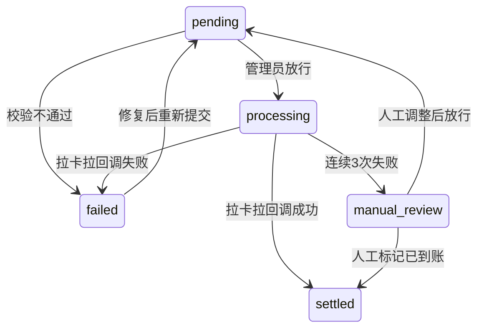

# 头号空间 页面功能详细规格书 v1.0

> **版本**: v1.0  
> **日期**: 2026-05-04  
> **定位**: 本文档为每个后台页面的完整规格说明书，涵盖 UI 布局、交互状态、业务规则、API 字段、异常场景。——"拿到就能直接开发"  
> **当前代码状态**: 已搭建 ~142 页面骨架 + Mock 数据，尚未接入真实 API

---

## 📑 导航指南

| 子系统 | 页面数 | 章节 |
|--------|:------:|------|
| 通用（登录） | 1 | [A](#a-通用页面) |
| **总运营后台** | **~55** | [B](#b-总运营后台-p0级页面规格) |
| **商家管理后台** | **~75** | [C](#c-商家管理后台-p0级页面规格) |
| **代理商系统** | **~12** | [D](#d-代理商系统页面规格) |

---

## 通用规格说明

### 页面状态矩阵（所有页面通用）

每个后台页面必须覆盖以下 5 种视觉状态：

| 状态 | 触发条件 | UI 表现 | 禁用例 |
|:----:|---------|---------|--------|
| **Loading** | 首次加载 / 切换条件 | 骨架屏（n-skeleton 4-6 行）或 n-spin 居中 | 请求完成后 |
| **Normal** | 数据正常返回 | 数据表格 / 图表 / 表单 | — |
| **Empty** | 数据为空（数组长度=0） | 空状态插图（240×120）+ "暂无数据" + CTA | 正在 Loading 时 |
| **Error** | 网络异常 / 服务器错误 | n-alert type="error" + "加载失败，请重试" + 重试按钮 | 正在 Loading 时 |
| **Filter Empty** | 筛选条件无匹配结果 | "没有符合条件的数据" + 清空筛选按钮 | 表格为空状态不是常规 Empty |

### 表格规格标准（所有数据表格页面通用）

| 属性 | 值 |
|------|-----|
| 分页 | 默认 20 条/页，可选 20/50/100；后端分页，前端仅显示页码 |
| 排序 | 点击列头排序，后端排序（传给后端 `sort_field` + `sort_order`） |
| 筛选 | 筛选表单 + URL query 参数同步（刷新保留筛选条件） |
| 导出 | 最多导出 10,000 行，超限提示"请缩小筛选范围" |
| 空行 | 表格行 hover 高亮（浅蓝背景，var(--color-primary-light) 20% 透明度） |
| 行操作 | 最后一列固定为"操作"列，按钮组：查看 / 编辑 / 删除 / 更多 |

### 表单规格标准

| 属性 | 值 |
|------|-----|
| 提交 | 按钮 n-button type="primary" + :loading="submitting" |
| 验证 | 使用 Naive UI n-form-item rule 规则，提交时 validate |
| 创建 | n-modal / n-drawer 作为弹层 |
| 编辑 | 同创建弹层，预填数据 |
| 删除 | n-popconfirm + "确定删除？此操作不可撤销" 红色确认 |
| 关键词搜索 | 300ms 防抖（useDebounce），输入变化自动触发查询 |

### 值枚举色彩规范

| 状态 | 语义色 | n-tag type |
|:----:|:------:|:----------:|
| 已支付 / 进行中 / 在线 | 绿 | `success` |
| 待支付 / 待审核 | 黄 | `warning` |
| 已取消 / 异常 / 离线 | 红 | `error` |
| 已退款 / 已结束 | 灰 | `default` |
| 进行中 | 蓝 | `primary` |

---

## A. 通用页面

### A.1 登录页 `/login`

| 属性 | 值 |
|------|-----|
| **UI 布局** | 居中卡片(最大480px宽)，左侧可选品牌展示区(大屏显示) |
| **Layout** | 独立，无侧边栏/顶栏 |

#### 表单字段

| 字段 | 组件 | 规则 | 说明 |
|------|------|------|------|
| 角色选择 | n-select | 必选，三选一 | 选项: `platform`(总运营)/`shop`(商家)/`agent`(代理商) |
| 用户名/手机号 | n-input | 必填，6-32字符 | placeholder: "请输入用户名或手机号" |
| 密码 | n-input(type=password) | 必填，6-32字符 | 支持显示/隐藏切换 |
| 验证码 | n-input(4字符) + canvas验证码 | 必填，忽略大小写 | 图片验证码本地生成（业务可换后端下发） |
| 记住登录 | n-checkbox | 可选 | localStorage 存储 refreshToken |
| 忘记密码 | n-button(text) | 触发 n-modal | 弹窗: 输入注册手机号 → 短信验证码 → 新密码 |

#### 业务规则

- 同一账号 5 分钟内连续失败 5 次 → 锁定 15 分钟（显示 "账户已锁定，请 15 分钟后重试"）
- 登录成功后跳转至对应角色首页（平台 → `/platform/dashboard`，商家 → `/shop/workbench`，代理 → `/agent/dashboard`）
- Token 有效期：accessToken 2h / refreshToken 7d

#### 交互状态

| 状态 | 表现 |
|:----:|------|
| 登录中 | 提交按钮 loading + 禁用 |
| 登录失败 | n-message error + 验证码刷新 |
| 验证码错误 | 输入框标红 + "验证码错误" + 自动刷新 |
| 网络超时 | n-message "网络连接超时，请检查网络" |

---

## B. 总运营后台（P0 级页面规格）

---

### B.1 大屏看板 `/platform/dashboard`

#### 页面整体布局

```
┌─────────────────────────────────────────────────────────────────┐
│  📊 大屏看板                  [今日] [本月] [本年]   [🔔通知]   │
├─────────────────────────────────────────────────────────────────┤
│ ┌──────┐ ┌──────┐ ┌──────┐ ┌──────┐ ┌──────┐                   │
│ │总GMV  │ │今日营收│ │门店数│ │会员数│ │在线设备│               │
│ │¥128万 │ │¥3.2万│ │  56  │ │1.2万 │ │ 128台 │               │
│ │↑12.3% │ │↓2.1% │ │  +2  │ │↑5.6% │ │  92%  │               │
│ └──────┘ └──────┘ └──────┘ └──────┘ └──────┘                   │
├─────────────────────────────────────────────────────────────────┤
│ ┌─ 营收趋势折线图 (ECharts) ────┐ ┌─ 热门游戏 TOP10 (表格) ──┐  │
│ │                                │ │  #  🎮 游玩次数 总营收   │  │
│ │                                │ │  1  过山车  1,234  ¥49K  │  │
│ │                                │ │  2  恐怖医院   987  ¥35K  │  │
│ │                                │ │  3  ...                    │  │
│ └────────────────────────────────┘ └──────────────────────────┘  │
├─────────────────────────────────────────────────────────────────┤
│ ┌─ 门店营收排行(柱状图) ────┐  ┌─ 支付渠道分布(饼图) ─────┐    │
│ │                            │  │ ⬤ 微信 68%             │    │
│ │                            │  │ ⬤ 支付宝 22%           │    │
│ │                            │  │ ⬤ 现金 8%              │    │
│ │                            │  │ ⬤ 余额 2%              │    │
│ └────────────────────────────┘  └──────────────────────────┘    │
└─────────────────────────────────────────────────────────────────┘
```

#### 顶部 KPI 指标卡（5 个）

| 指标 | API 字段 | 格式化 | 说明 |
|------|---------|--------|------|
| 总 GMV | `total_gmv` | ¥{value} | 全平台累计流水，同环比 arrow + 百分比 |
| 今日营收 | `today_revenue` | ¥{value} | 当日 0-24 点实收金额 |
| 门店数 | `store_count` | {value} | 当前有效门店总数，括号+月增 |
| 注册会员 | `member_count` | {value} | 全平台注册会员总数 |
| 在线设备 | `online_devices` | {value} / 占比% | 当前在线 / 总设备数 |

**变化趋势标识**：环比正增长 ↑ 绿色 | 环比负增长 ↓ 红色 | 持平 → 灰色

#### 图表规格

| 图表 | 类型 | 数据来源 API | Y 轴 | 交互 |
|:----:|:----:|:-----------:|:----:|:----:|
| 营收趋势 | 折线图-line | GET /platform/dashboard/revenue-trend?range={today,month,year} | ¥ | hover 显示 Tooltip + 鼠标滚轮缩放 |
| 门店排行 | 柱状图-bar | GET /platform/dashboard/store-ranking?limit=10 | ¥ | 柱状标签 + 前3名不同色 |
| 支付分布 | 饼图-pie | GET /platform/dashboard/payment-distribution?range=today | % | 显示百分比 + 实际金额 |
| 热门游戏 | 表格 | GET /platform/dashboard/top-games?limit=10 | — | 点击行跳转至游戏详情 |

#### 业务规则

- 顶部时间范围选择器联动所有图表（今日 / 本月 / 本年）
- 数据每 30 秒自动刷新（可手动点击右上角刷新按钮）
- 大屏模式按钮：点击进入全屏无操作栏展示模式（仅看板内容）

#### API 接口

```typescript
// GET /platform/dashboard/revenue-trend?range=today
interface RevenueTrendResponse {
  code: 0;
  data: {
    dates: string[];        // 日期标签 ['04-01','04-02',...]
    revenue: number[];      // 营收数值
    prevRevenue: number[];  // 上期对比
  }
}

// GET /platform/dashboard/top-games?limit=10
interface TopGamesResponse {
  code: 0;
  data: Array<{
    rank: number;
    game_id: string;
    game_name: string;
    play_count: number;
    total_revenue: number;
  }>
}
```

#### 异常场景

| 场景 | 处理 |
|------|------|
| 任一图表 API 失败 | 单独显示重试按钮，不影响其他图表 |
| 全部 API 失败 | 居中 Error 状态卡片 "加载失败" |
| 数据为 0 | 图表显示"暂无数据"占位，趋势线不绘制 |
| WebSocket 连接断开 | 右上角显示"实时数据断开"黄色提示条 |

---

### B.2 数据报表 `/platform/reports`

#### 页面布局

```
┌─────────────────────────────────────────────────────────────┐
│  📊 数据报表                              [📥导出报表]       │
├─────────────────────────────────────────────────────────────┤
│ 时间: [2026-04-01 ~ 2026-04-30] 维度: [全部门店 ▼]         │
├─────────────────────────────────────────────────────────────┤
│ [营收总览] [门店分析] [会员分析] [游戏分析] [平台财务]      │
├─────────────────────────────────────────────────────────────┤
│                                                             │
│  时间 = 日 周 月  指标 = 营收 客流 客单价 消费次数           │
│                                                             │
│  ┌────────────────────────────────────────────────────┐     │
│  │            ECharts 多指标折线/柱状组合图           │     │
│  └────────────────────────────────────────────────────┘     │
│                                                             │
│  ┌─────────────汇总指标──────────────┬──明细数据表─────────┐│
│  │ 总营收  ¥1,280,000 (+12.3%)      │  日期  营收   客流   ││
│  │ 总客流  18,560 人 (+8.1%)        │  04-01  ...    ...   ││
│  │ 客单价  ¥68.96  (-2.1%)          │  04-02  ...    ...   ││
│  └──────────────────────────────────┴─────────────────────┘│
└─────────────────────────────────────────────────────────────┘
```

#### 模块-维度矩阵

| Tab 名称 | 默认维度 | 可选维度 | 可视化类型 |
|:--------:|:--------:|:--------:|:---------:|
| 营收总览 | 营收 | 营收/支付方式分布/时段分布 | 折线图(主) + 饼图(支付) |
| 门店分析 | 营收 | 营收/客流/客单价/设备使用率 | 柱状图(门店排行) + 散点图 |
| 会员分析 | 新注册 | 新增/复购/活跃/留存 | 折线图 + 柱状图(留存) |
| 游戏分析 | 游玩次数 | 次数/时长/营收/好评率 | 柱状图 + 雷达图 |
| 平台财务 | 抽成 | 平台收入/商家结算/代理分润 | 堆叠面积图 |

#### 交互细节

- Tab 切换时 URL hash 同步（`/platform/reports#revenue`），支持分享链接
- 时间选择器范围：今日/昨日/本周/本月/近30天/自定义
- 维度切换时，图表和汇总指标同时刷新
- 鼠标悬停图表：显示精确数值 Tooltip + 对应日期垂直线

#### 导出功能

| 导出格式 | 按钮 | 行为 |
|:--------:|:----:|------|
| PNG | n-button "导出图片" | 使用 html-to-image 截图图表区域 |
| Excel | n-button "导出明细" | 调用 POST /platform/reports/export → 返回 Excel 文件流 |

---

### B.3 店铺列表 `/platform/stores`（核心数据页）

#### 页面布局

```
┌─────────────────────────────────────────────────────────────┐
│  🏪 店铺管理                          [➕新增门店] [状态图]   │
├─────────────────────────────────────────────────────────────┤
│  筛选: [门店名___] [代理商▼] [等级▼] [状态▼] [清空] [▶搜]  │
├─────────────────────────────────────────────────────────────┤
│  汇总: 总56家  营39  停6  审核2  关9                       │
├─────────────────────────────────────────────────────────────┤
│  ┌──────────────────────────────────────────────────────┐   │
│  │ 门店名    代理商   等级   设备数  月营收  状态  操作   │   │
│  │ ────────────────────────────────────────────────────  │   │
│  │ 深圳福田店  张三   旗舰版  12   ¥12.3W  营 ▶  ⋮    │   │
│  │ 上海南京路  李四   专业版  8    ¥8.5W   营 ▶  ⋮    │   │
│  │ 北京三里屯  王五   基础版  5    ¥3.2W   营 ▶  ⋮    │   │
│  │ ...                                                  │   │
│  │                                      [1/3] 20条/页    │   │
│  └──────────────────────────────────────────────────────┘   │
├─────────────────────────────────────────────────────────────┤
│  ➕新增门店 Modal (弹出层)                                   │
│  ┌──────────────────────────────────────────────┐            │
│  │  门店名* _____  联系电话* _____              │            │
│  │  省* [▼]    市* [▼]    区* [▼]               │            │
│  │  详细地址* _____                            │            │
│  │  代理商 [▼]    等级* [基础▼]                 │            │
│  │  营业时间 09:00 [~] 22:00                   │            │
│  │  [取消]  [确定创建]                          │            │
│  └──────────────────────────────────────────────┘            │
└─────────────────────────────────────────────────────────────┘
```

#### 筛选条件

| 字段 | 组件 | 说明 |
|------|------|------|
| 门店名 | n-input | 模糊搜索，300ms 防抖 |
| 代理商 | n-select | 下拉列表，选项来自 GET /platform/agents (id+name) |
| 套餐等级 | n-select | `basic`/`pro`/`premium`/`custom` |
| 状态 | n-select 多选 | `active`/`inactive`/`pending`/`closed` |

#### 表格列

| 列名 | 数据字段 | 对齐 | 格式化 | 可排序 |
|:----:|---------|:----:|--------|:------:|
| 门店名称 | `store_name` | 左 | 最长显示 20 字符，省略号 | ✅ |
| 代理商 | `agent_name` | 左 | — | ✅ |
| 套餐等级 | `plan_level` | 中 | n-tag: 基础(灰)/专业(蓝)/旗舰(紫)/定制(金) | ✅ |
| 设备数 | `device_count` | 中 | 数字 | ✅ |
| 本月营收 | `monthly_revenue` | 右 | `¥{value}` 格式，2 位小数 | ✅ |
| 状态 | `status` | 中 | n-tag: 营业(绿)/暂停(灰)/审核(黄)/关闭(红) | ✅ |
| 操作 | — | 中 | 查看(链接) + 更多(n-dropdown: 编辑/停用/重置Token) | — |

#### 添加门店表单验证规则

```typescript
const addStoreRules = {
  store_name:    [{ required: true, message: '请输入门店名称', trigger: 'blur' },
                  { min: 2, max: 50, message: '2-50个字符' }],
  phone:         [{ required: true, message: '请输入联系电话' },
                  { pattern: /^1[3-9]\d{9}$/, message: '手机号格式不正确' }],
  province:      [{ required: true, message: '请选择省份' }],
  city:          [{ required: true, message: '请选择城市' }],
  district:      [{ required: true, message: '请选择区县' }],
  address:       [{ required: true, message: '请输入详细地址' },
                  { max: 200, message: '不超过200字' }],
  plan_level:    [{ required: true, message: '请选择套餐等级' }],
  open_time:     [{ validator: validateTimeRange, message: '营业时间格式错误' }],
  agent_id:      [{ /* optional */ }]
}
```

#### 业务规则

| 规则 | 说明 |
|------|------|
| 套餐变更 | 升级即时生效，降级次月1日生效（涉及结算费率） |
| 门店停用 | 停用后该门店所有收银系统 Token 立即失效 |
| 删除门店 | 软删除（标记 `deleted_at`），有历史数据的门店不可物理删除 |
| 套餐超限 | 设备数超过套餐上限时显示红色警告图标，但不停服 |

---

### B.4 会员列表 `/platform/members/list`（跨店会员管理）

#### 页面布局

```
┌─────────────────────────────────────────────────────────────┐
│  👥 会员列表                  搜索: [手机号/姓名___]  [🔍]  │
├─────────────────────────────────────────────────────────────┤
│ 汇总: 总会员 1.2万  今日新增 56  本月活跃 8,920             │
├─────────────────────────────────────────────────────────────┤
│  筛选: 门店[▼]  等级[▼]  注册时间[~]  资产>¥[___]  [清空]  │
├─────────────────────────────────────────────────────────────┤
│  ┌──────────────────────────────────────────────────────┐   │
│  │ 手机号   姓名   等级   余额   积分   游戏豆  门店  操作  │   │
│  │ ────────────────────────────────────────────────────  │   │
│  │ 138****8888 张三  金卡  ¥256  1200  3000  深圳店 ▶    │   │
│  │ 139****6666 李四  钻石  ¥3800  5600  15000 上海店 ▶  │   │
│  │ ...                                                  │   │
│  └──────────────────────────────────────────────────────┘   │
├─────────────────────────────────────────────────────────────┤
│  ▶查看详情 Drawer (右侧滑出)                                 │
│  ┌────────────────────────────────────────┐                  │
│  │  会员信息                              │                  │
│  │  手机: 138****8888  姓名: 张三         │                  │
│  │  等级: 金卡  注册: 2026-01-15          │                  │
│  │  ─────────────────────────────          │                  │
│  │  资产: 余额 ¥256  积 1,200  豆 3,000   │                  │
│  │  ─────────────────────────────          │                  │
│  │  ⬇ 资产变更        ⬇ 消费记录         │                  │
│  │  ⬇ 游戏币记录      ⬇ 预存次数         │                  │
│  └────────────────────────────────────────┘                  │
└─────────────────────────────────────────────────────────────┘
```

#### 表格列详细定义

| 列名 | 字段 | 宽度 | 交互 |
|:----:|------|:----:|------|
| 手机号 | `phone` | 140px | 中间 4 位脱敏 `138****8888` |
| 姓名 | `name` | 100px | 完整显示，无数据显示 `--` |
| 等级 | `level` | 80px | n-tag: 普通(灰)/银卡(蓝)/金卡(金)/钻石(紫)/黑金(黑) |
| 余额 | `balance` | 100px | `¥{value}`，¥0 显示灰色 |
| 积分 | `points` | 80px | 纯数字 |
| 游戏豆 | `game_beans` | 90px | 纯数字 |
| 注册门店 | `store_name` | 120px | — |
| 注册时间 | `created_at` | 160px | `YYYY-MM-DD HH:mm` |
| 操作 | — | 80px | n-button "查看" 触发 Drawer |

#### Drawer 标签页（右侧滑出 720px）

| Tab | 内容 | API |
|:---:|------|:---:|
| 基础信息 | 会员详情字段 + 等级徽章 | GET /platform/members/:id |
| 资产变更 | n-data-table: 时间/类型/变动(金额)/余额/操作人 | GET /platform/members/:id/balance-log&page=&size= |
| 消费记录 | n-data-table: 时间/门店/消费项目/金额/支付方式 | GET /platform/members/:id/consumption-log |
| 游戏币记录 | n-data-table: 时间/类型/变动/余额/来源 | GET /platform/members/:id/game-bean-log |
| 预存次数 | n-data-table: 套票名/总次数/已用/剩余/有效期 | GET /platform/members/:id/prepaid-packages |

---

### B.5 订单流水 `/platform/order-flow/:type`（6 种订单统一页面）

#### 路由与映射

| 路由 | 订单类型 | 订单状态 tag |
|:----:|:--------:|:------------:|
| `/platform/order-flow/cashier` | 收银订单 | 已支付/已退款/已撤销 |
| `/platform/order-flow/vod` | 点播系统订单 | 已支付/已退款 |
| `/platform/order-flow/manual` | 手动扣费订单 | 已扣费/已撤销 |
| `/platform/order-flow/balance` | 修改储值订单 | 充值/扣款/退款 |
| `/platform/order-flow/gamebean` | 游戏币兑换订单 | 已兑换/已撤销 |
| `/platform/order-flow/promo` | 活动赠送订单 | 已赠送/已撤销 |

#### 页面布局

```
┌─────────────────────────────────────────────────────────────┐
│  📋 订单流水                              [📥导出Excel]      │
├─────────────────────────────────────────────────────────────┤
│  [全部订单] [已支付] [已退款] [已撤销]    [🔍 订单号___ ▶]  │
├─────────────────────────────────────────────────────────────┤
│  时间: [2026-04-01~2026-04-30]  门店: [全部门店▼]          │
├─────────────────────────────────────────────────────────────┤
│  ┌──────────────────────────────────────────────────────┐   │
│  │ 订单号  时间     门店   金额   支付  状态  关联ID  操作 │   │
│  │ ────────────────────────────────────────────────────  │   │
│  │ THK...  04-30 10:00 深圳店 ¥39  微信  已支付  S0123 ▶  │   │
│  │ THK...  04-30 09:30 上海店 ¥59  支付宝 已支付  S0456 ▶ │   │
│  │ ...                                                  │   │
│  └──────────────────────────────────────────────────────┘   │
├─────────────────────────────────────────────────────────────┤
│  ▶ 订单详情 Drawer                                         │
│  ┌────────────────────────────────────────┐                  │
│  │  订单号: THK20260504123456            │                  │
│  │  状态: ✅ 已支付                        │                  │
│  │  ─────────────────────────             │                  │
│  │  商品: 过山车VR × 1  ¥39.00           │                  │
│  │  优惠: -¥0.00                          │                  │
│  │  实付: ¥39.00                          │                  │
│  │  支付: 微信支付  trx_xxxxx             │                  │
│  │  ─────────────────────────             │                  │
│  │  时间: 2026-05-04 10:00:00             │                  │
│  │  门店: 深圳福田旗舰店                   │                  │
│  │  收银员: 王小丫                         │                  │
│  │  ─────────────────────────             │                  │
│  │  分润: 商家-¥33.15 平台-¥3.90 代理-¥1.95 │                  │
│  └────────────────────────────────────────┘                  │
└─────────────────────────────────────────────────────────────┘
```

#### 筛选规则

| 字段 | 组件 | 说明 |
|:----:|:----:|------|
| 订单状态 | n-radio-group | `all`/`paid`/`refunded`/`cancelled` |
| 订单号 | n-input | 精确匹配，不是模糊搜索 |
| 时间范围 | n-date-picker(datetimerange) | 默认本月 |
| 门店 | n-select | 全部 / 单店 |

#### 分润展示规则（订单详情 Drawer 底部）

- **平台抽成 15%**：`original_amount * 0.15`
- **商家实收**：`actual_amount - platform_fee - agent_commission`
- **代理分润**：已结算显示金额，未结算显示"待结算"
- 无代理的门店不显示代理分润行

---

### B.6 平台财务-营收总览 `/platform/finance`

#### 页面布局

```
┌─────────────────────────────────────────────────────────────┐
│  💰 平台营收总览                          年度: [2026 ▼]    │
├─────────────────────────────────────────────────────────────┤
│ ┌──────┐ ┌──────┐ ┌──────┐ ┌──────┐ ┌──────┐              │
│ │GMV   │ │平台   │ │商家   │ │代理   │ │增值   │            │
│ │¥1,280W│ │净收192W│ │结算   │ │分润   │ │收入   │          │
│ │+12.3%│ │+15.1%│ │1,088W│ │57.6W │ │¥12.8W│              │
│ └──────┘ └──────┘ └──────┘ └──────┘ └──────┘              │
├─────────────────────────────────────────────────────────────┤
│  [最近12个月] [月] [年]               [📥导出]              │
│  ┌──────────────────────────────────────────────────────┐   │
│  │          堆叠面积图: GMV = 商家实收 + 平台净收        │   │
│  │                        + 代理分润 + 增值收入          │   │
│  └──────────────────────────────────────────────────────┘   │
├─────────────────────────────────────────────────────────────┤
│ ┌─ 月流水排行(表格) ──────────────┐ ┌─ 收入构成(饼图) ────┐│
│ │ 门店       月流水   抽成 占比    │ │ ⬤ 硬件销售 50%   ││
│ │ 深圳福田店 ¥12.3W  ¥1.8W 15%   │ │ ⬤ 游戏豆销售 50% ││
│ │ 上海南京路 ¥8.5W  ¥1.3W 15%    │ │ ⬤ 游戏豆差价 15%  ││
│ │ ...                             │ │ ⬤ 增值服务 5%     ││
│ └─────────────────────────────────┘ └─────────────────────┘│
└─────────────────────────────────────────────────────────────┘
```

#### 业务规则

- 堆叠面积图拖拽选择时间段 → 下方表格联动更新
- 年选择器改变 → 所有指标按年重新聚合
- 点击门店排行某行 → 跳转至该门店的商家后台（新标签页）

---

### B.7 阶梯策略配置 `/platform/finance/tier-config`（★超管专有）

#### 页面布局

```
┌─────────────────────────────────────────────────────────────┐
│  📐 阶梯分润策略配置                  当前版本: v2 (生效中) │
├─────────────────────────────────────────────────────────────┤
│  ┌─ 选择代理级别 ──────────────────────────────────────┐    │
│  │  [城市代理] [区域代理] [省级总代]    基础比例: 5%    │    │
│  └──────────────────────────────────────────────────────┘    │
│                                                              │
│  ┌─ 阶梯区间配置(拖拽/输入) ─────────────────────────┐      │
│  │                                                     │      │
│  │  ¥0           → ¥50,000   系数 ×0.8 [  ]           │      │
│  │  ¥50,000      → ¥100,000  系数 ×1.0 [  ]           │      │
│  │  ¥100,000     → ¥200,000  系数 ×1.2 [🔹当前拖动]   │      │
│  │  ¥200,000+               → 系数 ×1.5 [  ]           │      │
│  │  ──────────────────────────────────────              │      │
│  │  [+ 添加区间]  [重置为默认]                         │      │
│  └──────────────────────────────────────────────────────┘      │
│                                                              │
│  ┌─ 模拟计算器 ────────────────────────────────────────┐      │
│  │  输入月采购额: [¥120,000]  [📊计算]                  │      │
│  │  ────────────────────────────────────                 │      │
│  │  结果: 总分润 = ¥7,200（全额按档位×1.2计算）           │      │
│  │  ¥120,000 × 5% × 1.2 = ¥7,200                        │      │
│  └──────────────────────────────────────────────────────┘      │
├─────────────────────────────────────────────────────────────┤
│  [💾 保存为新版本]  版本历史 v1 → v2 → v3 (当前生效)      │
│  提示: 新版本次月1日自动生效                                │
└─────────────────────────────────────────────────────────────┘
```

#### 安全与验证

| 规则 | 说明 |
|:----:|------|
| **权限** | 仅超级管理员可查看/编辑 |
| 版本管理 | 每次保存生成新版本号，旧版本只读存档 |
| 生效时间 | 新版本仅可配置为下月1日生效（当前月不可改）|
| 区间重叠验证 | 后端校验区间不重叠、不遗漏、单调递增 |
| 系数范围 | 系数 0.1 ≤ x ≤ 3.0，超出自动修正 |
| 行数限制 | 最多 8 个阶梯区间 |

---

### B.8 分账管理 `/platform/finance/payouts`

#### 页面布局

```
┌─────────────────────────────────────────────────────────────┐
│  💳 代理商分账管理                         [📊汇总统计]     │
├─────────────────────────────────────────────────────────────┤
│  结算月份: [2026-04 ▼]  状态筛选: [全部 ▼]  [▶搜索]       │
├─────────────────────────────────────────────────────────────┤
│  ┌──────────────────────────────────────────────────────┐   │
│  │ 汇总: 待处理 12  进行中 45  失败 3  已完成 156      │   │
│  └──────────────────────────────────────────────────────┘   │
├─────────────────────────────────────────────────────────────┤
│  ┌──────────────────────────────────────────────────────┐   │
│  │ 状态(圆点) 代理  结算月  应发  实发  时间    操作    │   │
│  │ ────────────────────────────────────────────────────  │   │
│  │ 🔴 待处理  张三  2026-04 ¥7,200 —    —    [📤放行]   │   │
│  │ 🟡 进行中  李四  2026-04 ¥12,000 —    05-02 [查看]   │   │
│  │ 🔴 失败x3  王五  2026-04 ¥3,200 —    05-01 [📤重试]  │   │
│  │ 🟢 已完成  赵六  2026-04 ¥8,500 ¥8,500 04-30 [查看]  │   │
│  └──────────────────────────────────────────────────────┘   │
├─────────────────────────────────────────────────────────────┤
│  🟡 进行中进度 Drawer                                       │
│  ┌────────────────────────────────────────┐                  │
│  │  打款进度: ████████░░ 80%              │                  │
│  │  拉卡拉批次号: 20260501_BATCH_003      │                  │
│  │  ─────────────────────────             │                  │
│  │  总笔数: 36/45                         │                  │
│  │  成功: 36 笔  ¥28,800                  │                  │
│  │  失败: 9 笔   ¥7,200                   │                  │
│  │  失败原因: 账户异常(5) 银行维护(3) 其他(1)│                  │
│  │  ─────────────────────────             │                  │
│  │  [📤批量重试失败]  [📥下载失败清单]     │                  │
│  └────────────────────────────────────────┘                  │
└─────────────────────────────────────────────────────────────┘
```

#### 状态流转



---

### B.9-B.15 其他平台页（简要规格，开发可直接理解）

| 页面 | 路由 | 核心数据 | 关键交互 |
|:----:|:----:|:---------|:---------|
| 游戏库 | `/platform/games` | 游戏名/分类/难度/版本/状态/安装门店数 | 新增 Modal(含封面上传)/状态切换/分发跳转 |
| 内容分发 | `/platform/content` | 游戏/目标(地区/等级/门店)/推送时间/进度 | 多选门店树(dialog)/定时推送/推送记录 |
| 商家管理 | `/platform/merchants` | 商家名/联系人/门店数/套餐/状态 | 类似门店列表，无等级列 |
| 代理商 | `/platform/agents` | 名称/级别/商家数/保证金/分润/状态 | 新增(含保证金)/冻结/保证金调整 |
| 设备总览 | `/platform/device-overview` | 门店/设备编号/型号/状态/最后心跳/当前操作 | 卡片模式/列表模式切换 |
| 告警中心 | `/platform/system/alerts` | 告警类型/级别/内容/时间/处理状态 | 标记已处理/批量处理 |
| 操作日志 | `/platform/system/logs` | 时间/操作人/IP/模块/操作内容/结果 | 详情的 JSON 查看器 |
| 工单系统 | `/platform/support/tickets` | 工单号/类型/优先级/提交人/状态/处理人 | 状态流转/附件上传/处理记录 |
| 版本发布 | `/platform/system` | 版本号/模块/发布内容/状态/发布时间 | 灰度/全量/回滚 |
| 帮助文档 | `/platform/help-center/docs` | 标题/分类/状态/更新时间 | 富文本编辑器(Markdown) |
| 公告管理 | `/platform/notice/announcement` | 标题/范围/状态/发布时间 | 指定角色可见/定时发布 |
| 消息推送 | `/platform/notice/push` | 标题/类型/渠道/发送时间/完成状态 | 模板选择/测试发送/批量推送 |
| 角色权限 | `/platform/users/roles` | 角色名/编码/描述/状态/权限树 | n-tree 权限树勾选/角色克隆 |
| 平台账号 | `/platform/users` | 用户名/角色/最后登录/状态 | 关联角色(下拉) |

---

## C. 商家管理后台（P0 级页面规格）

---

### C.1 工作台 `/shop/workbench`（店长每日必看页面）

#### 页面布局

```
┌─────────────────────────────────────────────────────────────┐
│  📈 今日概况                              2026-05-04 周一   │
├─────────────────────────────────────────────────────────────┤
│ ┌──────────────┬──────────────┬──────────────┬──────────┐   │
│ │ 今日营收      │ 今日客流     │ 今日订单     │ 会员新增  │   │
│ │ ¥3,280.00    │  56 人       │  42 单      │  5 人     │   │
│ │ ↑12.3% vs昨 │  ↓2.1% vs昨  │  ↑8.0% vs昨 │ = vs昨    │   │
│ └──────────────┴──────────────┴──────────────┴──────────┘   │
├─────────────────────────────────────────────────────────────┤
│ ┌─ 快速操作 ─────────────────────────────────────────────┐  │
│ │ [➕快速开单] [👥会员查询]  [📦商品管理] [🔄交接班]    │  │
│ └─────────────────────────────────────────────────────────┘  │
├─────────────────────────────────────────────────────────────┤
│ ┌─ 设备实时状态(核心) ───────────────────────────────┐      │
│ │  ┌──────┐ ┌──────┐ ┌──────┐ ┌──────┐             │      │
│ │  │ #01   │ │ #02   │ │ #03   │ │ #04   │          │      │
│ │  │ 过山车 │ │ 空闲  │ │ 恐怖  │ │ 空闲  │          │      │
│ │  │ ⏱️ 06:23│ │       │ │ ⏱️ 08:12│ │       │          │      │
│ │  │ 🟢运行 │ │ ⚪空闲 │ │ 🟢运行 │ │ ⚪空闲 │          │      │
│ │  └──────┘ └──────┘ └──────┘ └──────┘             │      │
│ │  [查看全部设备 →]                                  │      │
│ └────────────────────────────────────────────────────┘      │
├─────────────────────────────────────────────────────────────┤
│ ┌─ 营收趋势(近7日) ───────┐ ┌─ 热门游戏 TOP5 ──────────┐   │
│ │  (CSS/SVG 柱状图)        │ │  1 🎢 过山车 12次  ¥468  │   │
│ │                          │ │  2 🏥 恐怖医院 8次  ¥232  │   │
│ │                          │ │  3 🏎️ 极速赛 6次   ¥210  │   │
│ │                          │ │  4 🌊 海洋 5次    ¥125  │   │
│ │                          │ │  5 🦕 恐龙 4次    ¥120  │   │
│ └──────────────────────────┘ └──────────────────────────┘   │
├─────────────────────────────────────────────────────────────┤
│  ⏰ 待办: 退款待处理(2)  设备维护(1)  库存预警(0)          │
└─────────────────────────────────────────────────────────────┘
```

#### 设备状态卡片字段

| 字段 | 类型 | 值示例 | 说明 |
|:----:|:----:|:-------|:----:|
| 设备编号 | string | `#01` | 门店内唯一编号 |
| 运行状态 | enum | `running`/`idle`/`fault`/`offline` | 4态 → 对应 UI 背景色 |
| 当前游戏 | string | `过山车VR` | 运行中显示，空闲显示 "空闲" |
| 剩余时间 | string | `06:23` | min:sec 格式，空闲显示 "--:--" |
| 开始时间 | time | `10:12` | 当前游戏开始时间 |

#### 设备状态4色规范

| 状态 | 色值 | 边框 | 圆点图标 |
|:----:|:----:|:----:|:--------:|
| 运行中 | `#E8F5E9` 背景 + `#4CAF50` 圆点 | `#4CAF50` | 🟢 |
| 空闲 | `white` 背景 + `#9E9E9E` 文本 | `#E0E0E0` | ⚪ |
| 故障 | `#FFEBEE` 背景 + `#F44336` 文字 | `#F44336` | 🔴 |
| 离线 | `#ECEFF1` 背景 + `#607D8B` 文字 | `#90A4AE` | ⚫(灰色) |

#### 快速操作按钮映射

| 按钮 | 跳转路由 | 说明 |
|:----:|:---------|:----:|
| 快速开单 | 跳转至外部收银系统 URL | 携带 storeToken query 参数 |
| 会员查询 | `/shop/members` | — |
| 商品管理 | `/shop/products` | — |
| 交接班 | `/shop/shifts` | — |

---

### C.2 会员管理 `/shop/members`

#### 页面布局

```
┌─────────────────────────────────────────────────────────────┐
│  👥 会员管理                [🔍手机号搜索] [➕新增会员]      │
├─────────────────────────────────────────────────────────────┤
│  汇总: 总会员 1,234  今日新增 5  本月活跃 892             │
├─────────────────────────────────────────────────────────────┤
│  筛选: 等级[全部▼]  注册来源[全部▼]  资产≥¥[___]  [清空]  │
├─────────────────────────────────────────────────────────────┤
│  ┌──────────────────────────────────────────────────────┐   │
│  │ 手机号     姓名  等级  余额   积分  豆  消费    操作  │   │
│  │ ────────────────────────────────────────────────────  │   │
│  │ 138****8888 张三  金卡  ¥256  1200  3K  ¥12,800  ▶  │   │
│  │ 139****6666 李四  钻石  ¥3.8K 5600  15K ¥56,000  ▶  │   │
│  │ ...                                                  │   │
│  └──────────────────────────────────────────────────────┘   │
├─────────────────────────────────────────────────────────────┤
│  ➕新增会员 Modal                                           │
│  ┌──────────────────────────────────────────────┐            │
│  │  手机号* _____  姓名* _____  性别 [男/女]    │            │
│  │  生日 [📅]  等级 [普通▼]                     │            │
│  │  [📷拍照/相册上传头像]                       │            │
│  │  [取消]  [保存]                              │            │
│  └──────────────────────────────────────────────┘            │
└─────────────────────────────────────────────────────────────┘
```

#### 业务规则

| 规则 | 说明 |
|:----:|------|
| 会员去重 | 同一手机号在同一门店只能注册一次（跨店可重复） |
| 手机号必填 | 手机号既是登录凭证也是唯一标识 |
| 批量操作 | 支持批量导入（Excel 模板下载）和批量修改等级 |
| 历史保留 | 删除会员需二次确认（"删除后消费记录仍保留"） |

#### 会员等级计算规则

| 等级 | 条件（自动升级） | 权益 |
|:----:|:--------------:|:----:|
| 普通 | 注册即享 | 基础积分 |
| 银卡 | 累计消费 ≥ ¥500 | 9.5 折 |
| 金卡 | 累计消费 ≥ ¥2,000 | 9 折 |
| 钻石 | 累计消费 ≥ ¥5,000 | 8.5 折 |
| 黑金 | 年消费 ≥ ¥20,000 | 8 折，专属客服 |

---

### C.3 商品管理 `/shop/products`

#### 页面布局（两个 Tab）

```
┌─────────────────────────────────────────────────────────────┐
│  📦 商品管理                [➕新增商品] [➕新增虚拟商品]    │
├─────────────────────────────────────────────────────────────┤
│  [📦实体商品] [🎫虚拟商品]                                 │
├─ Tab1: 实体商品 ────────────────────────────────────────────┤
│  筛选: 分类[全部▼]  状态[上架▼]  [🔍搜索___]              │
│  ┌──────────────────────────────────────────────────────┐   │
│  │ 商品名   分类   售价  成本  库存  状态  操作          │   │
│  │ ────────────────────────────────────────────────────  │   │
│  │ 🌮 爆米花  零食  ¥15  ¥8   120  上架  [编辑][下架]   │   │
│  │ 🥤 可乐    饮品  ¥8   ¥4   200  上架  [编辑][下架]   │   │
│  │ ...                                                  │   │
│  │ 库存预警: 爆米花(低)                                 │   │
│  └──────────────────────────────────────────────────────┘   │
├─ Tab2: 虚拟商品 ────────────────────────────────────────────┤
│  类型: [单次消费] [储值套餐] [次数套票] [时长套票]         │
│  ┌──────────────────────────────────────────────────────┐   │
│  │ 名称      类型   售价  利润  状态   售出 操作         │   │
│  │ ────────────────────────────────────────────────────  │   │
│  │ 过山车体验 单次  ¥39  ¥20   上架   256  [编辑][下架]  │   │
│  │ ¥100充值  储值  ¥100 ¥-   上架   89   [编辑][下架]  │   │
│  │ 5次套票   次数  ¥150 ¥75   上架   45   [编辑][下架]  │   │
│  └──────────────────────────────────────────────────────┘   │
└─────────────────────────────────────────────────────────────┘
```

#### 新增商品表单字段

| 字段 | 组件 | 实体商品 | 虚拟商品-单次 | 虚拟商品-储值 | 虚拟商品-次数 |
|:----:|:----:|:--------:|:-------------:|:-------------:|:-------------:|
| 名称 | n-input | ✅ | ✅ | ✅(面额+赠送) | ✅(次+总价) |
| 分类 | n-select | ✅ | — | — | — |
| 售价 | n-input-number | ✅ | ✅ | ✅ | ✅ |
| 成本价 | n-input-number | ✅ | — | — | — |
| 库存 | n-input-number | ✅ | — | — | — |
| 规格/SKU | n-dynamic-tags | ✅(多规格) | — | — | — |
| 条码 | n-input | ✅(扫码枪) | — | — | — |
| 体验时长(min) | n-input-number | — | ✅ | — | — |
| 赠送金额 | n-input-number | — | — | ✅ | — |
| 总次数 | n-input-number | — | — | — | ✅ |
| 有效期(天) | n-input-number | — | — | — | ✅ |

---

### C.4 设备列表与远程控制 `/shop/devices` + `/shop/devices/control`

#### 设备列表页面

```
┌─────────────────────────────────────────────────────────────┐
│  🎮 设备管理              [🔍设备名搜索] [状态筛选▼]       │
├─────────────────────────────────────────────────────────────┤
│  汇总: 共12台  运行6  空闲3  故障2  离线1                  │
├─────────────────────────────────────────────────────────────┤
│  ┌──────┐ ┌──────┐ ┌──────┐ ┌──────┐                       │
│  │ #01  │ │ #02  │ │ #03  │ │ #04  │                       │
│  │ 过山车 │ │ 空闲  │ │ 恐怖  │ │ 空闲  │  (12宫格卡片)     │
│  │ 06:23 │ │      │ │ 08:12 │ │      │                       │
│  │ 🟢运行│ │ ⚪   │ │ 🟢运行│ │ ⚪   │                       │
│  └──────┘ └──────┘ └──────┘ └──────┘                       │
│  [切换列表模式]                                              │
│  ┌──────────────────────────────────────────────────────┐   │
│  │ 编号  型号  位置  状态  当前游戏  时间  连接  操作   │   │
│  │ #01  P4   A区  运行  过山车  06:23  WiFi ▶ [远程]   │   │
│  │ ...                                                  │   │
│  └──────────────────────────────────────────────────────┘   │
└─────────────────────────────────────────────────────────────┘
```

#### 远程控制弹窗

```
┌───────────────────────────────────────┐
│ 🎮 远程控制 - #01 Pico 4              │
├───────────────────────────────────────┤
│  📍 位置: A区  状态: 🟢 运行中         │
│  📊 帧率: 72fps  温度: 42°C            │
│  📶 WiFi: -65dBm  电量: 86%           │
│  ────────────────────────────────────  │
│  操作:                                 │
│  [🔄 重启设备]  [⏹ 结束游戏]          │
│  [🔊 语音喊话_____  ▶发送]           │
│  [📸 远程截图]                        │
│  ────────────────────────────────────  │
│  系统: [查看日志] [导出诊断包]         │
│  ⚠️ 远程操作后需设备确认               │
└───────────────────────────────────────┘
```

#### 业务规则

| 操作 | 安全确认 | 说明 |
|:----:|:--------:|------|
| 重启设备 | ⚠️ 二次确认 | 确认后 MQTT 下发 reboot 指令，设备 30s 内重启 |
| 结束游戏 | ⚠️ 二次确认 | "用户正在游戏中，结束将按已用时长扣费" |
| 语音喊话 | 无 | MQTT 下发语音文件/文字转 TTS，设备喇叭播放 |
| 远程截图 | 无 | MQTT 下发截屏指令，设备返回 base64 截图数据 |

---

### C.5 日报表/历史营收概览

#### 店铺销售日报 `/shop/daily-sales`

| 区块 | 内容 | 数据源 |
|:----:|------|:------:|
| 今日概况 | 营收/客流/订单数/客单价/会员新增 | GET /shop/reports/daily-summary?date= |
| 时段分布 | 24 小时柱状图（高峰标记） | GET /shop/reports/daily-hourly?date= |
| 支付分布 | 饼图：微信/支付宝/现金/余额 | GET /shop/reports/daily-payment?date= |
| 设备运行 | 各设备今日开机时长/游玩次数 | GET /shop/reports/daily-devices?date= |
| 交班汇总 | 本日交班记录（交接时间+金额） | GET /shop/shifts?date= |

#### 历史营收 `/shop/historical-revenue`

| 功能 | 说明 |
|:----:|------|
| 时间维度 | 日/周/月/季/年 切换 |
| 对比模式 | 同比/环比 Toggle |
| 趋势图 | ECharts 双 Y 轴（营收柱状图 + 增长率折线） |
| 筛选 | 按支付方式/时段/节假日 筛选 |
| 导出 | Excel 按日明细导出 |

---

### C.6 结算与对账

#### 结算记录 `/shop/settlement`

```
┌─────────────────────────────────────────────────────────────┐
│  📄 结算记录                                [📥下载PDF]     │
├─────────────────────────────────────────────────────────────┤
│  结算月份: [2026-04 ▼]  状态: [全部 ▼]                     │
├─────────────────────────────────────────────────────────────┤
│  ┌──────────────────────────────────────────────────────┐   │
│  │ 门店: 深圳福田旗舰店                                  │   │
│  │ 结算月份: 2026-04                                    │   │
│  │ ────────────────────────────────────────────────────  │   │
│  │ 本月流水:  ¥52,380.00                               │   │
│  │ 平台抽成:  -¥7,857.00 (15%)                         │   │
│  │ 代理分润:  -¥2,619.00 (5%)                          │   │
│  │ ────────────────────────────────────────────          │   │
│  │ 📌 应结金额:  ¥41,904.00                            │   │
│  │   其中: 微信(¥28,090)/支付宝(¥12,814)/现金(¥3,000)   │   │
│  │ ────────────────────────────────────────────────────  │   │
│  │ 状态: ✅ 已打款  打款日期: 2026-05-02                   │   │
│  │      或  ⏳ 待结算 / 🔴 异常(原因)                   │   │
│  └──────────────────────────────────────────────────────┘   │
├─────────────────────────────────────────────────────────────┤
│  明细数据表: 结算期内的订单明细（可分页查看）              │
└─────────────────────────────────────────────────────────────┘
```

#### 对账中心 `/shop/reconciliation`

| 区块 | 内容 | 说明 |
|:----:|------|:----:|
| 本店摘要 | 平台应收 vs 实付差异 | 三联数据汇总 |
| 订单维表 | 门店订单 / 平台统计 / 支付渠道 | 三方数据并列对比 |
| 差异高亮 | 金额不一致的行红色标记 | 逐行 + 总计差异 |
| 调账操作 | 发起调账申请 → 平台审批 | 限制每月3次 |

---

### C.7 其他商家关键页面

| 页面 | 路由 | 功能要点 |
|:----:|:----:|:---------|
| 充值套餐 | `/shop/recharge` | 固定面额档(50/100/200/500) + 赠送金额设置 |
| 优惠券 | `/shop/coupons` | 5种券型(满减/折扣/新客/节庆/储值) + 发放条件 |
| 促销 | `/shop/promotions` | 限时折扣/满减活动/第N件半价 配置 |
| 交接班 | `/shop/shifts` | 交班人/接班人/本班营收/现金盘点/交接记录 |
| 收银终端 | `/shop/cashier-terminal` | Token 查看/复制/重新生成/操作日志 |
| 收银设置 | `/shop/cashier-settings` | 支付渠道配置(微信/支付宝服务商) |
| 小票设置 | `/shop/cashier-receipt` | 小票模板/打印尺寸/自动打印+打印测试 |
| 游戏币设置 | `/shop/points-settings` | 游戏币名称/兑换比例/赠送规则 |
| 短信服务 | `/shop/sms` | 短信余额/发送记录/模板管理 |
| 员工管理 | `/shop/users` | 本店员工CURD + 角色分配(收银/员工) |
| 点播设置 | `/shop/on-demand-settings` | 点播费率/结算比例/内容源配置 |

---

## D. 代理商系统页面规格

### D.1 首页概览 `/agent/dashboard`

```
┌─────────────────────────────────────────────────────────────┐
│  📊 首页概览                              🎯 本月目标: 65% │
├─────────────────────────────────────────────────────────────┤
│ ┌──────┐ ┌──────┐ ┌──────┐ ┌──────┐                      │
│ │辖下   │ │本月   │ │本年   │ │本月新增│                    │
│ │门店数 │ │充值额 │ │分润   │ │商家   │                    │
│ │  12   │ │¥28.5W│ │¥12.8W│ │  2   │                    │
│ └──────┘ └──────┘ └──────┘ └──────┘                      │
├─────────────────────────────────────────────────────────────┤
│  近6月充值趋势(柱状图)      ┌─ 商家排行(表格) ────────────┐│
│  │   ██                     │ # 商家        充值   分润    ││
│  │ ████████                 │ 1 深圳福田店 ¥12.3W ¥6,150  ││
│  │ ██████████████           │ 2 上海南京路 ¥8.5W ¥4,250   ││
│  └─────────────────────────  │ 3 北京三里屯 ¥6.2W ¥3,100  ││
│                              └─────────────────────────────┘│
└─────────────────────────────────────────────────────────────┘
```

#### 指标卡定义

| 指标 | 数据来源 | 精度 |
|:----:|:--------:|:----:|
| 门店数 | GET /agent/stats | 整数，含本月新增(括号) |
| 本月充值额 | GET /agent/stats?month=current | ¥K 精确到百 |
| 本年分润 | GET /agent/stats?year=current | ¥K 精确到百 |
| 新增商家 | GET /agent/stats?month=current | 整数 |

---

### D.2 分润明细 `/agent/commission`

#### 页面布局

```
┌─────────────────────────────────────────────────────────────┐
│  💰 分润明细                             [📥导出Excel]      │
├─────────────────────────────────────────────────────────────┤
│  月份: [2026-04 ▼]  状态: [全部 ▼]                         │
├─────────────────────────────────────────────────────────────┤
│  ┌─ 分润策略面板(只读) ────────────────────────────────┐   │
│  │  当前级别: 城市代理  基础比例: 5%                    │   │
│  │  阶梯: ¥0-5万×0.8  ¥5-10万×1.0  ¥10-20万×1.2  ≥20万×1.5 │   │
│  └──────────────────────────────────────────────────────┘   │
├─────────────────────────────────────────────────────────────┤
│  ┌──────────────────────────────────────────────────────┐   │
│  │ 门店       采购额     比例  系数  分润   状态  结算月  │   │
│  │ ────────────────────────────────────────────────────  │   │
│  │ 深圳福田店 ¥120,000  5%    ×1.2  ¥7,200 ✅已结 2026-04│
│  │ 上海南京路 ¥85,000   5%    ×1.0  ¥3,400 ✅已结 2026-04│
│  │ 北京三里屯 ¥45,000   5%    ×0.8  ¥1,800 ⏳待结 2026-04│
│  └──────────────────────────────────────────────────────┘   │
└─────────────────────────────────────────────────────────────┘
```

---

### D.3-D.12 其他代理页面

| 页面 | 路由 | 核心表格字段 | 关键操作 |
|:----:|:----:|:------------|:---------|
| 商家管理 | `/agent/merchants` | 商家名/门店数/充值额/分润/状态 | 点击查看详情 |
| 店铺概览 | `/agent/stores` | 门店名/地址/设备数/状态/营收 | 点击跳转商家后台 |
| 设备统计 | `/agent/stores/devices` | 门店/总设备/在线/空闲/故障(数字卡片+饼图) | 仅查看 |
| 结算记录 | `/agent/settlement` | 月份/应结/实结/扣税/打款日/状态 | 查看明细 |
| 提现账户 | `/agent/bank-account` | 银行/支行/账号/持卡人 | 编辑(冷却期10min+短信验证) |
| 营收统计 | `/agent/reports/revenue` | 近12月折线图 + 支付分布饼图 | 导出报表 |
| 会员统计 | `/agent/reports/members` | 辖下总会员/增长曲线/等级分布 | 仅查看 |
| 账户信息 | `/agent/account` | 公司名/联系人/手机/邮箱/地址 | 编辑 |
| 安全设置 | `/agent/account/security` | 登录密码/手机号/设备管理 | 修改密码需原密码验证 |
| 消息中心 | `/agent/message` | 系统通知/公告/已读未读 | 标记已读 |

---

## E. API 响应格式与错误码总规

### E.1 统一响应结构

```typescript
// 成功
interface ApiSuccess<T> {
  code: 0;
  message: "success";
  data: T;
  timestamp: number;  // 毫秒时间戳
}

// 错误
interface ApiError {
  code: number;       // 业务错误码，>0
  message: string;    // 人类可读错误描述
  data: null;
  timestamp: number;
  trace_id: string;   // 日志追踪ID，用于排查
  path?: string;      // 请求路径（仅debug模式）
}

// 分页
interface PaginatedData<T> {
  list: T[];
  pagination: {
    page: number;
    size: number;
    total: number;
    total_pages: number;  // = Math.ceil(total / size)
  };
}
```

### E.2 业务错误码一览

| code | message | HTTP状态码 | 前端处理 |
|:----:|---------|:----------:|---------|
| 0 | success | 200 | ✅ |
| 40000 | 参数校验失败 | 400 | 显示表单字段错误 |
| 40001 | 资源不存在 | 404 | 跳转404或显示"数据不存在" |
| 40002 | 资源已存在 | 409 | 提示"已存在不可重复创建" |
| 40003 | 操作冲突 | 409 | 提示"请刷新后重试" |
| 40100 | Token过期 | 401 | 自动刷新Token/跳转登录 |
| 40101 | 无权限 | 403 | 显示"无权访问" |
| 40102 | 密码错误 | 401 | 显示"账号或密码错误" |
| 40103 | 登录失败超限 | 429 | "账户已锁定，请15分钟后重试" |
| 40200 | 余额不足 | 402 | 显示"余额不足，请充值" |
| 40201 | 游戏次数不足 | 402 | "剩余次数不足" |
| 50000 | 服务器内部错误 | 500 | "系统繁忙，请稍后重试" |
| 50001 | 第三方服务异常 | 502 | "支付服务异常，请稍后重试" |
| 50002 | 数据库超时 | 504 | "查询超时，请缩小筛选范围" |

---

> **本文档版本**: v1.0  
> **覆盖页面**: ~142 个后台页面中，本文对 P0 核心页面做了完整 UI 规格 + 业务规则 + API 接口 + 异常场景的四维定义  
> **P0 页面判定标准**: 每日必用 / 影响核心业务流程 / 涉及资金结算  
> **已覆盖 P0 页面**: 登录页、大屏看板、数据报表、店铺列表、会员管理、订单流水(6类)、平台财务(营收/阶梯/分账)、商家工作台、商家会员、商品管理、设备控制、日报/营收、结算/对账、代理概览、分润明细、提现账户
