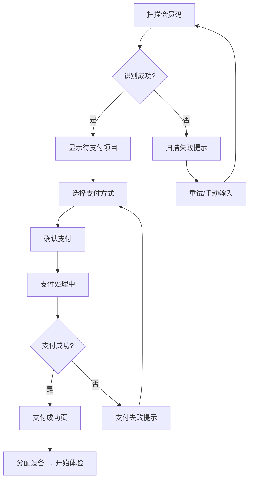

# 扫码支付 — 移动端界面设计

## 界面预览

### ① 待支付

```
┌──────────────────────────────┐
│          9:41                │
│  ┌──────────────────────┐    │
│  │                      │    │
│  │    [✓] 扫到会员码     │    │
│  │    会员：张小明       │    │
│  │    金卡 · 余额 ¥256   │    │
│  │                      │    │
│  └──────────────────────┘    │
│                              │
│  ┌──────────────────────┐    │
│  │  待支付项目            │    │
│  │                      │    │
│  │  🎢 过山车VR         │    │
│  │  时长：10分钟        │    │
│  │               ¥38.00 │    │
│  │                      │    │
│  │  ────────────────   │    │
│  │                      │    │
│  │  合计          ¥38.00 │    │
│  │  会员价(95折)  ¥36.10 │    │
│  └──────────────────────┘    │
│                              │
│  ┌──────────────────────┐    │
│  │  选择支付方式          │    │
│  │   ○ 余额支付 ¥256.00  │    │
│  │   ○ 微信支付          │    │
│  │   ○ 支付宝            │    │
│  │   ○ 现金              │    │
│  └──────────────────────┘    │
│                              │
│  ┌──────────────────────┐    │
│  │    确认支付 ¥36.10   │    │
│  └──────────────────────┘    │
│                              │
└──────────────────────────────┘
```

---

### ② 支付中

```
┌──────────────────────────────┐
│          9:41                │
│                              │
│          ◌ ◌ ◌              │
│        ◌   ●   ◌            │
│          ◌ ◌ ◌              │
│                              │
│       支付处理中...           │
│                              │
│   请稍候，正在请求支付网关     │
│                              │
│         ─── ───              │
│                              │
│          ¥36.10              │
│      过山车VR · 余额支付     │
│                              │
└──────────────────────────────┘
```

---

### ③ 支付成功

```
┌──────────────────────────────┐
│          9:41                │
│                              │
│          ┌─────┐             │
│          │  ✓  │             │
│          └─────┘             │
│                              │
│       支付成功 🎉             │
│                              │
│   ──────────────────────    │
│                              │
│   游戏：过山车VR              │
│   时长：10分钟               │
│   金额：¥36.10               │
│   支付方式：余额支付          │
│   余额：¥219.90              │
│                              │
│   ──────────────────────    │
│                              │
│     请佩戴 #03 头盔开始体验    │
│                              │
│  ┌──────────────────────┐    │
│  │    返回收银台        │    │
│  └──────────────────────┘    │
│                              │
└──────────────────────────────┘
```

---

### ④ 扫描会员码失败

```
┌──────────────────────────────┐
│          9:41                │
│                              │
│          ┌─────┐             │
│          │  ✕  │             │
│          └─────┘             │
│                              │
│      扫描失败                 │
│                              │
│    未能识别付款二维码          │
│    ─────────────             │
│    可能原因：                 │
│    • 二维码已过期             │
│    • 二维码格式不正确         │
│    • 摄像头未对准二维码        │
│                              │
│      ┌─────────────┐         │
│      │  重新扫描   │         │
│      └─────────────┘         │
│                              │
│      ┌─────────────┐         │
│      │ 手动输入会员号│        │
│      └─────────────┘         │
│                              │
└──────────────────────────────┘
```

---

## 支付流程说明



## 交互状态表

| 状态 | 核心元素 | 按钮文案 | 备注 |
|------|---------|---------|------|
| **待支付** | 会员信息卡 + 商品明细 + 支付方式选择 | `确认支付 ¥36.10` | 默认选中余额支付 |
| **支付中** | 加载动画 + 金额显示 | - | 不可操作，约 1-3 秒 |
| **支付成功** | 成功图标 + 订单摘要 + 设备引导 | `返回收银台` | 显示剩余余额 |
| **扫码失败** | 失败图标 + 原因说明 | `重新扫描` / `手动输入会员号` | 两种应急方案 |
