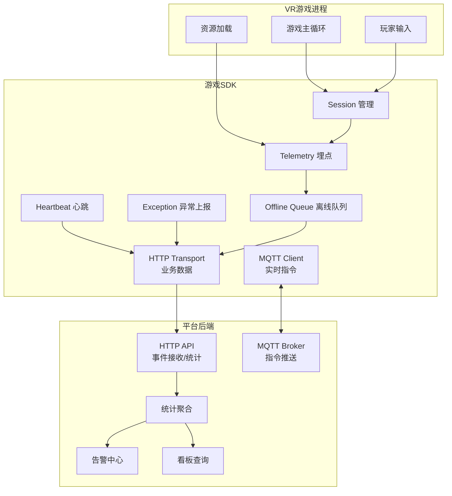
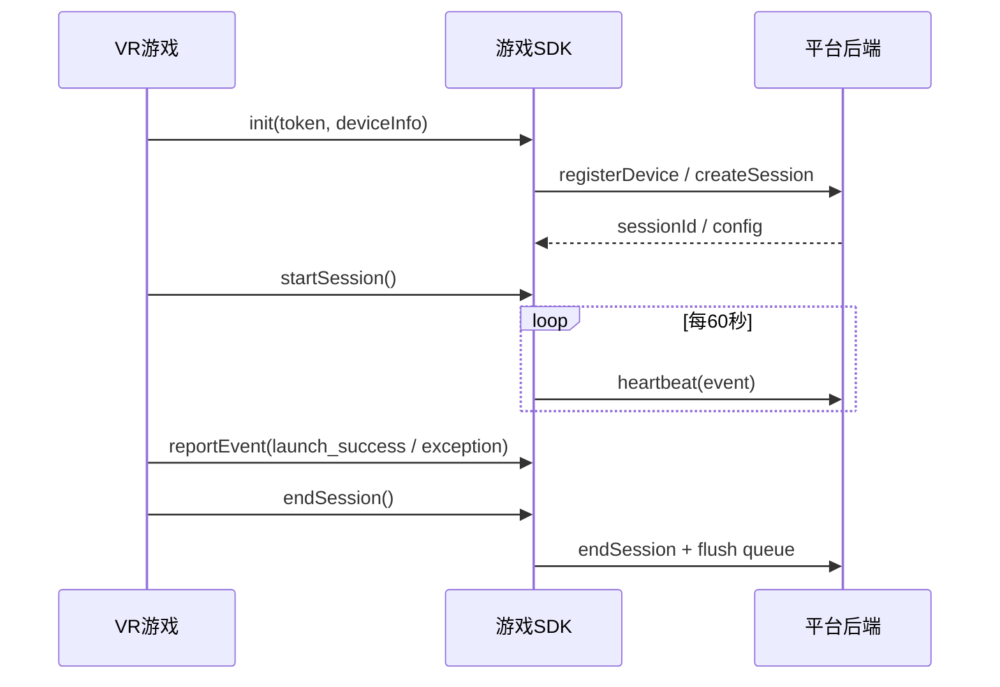

# 头号空间 - 游戏SDK开发文档

> **版本**: v1.1  
> **日期**: 2026-06-14  
> **状态**: 已对齐 PRD 完整版 v1.3 / 可进入研发拆解  
> **适用范围**: VR头显终端、游戏CP接入包、门店PC终端、商家后台、平台运营后台  
> **参考来源**: [PRD-完整版.html](./PRD-完整版.html)

---

## 目录

1. [文档目标](#1-文档目标)
2. [SDK定位与边界](#2-sdk定位与边界)
3. [整体架构](#3-整体架构)
4. [核心能力清单](#4-核心能力清单)
   - [4.1 会话管理](#41-会话管理)
   - [4.2 启动与加载](#42-启动与加载)
   - [4.3 心跳与设备健康](#43-心跳与设备健康)
   - [4.4 异常上报](#44-异常上报)
   - [4.5 统计埋点](#45-统计埋点)
   - [4.6 离线缓存](#46-离线缓存)
   - [4.7 游戏豆自动退还](#47-游戏豆自动退还)
   - [4.8 安全通信](#48-安全通信)
   - [4.9 多人 Session 规则](#49-多人-session-规则)
   - [4.10 时长限制与自动结束](#410-时长限制与自动结束)
   - [4.11 启动超时配置](#411-启动超时配置)
5. [事件与统计体系](#5-事件与统计体系)
6. [异常体系与告警规则](#6-异常体系与告警规则)
7. [接口设计](#7-接口设计)
8. [数据模型与落库建议](#8-数据模型与落库建议)
9. [运行时流程](#9-运行时流程)
10. [离线与重试机制](#10-离线与重试机制)
11. [版本、兼容与配置](#11-版本兼容与配置)
12. [接入流程](#12-接入流程)
13. [测试与验收](#13-测试与验收)
14. [实施建议](#14-实施建议)
15. [附录：术语与异常码](#15-附录术语与异常码)

---

## 1. 文档目标

本文件定义“游戏SDK”的产品边界、技术职责、接口形态、统计口径、异常分类和落地方式，目标是让技术团队可以直接按照本说明拆分开发任务。

SDK 面向的是 VR 游戏 CP，属于跨平台中间件，不承载游戏业务本体，但需要稳定完成以下事情：

- 游戏启动与关闭的会话管理
- 设备注册、心跳保活、状态同步
- 启动次数、启动成功/失败、游玩时长等统计
- 崩溃、卡死、断网、过热、传感器异常等异常上报
- 离线缓存和恢复补传
- 与平台/门店侧统一的数据上报协议

---

## 2. SDK定位与边界

### 2.1 定位

SDK 是连接“VR游戏进程”与“平台后端”的标准化中间层。

它的角色不是游戏引擎，也不是运营后台，而是：

- 向上为 CP 提供最小接入成本
- 向下为平台提供统一、可统计、可追踪的数据入口
- 向外为 VR 终端提供稳定的运行时控制能力

### 2.2 不负责的内容

SDK 不应该做以下事情：

- 不做游戏玩法逻辑
- 不做游戏内 UI 设计
- 不展示计费/时间信息（VR内零UI，仅Logo+文字提示，计费和时间由PC终端展示）
- 不做门店收银和支付
- 不做平台分润和结算计算
- 不做游戏资源审核
- 不替代引擎加载器、渲染器、资源管理器

### 2.3 设计原则

1. **无侵入**: CP 只在游戏入口和出口接少量调用
2. **强一致**: 关键事件可追踪、可重放、可幂等
3. **离线优先**: 网络异常时不丢关键数据
4. **统计可用**: 所有核心统计都能由事件汇总得出
5. **沉浸优先**: VR端不展示多余统计信息，避免打断体验

---

## 3. 整体架构

### 3.1 模块图

SDK 采用双通道通信架构：**MQTT** 承载实时设备指令（低延迟），**HTTP** 承载业务数据上报。



### 3.2 数据流



---

## 4. 核心能力清单

> **参考：VR终端 ↔ PC终端 / SDK 协作矩阵（PRD 4.4.4）**
> 
> SDK 在以下事件中承担职责：游戏加载、计时扣费（后台无感知）、时间到自动结束、提前结束通知、头盔摘下检测（P-Sensor）、游戏崩溃处理、设备心跳上报。选游戏、支付、分配设备、结算评价、系统设置等由 PC 终端负责，VR 终端负责游戏画面渲染和异常提示展示。

### 4.1 会话管理

会话是统计和计费的最小业务单元。一次 Session 代表一次完整游玩过程。

建议支持：

- 创建 Session
- 开始 Session
- 暂停 Session
- 恢复 Session
- 结束 Session
- 强制结束 Session
- 查询 Session 状态

### 4.2 启动与加载

SDK 必须覆盖游戏启动链路中的关键节点：

- 启动请求
- 资源准备
- 首帧渲染
- 启动成功
- 启动失败
- 启动超时

### 4.3 心跳与设备健康

建议心跳周期为 60 秒，和项目文档一致。

心跳中建议包含：

- 当前设备状态
- 当前 Session 状态
- 当前网络状态
- 当前资源占用
- 温度、帧率、异常计数

### 4.4 异常上报

异常上报必须结构化，而不是简单字符串。

SDK 至少要能识别：

- 游戏崩溃
- 启动失败
- 加载超时
- 资源损坏
- 卡死
- 断网
- 过热
- 传感器异常
- 设备掉线
- SDK 内部错误

### 4.5 统计埋点

SDK 应当支持基础统计埋点和业务统计埋点两类：

- 基础统计: 启动次数、成功率、崩溃率、平均时长
- 业务统计: Session 数、有效游玩数、暂停次数、重试次数、补传次数

### 4.6 离线缓存

网络不可用时，SDK 仍然要：

- 缓存关键事件
- 保留事件顺序
- 支持恢复后批量补发
- 支持幂等去重

### 4.7 游戏豆自动退还

SDK 只负责输出“是否应触发退还”的事实信号，不直接执行钱包或账务操作。详细的游戏豆扣费、冲正、退还金额计算和审批口径，单独定义在：

- [游戏豆计费与自动退还规则.md](/Users/andy/Downloads/baidu/codebuddy/VRtouhaokongjian/docs/游戏豆计费与自动退还规则.md)

SDK 侧需要提供的最小能力是：

- 上报启动失败、首帧超时、资源加载失败等事件
- 标记当前 Session 是否进入首帧
- 发送 `bean_refund` 事件作为退还触发信号
- 携带 `origin_event_id`、`session_id`、`order_id` 等幂等字段
- 让平台后端完成真正的冲正、退还和账务落库

### 4.8 安全通信

SDK 所有网络通信必须满足以下安全规格（对齐 PRD 4.5）：

- **传输加密**：TLS 1.3
- **请求签名**：HMAC-SHA256 签名，防篡改和重放
- **设备注册**：绑定硬件 SNR（序列号），防止设备伪造
- **MQTT 通道**：设备指令使用 TLS 加密的 MQTT 连接
- **HTTP 通道**：业务数据使用 HTTPS + HMAC 签名

### 4.9 多人 Session 规则

当游戏支持多人同时游玩时（对齐 PRD 4.3.7）：

- **设备分配**：系统自动分配 N 台空闲 VR 设备，显示设备编号和位置指引
- **就绪等待**：所有参与者佩戴就绪后统一进入游戏；超时未就绪的设备可跳过
- **独立 Session**：各参与者拥有独立 Session，一人退出不影响其他人继续游戏
- **游戏豆消耗**：总消耗 = 单人游戏豆消耗 × 参与人数
- **SDK 职责**：每个设备上的 SDK 独立管理各自 Session，无需感知多人逻辑

### 4.10 时长限制与自动结束

对于开启时长限制的游戏（对齐 PRD 4.3.7）：

- **监控**：SDK 在 Playing 状态持续计时
- **倒计时提醒**：剩余 1 分钟时发出事件通知 → PC 终端显示视觉提醒 → 最后 10 秒数字倒数
- **超时处理**：计时归零 → 后端自动终止 Session → VR 退出 → PC 跳转结算
- **提前结束**：PC 终端发起 `force_end` 指令 → SDK 结束 Session → 按实际游玩时长结算

### 4.11 启动超时配置

启动超时阈值建议通过平台动态配置下发（对齐 PRD Launcher 拉起协议）：

| 配置项 | 默认值 | 说明 |
|------|------|------|
| `launch_timeout_ms` | 3000 | 游戏进程启动超时（ms） |
| `first_frame_timeout_ms` | 10000 | 首帧渲染超时（ms） |
| `load_asset_timeout_ms` | 15000 | 资源加载超时（ms） |

超过阈值触发对应异常码（LAUNCH_TIMEOUT / FIRST_FRAME_TIMEOUT / ASSET_LOAD_FAILED），并在条件满足时触发自动退还。

---

## 5. 事件与统计体系

### 5.1 事件总表

建议所有事件统一使用一个标准结构。

| 事件类型 | 说明 | 统计用途 |
|------|------|------|
| `sdk_init` | SDK 初始化完成 | 初始化成功率 |
| `device_register` | 设备注册成功 | 设备接入统计 |
| `session_create` | 创建会话 | 会话基数 |
| `session_start` | 会话开始 | 体验次数 |
| `launch_request` | 请求启动游戏 | 启动次数 |
| `launch_success` | 启动成功 | 启动成功率 |
| `launch_failed` | 启动失败 | 启动失败率 |
| `first_frame` | 首帧渲染完成 | 启动耗时 |
| `bean_refund` | 游戏豆自动退还/冲正 | 启动失败冲正统计 |
| `heartbeat` | 心跳包 | 在线率、健康度 |
| `session_pause` | 暂停 | 摘盔分析 |
| `session_resume` | 恢复 | 恢复率 |
| `session_end` | 正常结束 | 游玩时长 |
| `session_force_end` | 强制结束 | 异常结束率 |
| `game_exception` | 游戏异常 | 异常统计 |
| `sdk_exception` | SDK异常 | SDK稳定性 |
| `offline_queue_flush` | 离线队列补传 | 离线补传率 |

### 5.2 事件标准字段

建议统一事件协议为：

```json
{
  "event_id": "evt_01HZ...",
  "event_type": "game_exception",
  "event_version": "1.0",
  "timestamp": 1717480000,
  "sdk_version": "1.0.0",
  "game_id": "G10086",
  "cp_id": "CP001",
  "store_id": "ST001",
  "device_id": "DEV009",
  "session_id": "S202606040001",
  "order_id": "O202606040001",
  "scene": "launching",
  "severity": "error",
  "message": "游戏启动超时",
  "payload": {
    "launch_elapsed_ms": 3278,
    "memory_usage_mb": 1820
  }
}
```

### 5.3 启动统计口径

建议至少支持以下统计指标：

| 指标 | 定义 |
|------|------|
| 启动次数 | `launch_request` 事件数 |
| 启动成功次数 | `launch_success` 事件数 |
| 启动失败次数 | `launch_failed` 事件数 |
| 启动成功率 | 成功次数 / 启动次数 |
| 平均启动耗时 | `launch_request` 到 `first_frame` 的平均差值 |
| 超时率 | 启动超时次数 / 启动次数 |
| 黑屏率 | 启动后未进入首帧的失败占比 |
| 自动退还率 | `bean_refund` / 触发退还的启动失败数 |

### 5.4 退还统计口径

| 指标 | 定义 |
|------|------|
| 退还次数 | `bean_refund` 事件数 |
| 退还游戏豆 | 所有 `refund_bean_amount` 之和 |
| 退还成功率 | 退还成功次数 / 触发退还次数 |
| 退还时延 | 启动失败到退还完成的耗时 |
| 净消耗游戏豆 | 扣除游戏豆总量 - 退还游戏豆总量 |

### 5.5 Session统计口径

> **有效体验判定条件（对齐 PRD 10.9.2）**：计入 CP 收益的 Session 必须同时满足以下全部条件：
> 1. 订单支付成功
> 2. 游戏会话进入有效体验状态（到达首帧）
> 3. 游戏已绑定 CP 和单次成本价
> 4. 未触发自动退还或无效体验冲正
> 
> 不计入的情况：游戏未启动成功、未进入首帧、自动退还游戏豆、全额退款、财务人工判定为无效体验。

| 指标 | 定义 |
|------|------|
| Session 总数 | 所有创建的会话 |
| 有效 Session 数 | 满足上述全部判定条件的会话数（等价于「有效体验次数」） |
| 平均游玩时长 | 所有有效 Session 时长均值 |
| 暂停次数 | `session_pause` 数 |
| 恢复次数 | `session_resume` 数 |
| 自动结束次数 | 因超时自动结束 |
| 强制结束次数 | 因崩溃、掉线、过热等异常终止 |

### 5.6 设备健康统计口径

| 指标 | 定义 |
|------|------|
| 心跳成功率 | 心跳成功数 / 应发送心跳数 |
| 心跳缺失次数 | 超过 2 个周期未收到心跳 |
| 平均 CPU | 心跳采样 CPU 平均值 |
| 平均内存 | 心跳采样内存平均值 |
| 最大温度 | 统计周期内温度峰值 |
| 平均 FPS | 统计周期内帧率均值 |

---

## 6. 异常体系与告警规则

### 6.1 异常分级

建议采用四级：

| 级别 | 含义 | 是否影响会话 |
|------|------|------|
| `info` | 记录性事件 | 否 |
| `warning` | 轻度异常，可恢复 | 可能 |
| `error` | 需要关注，建议告警 | 是 |
| `critical` | 立即中断或人工介入 | 是 |

### 6.2 异常分类

#### 6.2.1 启动类异常

- `INIT_FAILED`
- `LAUNCH_TIMEOUT`
- `LAUNCH_FAILED`
- `FIRST_FRAME_TIMEOUT`
- `ASSET_LOAD_FAILED`

#### 6.2.2 运行类异常

- `CRASH`
- `HANG`
- `FPS_TOO_LOW`
- `MAIN_LOOP_BLOCKED`
- `MEMORY_LEAK_SUSPECTED`

#### 6.2.3 设备类异常

- `HEADSET_DISCONNECTED`
- `CONTROLLER_LOST`
- `SENSOR_ABNORMAL`
- `GPU_OVERHEAT`
- `SYSTEM_RESOURCE_LOW`

#### 6.2.4 网络类异常

- `NETWORK_DOWN`
- `HEARTBEAT_MISSED`
- `UPLOAD_FAILED`
- `QUEUE_RETRY_EXHAUSTED`

#### 6.2.5 业务类异常

- `USER_LEFT_SESSION`
- `AUTO_PAUSE_TIMEOUT`
- `FORCE_END_BY_ADMIN`
- `SESSION_RECOVERY_FAILED`

### 6.3 异常上报字段

```json
{
  "event_type": "game_exception",
  "exception_code": "LAUNCH_TIMEOUT",
  "severity": "error",
  "scene": "launching",
  "affect_billing": true,
  "affect_session": true,
  "should_refund_beans": true,
  "refund_scope": "full",
  "show_vr_error_screen": true,
  "notify_pc_terminal": true,
  "notify_backend_alarm": true,
  "message": "游戏启动超时",
  "detail": {
    "timeout_ms": 3000,
    "elapsed_ms": 3278
  }
}
```

### 6.4 告警规则建议

| 触发条件 | 处理动作 |
|------|------|
| 单次启动失败 | 记日志，不强告警 |
| 同一设备 10 分钟内启动失败 >= 3 次 | 告警 |
| 同一游戏 1 小时崩溃率 > 5% | 告警 |
| 心跳缺失 >= 3 个周期 | 告警 |
| 设备温度持续超阈值 2 分钟 | 告警并建议下线 |
| 离线队列堆积超过阈值 | 告警 |

---

## 7. 接口设计

### 7.1 SDK 对外接口

建议以 Unity C# 包为主，底层可由 C++ Core 实现。

```ts
init(options)
bindDevice(deviceToken)
createSession(input)
startSession(sessionId)
pauseSession(sessionId, reason)
resumeSession(sessionId)
reportEvent(event)
reportException(exception)
reportHeartbeat(payload)
endSession(sessionId, result)
flush()
shutdown()
```

### 7.2 初始化参数

| 参数 | 类型 | 必填 | 说明 |
|------|------|------|------|
| `deviceToken` | string | 是 | 平台下发的设备令牌 |
| `gameId` | string | 是 | 游戏唯一标识 |
| `cpId` | string | 是 | CP标识 |
| `storeId` | string | 是 | 门店标识 |
| `deviceId` | string | 是 | 终端设备标识 |
| `sdkVersion` | string | 否 | SDK版本 |
| `platform` | string | 否 | Pico / Meta / Windows 等 |
| `debug` | boolean | 否 | 是否开启调试日志 |
| `costPrice` | number | 否 | CP设定的单次成本价（¥），用于后端结算：`CP收益 = 有效体验次数 × costPrice` |

### 7.3 会话创建参数

```json
{
  "game_id": "G10086",
  "session_type": "normal",
  "member_id": "M001",
  "order_id": "O202606040001",
  "price_plan": {
    "mode": "time",
    "unit": "second",
    "base_price": 2,
    "cost_price": 2.00
  }
}
```

### 7.4 会话结束结果

```json
{
  "session_id": "S202606040001",
  "end_reason": "normal_end",
  "duration_sec": 1280,
  "billable_sec": 1220,
  "paused_sec": 60,
  "exception_code": null
}
```

### 7.5 事件上报接口建议

建议统一为一个基础接口，再由 SDK 内部做分流：

```ts
reportEvent({
  eventType: 'launch_success',
  level: 'info',
  sessionId,
  payload: { firstFrameMs: 2650 }
})
```

优点：

- API 少
- 兼容性高
- 新事件可平滑扩展
- 统计和异常共用同一协议

---

## 8. 数据模型与落库建议

### 8.1 原始事件表

表名建议：`sdk_event_log`

| 字段 | 类型 | 说明 |
|------|------|------|
| `id` | bigint | 主键 |
| `event_id` | varchar | 幂等ID |
| `event_type` | varchar | 事件类型 |
| `event_version` | varchar | 协议版本 |
| `timestamp` | bigint | 事件时间 |
| `game_id` | varchar | 游戏ID |
| `cp_id` | varchar | CP ID |
| `store_id` | varchar | 门店ID |
| `device_id` | varchar | 设备ID |
| `session_id` | varchar | 会话ID |
| `severity` | varchar | 级别 |
| `scene` | varchar | 场景 |
| `message` | text | 人类可读描述 |
| `payload` | json | 扩展字段 |
| `received_at` | datetime | 后端接收时间 |

### 8.2 会话表

表名建议：`sdk_session`

| 字段 | 说明 |
|------|------|
| `session_id` | 会话ID |
| `game_id` | 游戏ID |
| `cp_id` | CP ID |
| `store_id` | 门店ID |
| `device_id` | 设备ID |
| `member_id` | 会员ID（如有） |
| `order_id` | 订单ID（如有） |
| `start_time` | 开始时间 |
| `end_time` | 结束时间 |
| `duration_sec` | 总时长 |
| `billable_sec` | 计费时长 |
| `paused_sec` | 暂停时长 |
| `status` | 状态 |
| `end_reason` | 结束原因 |
| `exception_code` | 异常码 |
| `bean_amount` | 扣除游戏豆数量 |
| `refund_bean_amount` | 退还游戏豆数量 |
| `refund_status` | 退还状态 |
| `refund_txn_id` | 退还事务号 |

### 8.3 计费流水表

表名建议：`sdk_billing_ledger`

建议按每次扣豆、退还、冲正记录一条流水：

| 字段 | 说明 |
|------|------|
| `ledger_id` | 流水ID |
| `session_id` | 会话ID |
| `order_id` | 订单ID |
| `game_id` | 游戏ID |
| `device_id` | 设备ID |
| `bean_amount` | 本次扣除游戏豆数量 |
| `ledger_type` | `deduct` / `refund` / `reversal` |
| `origin_event_id` | 关联事件ID |
| `refund_txn_id` | 退还事务号 |
| `status` | 流水状态 |
| `reason` | 原因说明 |
| `created_at` | 创建时间 |

### 8.4 日汇总表

表名建议：`sdk_game_daily_stats`

建议按天、游戏、门店、设备聚合：

| 字段 | 说明 |
|------|------|
| `day` | 日期 |
| `game_id` | 游戏ID |
| `cp_id` | CP ID |
| `store_id` | 门店ID |
| `device_id` | 设备ID |
| `launch_count` | 启动次数 |
| `launch_success_count` | 启动成功次数 |
| `launch_fail_count` | 启动失败次数 |
| `bean_refund_count` | 退还次数 |
| `bean_refund_amount` | 退还游戏豆总量 |
| `session_count` | Session次数 |
| `total_duration_sec` | 总时长 |
| `avg_duration_sec` | 平均时长 |
| `exception_count` | 异常次数 |
| `crash_count` | 崩溃次数 |
| `offline_count` | 离线次数 |
| `heartbeat_miss_count` | 心跳缺失次数 |

---

## 9. 运行时流程

### 9.1 正常流程


### 9.2 摘盔暂停流程

1. 传感器检测到摘盔
2. SDK 将 Session 标记为 `paused`
3. 暂停期间停止计费
4. 若 3 分钟内重新佩戴，则恢复
5. 若超时未恢复，则自动结束 Session
6. 结束原因标记为 `auto_pause_timeout`

### 9.3 异常终止流程

1. SDK 监测到崩溃、卡死、温度过高或掉线
2. 生成异常事件
3. 标记当前 Session 的结束原因
4. 若需要，触发 VR 异常页面
5. 若需要，通知 PC 端告警
6. 断网时写入离线队列，联网后补传

### 9.4 自动退还流程

1. SDK 收到 `launch_failed`、`FIRST_FRAME_TIMEOUT`、`ASSET_LOAD_FAILED` 等启动失败信号
2. 判断当前会话是否已经调用 `startSession()`
3. 若未进入首帧，则标记该次启动为“未生效消费”
4. SDK 发送 `bean_refund` 事件，携带原始扣豆订单/会话信息
5. 后端执行退还或冲正，并返回 `refund_txn_id`
6. SDK 更新本地退还状态，并在离线时补传结果
7. 若已进入首帧，则不执行自动退还，按正常会话统计

---

## 10. 离线与重试机制

### 10.1 设计目标

离线机制不是“可选增强”，而是 SDK 的基础能力。

必须保证：

- 断网不丢 Session
- 断网不丢异常
- 断网不丢心跳记录
- 恢复后按顺序补传

### 10.2 队列策略

建议使用本地持久化队列：

- 内存队列：当前运行时缓存
- 磁盘队列：异常退出后仍可恢复

队列元素建议包含：

- `event_id`
- `event_type`
- `created_at`
- `retry_count`
- `next_retry_at`
- `payload`

### 10.3 重试策略

建议：

- 首次失败后立即重试 1 次
- 随后指数退避
- 单事件最大重试 5 次
- 关键会话结束事件优先重发

### 10.4 幂等策略

每条事件都应有唯一 `event_id`。

后端按 `event_id` 去重，避免：

- 断网重发导致重复统计
- 客户端重复提交导致重复计费

---

## 11. 版本、兼容与配置

### 11.1 SDK 版本策略

建议采用语义化版本：

- `MAJOR`: 协议不兼容变更
- `MINOR`: 新增能力，向后兼容
- `PATCH`: Bug 修复

### 11.2 配置下发

平台建议支持动态配置：

- 心跳间隔
- 超时阈值
- 异常告警阈值
- 离线补传间隔
- 日志级别
- 是否启用调试模式

### 11.3 兼容范围

建议先覆盖：

- Pico Neo 3
- Pico 4

后续扩展：

- Meta Quest 3
- Meta Quest Pro

---

## 12. 接入流程

### 12.1 CP 接入步骤

1. 从平台下载 SDK 包
2. 在 Unity / 引擎工程中导入 SDK
3. 配置 `deviceToken`、`gameId`、`cpId`
4. 在游戏入口调用 `init()`
5. 在启动场景调用 `createSession()` 和 `startSession()`
6. 在游戏结束、返回大厅、异常退出时调用对应接口
7. 联调平台事件上报和统计看板

### 12.2 推荐接入节点

| 节点 | 建议调用 |
|------|------|
| 游戏启动前 | `init()` |
| 资源准备完成 | `createSession()` |
| 首帧进入游戏 | `startSession()` |
| 用户摘盔 | `pauseSession()` |
| 重新戴盔 | `resumeSession()` |
| 正常退出 | `endSession()` |
| 崩溃/卡死/异常 | `reportException()` + `forceEndSession()` |

### 12.3 集成验收标准

接入完成后，至少应满足：

- 启动事件可在后台看到
- 心跳连续可见
- Session 有开始/结束闭环
- 异常可分类型看到
- 断网后可补传

---

## 13. 测试与验收

### 13.1 功能测试

- 正常启动和结束
- 摘盔暂停与恢复
- 超时自动结束
- 启动失败
- 游戏崩溃
- 网络断开与恢复
- 队列补传
- 重复事件去重

### 13.2 压力测试

- 高频心跳
- 连续短会话
- 长时间运行
- 弱网环境
- 离线缓存堆积

### 13.3 验收指标建议

| 指标 | 建议值 |
|------|------|
| 启动成功率 | >= 99% |
| 心跳成功率 | >= 99.5% |
| 事件补传成功率 | >= 99.9% |
| 首帧平均时间 | 视游戏而定，建议可配置 |
| 关键事件丢失率 | 0 |

---

## 14. 实施建议

### 14.1 第一阶段

优先实现：

- SDK 初始化
- Session 生命周期
- 心跳
- 启动成功/失败
- 基础异常上报
- 本地离线队列

### 14.2 第二阶段

补充：

- 设备健康指标
- 统计聚合表
- 告警规则
- 后台看板字段

### 14.3 第三阶段

扩展：

- 多平台适配
- 更多异常细分
- 高级分析指标
- 自动化运维联动

---

## 15. 附录：术语与异常码

### 15.1 术语

| 术语 | 说明 |
|------|------|
| Session | 一次完整游戏会话 |
| Heartbeat | 周期性心跳 |
| First Frame | 游戏首帧渲染完成 |
| Offline Queue | 本地离线缓存队列 |
| Device Shadow | 设备实时状态快照 |

### 15.2 建议异常码表

| 异常码 | 说明 |
|------|------|
| `INIT_FAILED` | 初始化失败 |
| `LAUNCH_TIMEOUT` | 启动超时 |
| `LAUNCH_FAILED` | 启动失败 |
| `FIRST_FRAME_TIMEOUT` | 首帧超时 |
| `CRASH` | 游戏崩溃 |
| `HANG` | 游戏卡死 |
| `NETWORK_DOWN` | 网络断开 |
| `HEARTBEAT_MISSED` | 心跳缺失 |
| `GPU_OVERHEAT` | 设备过热 |
| `SENSOR_ABNORMAL` | 传感器异常 |
| `CONTROLLER_LOST` | 手柄丢失 |
| `QUEUE_RETRY_EXHAUSTED` | 队列重试耗尽 |

---

## 结语

这份文档的目标是把游戏 SDK 从“功能点”变成“可研发、可测试、可统计、可运维”的完整中间件。

如果后续要继续细化，建议下一步补三份配套文件：

1. SDK 接口定义文档（按语言/方法签名展开）
2. 事件字典与埋点口径表
3. 后端接收 API 和数据库表结构设计
