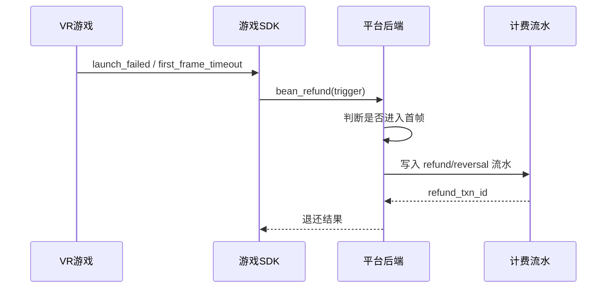

# 头号空间 - 游戏豆计费与自动退还规则

> **版本**: v1.0  
> **日期**: 2026-06-04  
> **适用范围**: 门店PC终端、平台后端、商家后台、游戏SDK、结算服务

---

## 1. 文档目标

本文档定义“游戏豆如何扣除、何时自动退还、由谁执行退还、如何落账与去重”的统一口径。

它的目标不是描述SDK实现细节，而是把业务规则、账务规则和异常补偿规则一次性对齐，避免出现“技术按A做、财务按B算”的情况。

---

## 2. 核心原则

1. **游戏豆是B端运营消耗资源**
   - 商家采购游戏豆，用于门店启动游戏。
   - C端用户不直接接触游戏豆。

2. **退还只针对“未形成有效体验”的失败**
   - 只有当游戏未真正进入首帧可玩态时，才考虑自动退还。

3. **SDK 只上报事实，不执行账务**
   - SDK 负责提供启动失败、首帧完成、会话状态等事实。
   - 平台后端负责真正的冲正、退还和流水入账。

4. **退还必须幂等**
   - 同一笔失败事件最多触发一次退还。
   - 重发、补传、重试不能造成重复退款。

5. **原始扣豆记录不能删除**
   - 必须保留扣豆流水。
   - 退还通过新增一笔冲正流水实现。

---

## 3. 关键定义

| 术语 | 定义 |
|------|------|
| 扣豆 | 游戏启动或进入体验时，门店游戏豆账户被扣除 |
| 预扣 | 在游戏真正进入可玩态之前，平台对游戏豆做冻结或暂扣 |
| 退还 | 因启动失败等原因，将已扣或预扣的游戏豆返还 |
| 冲正 | 通过新增一笔反向流水抵消原扣款，不直接改写原流水 |
| 首帧 | 游戏画面成功进入可玩状态的关键节点 |
| 有效体验 | 已进入首帧，并进入正常 Session 生命周期 |

---

## 4. 计费边界

### 4.1 可以自动退还的边界

以下情况建议进入自动退还流程：

- 游戏启动失败，且未进入首帧
- 启动超时，且未进入 `startSession()`
- 资源加载失败，导致未进入可玩态
- 初始化失败，且平台侧已做预扣
- 首帧超时，且业务口径认定为未生效消费

### 4.2 不自动退还的边界

以下情况默认不做全额自动退还：

- 已进入首帧后的崩溃
- 用户主动退出
- 摘盔后超时自动结束
- 会话中途掉线，但已形成有效体验
- 平台规则认定为“已消费”的其他情况

### 4.3 可配置边界

平台可以配置“启动保护期”或“首帧保护窗口”：

- 在保护窗口内失败，可全额退还
- 超出保护窗口后，按正常消费或部分补偿规则处理
- 是否启用、窗口时长、是否支持部分退还，均由平台后端配置决定

---

## 5. 推荐状态机

### 5.1 会话状态

| 状态 | 含义 |
|------|------|
| `created` | 会话已创建 |
| `launching` | 游戏正在启动 |
| `ready` | 已准备完成，等待首帧 |
| `running` | 已进入首帧并可体验 |
| `paused` | 暂停中 |
| `ended` | 正常结束 |
| `failed` | 启动失败或异常失败 |
| `refunding` | 正在退还/冲正 |
| `refunded` | 已完成退还 |

### 5.2 推荐判定规则

1. `created` 到 `ready` 之间，不应视为有效消费
2. `running` 之后，默认视为已形成有效体验
3. `failed` 状态若未进入 `running`，可进入自动退还
4. `refunding` 和 `refunded` 必须由后端控制，不由 SDK 直接写入

---

## 6. 自动退还触发条件

建议由平台根据以下事件组合触发退还：

- `launch_failed`
- `FIRST_FRAME_TIMEOUT`
- `ASSET_LOAD_FAILED`
- `INIT_FAILED`
- `LAUNCH_TIMEOUT`
- `session_create` 成功但 `startSession()` 未发生

推荐触发条件需要同时满足：

1. 存在有效订单或预扣记录
2. 未进入首帧，或未形成有效体验
3. 事件链路可定位到唯一 `session_id`
4. 幂等键未被处理过

---

## 7. 自动退还流程

### 7.1 标准流程

1. SDK 或游戏进程上报启动失败事件
2. 平台判断是否已进入首帧
3. 若未进入首帧，平台创建退还任务
4. 退还任务关联原始扣豆流水
5. 平台执行冲正或返还
6. 写入退还结果流水
7. 更新订单、会话、统计报表

### 7.2 推荐时序

---

## 8. 账务处理建议

### 8.1 流水原则

建议账务系统采用“双流水”或“原始流水 + 冲正流水”模型：

- 原扣豆流水保留
- 退还时新增反向流水
- 所有统计按净额计算
- 任何人工修正都必须留痕

### 8.2 推荐流水类型

| 流水类型 | 说明 |
|------|------|
| `deduct` | 正常扣除游戏豆 |
| `refund` | 退还游戏豆 |
| `reversal` | 冲正原扣款 |
| `adjustment` | 人工调整 |

### 8.3 幂等要求

建议幂等键至少包含：

- `session_id`
- `order_id`
- `origin_event_id`
- `refund_type`

同一幂等键只能成功一次。

---

## 9. 建议数据字段

### 9.1 扣豆记录

| 字段 | 说明 |
|------|------|
| `order_id` | 订单ID |
| `session_id` | 会话ID |
| `game_id` | 游戏ID |
| `store_id` | 门店ID |
| `bean_amount` | 扣除游戏豆数量 |
| `deduct_time` | 扣豆时间 |
| `deduct_status` | 扣豆状态 |

### 9.2 退还记录

| 字段 | 说明 |
|------|------|
| `refund_txn_id` | 退还事务号 |
| `origin_event_id` | 触发退还的原始事件 |
| `origin_order_id` | 原订单ID |
| `origin_session_id` | 原会话ID |
| `refund_bean_amount` | 退还游戏豆数量 |
| `refund_reason` | 退还原因 |
| `refund_status` | 退还状态 |
| `refunded_at` | 退还完成时间 |

---

## 10. 对接 SDK 的最小要求

SDK 只需要提供以下事实信号：

- `launch_request`
- `launch_failed`
- `launch_success`
- `first_frame`
- `session_start`
- `session_end`
- `force_end`

当发生失败时，SDK 额外发送 `bean_refund` 触发事件，并携带：

- `session_id`
- `order_id`
- `origin_event_id`
- `scene`
- `message`
- `payload`

SDK 不负责：

- 计算退多少豆
- 判断退款金额
- 直接改余额
- 直接写账务流水

---

## 11. 结算与统计建议

建议将以下指标纳入后台看板：

- 扣豆总量
- 退还总量
- 启动失败率
- 自动退还率
- 退还成功率
- 平均退还时延
- 净消耗游戏豆

推荐统计公式：

- **净消耗游戏豆** = 扣豆总量 - 退还总量
- **自动退还率** = 自动退还成功次数 / 触发退还次数

---

## 12. 异常处理建议

| 异常场景 | 建议处理 |
|------|------|
| 退还接口超时 | 记录失败状态，进入重试队列 |
| 退还重复提交 | 按幂等键直接返回已处理结果 |
| 退还后回调失败 | 不重复退，修复回调后补账 |
| 原扣豆流水不存在 | 进入人工审核队列 |
| 订单已人工退款 | 退还任务进入冲突审核 |

---

## 13. 实施建议

1. 先定义扣豆和退还的统一流水模型
2. 再统一 SDK 上报的启动事件
3. 再实现后端冲正服务和幂等控制
4. 最后把统计看板和异常审核补齐

---

## 14. 附录：建议异常码

| 异常码 | 说明 |
|------|------|
| `INIT_FAILED` | 初始化失败 |
| `LAUNCH_TIMEOUT` | 启动超时 |
| `LAUNCH_FAILED` | 启动失败 |
| `FIRST_FRAME_TIMEOUT` | 首帧超时 |
| `ASSET_LOAD_FAILED` | 资源加载失败 |
| `REFUND_CONFLICT` | 退还冲突 |
| `REFUND_DUPLICATE` | 重复退还请求 |

